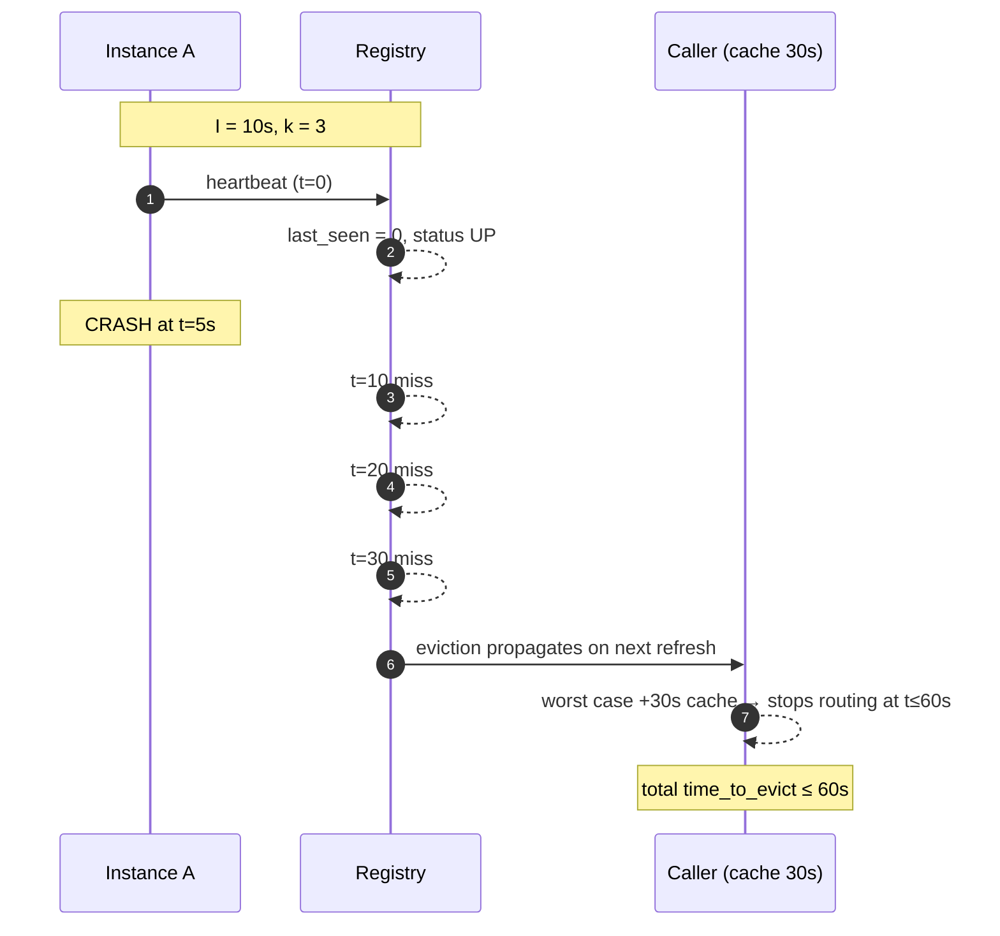

# Service Discovery — Professional

<!-- level-focus -->
At professional level, focus on this question:

> How should teams adopt and operate **Service Discovery** with measurable outcomes and limited coordination?

Use the smallest realistic scenario that exposes the decision and its failure behavior.
## 1. The Detection Problem, Formally

A **failure detector** is a distributed oracle that each process queries to learn which other processes it *suspects* to have crashed. Chandra and Toueg formalized detectors by two properties:

- **Completeness** — every crashed process is eventually suspected by every correct process.
- **Accuracy** — some correct process is never (or eventually never) wrongly suspected.

The uncomfortable result is that in a **purely asynchronous** system — no bound on message delay or relative process speed — you cannot build a detector that is both *complete* and *strongly accurate*. Any timeout short enough to detect a crash promptly will, on some run, fire on a merely-slow-but-alive process (a false positive); any timeout long enough to never false-positive can be starved of a real detection indefinitely. This is the same asynchrony wall that underlies FLP: perfect failure detection would let you solve consensus, which FLP says you can't do deterministically.

The practical consequence for service discovery:

> You are not choosing *whether* to have false positives. You are choosing *where on the detection-time / false-positive curve* to sit, and paying for it with either wasted requests to zombies (slow eviction) or dropped traffic to healthy nodes (aggressive eviction).

Everything below is a mechanism for choosing a point on that curve — and for making the curve itself more favorable (phi-accrual, adaptive timeouts) rather than moving along a fixed one.

---

## 2. Heartbeat / TTL Detectors

The workhorse. Each instance emits a heartbeat every `I` seconds (or renews a TTL lease). The registry considers an instance *up* while heartbeats keep arriving, and evicts it after `k` consecutive misses.

Two dual framings, identical math:

- **Push heartbeat**: instance sends; registry counts misses. Eviction after `k` missed intervals.
- **Pull / TTL lease**: instance registers with TTL `T`; must renew before `T` expires. Eviction at expiry. Consul uses TTL health checks this way; etcd uses lease keep-alives.

The detector is a **binary step function of a single timeout**. Its entire quality is set by `I` and `k` (or by `T`). It has two structural flaws:

1. **Fixed threshold, variable network.** A `k`-miss threshold tuned for a quiet datacenter false-positives during a GC pause or a transient link blip; tuned for the worst case, it detects real crashes slowly.
2. **No confidence signal.** The output is `up` or `down`. A caller cannot ask "how sure are you?" to make a graded decision (e.g., stop sending *new* traffic but keep draining).

Heartbeats are cheap, obvious, and correct for stable networks with lenient SLAs. For everything else, phi-accrual generalizes them.

---

## 3. Phi-Accrual Detectors

Hayashibara et al.'s **phi (φ) accrual failure detector** replaces the binary verdict with a *continuous suspicion level*. Instead of "has the timeout fired," it asks "given the history of inter-arrival times, how surprising is it that we've heard nothing for this long?"

Mechanism:

1. Maintain a sliding window of recent heartbeat inter-arrival times.
2. Fit a distribution (the classic paper assumes normal; Cassandra's implementation uses an exponential-ish estimate) with sample mean `μ` and variance `σ²`.
3. When the last heartbeat arrived at `t_last` and the current time is `t`, compute the elapsed gap and output:

   ```
   φ(t) = -log10( P(heartbeat arrives later than (t − t_last) | history) )
   ```

`φ` rises smoothly as silence lengthens. A `φ` of 1 means ~10% chance the process is actually alive (0.1 probability); `φ = 2` → ~1%; `φ = 3` → ~0.1%. The application picks a **threshold** `Φ` and suspects when `φ ≥ Φ`. Crucially, that threshold is a *probability of false positive you are willing to accept*, not an opaque number of milliseconds.

The win: the detector **adapts to observed network conditions**. On a jittery network with high `σ`, `φ` rises slowly, so the same `Φ` tolerates more delay automatically — you get the same *false-positive rate* under both calm and stormy conditions, instead of the same *timeout*. This shifts you to a strictly better point on the detection-time/accuracy curve for variable networks, at the cost of maintaining per-peer statistics.

Akka, Cassandra, and ScyllaDB all ship phi-accrual detectors for exactly this reason.

---

## 4. Heartbeat vs Phi-Accrual

| Dimension | Fixed Heartbeat / TTL | Phi-Accrual |
|---|---|---|
| Output | Binary `up`/`down` | Continuous suspicion `φ` (real number) |
| Tuning knob | Timeout `T` (or `I`, `k`) in ms | Threshold `Φ` = accepted false-positive probability |
| Adapts to network jitter | No — one timeout for all conditions | Yes — window tracks `μ`, `σ`; tolerance scales with variance |
| False-positive behavior | Spikes under GC pauses / link blips | Rises smoothly; absorbs transient delay |
| Graded decisions | Impossible (one bit) | Natural (act at `φ=1` vs `φ=3`) |
| State per peer | Counter / last-seen timestamp | Sliding window of inter-arrivals + stats |
| CPU / memory cost | Negligible | Small but non-zero (distribution fit per sample) |
| Best fit | Stable networks, lenient SLAs, simple TTL leases | Variable/WAN networks, tight SLAs, large clusters |
| Real-world users | Consul TTL checks, etcd leases | Cassandra, Akka, ScyllaDB |

The through-line: phi-accrual doesn't escape the Chandra-Toueg impossibility — it just makes the tradeoff *legible* (you dial a false-positive probability) and *adaptive* (the ms-tolerance moves with measured jitter) instead of static.

---

## 5. The Time-to-Evict Formula, Worked

The number you must be able to derive: **how long after a crash is a dead instance no longer routed to?** It has three additive components.

```
time_to_evict = detection_time + propagation_time

  detection_time    = heartbeat_interval × miss_threshold        (local suspicion)
  propagation_time  = time for eviction to reach all callers /
                      resolvers (gossip convergence or DNS TTL)
```

Expanded:

```
time_to_evict ≈ (heartbeat_interval × miss_threshold)
              + (propagation / cache staleness)
```

### Worked example — CP registry with client-side caching

Take a registry with:

- `heartbeat_interval I = 10 s`
- `miss_threshold k = 3`
- clients cache the instance list with a `refresh = 30 s` poll (worst-case staleness = one full refresh)

```
detection_time   = I × k            = 10 s × 3   = 30 s
propagation_time = client cache TTL = 30 s (worst case)

time_to_evict    = 30 s + 30 s      = 60 s (worst case)
                   30 s + 0 s        = 30 s (best case, cache just refreshed)
```

So a crash can be masked for **up to 60 seconds** of traffic to a dead node. To halve it you can cut any term: `I = 5 s` → detection 15 s; `refresh = 10 s` → propagation 10 s; combined worst case 25 s. But note the coupling — smaller `I` raises heartbeat traffic linearly, and a smaller `k` raises the **false-positive rate** (fewer misses tolerated before eviction). You are back on the Chandra-Toueg curve.

### The false-positive floor

For a fixed-timeout detector, a crude bound on the false-positive rate is the probability that `k` consecutive intervals each overrun `I` due to normal jitter. If per-interval overrun probability is `p`, then

```
P(false eviction) ≈ p^k
```

Raising `k` shrinks false positives geometrically but raises `detection_time` linearly (`I × k`). That asymmetry — geometric accuracy gain, linear latency cost — is exactly why `k = 3` is such a common sweet spot, and why phi-accrual (which reshapes `p` with the measured distribution) is worth its complexity in jittery environments.

### Heartbeat-miss eviction timeline



---

## 6. Registry Consistency: CP vs AP

The registry is itself a replicated data store, so it inherits the CAP dilemma. During a network partition it must choose:

- **CP registry** — refuse writes/reads that can't be linearized rather than serve stale membership. Backed by a consensus log (**Raft**, Paxos). etcd (Raft), ZooKeeper (Zab), and Consul's *server* tier (Raft) live here.
- **AP registry** — always answer, tolerating divergent/stale views that reconcile later. Backed by **gossip / SWIM** epidemic dissemination. Consul's *client/serf* membership layer and Netflix Eureka live here.

The core reasoning for a service-discovery context:

> A discovery registry is read-mostly and **failure is the common case it exists to handle** — a partition is precisely when you most need *an* answer. Refusing to answer (CP) during a partition can strand a whole zone even though the local instances are perfectly healthy. That is why availability-leaning designs (Eureka's self-preservation mode, Consul's LAN gossip) deliberately keep serving possibly-stale membership.

But AP has a dual failure mode: **stale liveness**. Gossip can keep advertising a node the partitioned-away half hasn't heard is dead, so callers keep routing to a zombie until convergence. CP registries make the opposite bet: never route to a node the quorum hasn't confirmed, at the cost of unavailability when quorum is lost.

| Dimension | CP Registry (Raft / Paxos) | AP Registry (Gossip / SWIM) |
|---|---|---|
| Backing mechanism | Consensus log, quorum writes | Epidemic dissemination, no quorum |
| Behavior on partition | Minority side unavailable (rejects) | Both sides keep serving, diverge |
| Consistency guarantee | Linearizable membership | Eventual; bounded convergence |
| Write cost | Quorum round-trip (leader + majority) | Local + gossip fan-out |
| Scale ceiling | ~5–7 voting members (quorum chatter) | Thousands of nodes (SWIM is `O(1)` per node) |
| Failure signal | Authoritative once committed | Best-effort, may lag or flap |
| Staleness risk | Low (leader is source of truth) | Zombie entries until convergence |
| Examples | etcd, ZooKeeper, Consul servers | Eureka, Consul serf, Cassandra membership |
| Right when | Correctness > availability (locks, leader election, config) | Availability > freshness (large fleets, discovery) |

A common production shape is **hybrid**: a CP core (etcd/Consul-server Raft) holding the authoritative catalog, fed by an AP gossip layer that does the cheap, scalable liveness detection and pushes deltas into the core. You get consensus-grade truth for the things that need it and gossip-grade scale for membership churn.

---

## 7. SWIM and Gossip Membership

**SWIM** (Scalable Weakly-consistent Infection-style process group Membership, Das/Gupta/Motorola) is the algorithm behind Consul's serf layer, HashiCorp memberlist, and many others. It solves the "how do N nodes agree on who's alive" problem with cost **`O(1)` per node per period**, independent of cluster size — the key to AP registries scaling to thousands of members where all-to-all heartbeats (`O(N²)`) collapse.

Two decoupled subsystems:

1. **Failure detection (the probe cycle).** Each period, a node picks one random peer and sends a `ping`. If no `ack` within the timeout, it doesn't immediately declare death — it asks `k` other random peers to `ping-req` (indirect probe) on its behalf. Only if *both* the direct and indirect probes fail does it *suspect* the target. This indirect probing is what kills false positives from a single bad link: one broken path between two nodes no longer looks like a death.

2. **Dissemination (infection-style gossip).** Membership updates (`alive`, `suspect`, `dead`) piggyback on the normal ping/ack traffic — no separate broadcast. Updates spread epidemically; convergence time is `O(log N)` rounds.

The **suspicion mechanism** adds a grace period: a suspected node is given time to refute (by gossiping a higher-incarnation `alive`) before being marked `dead`. This is SWIM's version of the detection-time/false-positive knob — longer suspicion timeout = fewer false deaths, slower real detection.

```mermaid
flowchart TD
    subgraph "Probe cycle at node P"
        P[P selects random target Q] --> D{direct ping Q<br/>ack in time?}
        D -- yes --> OK[Q alive - refresh]
        D -- no --> IND[ping-req via k random peers R1..Rk]
        IND --> I2{any indirect ack?}
        I2 -- yes --> OK
        I2 -- no --> SUS[mark Q SUSPECT<br/>start suspicion timer]
    end
    SUS --> REF{Q refutes with<br/>higher incarnation?}
    REF -- yes --> OK
    REF -- no --> DEAD[mark Q DEAD]
    DEAD --> GOS[gossip 'dead Q' piggybacked<br/>on ping/ack → O(log N) convergence]
    OK --> GOS2[gossip 'alive Q' piggybacked]
```

Why this matters for the tradeoff: SWIM's indirect probing improves the *accuracy* axis (fewer false positives from single-link failures) without lengthening the base *detection time*, and its epidemic dissemination keeps *propagation time* at `O(log N)` — so it pushes the whole `time_to_evict` budget down at scale rather than just re-dividing it.

---

## 8. DNS TTL: Role and Limits

DNS is the oldest discovery mechanism and still ubiquitous (Kubernetes `Service` DNS, service records, cloud internal zones). A client resolves a name to instance IPs; the record's **TTL** governs how long resolvers cache before re-querying.

DNS TTL is precisely the `propagation_time` term from §5. When the registry evicts an instance, callers keep hitting the stale IP until their cached record expires. So:

```
worst-case DNS staleness ≈ record TTL (often bounded further by resolver-imposed minimums)
```

Its limits as a discovery substrate:

- **No push, no health signal.** DNS is pull-with-TTL. It cannot notify; it cannot say "this A record is a currently-failing instance." Liveness must be enforced elsewhere (the registry removing the record). A dead IP lingers in caches for up to a full TTL.
- **TTL is a blunt tradeoff.** Low TTL (e.g., 5–30 s) → fast propagation but heavy resolver load and query amplification. High TTL → cheap but stale. This is the same detection-vs-cost knob, one layer removed.
- **TTL is advisory.** Resolvers, OS stub caches, JVMs (historically `networkaddress.cache.ttl`), and connection pools can ignore or clamp TTL, holding a dead IP far past its stated lifetime. You cannot *guarantee* propagation with TTL alone.
- **No load or weighting semantics** beyond crude round-robin / SRV weights; no session affinity; no draining.

The takeaway: DNS is a fine *last-mile* discovery layer for the propagation step, but leaning on TTL for **liveness** re-imports every heartbeat weakness (fixed timeout, no confidence, cache stubbornness) with *less* control. Serious systems put an active detector (heartbeat/phi/SWIM) behind the registry and use DNS — or better, a push-based client/sidecar — only to distribute the resulting membership.

---

## 9. Putting the Budget Together

Read `time_to_evict` as a budget you spend across three independent line items, each with its own theory:

```
time_to_evict = (I × k)              ← detector: Chandra-Toueg curve, phi-accrual reshapes it
              + suspicion_grace       ← SWIM: refutation window, false-positive insurance
              + propagation           ← gossip O(log N) OR DNS/cache TTL
```

Design guidance that falls out of the theory:

- **Tighten the term that dominates.** If DNS TTL is 300 s and detection is 30 s, optimizing the detector is pointless — attack propagation first.
- **Don't chase zero false positives.** The impossibility result says you can't. Pick a false-positive *rate* you can absorb (graceful client-side retries/hedging make a slightly-too-eager detector safe) and tune to that.
- **Match consistency to the job.** Membership/liveness → AP + SWIM (availability, scale). Leader election / locks / config that gates correctness → CP + Raft. Hybrid when you need both.
- **Prefer detectors with a confidence output** (phi-accrual) in variable/WAN networks so the client can make graded routing decisions instead of a hard flip.

The senior tier builds on this to cover operational governance: SLOs on `time_to_evict`, flapping suppression, multi-region registry topology, and the failure modes of self-preservation modes under correlated failure.

---

## 10. Sources

Cited by name, no invented links:

- **Chandra, T. D., and Toueg, S.** — *Unreliable Failure Detectors for Reliable Distributed Systems* (completeness/accuracy properties; why perfect detection ⇒ consensus).
- **Fischer, Lynch, Paterson** — *Impossibility of Distributed Consensus with One Faulty Process* (FLP; the asynchrony wall behind imperfect detection).
- **Hayashibara, Défago, Yared, Katayama** — *The φ Accrual Failure Detector* (continuous suspicion, adaptive to inter-arrival distribution).
- **Das, Gupta, Motorola** — *SWIM: Scalable Weakly-consistent Infection-style Process Group Membership Protocol* (random probe + indirect ping-req + suspicion + epidemic dissemination).
- **Ongaro, D., and Ousterhout, J.** — *In Search of an Understandable Consensus Algorithm* (Raft; the CP registry backbone).
- **Brewer, E.** — CAP conjecture / theorem (the CP-vs-AP framing).
- Implementations referenced by name: Consul (serf/memberlist + Raft servers), etcd (Raft leases), ZooKeeper (Zab), Netflix Eureka (AP self-preservation), Apache Cassandra / Akka (phi-accrual), Kubernetes `Service` DNS.


---

## Apply it

1. Define the user or business outcome that **Service Discovery** should improve.
2. Assign one owner for code, contracts, operations, and incidents.
3. Split delivery into reversible increments that produce evidence early.
4. Publish responsibilities, escalation paths, and compatibility windows.
5. Stop or expand only when the agreed measures support that decision.

## Verify your work

- Each increment has an owner, rollback path, and observable exit condition.
- Adoption, reliability, delivery time, and coordination cost are measured.
- Incident and migration exercises prove that responsibility is executable.
- The old path is removed only after telemetry proves it is unused.

## Review questions

- Which measurable outcome justifies investing in Service Discovery?
- Which team owns the full lifecycle and incident response?
- What reversible increment produces the earliest useful evidence?
- Which exit condition proves that migration or adoption is complete?
