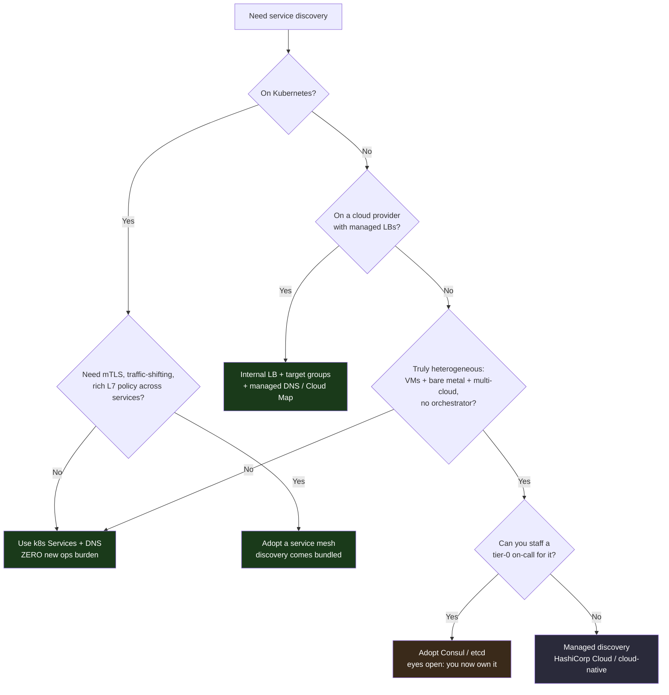
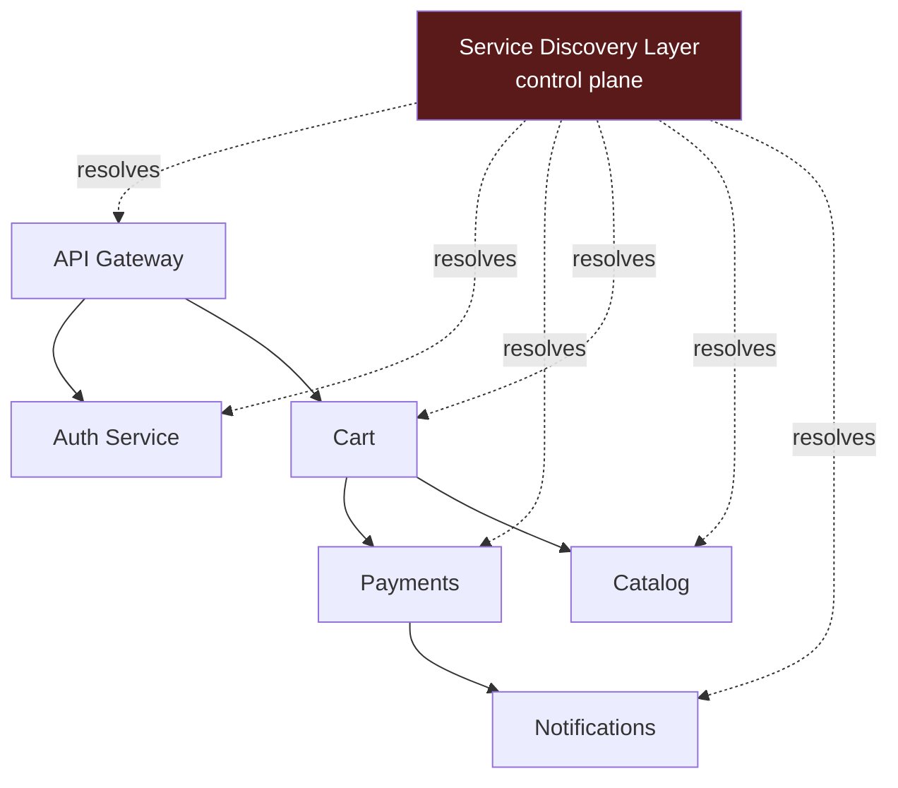

# Service Discovery — Staff

At Staff and Principal scope, service discovery stops being "which library resolves `payments.svc` to an IP" and becomes a question of *who runs the thing that everyone's traffic depends on, and what happens the day it's down*. The discovery layer is tier-0 infrastructure: its blast radius is the whole fleet, because a service that cannot find its dependencies is a service that is down, even though every one of its own processes is healthy. The dominant Staff instinct here is restraint. Most organizations should **not** run a bespoke Consul or Eureka cluster; they should inherit discovery from a platform they already operate — Kubernetes, a cloud load balancer, or a service mesh — and spend their scarce operational budget elsewhere. This page is about that judgment: standardizing one discovery mechanism across the org, treating it as tier-0, and knowing when building your own is the wrong answer (almost always) and when it is the right one (rarely, and you'll know why).

## Table of Contents

1. [The framing: discovery is tier-0 infrastructure](#1-the-framing-discovery-is-tier-0-infrastructure)
2. [Default to the platform's built-in discovery](#2-default-to-the-platforms-built-in-discovery)
3. [The build-vs-buy-vs-adopt decision](#3-the-build-vs-buy-vs-adopt-decision)
4. [Blast radius: what a discovery outage actually breaks](#4-blast-radius-what-a-discovery-outage-actually-breaks)
5. [Comparison: k8s DNS vs mesh vs self-run registry](#5-comparison-k8s-dns-vs-mesh-vs-self-run-registry)
6. [Standardizing discovery across the org](#6-standardizing-discovery-across-the-org)
7. [Staged decision framework](#7-staged-decision-framework)
8. [Failure modes and cost table](#8-failure-modes-and-cost-table)
9. [When self-run discovery is actually the right call](#9-when-self-run-discovery-is-actually-the-right-call)
10. [Second-order consequences and staff takeaways](#10-second-order-consequences-and-staff-takeaways)

---

## 1. The framing: discovery is tier-0 infrastructure

Rank your infrastructure by blast radius, not by traffic. A service that carries 40% of user requests but whose failure is contained to one feature is *lower* tier-0 than a component that carries no user traffic at all but whose failure makes every service unable to locate its dependencies. Service discovery is the canonical example of the latter. It sits underneath authentication, underneath the database proxy, underneath the message bus — because all of those are reached *through* discovery.

The Staff error is to reason about discovery the way a senior engineer reasons about it: as a mechanism with latency and freshness properties, tuned per service. That reasoning is correct and necessary, but it is the wrong altitude for the org-level question, which is: **this is a single dependency shared by the entire fleet, so its availability caps the availability of everything above it.** If discovery is 99.9% available, nothing built on it can exceed 99.9% no matter how much you invest in the services themselves. You have quietly imposed a ceiling on the whole company.

Three properties make discovery a tier-0, platform-scope concern rather than a per-service one:

- **Shared fate.** Every service resolves names through the same layer. One bad registry write, one propagation bug, one control-plane crash affects everyone simultaneously — there is no bulkhead.
- **It is on the critical path of *starting up*.** During a region recovery or a mass restart (a "thundering herd" of pods all coming back at once), every service hits discovery at the same instant. The one moment you most need discovery is the moment it's under maximum load.
- **It fails invisibly.** A discovery outage doesn't look like a discovery outage. It looks like a hundred services simultaneously reporting "connection refused" or "no healthy upstreams." The correlation is the diagnosis, and if you haven't drilled it, the incident bridge burns an hour blaming the wrong layer.

The correct Staff posture: give discovery the same operational rigor as your primary database. Multi-AZ, tested failover, defined RTO/RPO for the control plane, a runbook, and — critically — a *stale-but-serving* data plane so that a control-plane outage degrades gracefully rather than blacking out.

## 2. Default to the platform's built-in discovery

The single most valuable Staff decision about service discovery is usually the one to **not have a discovery project at all**. If you run Kubernetes, you already have service discovery: a `Service` object gives you a stable virtual IP and a DNS name (`payments.default.svc.cluster.local`), and kube-proxy or your CNI programs the dataplane to load-balance across healthy pods. If you run on a cloud provider, an internal load balancer with a target group *is* your discovery layer — the LB name is the stable endpoint, and health checks handle membership. Neither of these is a component your team operates, staffs on-call for, patches for CVEs, or wakes up at 3 a.m. to recover.

Contrast that with adopting Consul or Eureka as a standalone system. You now own:

- A quorum-based (Consul/Raft) or replicated (Eureka/AP) cluster that must be sized, patched, upgraded, and monitored.
- The agent or sidecar on every node, its version skew, and its failure modes.
- A new tier-0 dependency that *you* introduced, whose outage you are personally accountable for.
- The integration glue between the registry and every language/framework in the org.

The uncomfortable truth is that a self-run registry rarely buys you anything the platform doesn't already provide, and it costs you a permanent operational tax. The features people reach for Consul to get — health-checked membership, key-value config, multi-datacenter — are increasingly available in the platform (k8s health probes, ConfigMaps, cluster federation) or in a mesh you might adopt anyway. Before greenlighting a discovery system, force the question: *what does the platform's built-in discovery fail to do that is worth standing up and operating a new tier-0 cluster forever?* If the answer is "nothing concrete, it's just how we've always done it," kill the project.



The staged reading of this diagram: the green terminals are where most orgs land, and they involve *no new operated system*. The amber terminal (self-run Consul/etcd) is reachable only after you've confirmed you have neither an orchestrator nor managed LBs *and* that you can staff a tier-0 rotation. That is a narrow door, and it should feel narrow.

## 3. The build-vs-buy-vs-adopt decision

"Build your own service discovery" almost never means writing a registry from scratch — anyone proposing a home-grown Raft implementation for this should be gently redirected. In practice the three real options are **adopt the platform's built-in**, **adopt an open-source system you self-operate**, and **buy a managed offering**. The decision hinges on operational capacity and on how much of the surrounding platform you already run.

| Option | When it wins | Hidden cost |
| --- | --- | --- |
| **Adopt platform built-in** (k8s Services/DNS, cloud LB target groups) | You already run the orchestrator or cloud LBs; discovery is a free byproduct | You inherit the platform's discovery semantics — DNS TTL caching quirks, kube-proxy scaling limits at very large service counts |
| **Adopt + self-operate OSS** (Consul, etcd, Eureka) | Heterogeneous fleet with no orchestrator; multi-datacenter; need registry as a product surface | Permanent tier-0 on-call, Raft quorum operations, upgrade treadmill, per-node agent fleet, CVE patching |
| **Buy managed** (HashiCorp Cloud Consul, cloud-native service registries) | You need the OSS features but not the operational burden; small platform team | Vendor lock-in, per-node/per-service pricing that scales with fleet, egress and API-call costs, less control over failover behavior |
| **Build from scratch** | Effectively never — a genuine platform company whose discovery IS the product | Years of engineering, an entire team, and you've reinvented Consul with more bugs |

The Staff framing that cuts through the noise: **discovery is a commodity capability, not a differentiator.** No customer has ever chosen your product because your service registry was clever. Every hour spent operating a bespoke registry is an hour not spent on the thing that *is* your differentiator. That argument alone pushes the default hard toward "adopt the platform's built-in" and treats self-operation as something you justify against, not toward.

The one legitimate build-vs-adopt tension is the **service mesh** question. A mesh (Istio, Linkerd, Consul Connect, cloud app mesh) bundles discovery with mTLS, retries, circuit breaking, traffic shifting, and L7 observability. If you need those things — and at real microservice scale you eventually do — the mesh's discovery comes essentially for free, and adopting the mesh *is* your discovery decision. The mistake is adopting a mesh *only* for discovery: that is a sledgehammer for a thumbtack, and the mesh's control-plane and sidecar-proxy operational cost dwarfs anything discovery alone would justify.

## 4. Blast radius: what a discovery outage actually breaks

The reason discovery must be treated as tier-0 is that its failure does not degrade one feature — it delaminates the entire service graph. Model it as a dependency fan-out.



When the control plane goes dark, the failure mode depends entirely on one design choice: **does the data plane keep serving stale membership, or does it fail closed?**

- **Fail-open / stale-but-serving (correct default).** Clients and proxies keep their last-known-good endpoint list. New instances can't register and dead ones can't be evicted, but existing traffic flows. You have minutes-to-hours of graceful degradation to fix the control plane. This is how DNS-based discovery, mesh sidecars with cached config, and Eureka (deliberately AP) behave. The cost is *staleness*: you may route to a dead pod until health checks or TTL expiry catch it.
- **Fail-closed (dangerous default).** If a resolver treats an unreachable registry as "no healthy endpoints," every dependent service instantly sees zero upstreams and returns errors. This is the outage that takes down the company from a single control-plane blip. A strongly-consistent (CP) registry like Consul or etcd will refuse reads when it loses quorum — and if your clients don't cache aggressively, that quorum loss *is* a total outage.

The Staff lesson is stark: **the availability model of your discovery layer is the availability model of your whole platform.** Choosing a CP registry (Consul, etcd) buys you correctness — you never route to a stale endpoint — at the price of a discovery outage during network partition. Choosing an AP registry or DNS (Eureka, k8s DNS with cached records) buys you availability at the price of occasionally routing to a dead instance. This is a direct application of CAP to your most critical shared dependency, and picking the wrong side of it for your org's risk profile is a Principal-level mistake with company-scale consequences.

Two hardening moves follow directly:
1. **Every client caches last-known-good and serves from cache when the registry is unreachable.** This converts a control-plane outage into a staleness problem, not an availability problem.
2. **Game-day the discovery outage.** Kill the control plane in a non-prod (or carefully, in prod) and confirm the fleet degrades gracefully. If you've never tested it, you do not know your blast radius — you're guessing.

## 5. Comparison: k8s DNS vs mesh vs self-run registry

The three realistic mechanisms differ most in what they cost you to operate and how large a blast radius they carry, not in their raw feature checkboxes.

| Dimension | Kubernetes DNS / Services | Service Mesh (Istio / Linkerd / app-mesh) | Self-run registry (Consul / Eureka / etcd) |
| --- | --- | --- | --- |
| **Who operates it** | The platform you already run; kube-proxy + CoreDNS ship with the cluster | You operate the mesh control plane + sidecar fleet | Your team operates a standalone cluster + agents |
| **Ops burden** | Near-zero incremental — it's part of the cluster | High — control plane, sidecar upgrades, cert rotation | High — quorum ops, upgrades, per-node agents, CVEs |
| **Consistency model** | AP-ish (DNS caching); stale until endpoints reconcile | Control-plane pushes config; sidecars cache (fail-open) | Consul/etcd = CP (quorum); Eureka = AP by design |
| **Blast radius on control-plane loss** | Existing IPs keep working; new/changed endpoints stall | Sidecars serve last-known config; graceful | CP registry: quorum loss can fail-closed → total outage |
| **Features beyond discovery** | Basic L4 load-balancing, health via probes | mTLS, retries, circuit breaking, traffic shift, L7 metrics | KV store, multi-DC, ACLs, health checks |
| **Cross-platform reach** | k8s-only (VMs/bare-metal need a bridge) | Can span k8s + VMs with effort | Truly heterogeneous: VMs, bare metal, multi-cloud |
| **Latency added** | DNS lookup (cached); kube-proxy hop | Sidecar proxy hop (~0.5–2 ms/hop) + resource per pod | Client-library lookup or agent hop |
| **Right for** | Anyone on k8s who needs plain discovery | k8s shops that also need mTLS + L7 policy at scale | No orchestrator, heterogeneous fleet, can staff tier-0 |

The pattern the table encodes: **you pay for discovery in operational surface, and the platform built-in has the smallest surface by far.** The mesh is justified when you're buying the *bundle* (mTLS + policy + observability), with discovery as a rider. The self-run registry is justified almost solely by the "no orchestrator / heterogeneous / multi-cloud" row — its unique column is cross-platform reach, and if you don't need that, you're paying a tier-0 operational tax for a feature you already have.

## 6. Standardizing discovery across the org

The failure state a Staff engineer is uniquely positioned to prevent is **N teams each rolling their own discovery**. Left ungoverned, one team uses k8s DNS, another embeds a Eureka client, a third hardcodes cloud LB names in config, and a fourth runs a little Consul cluster "just for us." Now you have four tier-0 discovery mechanisms, four failure modes, four sets of runbooks, and — worst — no coherent story when a cross-team call fails at the boundary between two of these systems. The blast radius didn't shrink; it fragmented into four incidents nobody can reason about holistically.

Standardization is the antidote, and it is a Staff/Principal responsibility because it requires influence across teams without direct authority over them. The mechanism:

- **Bless one default and make it the paved road.** "On this platform, services are discovered via k8s DNS (or via the mesh). Here is the client config, the health-probe contract, and the naming convention. Do this and you inherit our reliability, observability, and on-call for free."
- **Make the paved road cheaper than the alternative.** Golden templates, generated manifests, a service scaffold that wires discovery correctly by default. Teams take the paved road when it's the path of least resistance, not because a policy told them to.
- **Standardize the naming convention explicitly.** `<service>.<namespace>.svc` (or equivalent) is a contract. Inconsistent naming is how cross-team calls quietly break during migrations. This is cheap to enforce early and painful to retrofit.
- **Own the health-check contract centrally.** Discovery is only as good as the liveness/readiness signal it acts on. If every team defines "healthy" differently, membership decisions are inconsistent across the fleet. Standardize what readiness *means* (can serve traffic, dependencies reachable) as a platform contract.
- **Offer an exception path, not a wall.** The one team with a genuine multi-cloud VM fleet may legitimately need something else. Standardization means "one default plus a documented, reviewed exception process," not "one mechanism, no exceptions." Rigid mandates get routed around and you lose visibility entirely.

The organizational payoff: when discovery is standardized, a discovery incident has *one* runbook, *one* on-call, and *one* set of dashboards, and every engineer already knows how to reason about it. When it's fragmented, every incident is a fresh archaeology dig. Standardization is how you shrink mean-time-to-recovery for the highest-blast-radius component you own.

## 7. Staged decision framework

Walk a discovery decision through these stages in order; do not skip to mechanism selection.

```mermaid
sequenceDiagram
    autonumber
    participant Staff as Staff Engineer
    participant Plat as Platform Reality
    participant Ops as Ops Capacity
    participant Org as Org / Teams

    Staff->>Plat: 1. What discovery do we ALREADY have for free?
    Plat-->>Staff: k8s DNS / cloud LB target groups / none
    Staff->>Plat: 2. Does the built-in fail any CONCRETE need?
    Plat-->>Staff: (mTLS? multi-cloud? VM+bare-metal?)
    Note over Staff,Plat: If no concrete gap → STOP, adopt built-in
    Staff->>Ops: 3. If a gap exists, can we staff a tier-0 rotation?
    Ops-->>Staff: on-call, patching, quorum ops capacity?
    Note over Staff,Ops: If no → managed offering, not self-run
    Staff->>Org: 4. What is EVERY team already using?
    Org-->>Staff: fragmented mechanisms discovered
    Staff->>Org: 5. Bless one default + paved road + exception path
    Staff->>Org: 6. Game-day the outage; verify graceful degradation
    Note over Staff,Org: Decision captured as ADR with reversal criteria
```

The discipline the sequence enforces: stage 2 is a hard stop for most orgs. If the platform's built-in discovery has no *concrete, named* gap, the correct decision is to adopt it and end the project — you never reach the operational-capacity or self-run stages at all. Only a real gap (mTLS everywhere, a genuinely heterogeneous fleet, multi-datacenter federation) advances the decision, and even then stage 3 routes you to managed-over-self-run unless you can honestly staff a tier-0 rotation.

## 8. Failure modes and cost table

| Failure / decision | Symptom | Blast radius | Mitigation |
| --- | --- | --- | --- |
| Self-run CP registry loses quorum | Registry refuses reads; clients see "no upstreams" | Whole fleet, if clients don't cache | Aggressive client-side last-known-good cache; multi-AZ quorum; **prefer built-in over self-run** |
| Fail-closed resolver on registry blip | Instant zero-upstream errors org-wide | Every dependent service | Fail-open / stale-but-serving as the default resolver behavior |
| N teams each roll their own | Fragmented failure modes; cross-team calls break at boundaries | Unbounded; per-team | Standardize one default; paved road; naming contract |
| Inconsistent health-check semantics | Membership flaps; traffic to not-ready pods | Per-service, spreading | Central readiness contract as a platform standard |
| DNS TTL too high | Dead endpoints served for minutes after eviction | Callers of the changed service | Tune TTL; combine DNS with active health checks |
| Thundering herd on region recovery | Discovery overloaded exactly when most needed | Whole region restart | Rate-limit registration; capacity-plan control plane for restart storms; cached bootstrap |
| Adopting a mesh only for discovery | Massive control-plane + sidecar cost for a solved problem | Platform ops budget | Use built-in discovery; adopt mesh only when buying the mTLS/policy bundle |
| Building a registry from scratch | Years of work reinventing Consul, with bugs | Engineering opportunity cost | Don't. Adopt. Discovery is a commodity, not a differentiator |

## 9. When self-run discovery is actually the right call

Restraint is the theme, but it is not absolutism. There are real situations where adopting and operating a standalone registry is the correct Staff decision:

- **Genuinely heterogeneous, orchestrator-less fleets.** VMs, bare-metal boxes, and multiple clouds with no common orchestrator to inherit discovery from. Consul's cross-platform reach is its genuine differentiator, and here it earns its operational cost. Even so, prefer *managed* Consul over self-run if a managed offering exists in your environment.
- **Multi-datacenter federation with strict topology control.** When you need explicit control over how services in DC-A discover services in DC-B, with WAN gossip and datacenter-aware routing, a purpose-built registry gives you knobs the platform built-ins don't expose.
- **Discovery as a product surface.** If the registry's KV store, ACL system, or health-check API is something many internal tools consume directly (not just for routing), the registry becomes a platform primitive worth operating deliberately.
- **Regulatory or air-gapped environments** where you cannot use a cloud provider's managed discovery and have no orchestrator.

In every one of these, the deciding factor is a *concrete capability the platform built-in cannot provide*, weighed against a *demonstrated ability to staff tier-0 on-call for it*. If you can't name the capability, or you can't staff the rotation, you're not in this section — you're back in section 2.

## 10. Second-order consequences and staff takeaways

The decisions on this page have downstream effects that show up 6–12 months later:

- **A self-run registry becomes the incident you own forever.** Every registry outage is now attributable to your team's decision to run it. The operational tax compounds: version upgrades, CVE patches, quorum recoveries, agent fleet management — none of which advance the business, all of which consume your best engineers' time.
- **The consistency choice caps your availability.** Pick a CP registry and fail-closed clients, and you've silently set a company-wide availability ceiling at the discovery layer's quorum-availability. This won't surface until the first partition, and then it surfaces as a total outage.
- **Fragmented discovery metastasizes.** Every quarter you tolerate N teams rolling their own, the harder standardization becomes. Retrofitting a naming convention across a live fleet is a multi-quarter migration; enforcing it on day one is a template change.
- **The mesh is a one-way-ish door.** Once services depend on sidecar-provided mTLS and policy, backing the mesh out is a major migration. Adopt it deliberately for the whole bundle, not as an accidental consequence of wanting discovery.

The metric to watch that tells you the decision is going wrong: **the fraction of your incident hours attributable to the discovery layer itself.** If discovery — the thing that should be boring, inherited, and invisible — is generating incidents, you have either over-built (self-run when you should have adopted) or under-governed (fragmented when you should have standardized). Both are Staff-scope failures, and both are avoidable by defaulting hard to the platform's built-in discovery and treating what you keep as the tier-0 dependency it is.

### Staff Checklist
- [ ] Discovery decision captured as an ADR with explicit build-vs-adopt reasoning and reversal criteria.
- [ ] Default is the platform's built-in (k8s Services/DNS, cloud LB target groups) unless a *named* concrete gap justifies otherwise.
- [ ] Self-run registry, if any, has a staffed tier-0 on-call, multi-AZ quorum, and a tested recovery runbook.
- [ ] Resolvers fail-open / serve stale on control-plane loss; verified in a game day.
- [ ] One org-wide discovery default is blessed, with a paved road and a documented exception path.
- [ ] Naming convention and readiness/health-check semantics standardized as platform contracts.
- [ ] Fraction of incident hours attributable to the discovery layer is tracked as the "is this decision going wrong" signal.

*Next step:* [Service Discovery — Interview](interview.md)
