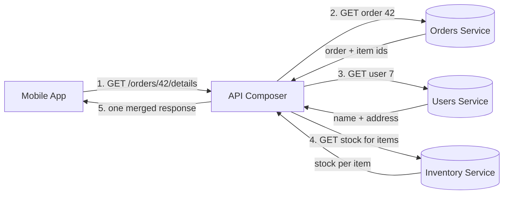
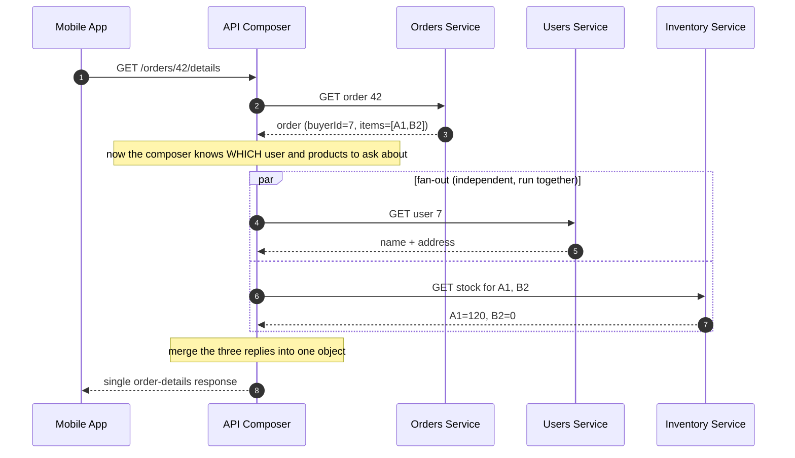
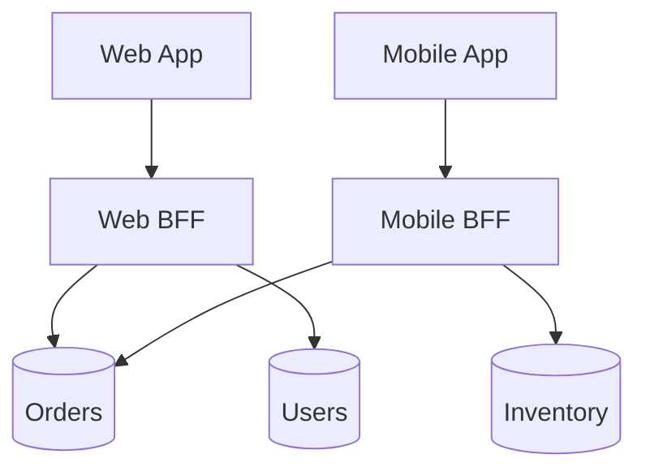

# API Composition — Junior

<!-- level-focus -->
At junior level, focus on this question:

> How can I apply **API Composition** in one small example and prove the result?

Use the smallest realistic scenario that exposes the decision and its failure behavior.
## 1. The Problem: One Page, Many Owners

Open the order details page on any shopping app. You see: the items you bought, the
name and shipping address of the person who bought them, and whether each item is
still in stock. To your eyes it is **one screen** — one coherent thing.

But behind the screen, that data does not live in one place. In a microservices
system, each part of the business is owned by a separate service with its own database:

- **Orders service** knows *what was ordered* — order id, line items, totals, status.
- **Users service** knows *who ordered it* — name, email, saved addresses.
- **Inventory service** knows *whether it can be shipped* — stock count per product.

Each service guards its own data. The Orders service cannot reach into the Users
database to read a name — that data belongs to Users, behind the Users API. This is
the whole point of microservices: teams own their data and can change it independently.

The catch: the client wants one response, but the answer is **spread across three
services**. Somebody has to gather the pieces and assemble them. That job — calling
several services and combining their results into one response — is **API Composition**.

> 🎞️ **See it animated:** [API Composition pattern](https://microservices.io/patterns/data/api-composition.html)

---

## 2. The Mental Model: A Composer Stitches Pieces

Think of a single component whose only job is to be the assembler. It is called the
**composer** (or *API composer*, or *aggregator*). The client makes **one** request to
the composer — "give me order 42's details" — and the composer does the legwork:

1. It calls the **Orders** service and gets the order (items, totals, and the ids of
   the buyer and the products).
2. Using ids from that order, it calls the **Users** service for the buyer's name and
   address, and the **Inventory** service for the stock of each product.
3. It **stitches** the three replies together into one JSON object shaped exactly the
   way the screen needs it.
4. It returns that single object to the client.

The client never learns that three services exist. It asked one question and got one
answer. All the fan-out, waiting, and merging happened inside the composer.



Two things make this pattern work:

- **Fan-out, then merge.** The composer sends several requests out (fan-out) and joins
  the answers back into one (merge). This is a *scatter-gather*: scatter the questions,
  gather the replies.
- **The client stays simple.** It talks to one endpoint over one connection. It does
  not need to know service addresses, call order, or how to combine the data.

---

## 3. Worked Example: The Order Details Page

Let's trace one real request end to end. The mobile app wants to render order `42`.

**Step 0 — the client's single call:**

```
GET /orders/42/details
```

**Step 1 — the composer calls Orders first.** It needs the order before it knows
*which* user or *which* products to ask about. Orders replies:

```json
{
  "orderId": 42,
  "status": "SHIPPED",
  "buyerId": 7,
  "items": [
    { "productId": "A1", "qty": 2, "price": 15.00 },
    { "productId": "B2", "qty": 1, "price": 40.00 }
  ],
  "total": 70.00
}
```

Notice the reply contains **ids, not names**: `buyerId: 7`, `productId: "A1"`. Orders
stores references, not other services' data. Those ids are the keys the composer uses
next.

**Step 2 — the composer fans out.** Now that it holds `buyerId` and the product ids,
it can ask the other two services. These two calls are *independent* — the answer from
Users does not affect the request to Inventory — so the composer can send them **at the
same time** (in parallel) and wait for both.

- To Users: `GET /users/7` → `{ "name": "Aziz", "address": "12 Main St, Tashkent" }`
- To Inventory: `GET /inventory?ids=A1,B2` → `{ "A1": 120, "B2": 0 }`

**Step 3 — the composer merges.** It maps each item to its stock and folds the buyer in,
producing exactly the shape the screen wants:

```json
{
  "orderId": 42,
  "status": "SHIPPED",
  "buyer": { "name": "Aziz", "address": "12 Main St, Tashkent" },
  "total": 70.00,
  "items": [
    { "productId": "A1", "qty": 2, "price": 15.00, "inStock": true },
    { "productId": "B2", "qty": 1, "price": 40.00, "inStock": false }
  ]
}
```

**Step 4 — one response goes back to the client.** The app renders the page directly
from this object. It never saw three services.

Here is the same flow as an ordered sequence, showing which calls happen first and which
happen together:



The key ordering lesson: the **Orders call must come first** because it produces the ids
the other two calls depend on. The Users and Inventory calls have no such dependency on
each other, so they run **in parallel**. Getting this ordering right is most of the job.

---

## 4. Where the Composer Lives: Gateway vs BFF

The composer is a role, not one fixed box. In practice it usually lives in one of two
places, and both are just "the thing that fans out and merges."

- **API Gateway.** A single front door for the whole system. All clients (web, mobile,
  partners) hit the gateway, and it can compose responses on their behalf. One composer
  serving everyone.

- **Backend for Frontend (BFF).** A composer built *for one specific client*. The mobile
  app has a mobile BFF; the web app has a web BFF. Each BFF composes exactly the fields
  its screen needs — a phone screen wants less data than a desktop dashboard, so the
  mobile BFF trims the response. Same composition pattern, tailored per client.



Do not overthink the choice yet. At this level, remember only this: **composition is the
job; the gateway and the BFF are two common homes for it.** The next tier goes into when
to pick which.

---

## 5. The Alternative: Let the Client Call Everyone

Composition is not the only way to build the order page. The client *could* skip the
composer and call all three services itself: ask Orders, read the ids, then call Users
and Inventory, then merge the pieces on the device. This is sometimes called
**client-side composition**.

It works, but it pushes real cost onto the client:

| Concern | Composed (server assembles) | Client calls everyone directly |
|---|---|---|
| Round trips over the phone's network | **One** request from the client | Several (Orders, then Users + Inventory) |
| Who knows the service map | Composer only | Every client must know all service URLs |
| Who writes the merge/join logic | Once, in the composer | Duplicated in every client (web, iOS, Android) |
| Data pulled over the mobile link | Only the final trimmed page | All raw replies, then thinned on-device |
| Effect of adding a 4th service | Change the composer | Re-ship every client app |
| Where slowness is hidden | Inside the datacenter (fast links) | On the user's cellular connection (slow) |

The decisive factor is usually the **network**. Calls *between* the composer and the
services happen inside the datacenter, where links are fast (about 1 ms) and reliable.
Calls from a phone to a service cross the open internet, where each round trip can cost
tens or hundreds of milliseconds. Making the client do the fan-out means paying that slow
round trip several times. Composing on the server pays the fast internal round trips and
sends the client just **one** result over the slow link.

There is also duplication: the "call Orders, then join Users and Inventory" logic lives
in *one* composer versus being copied into the web app, the iOS app, and the Android app
— three chances to drift and get it wrong. Composition centralizes that logic.

---

## 6. What Happens When One Service Is Slow or Down

The moment you call three services to build one response, you inherit their problems. Two
questions you must always ask:

**What if one call is slow?** The composed response can only be as fast as its **slowest**
call. If Users answers in 5 ms but Inventory takes 300 ms, the whole page waits ~300 ms.
This is exactly why the independent calls run in parallel — running them one after another
would *add* the times (5 + 300) instead of overlapping them (max 300). Parallel fan-out is
not a nicety; it is how composition stays fast.

**What if one call fails?** Say Inventory is down. You have a choice to make on purpose:

- **Fail the whole page** — return an error because you can't show stock. Simple, but one
  small service takes down the entire screen.
- **Degrade gracefully** — return the order and buyer, and just leave the stock badge
  blank or say "stock unknown." The user still sees most of their page.

For a page like this, partial data usually beats no data, so degrading is often the right
call. You do not need to implement this yet — the point at Junior level is to *notice* that
composition makes you responsible for other services' failures, and that "what do I return
when service X is down?" is a real design decision, not an afterthought.

---

## 7. Key Terms

| Term | Definition |
|---|---|
| API Composition | Building one response by calling several services and combining their results |
| Composer / Aggregator | The component that fans out the calls and merges the replies |
| Fan-out | Sending several requests from one place at roughly the same time |
| Merge / Stitch | Joining the several replies into a single, client-shaped response |
| Scatter-gather | The pattern of scattering questions to many services and gathering their answers |
| API Gateway | A single front door for all clients; can compose on their behalf |
| BFF (Backend for Frontend) | A composer built for one specific client (e.g., mobile), returning exactly its screen's data |
| Graceful degradation | Returning a partial (still useful) response when one dependency fails |

---

## 8. Common Mistakes at This Level

1. **Calling services one after another when they are independent.** Users and Inventory
   don't depend on each other — run them in parallel. Serial calls make the page needlessly
   slow by adding latencies that could have overlapped.
2. **Getting the call order wrong.** You cannot ask Users about the buyer before Orders has
   told you *who* the buyer is. Dependent calls come first; independent ones fan out after.
3. **Assuming every service always answers.** A composed response has many dependencies.
   Decide up front what to return when one is slow or down.
4. **Pushing the fan-out onto the client.** Making the phone call three services multiplies
   slow internet round trips and copies the merge logic into every app.
5. **Letting the composer hold business logic.** The composer's job is to gather and stitch,
   not to decide prices or change orders. That logic belongs inside the owning services.

---

## 9. Hands-On Exercise

Take a **user profile page** for a social app. It must show: the user's name and avatar,
their number of followers, and the titles of their three most recent posts. Assume three
services own this data — a **Profile** service (name, avatar), a **Social** service
(follower count), and a **Posts** service (recent posts).

On paper, do the following:

- Draw a composer in the middle and the three services around it.
- Decide the **order** of calls. Which call must happen first? Which two can run in
  **parallel**? (Hint: do you need the user's id before you can ask the other services?)
- Sketch the **final merged JSON** the page needs — one object, the way the screen reads it.
- Write down what the composer should return **if the Posts service is down** but Profile
  and Social answer fine. Would you fail the page, or degrade it? Justify your choice in
  one sentence.

*Next step:* [API Composition — Middle](middle.md)

---

## Apply it

1. Choose one small, known input for **API Composition**.
2. Predict the output or observable behavior.
3. Run the smallest example or probe that exercises the concept.
4. Change one input to trigger a failure or boundary case.
5. Explain the evidence using the guide's vocabulary.

## Verify your work

- Record the exact input, command or code path, and output.
- Repeat the probe and confirm the result is consistent.
- Show one expected success and one expected failure.
- Resolve any difference between the prediction and the evidence.

## Review questions

- What problem does API Composition solve in the example?
- Which input changes the observed result, and why?
- What is the smallest useful success check?
- Which beginner mistake would your evidence catch?
