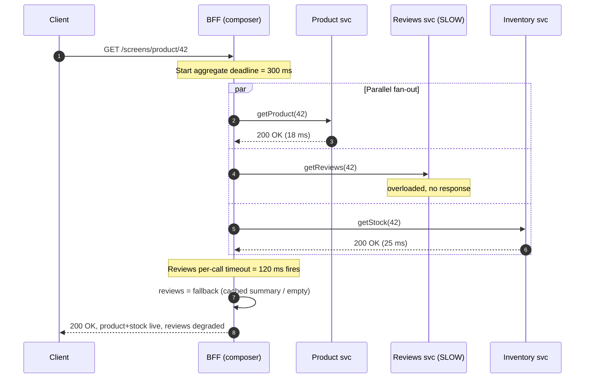
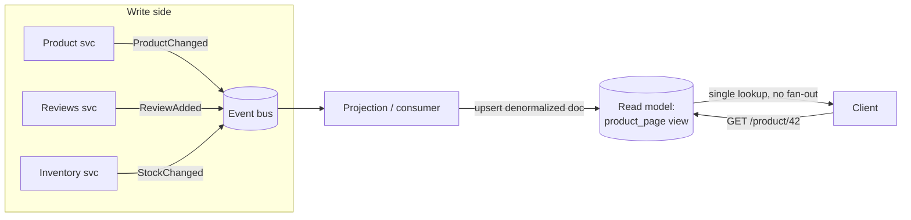

# API Composition — Middle

<!-- level-focus -->
At middle level, focus on this question:

> Where does **API Composition** belong in a maintainable component, and which trade-off selects the design?

Use the smallest realistic scenario that exposes the decision and its failure behavior.
---

## 1. Where composition lives: gateway vs BFF vs composition service

Composition is a *responsibility*, and where you place it changes latency, coupling, and who owns the assembly logic. Three placements dominate.

- **API gateway aggregation.** The edge gateway (Kong, Apigee, AWS API Gateway, an Envoy filter) fans out to a few backends and merges responses. Cheap when the merge is trivial — concatenate two JSON blobs, no per-client shaping. The gateway is shared infrastructure, so aggregation logic that lives there is generic by construction and hard to evolve per consumer.
- **Backend-for-Frontend (BFF).** A dedicated backend owned by *one* frontend team (iOS, web, partner API). It composes exactly the data that frontend's screens need, shaped for that client. Each frontend gets its own BFF; the BFFs do not share a schema. This is the pattern documented as [Backends for Frontends on microservices.io](https://microservices.io/patterns/apigateway.html). The cost is duplication across BFFs; the benefit is that a UI change never blocks on a shared-gateway release train.
- **Dedicated composition service.** A standalone internal service whose job is "join these N domains." Useful when the *same* composed view is consumed by multiple frontends and other services (so it doesn't belong to any one frontend team) and the join logic is heavy enough to warrant isolation, its own scaling, and its own cache. It is [the API Composition pattern](https://microservices.io/patterns/data/api-composition.html) implemented as a first-class service rather than folded into an edge or a BFF.

| Dimension | API gateway aggregation | Backend-for-Frontend (BFF) | Dedicated composition service |
|---|---|---|---|
| Owner | Platform / infra team | One frontend team (per client) | A backend/domain team |
| Shaping | Generic, one shape for all | Per-client, screen-tailored | One canonical composed view |
| Best when | 2–3 calls, trivial merge | Client-specific screens, divergent needs | Same view reused by many consumers |
| Coupling risk | Frontend logic leaks into shared infra | Duplication across BFFs | Becomes a distributed monolith if it owns too much logic |
| Deploy cadence | Slow (shared platform) | Fast (owned by the UI team) | Independent |
| Where auth/rate-limit sits | Naturally here | Delegated to gateway upstream | Delegated to gateway upstream |

Rule of thumb: gateway for trivial merges, **BFF when clients diverge**, composition service when the composed view is a reusable asset in its own right. A BFF and a gateway are not exclusive — the gateway does auth/TLS/rate-limiting at the edge and forwards to the BFF, which does the domain fan-out.

---

## 2. Fan-out mechanics: parallel vs sequential

The composer's latency is dominated by how it schedules its downstream calls.

- **Parallel (scatter-gather).** Independent calls fire concurrently; aggregate latency ≈ the **slowest** call (p-latency of the tail dependency), not the sum. This is the default and correct choice whenever calls have no data dependency between them.
- **Sequential (pipeline).** Required only when call *B* needs a value from call *A*'s response (e.g. resolve a `userId` → get their `cartId` → fetch cart lines). Here latency is additive. Sequential chains are the biggest avoidable latency sink in composition — audit every one and ask "does B *truly* need A's output, or am I just calling them in the order I wrote them?"

The practical shape is a **hybrid**: parallelize everything independent, and keep only the genuinely dependent hops sequential. If A→B is a chain but C and D are independent of both, run `{A→B}`, `C`, and `D` all concurrently and join at the end.



Two properties to lock in from the diagram: (a) the fan-out is `par`, so the client waits ~one round trip, not three; and (b) the slow dependency **cannot** blow the whole response — its per-call timeout fires and a fallback is substituted, covered next.

---

## 3. Timeouts and the aggregate deadline

Every downstream call gets a **per-call timeout**, and the whole request gets an **aggregate deadline (budget)**. These are different tools:

- **Aggregate deadline** — the total time the client is willing to wait (e.g. 300 ms). It is passed down as a request-scoped deadline (Go `context.WithTimeout`, gRPC deadlines, an `X-Request-Deadline`/`Deadline` propagated header). Every downstream call is bounded by *time remaining* against this budget, so a request never runs past the point where the client has already given up.
- **Per-call timeout** — a per-dependency ceiling derived from that dependency's own latency SLO (e.g. reviews p99 = 90 ms → timeout 120 ms). Set it just above the dependency's p99, not to some round number; too-generous timeouts defeat the point because the slow call eats the whole budget before firing.

Guidelines that separate a working composer from a fragile one:

1. **Never call downstream without a timeout.** An untimed call inherits the transport default (often tens of seconds) and turns one slow dependency into a stalled thread and, under load, a thread-pool exhaustion / cascading failure.
2. **Budget = max(critical-path per-call timeouts), not their sum**, because independent calls run in parallel. If the deepest sequential chain is A(50)→B(80) = 130 ms and everything else fits under that, the aggregate deadline of ~200 ms is realistic.
3. **Propagate the deadline downstream** so services stop working on a request the caller has abandoned — otherwise you burn capacity computing responses nobody will read.
4. **Pair timeouts with a circuit breaker** per dependency: after a run of failures, stop calling the dead dependency and serve its fallback immediately, so you don't pay the timeout on every request while it's down.

---

## 4. Partial-failure handling: partial data, defaults, cached

The defining discipline of composition is deciding, **per dependency**, whether it is *required* or *optional* for the response to be useful.

- **Required dependency** (e.g. the core product for a product page): if it fails, the whole response fails — return `502/503` with a clear error. Do not fabricate a fake product.
- **Optional dependency** (reviews, recommendations, "customers also bought"): if it fails or times out, **degrade gracefully** and still return `200`. The screen renders with a hole where the optional widget was, not an error page.

Fallback strategies for optional dependencies, in rough order of preference:

| Strategy | What you return on failure | Good for | Caveat |
|---|---|---|---|
| **Cached (stale)** | Last-known-good value from a local/near cache | Slow-changing data (ratings summary, catalog copy) | Serve stale, must signal freshness; needs a warm cache |
| **Default / empty** | Neutral placeholder (`reviews: []`, `recommendations: []`) | Data whose absence the UI can render cleanly | UI must be built to render the empty state |
| **Partial omission** | Drop the field entirely from the composed payload | Purely additive widgets | Client must tolerate missing keys |
| **Best-effort recompute** | A cheaper approximation (e.g. count from a cached aggregate) | When an approximate answer beats none | Extra code path to maintain and test |

Make partial success **observable to the caller**: annotate the composed response so the client (and your dashboards) know it was degraded — e.g. `"_partial": true` or a per-section `"status": "degraded"`. Blindly returning `200` with silently-missing data hides incidents and confuses clients that can't tell "no reviews exist" from "reviews service is down." The composer should also emit a metric per dependency (`hit / timeout / fallback`) so degradation is a graph, not a surprise.

---

## 5. Worked example: a BFF assembling a product screen

A mobile product screen needs: the **product** (name, price, images — *required*), **live inventory** (in-stock badge — *required-ish*), **review summary** (stars + count — *optional*), and **recommendations** (*optional*). Four owners, four services. The iOS BFF composes them.

Pseudo-implementation of the composer (language-agnostic, concurrency + fallback made explicit):

```text
handle GET /screens/product/{id}:
    deadline = now + 300ms                      # aggregate budget
    ctx = context.with_deadline(deadline)

    # fan out — all independent, run concurrently
    fProduct = async  call(product.get,   id, ctx, timeout=150ms)   # REQUIRED
    fStock   = async  call(inventory.get, id, ctx, timeout=120ms)   # required-ish
    fReviews = async  call(reviews.get,   id, ctx, timeout=120ms)   # optional
    fRecs    = async  call(recs.get,      id, ctx, timeout=100ms)   # optional

    product = await fProduct
    if product.failed:
        return 503  { error: "product_unavailable" }               # hard fail

    stock = await fStock  or  { available: null, status: "unknown" }   # neutral default
    reviews = await fReviews
        or  cache.get("reviews:"+id)                               # 1) stale cache
        or  { rating: null, count: 0 }                             # 2) empty default
    recs = await fRecs  or  []                                     # empty default

    partial = fStock.failed or fReviews.usedFallback or fRecs.failed

    return 200 {
        product, stock, reviews, recs,
        "_partial": partial
    }
```

What each design decision buys:

- **All four calls fan out in parallel**, so the screen's server-side latency is ≈ `max(150, 120, 120, 100)` capped by the 300 ms budget — not `150+120+120+100 = 490 ms`.
- **`product` is the only hard dependency.** Its failure is the only thing that can turn the response into a 5xx. That is a deliberate product decision: a product page with no product is not a page.
- **`reviews` has a two-level fallback** — try the live call, then a stale cache, then an empty default — so a reviews outage shows a page without a rating widget rather than an error. `recs` and `stock` degrade to a neutral value.
- **`_partial` surfaces degradation** to the client and to observability, instead of pretending the response was whole.

This is exactly the [Backends for Frontends](https://microservices.io/patterns/apigateway.html) shape: the composition logic and the fallbacks are specific to *this* client's screen, owned by the team that ships that screen, and it can change on the UI team's cadence without a shared-platform deploy.

---

## 6. The alternative: CQRS read model / materialized view

Composition-on-read pays the fan-out cost on **every request**. The alternative is to pay it **once, on write**: pre-join the data into a read-optimized store so the read is a single lookup with no fan-out.

This is the read side of **CQRS**. Domain services emit events on state change; a **materialized view** (a projection) subscribes, denormalizes, and maintains a document shaped like the screen — one row/document per product page, already containing product + stock summary + review summary. The read path becomes `GET view.product:42` — a single key lookup, no scatter-gather, no partial-failure branching at read time.

The mechanics and their trade-offs are documented under [CQRS](https://microservices.io/patterns/data/cqrs.html) on microservices.io. The core cost you accept: **eventual consistency**. The projection lags the source of truth by the event-propagation delay, so a just-changed price may be stale in the read model for a short window. You also take on projection code, replay/rebuild tooling for when a projection is wrong, and storage for the denormalized copies.



---

## 7. Choosing between composition-on-read and a read model

Neither is universally right. The decision hinges on read/write ratio, consistency tolerance, and how volatile the source data is.

| Concern | API composition (fan-out on read) | CQRS read model (pre-joined on write) |
|---|---|---|
| Read latency | Sum/max of downstream calls + network | Single lookup — fastest |
| Consistency | Strong (reads live data at request time) | Eventual (projection lags writes) |
| Cost paid per | Every read | Every write, once |
| Best for read:write | Low-to-moderate reads | Read-heavy (fan-out cost repeated too often) |
| Partial-failure logic | Required at read time (this whole doc) | Absent at read time; moved into projection health |
| Storage | None extra | Denormalized copies, per view |
| Operational surface | Timeouts, circuit breakers, fallbacks | Projection lag, event ordering, replay/rebuild |
| Data freshness need | High (must be current) | Tolerates seconds of staleness |
| New view = | New composition endpoint | New projection + backfill |

Heuristics:

- Start with **composition-on-read**. It has no eventual-consistency tax and no projection machinery — the simplest thing that works.
- Move a view to a **read model** when: it is read *far* more than the underlying data changes, the fan-out is expensive or wide (many services / N+1 shapes), and the business tolerates second-scale staleness.
- These are not exclusive at the system level: keep strongly-consistent, low-traffic screens on composition and promote the few hot, read-heavy, staleness-tolerant screens to projections.

---

## 8. Middle-tier checklist

- [ ] I can name **where** each composition lives (gateway / BFF / composition service) and justify it against the table in §1.
- [ ] Independent downstream calls fan out **in parallel**; only genuinely data-dependent hops are sequential.
- [ ] Every downstream call has a **per-call timeout** set just above its p99, and the request carries a **propagated aggregate deadline**.
- [ ] Each dependency is classified **required vs optional**; optional ones have an explicit fallback (cached → default → omit).
- [ ] Partial success is **observable** (`_partial` flag + per-dependency metric), never a silent hole.
- [ ] Timeouts are paired with **circuit breakers** so a dead dependency serves its fallback immediately.
- [ ] For hot, read-heavy, staleness-tolerant screens, I have considered a **CQRS read model** instead of fanning out on every request.

---

*Next step:* [API Composition — Senior](senior.md)

---

## Apply it

1. Find a real component where **API Composition** affects an interface or dependency.
2. Write two plausible choices and the constraint that favors each one.
3. Make the smallest reversible change at that boundary.
4. Exercise the component alone, then exercise the integrated flow.
5. Keep the decision note with the evidence that selected the option.

## Verify your work

- A focused check proves the local behavior.
- An integrated check proves callers and dependencies still agree.
- Logs, traces, compiler output, or benchmarks expose the boundary.
- Reverting the change restores the previous behavior without unrelated edits.

## Review questions

- Which boundary is most affected by API Composition?
- What constraint would make you choose the alternative design?
- How would you isolate a local defect from an integration defect?
- What evidence shows that the change remains maintainable?
