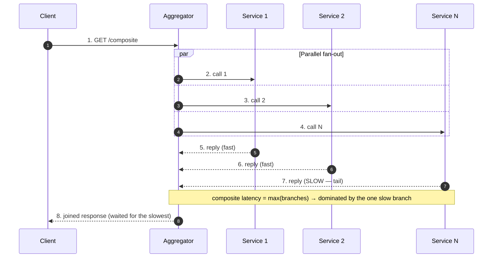
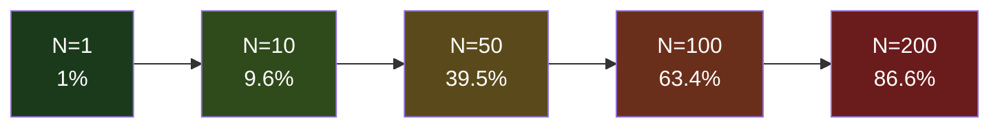
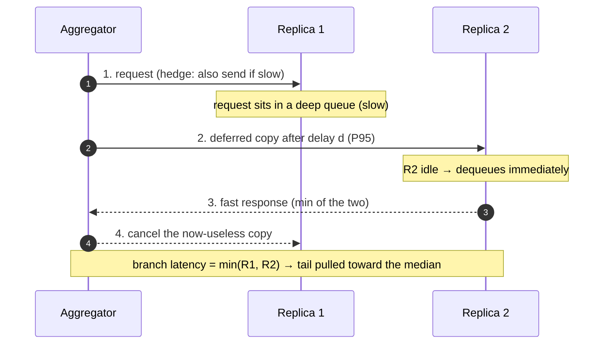

# API Composition — Professional

<!-- level-focus -->
At professional level, focus on this question:

> How should teams adopt and operate **API Composition** with measurable outcomes and limited coordination?

Use the smallest realistic scenario that exposes the decision and its failure behavior.
---

## 1. Why Composition Changes the Math

An API composition layer (a BFF, a gateway aggregator, a GraphQL resolver) turns one
inbound request into a *fan-out* of backend calls, then joins the results. The reason
this is a distinct discipline — and not just "call some services" — is that two
composite metrics degrade **super-linearly** with fan-out width N:

- **Composite tail latency.** The composite is only as fast as its *slowest* branch
  (for a parallel fan-out, the wall-clock time is `max` over the branches). Taking a
  maximum over many random variables pushes the observed latency far out into the tail.
- **Composite availability.** For a fan-out where *every* branch is required, the
  composite succeeds only if *all* branches succeed. Success probabilities **multiply**,
  so availability erodes with each added dependency.

The whole professional-level intuition is this: *the mean is a lie for composed calls.*
A branch that is "1% slow" or "99.9% available" looks harmless in isolation and becomes
dominant once you take a `max` or a product over N of them. Sections 2 and 3 make each
of those precise.



---

## 2. The Tail at Scale — `1 − (1 − p)^N` Derived and Worked

**Setup.** Let each backend call independently have probability `p` of exceeding a
latency threshold `L` (i.e., `p = P[branch latency > L]`; equivalently, if `L` is the
per-branch P99, then `p = 0.01`). The aggregator waits for **all N** branches (a
required fan-out), so the composite exceeds `L` if *at least one* branch does.

**Derivation.**

```text
Let X_i = event "branch i exceeds L",  with P[X_i] = p, branches independent.

P[a given branch does NOT exceed L]          = 1 − p
P[ALL N branches stay under L]  (independence) = (1 − p)^N
P[composite exceeds L]
    = P[at least one branch exceeds L]
    = 1 − P[all N stay under L]
    = 1 − (1 − p)^N                              ← the tail-at-scale formula
```

The step that does the damage is the independence product `(1 − p)^N`: raising a number
slightly below 1 to the N-th power drives it toward 0 as N grows, so its complement
races toward 1.

**Worked example (the canonical one).** `p = 0.01` (each call's P99 = L), `N = 100`:

```text
P[composite > L] = 1 − (1 − 0.01)^100
                 = 1 − 0.99^100
                 = 1 − 0.3660  (0.99^100 ≈ 0.3660)
                 = 0.6340   ≈ 63%

So a fan-out of 100 calls, each with a 1-in-100 chance of being slow, is slow
about 63% of the time. What was a per-branch P99 becomes a composite P37 —
the "1% tail event" is now the common case.
```

This is exactly the effect Dean & Barroso describe in **"The Tail at Scale" (CACM,
Feb 2013)**: in a service where a user request touches many servers, the *service-level*
tail is set by the *rare* slow response of *any* one of them, and rare-per-server becomes
frequent-per-request at fan-out scale.

**A fast approximation.** For small `p`, `(1 − p)^N ≈ e^{−pN}`, so
`P[composite > L] ≈ 1 − e^{−pN}`. With `p = 0.01, N = 100`: `pN = 1`, and
`1 − e^{−1} = 0.632` — matching the exact 0.634 to within rounding. The quantity `pN`
(expected number of slow branches) is the knob: keep `pN ≪ 1` and the composite tail
stays small; let `pN ≈ 1` and roughly two-thirds of composites are slow.

**Tail vs N table** (each branch `p = 0.01`, exact `1 − 0.99^N`):

| Fan-out N | `0.99^N` (all fast) | `P[composite > L]` | Reading |
|-----------|---------------------|--------------------|---------|
| 1         | 0.990               | 1.0%               | the per-branch P99 |
| 5         | 0.951               | 4.9%               | still tolerable |
| 10        | 0.904               | 9.6%               | ~1 in 10 slow |
| 50        | 0.605               | 39.5%              | tail now common |
| 100       | 0.366               | **63.4%**          | slow is the norm |
| 200       | 0.134               | 86.6%              | almost always slow |



**Consequences for design.**

- To hold the composite tail at target `T` (e.g., "composite P99 ≤ L"), each branch must
  satisfy `1 − (1 − p)^N ≤ T`, i.e. `p ≤ 1 − (1 − T)^{1/N}`. For `T = 0.01, N = 100`:
  `p ≤ 1 − 0.99^{0.01} ≈ 0.0001` — each branch needs a **P99.99**, two nines tighter than
  the composite target. Fan-out *tightens* every dependency's SLO.
- Reduce N: co-locate data so one call replaces ten (this is what read-time→write-time
  joins do, §6), or collapse chatty calls into a batch endpoint.
- Cut the *per-branch* tail directly: hedged/tied requests (§4).

---

## 3. The Availability Product for Composed Calls

**Setup.** Let branch `i` have availability `aᵢ = P[branch i returns a good response]`.
For a required fan-out (every branch must succeed for the composite to succeed), and
assuming independent failures:

```text
A_composite = ∏_{i=1..N} a_i          ← the availability product

If all branches share availability a:  A_composite = a^N
Composite unavailability:              1 − a^N ≈ N·(1 − a)   for a ≈ 1
```

The approximation `1 − a^N ≈ N·(1 − a)` (first-order, from `a^N ≈ 1 − N(1−a)`) is the
availability twin of the tail approximation `1 − e^{−pN} ≈ pN`: **unavailability adds up
roughly linearly across dependencies.**

**Worked example.** Each backend is a respectable three-nines service, `a = 0.999`.

```text
N = 10 :  A = 0.999^10  = 0.99004   → ~2 nines  (unavailability 0.996%)
N = 50 :  A = 0.999^50  = 0.95121   → downtime  4.9%
N = 100:  A = 0.999^100 = 0.90479   → ~1 nine   (unavailability ≈ 9.5%)

Linear check for N=10: N·(1−a) = 10 × 0.001 = 0.010 → A ≈ 0.990. Matches 0.99004.
```

Ten three-nines dependencies, composed and all required, yield a **two-nines** endpoint.
A hundred of them yield roughly **one nine** — worse than a single unreplicated server.
The composite is strictly less available than its weakest link, and each additional
required dependency is a multiplicative tax.

**Availability product table** (`aᵢ = a` for all i):

| Per-branch `a` | N=5 | N=10 | N=50 | N=100 |
|----------------|-----|------|------|-------|
| 0.99  (2 nines)  | 0.951 | 0.904 | 0.605 | 0.366 |
| 0.999 (3 nines)  | 0.995 | 0.990 | 0.951 | 0.905 |
| 0.9999(4 nines)  | 0.9995| 0.9990| 0.9950| 0.9900|

**Design levers implied by the product:**

- **Make branches optional.** If a branch is *not* required — the composite can render a
  degraded-but-valid response without it — that branch leaves the product entirely. An
  optional branch with a timeout+fallback contributes `1` to the product, not `aᵢ`. This
  is the single most powerful availability lever in composition: turn required
  dependencies into optional ones with a default/placeholder.
- **Redundancy inside a branch** raises that branch's `aᵢ` toward `1 − (1−a)^r` for `r`
  replicas, buying back the exponent.
- **Fewer branches** (N) helps availability for the same reason it helps the tail —
  denormalize at write time (§6) so the read path touches one store.

> Tie-in: the tail product `(1−p)^N` and the availability product `∏ aᵢ` are the *same
> mathematics* — independent events compounded over a fan-out. Latency-exceedance is just
> a "soft failure"; treat a branch that misses its deadline as a (recoverable) failure and
> the two analyses merge.

---

## 4. Hedged and Tied Requests — Theory

The tail formula says the composite tail is dominated by the *rare* slow branch. Hedged
and tied requests attack that rare event directly, per Dean & Barroso's **"The Tail at
Scale"**.

**Hedged requests.** Send the request to one replica. If no response arrives within a
*deferral delay* `d` (chosen near a high percentile of the branch's own latency
distribution, e.g. its P95), send a *second* copy to another replica and take whichever
returns first, cancelling the loser.

Why it crushes the tail: the deferral `d` is set so that the second request only fires on
the small fraction (≈5%) of requests that are already running slow. For those, the
composite branch latency becomes `min` of two draws instead of a single unlucky draw —
and `min` pulls *toward* the median. A request only stays slow if *both* copies are slow.
If the slow-tail probability per copy is `p`, and the copies are roughly independent, the
branch's slow probability drops from `p` toward `p²` on the hedged fraction.

```text
Effect on the branch tail (informal):
  Without hedge:  P[branch > L] = p
  With hedge fired on the slow tail, ~independent copies:
                  P[branch > L] ≈ p²   (both copies must be slow)

Feed the improved per-branch p back into §2:
  p = 0.01, N = 100, no hedge  → 1 − 0.99^100  = 63%
  p = 0.01→~0.0001 effective   → 1 − 0.9999^100 ≈ 1.0%   composite tail collapses
```

**Tied requests.** A stronger variant. Send *both* copies (nearly) immediately, but
"tie" them: each replica's queue holds a reference to the other, and as soon as **one
starts executing**, it messages the other to cancel the still-queued twin. This kills the
dominant tail cause in queue-based systems — *queueing delay*, not service time — because
the request is served by whichever replica dequeues it first, and the duplicate is pulled
before it does real work. The extra cost is only the copies that both begin executing in
the tiny window before the cancel message lands.



**No-hedge vs hedge, at a glance:**

| Property | No hedge | Hedged request | Tied request |
|----------|----------|----------------|--------------|
| Extra load | 0% | small (only the deferred fraction) | small (only the pre-cancel overlap) |
| Tail cause it fixes | — | slow service *and* queueing | primarily queueing delay |
| Per-branch tail `p` → | `p` | ≈ `p²` on hedged fraction | ≈ `p²`, tighter window |
| Deferral delay | n/a | ≈ branch P95 | ≈ 0 (send immediately, cancel on start) |
| Correctness need | — | requests must be idempotent / cancellable | same + cross-replica cancel channel |

**Correctness caveats (why this is theory you must apply carefully):**

- Duplicated requests must be **idempotent** or safely cancellable; hedging a
  non-idempotent write (a payment, a counter increment) risks double execution.
- The deferral `d` must sit high in the distribution (P95+). Set it too low and you hedge
  *most* requests, multiplying load without buying tail improvement (§5).
- The copies must be *roughly independent*. A shared partition, a shared hot key, or a
  correlated GC pause defeats the `min`: both copies are slow together, and `p²` reverts
  toward `p`.

---

## 5. Modeling the Load Cost of Hedging

Hedging is a **latency-for-utilization** trade. The elegant result from Dean & Barroso is
that a well-tuned hedge buys a large tail reduction for a *small* load increase, because
the second copy fires only on the slow minority.

**Model.** Let the deferral `d` equal the branch's `(1 − f)` quantile — i.e., a fraction
`f` of requests exceed `d` and therefore trigger a hedge. The extra load is approximately:

```text
extra_load_fraction ≈ f × (fraction of the hedged request's work actually done
                            before the winner cancels the loser)

Upper bound (loser runs to completion): extra requests ≈ f  → +f load.
With prompt cancellation, the loser usually does far less than a full request's work,
so realized extra load ≪ f.
```

**Worked example.** Defer at P95 → `f = 0.05`. Naively, that is at most **+5%** duplicate
requests. Dean & Barroso report a real Google benchmark where hedging at the 95th
percentile cut the 99.9th-percentile latency of a read from **1,800 ms to 74 ms** while
adding only about **2%** extra requests (well under the 5% upper bound, because losers are
cancelled before completing). The lesson: choose `d` at a high percentile so `f` is small,
and cancel aggressively so realized overhead stays below `f`.

| Deferral point `d` | Hedged fraction `f` | Upper-bound extra load | Tail benefit |
|--------------------|---------------------|------------------------|--------------|
| P50 (median)       | 50%                 | +50%                   | large, but ruinous load |
| P90                | 10%                 | +10%                   | strong |
| P95                | 5%                  | +5% (often ~2% realized)| strong — the sweet spot |
| P99                | 1%                  | +1%                    | modest (only worst 1% helped) |

The utilization budget matters because of queueing theory: a system already near its
utilization knee (recall the M/M/1 result that latency blows up as ρ→1) cannot absorb even
a small *sustained* hedge load without *worsening* its own tail — the extra copies raise
ρ, which raises everyone's queueing delay, which raises `f`, which triggers more hedges.
Hedging is safe only with **utilization headroom** and a **rate cap** (e.g., "hedges may
add at most 5% to total load"); above that cap, drop back to a single request.

---

## 6. Read-Time vs Write-Time Joins, Formalized

Fan-out width N (which drives both §2 and §3) is not fixed — it depends on *where you do
the join*. This is the deepest lever in composition, and it is an **amortization** choice.

- **Read-time join (fan-out on read).** Store data normalized across services. On each
  read, the aggregator issues N calls and joins in memory. The composite pays the tail
  product and the availability product every request.
- **Write-time join (fan-out on write, a.k.a. materialized view / denormalization).**
  When any source changes, do the join *once* and store the pre-joined result. Reads hit a
  single store → `N = 1` on the read path, so `1 − (1−p)^1 = p` and `A = a`. You have moved
  the fan-out from the read path to the write path.

**The formal trade-off.** Let a piece of composed data be read `R` times and written `W`
times over its lifetime, with join fan-out cost `c` per join.

```text
Read-time join total work  ∝  R × c        (join on every read; writes are cheap)
Write-time join total work ∝  W × c + R×1  (join once per write; reads are O(1))

Write-time wins on total work when:  W × c + R  <  R × c
                                      W × c      <  R × (c − 1)
                                      W / R      <  (c − 1) / c   ≈ 1   for large c

So: when the read:write ratio R/W is high (read-heavy), pre-compute at write time.
The join work is amortized across many cheap reads. For a 100:1 read:write workload,
write-time joins do ~1/100th of the online join work.
```

But the write-time join is not free — it trades three costs for its read-latency win:

1. **Write amplification.** One source update triggers re-materialization, possibly across
   many views (a "celebrity" fan-out: one write updates millions of precomputed feeds).
   Write cost goes from `O(1)` to `O(fan-out of the view)`.
2. **Staleness.** Between the source change and the view refresh, reads return stale data.
   The materialized view is, by construction, an *eventually consistent* denormalization;
   the staleness window is the view's refresh lag.
3. **Storage.** The pre-joined result is stored redundantly (denormalized copies), costing
   space proportional to the number of views.

```mermaid
sequenceDiagram
    autonumber
    participant W as Writer
    participant V as Materializer
    participant Store as View Store
    participant R as Reader
    W->>V: 1. source change (write)
    V->>V: 2. do the join ONCE (fan-out on write)
    V->>Store: 3. write pre-joined view (amplified writes, staleness begins)
    Note over Store: view is now the read model
    R->>Store: 4. read (single call, N=1)
    Store-->>R: 5. pre-joined result — no read-time fan-out
    Note over R,Store: read pays p and a of ONE store; may be slightly stale
```

**Read-time vs write-time join, compared:**

| Dimension | Read-time join (fan-out on read) | Write-time join (materialized view) |
|-----------|----------------------------------|-------------------------------------|
| Read latency | high — `max` over N branches (§2) | low — single store, `N = 1` |
| Read availability | `∏ aᵢ` over N deps (§3) | `a` of one store |
| Write cost | `O(1)` | `O(view fan-out)` — write amplification |
| Consistency | fresh (reads current sources) | eventually consistent — staleness window |
| Storage | normalized, minimal | denormalized, redundant copies |
| Best when | write-heavy; freshness critical; ad-hoc joins | read-heavy (`R/W` high); read latency/availability critical |
| Canonical instance | GraphQL resolver fan-out; BFS aggregation | timeline fan-out-on-write; CQRS read model; DB materialized view |

The decision rule falls straight out of the amortization inequality: **pre-compute
(write-time) when reads vastly outnumber writes and you can tolerate a bounded staleness
window; join at read time when writes dominate, freshness is non-negotiable, or the query
shapes are too varied to materialize.** Hybrid designs pick per-entity (e.g., fan-out-on-
write for normal users, fan-out-on-read for celebrities whose write amplification is
prohibitive).

---

## 7. Putting It Together: A Composition Latency Budget

A worked composite that exercises every result above. A product page aggregates `N = 8`
required backend calls; each has per-call P99 threshold `L = 50 ms` (so `p = 0.01`) and
availability `a = 0.999`.

```text
Baseline (read-time join, no hedge):
  Composite tail:  1 − (1 − 0.01)^8  = 1 − 0.9227 = 7.7%   → composite P92, not P99
  Composite avail: 0.999^8           = 0.99202            → ~2 nines (unavail 0.8%)

Lever 1 — make 3 of 8 branches OPTIONAL (fallback to cached/default):
  Required N drops 8 → 5.
  Composite tail:  1 − 0.99^5 = 4.9%
  Composite avail: 0.999^5    = 0.99501  (optional branches contribute 1 to the product)

Lever 2 — hedge the remaining 5 required branches at P95 (f = 0.05):
  Effective per-branch p: 0.01 → ~0.0005 (near p² on the hedged tail)
  Composite tail:  1 − (1 − 0.0005)^5 ≈ 0.25%   → comfortably under a 1% (P99) target
  Extra load:      ≤ +5% (realistically ~2% with prompt cancel)

Lever 3 — for the read-heavy core object (R/W ≈ 100:1), materialize the join:
  Read path N: 5 → 1 for the pre-joined part.
  Read-time work cut ~100×; read tail = p of one store; cost = staleness + write amplification.
```

Each lever maps to a section: **optional branches** shrink the product (§3), **hedging**
shrinks per-branch `p` (§4–5), **materialization** shrinks N on the read path (§6). Applied
together they move an endpoint from a 7.7% composite tail and two nines to a sub-1% tail
and near-three nines, at a few percent extra load and a bounded staleness window.

---

## 8. Assumptions, Limits, and When the Math Lies

Every formula above rests on **independence**. The professional obligation is to know when
that assumption breaks, because when it does, the clean products stop holding — usually in
the pessimistic direction.

- **Correlated tails.** `1 − (1 − p)^N` and `∏ aᵢ` assume independent branches. Shared
  infrastructure (one overloaded database behind three "different" services, a common GC
  pause, a saturated network link, a shared thundering-herd cache-miss) makes slow/failed
  branches *co-occur*. Correlation makes the composite tail **worse** than the independent
  formula for the mean case but can make catastrophic all-fail events more likely — and it
  defeats hedging, since both copies are slow together (`p²` reverts toward `p`).
- **Hedging needs headroom and idempotency.** §5's small-cost result assumes utilization
  headroom and cancellable/idempotent work. Without headroom, hedges raise ρ and worsen the
  very tail they target; without idempotency, duplicates corrupt state.
- **`max` vs sum.** §2 models a *parallel* fan-out (composite = `max` of branches). A
  *sequential* chain of N calls has composite latency ≈ the *sum* of branch latencies and
  composite tail governed by the convolution — even worse, and the reason to parallelize
  independent branches and to collapse sequential chains.
- **Materialized views trade correctness for latency.** §6's write-time join is an
  eventually consistent denormalization. If a reader cannot tolerate the staleness window,
  the amortization argument does not license it regardless of the read:write ratio.
- **The threshold `p` is per-workload.** `p = P[branch > L]` depends on the chosen `L`,
  the load, and the time of day. Re-derive it from live percentiles; do not assume a
  static P99.

The through-line: composition is compounding. Independent good behavior compounds into
composite bad behavior via products and maxima, and the engineer's job is to *break the
compounding* — reduce N, make branches optional, hedge the tail, and amortize joins — while
respecting the independence and headroom assumptions that make the arithmetic valid.

> 🎞️ **See it animated:** none verified for this specific topic — the results here are best
> reproduced with your own service's latency histograms.

**Primary sources (cite by name — no invented URLs):**

- Jeffrey Dean and Luiz André Barroso, **"The Tail at Scale," Communications of the ACM,
  Vol. 56 No. 2, February 2013** — the tail-probability argument, hedged requests, and tied
  requests.
- The availability-product and read-time/write-time-join amortization are standard results;
  fan-out-on-write vs fan-out-on-read is treated at length in Martin Kleppmann,
  *Designing Data-Intensive Applications* (the Twitter timelines example).


---

## Apply it

1. Define the user or business outcome that **API Composition** should improve.
2. Assign one owner for code, contracts, operations, and incidents.
3. Split delivery into reversible increments that produce evidence early.
4. Publish responsibilities, escalation paths, and compatibility windows.
5. Stop or expand only when the agreed measures support that decision.

## Verify your work

- Each increment has an owner, rollback path, and observable exit condition.
- Adoption, reliability, delivery time, and coordination cost are measured.
- Incident and migration exercises prove that responsibility is executable.
- The old path is removed only after telemetry proves it is unused.

## Review questions

- Which measurable outcome justifies investing in API Composition?
- Which team owns the full lifecycle and incident response?
- What reversible increment produces the earliest useful evidence?
- Which exit condition proves that migration or adoption is complete?
