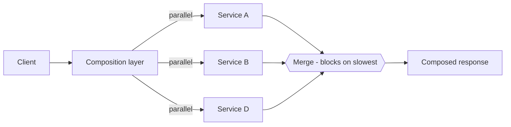
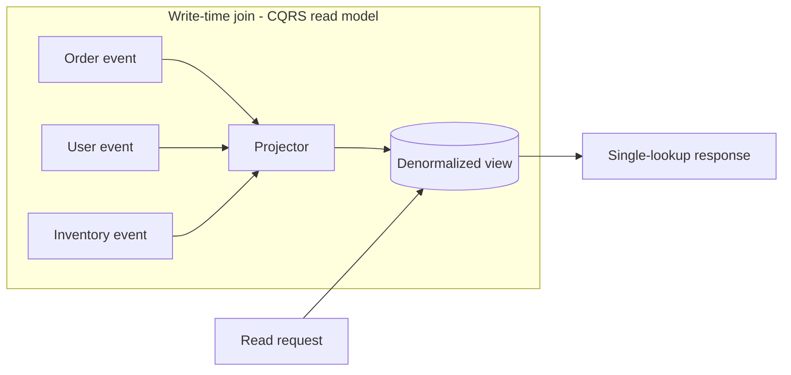

# API Composition — Senior

<!-- level-focus -->
At senior level, focus on this question:

> Which system invariant is affected by **API Composition** under failure, load, and change?

Use the smallest realistic scenario that exposes the decision and its failure behavior.
## 1. The fan-out model and where cost hides

A composition endpoint (an aggregator, BFF, or gateway) receives a request, dispatches sub-requests to N dependencies, and merges. The naive mental model is *"total latency = sum of the parts"* if serial, or *"latency = the max of the parts"* if parallel. Both are correct only for the mean. The load-bearing insight is that a composed response is bounded below by its **slowest** contributing call, and slowness is not evenly distributed — it lives in the tail.

Two dispatch shapes:

- **Serial (dependent) fan-out** — call B needs the output of A. Latency adds; tails add too. This is where the N+1 anti-pattern breeds (§8).
- **Parallel (independent) fan-out** — A, B, C fire concurrently; you block on the last to return. Latency is `max(A, B, C)`. This is the common case, and the one the tail math punishes.



The cost hides in the merge node: it cannot complete until every branch it depends on has returned (or been cut off). Everything downstream in this tier is a strategy for making that merge node stop waiting on the worst branch.

---

## 2. The tail-latency problem: p99 amplification

Dean & Barroso, *"The Tail at Scale"* (Communications of the ACM, 2013), name the mechanism precisely: **variability in individual server latency gets amplified at the service level by fan-out.** A single backend might have a perfectly healthy p50; its p99 is where GC pauses, queueing behind a slow request, disk seeks, network retransmits, and noisy neighbors live. Those events are individually rare, but a composed request that touches many backends is likely to hit *at least one* of them.

The consequence is counter-intuitive and worth stating flatly: **as you fan out to more services, the tail latency of the composite gets worse even if every dependency's own tail stays constant.** You do not need any service to degrade for your p99 to blow up — you only need to add more of them. The composite p99 is not the p99 of any single dependency; it drifts toward the *max* of independent draws, which sits far out in each dependency's tail.

This reframes a common design instinct. "Let's split this into more granular services and compose them" is a latency-tail decision, not just an organizational one. Each new dependency in the fan-out set is another lottery ticket for hitting someone's tail.

---

## 3. The "one in a hundred" math

Model each of N independent parallel calls as having probability `p` of being "slow" (say, slower than that service's p99, so `p = 0.01`). The composite request is slow if **at least one** call is slow:

```
P(composite slow) = 1 - (1 - p)^N
```

Plug in `p = 0.01`:

| N (fan-out) | 1 − (0.99)^N | Interpretation |
|---|---|---|
| 1 | 0.010 | 1% of requests hit the tail |
| 10 | 0.096 | ~1 in 10 requests slow |
| 50 | 0.395 | ~2 in 5 requests slow |
| 100 | 0.634 | ~2 in 3 requests slow |
| 200 | 0.866 | ~7 in 8 requests slow |

At a fan-out of 100 to services whose *individual* p99 latency is your slowness threshold, roughly **63% of composite requests** experience a "one-in-a-hundred" event on at least one leg. Dean & Barroso's canonical version: with each server responding above 1 s only 1% of the time, a request touching 100 servers sees a >1 s response **63%** of the time. The rare event, at scale, becomes the common case.

Two corollaries seniors must internalize:

- **Percentiles do not compose by taking the same percentile.** The composite's p99 is governed by the *tail* of the underlying distribution, not by lining up each dependency's p99. Reducing a dependency's median does almost nothing for the composite; reducing its *tail* does.
- **The threshold matters more than the mean.** If your latency budget forces "slow" to mean "above p95" (`p = 0.05`), then `1 - (0.95)^20 ≈ 0.64` — a fan-out of only 20 already makes two-thirds of requests slow. Tightening budgets while widening fan-out is a trap.

---

## 4. Availability multiplication

Latency is not the only thing that compounds. If the composite **requires** all N dependencies to succeed, availability multiplies:

```
A_composite = A_1 × A_2 × ... × A_N
```

Ten dependencies each at 99.9% ("three nines") give `0.999^10 ≈ 0.990` — the composite drops to **99.0%**, roughly 10× the downtime. Fan out to 100 such dependencies and you are at `0.999^100 ≈ 0.905`. You cannot buy your way to composite reliability by hardening one service; the product punishes the weakest and the count alike.

The only escape is to **break the "all must succeed" requirement** — i.e. degrade gracefully so a failed leg yields a partial (but useful) response rather than a total failure (§5). Once a dependency is optional, it drops out of the multiplication for the *availability of a useful answer*. This is why partial responses are an availability lever, not merely a UX nicety: they convert an AND across dependencies into an OR-ish "best effort" that no longer compounds catastrophically.

---

## 5. Tail mitigations: parallelism, hedging, timeouts, partial responses

The toolkit, and what each actually buys:

- **Parallelism** — fire independent calls concurrently so composite latency is `max` not `sum`. Necessary but not sufficient: `max` of many draws still lands in the tail (§2). Parallelism removes serial addition; it does not remove tail amplification.
- **Hedged / backup requests** (Dean & Barroso) — after a call exceeds, say, its p95, send a *second* copy to a replica and take whichever returns first; cancel the loser. This trades a small fraction of extra load (only ~5% of requests are hedged) for a dramatic tail cut, because it takes the *min* of two independent draws for the unlucky requests. Tied requests (send to two, cancel on first pickup) push this further.
- **Timeouts + partial responses** — cap every leg at a deadline derived from the *remaining* request budget, not a fixed constant. When a leg times out, return the composite *without* it, flagged as degraded. This bounds the tail at the timeout and breaks availability multiplication (§4).
- **Caching** — serve dependency data from a near cache so the slow leg is skipped entirely on hits. Effective for read-mostly, tolerant-of-staleness fields.
- **Precomputed read models** — the structural fix: move the join off the read path entirely (§6), so there is no fan-out to have a tail.

Deadline propagation is the discipline that ties these together: the incoming request carries a budget; each hop subtracts its elapsed time and passes the remainder down. A leg with 20 ms left does not get to wait 2 s. Without propagated deadlines, timeouts are guesses and cascading timeouts (§8) become inevitable.

---

## 6. Read-time composition vs write-time materialized views

The deepest lever is *when* the join happens. **Read-time composition** joins on every request (fan out, merge). **Write-time materialization** — the read side of CQRS — does the join once, on write, and stores a denormalized read model the query reads with a single lookup. You are choosing which side of the read/write asymmetry pays.



| Dimension | Read-time composition | Write-time materialized view (CQRS) |
|---|---|---|
| When the join runs | Every read | Once per write / event |
| Read latency | Fan-out tail (§2) | Single lookup, tail-free |
| Read availability | Product of N (§4) | Depends on one store |
| Freshness | Live, as consistent as sources are | Lagging by projection delay |
| Write cost | None extra | Projection compute + storage |
| Storage | None extra | Denormalized duplication |
| Ad-hoc / new shapes | Immediate — just compose differently | Must build & backfill a new projection |
| Best when | Reads rare relative to writes, freshness critical, query shapes volatile | Reads >> writes, shapes stable, staleness tolerable |

The rule of thumb: **the read model exists to move the fan-out from the hot read path to the cold write path.** If a page is read a million times per write, materializing pays for itself many times over — and it eliminates both the tail amplification *and* the availability multiplication in one move. The cost is eventual-consistency lag and the operational weight of projections (rebuilds, backfills, schema evolution). Do not materialize prematurely: a volatile query surface or a write-heavy, read-light workload makes read-time composition the cheaper, more flexible choice.

---

## 7. Consistency of composed data

A composed response is a snapshot stitched from services that are each at a *different* consistency point. Service A may have committed a write that service B has not yet observed; the composite shows A's new value beside B's stale one, and the merged object can be internally inconsistent in a way no single source ever is. This is a first-class correctness concern, not an edge case.

Senior handling:

- **Name the guarantee you actually provide.** Read-time composition gives you, at best, per-source freshness — never a global snapshot across sources. If the client assumes cross-entity atomicity, you are lying to it.
- **Version and reconcile.** Carry entity versions/timestamps in sub-responses so the merge layer can detect and, where possible, resolve skew (drop the stale leg, or refetch).
- **Materialized views trade one skew for another.** A CQRS read model is internally consistent (it was joined at one point) but globally *stale* by the projection lag. You swap "inconsistent-but-fresh" for "consistent-but-behind." Pick the one your domain tolerates: a bank balance page prefers consistent-but-behind; a live-ops dashboard may prefer fresh-but-skewed.
- **Idempotent, monotonic projections.** For write-time models, ensure re-processing an event does not regress the view (monotonic reads), so retries and rebuilds converge rather than corrupt.

---

## 8. Failure modes: fan-out storms, cascading timeouts, N+1 across services

- **Fan-out storms.** One inbound request that expands into hundreds of downstream calls (often via unbounded loops over a collection) can saturate a dependency or a connection pool. A modest inbound QPS becomes a downstream QPS multiplied by the fan-out factor. Bound the fan-out: cap batch sizes, apply per-dependency concurrency limits and bulkheads, and load-shed at the aggregator before you amplify.
- **Cascading timeouts.** Without propagated deadlines, an inner service keeps working on a request whose caller has already timed out and retried — the classic retry-amplification collapse. The outer timeout must exceed the inner timeout *plus* transit, and deadlines must flow downward so no hop works past the client's budget. Pair with circuit breakers so a sick dependency is shed fast instead of dragging the composite into its tail on every request.
- **N+1 across services.** The distributed cousin of the ORM N+1: fetch a list of N items, then make one call *per item* to enrich each. N+1 sub-requests, N+1 tails, N+1 round trips — and the tail math of §3 hits its worst case because you have manufactured a huge fan-out. The fix is **batch APIs**: a single `getUsers([ids])` call replaces N `getUser(id)` calls, collapsing the fan-out from N to 1 and the availability product from `A^N` to `A`. Where the dependency lacks a batch endpoint, a request-coalescing loader (dataloader-style, dedupe + batch within a tick) restores it at the caller.

Each of these is the tail/availability math from §2–§4 showing up operationally. Bounding fan-out, propagating deadlines, and batching are not optional polish — they are what keep the composite from inheriting the sum of everyone's worst day.

---

## 9. Senior decision checklist

- **Count your fan-out.** Compute `1 - (1-p)^N` for your real N and slowness threshold. If the composite tail is unacceptable, the answer is fewer legs (batch, coalesce) or no legs on the read path (materialize) — not faster medians.
- **Compute the availability product.** `∏ A_i`. If it is below your SLO, make dependencies *optional* via partial responses, or move the join to write time.
- **Propagate deadlines** end to end; derive per-leg timeouts from the remaining budget.
- **Hedge the tail** for latency-critical, idempotent reads; cap hedge rate (~5%).
- **Choose read-time vs write-time deliberately** using the read:write ratio, query-shape volatility, and staleness tolerance — not by default.
- **State the consistency guarantee** the composite actually offers, and version sub-responses so the merge can detect skew.
- **Bound and batch** to kill fan-out storms and cross-service N+1 before they multiply your load.

*Next step:* [API Composition — Professional](professional.md)

---

## Apply it

1. State the system invariant that **API Composition** must protect.
2. Mark ownership, state, and failure propagation at each boundary.
3. Compare two designs under load, dependency failure, and future change.
4. Define recovery and compatibility behavior before implementation.
5. Test the riskiest assumption with a focused experiment.

## Verify your work

- The experiment supports the design with evidence, not preference.
- Failure injection shows the blast radius and recovery path.
- Compatibility checks cover old and new callers or data.
- Operational signals reveal invariant violations and recovery progress.

## Review questions

- Which invariant must remain true when API Composition fails?
- Where should recovery responsibility live, and why?
- Which assumption deserves an experiment before implementation?
- How can the design evolve without changing every consumer at once?
