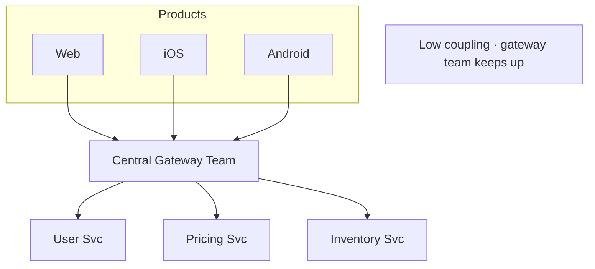
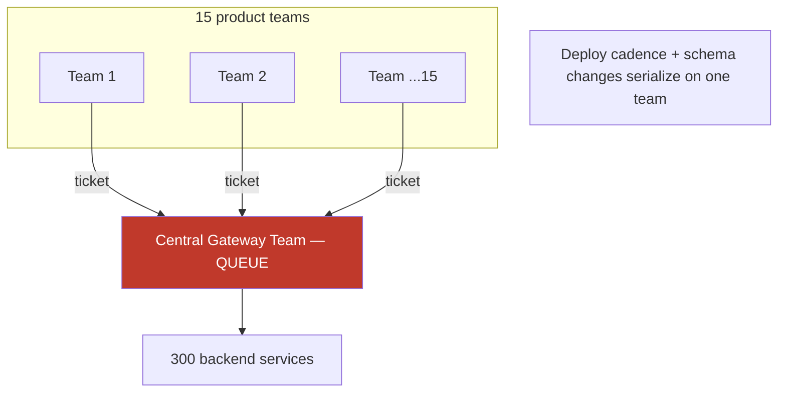
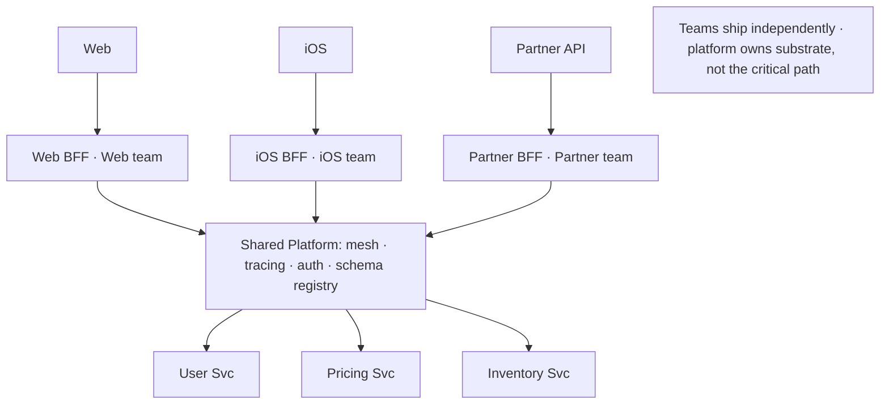
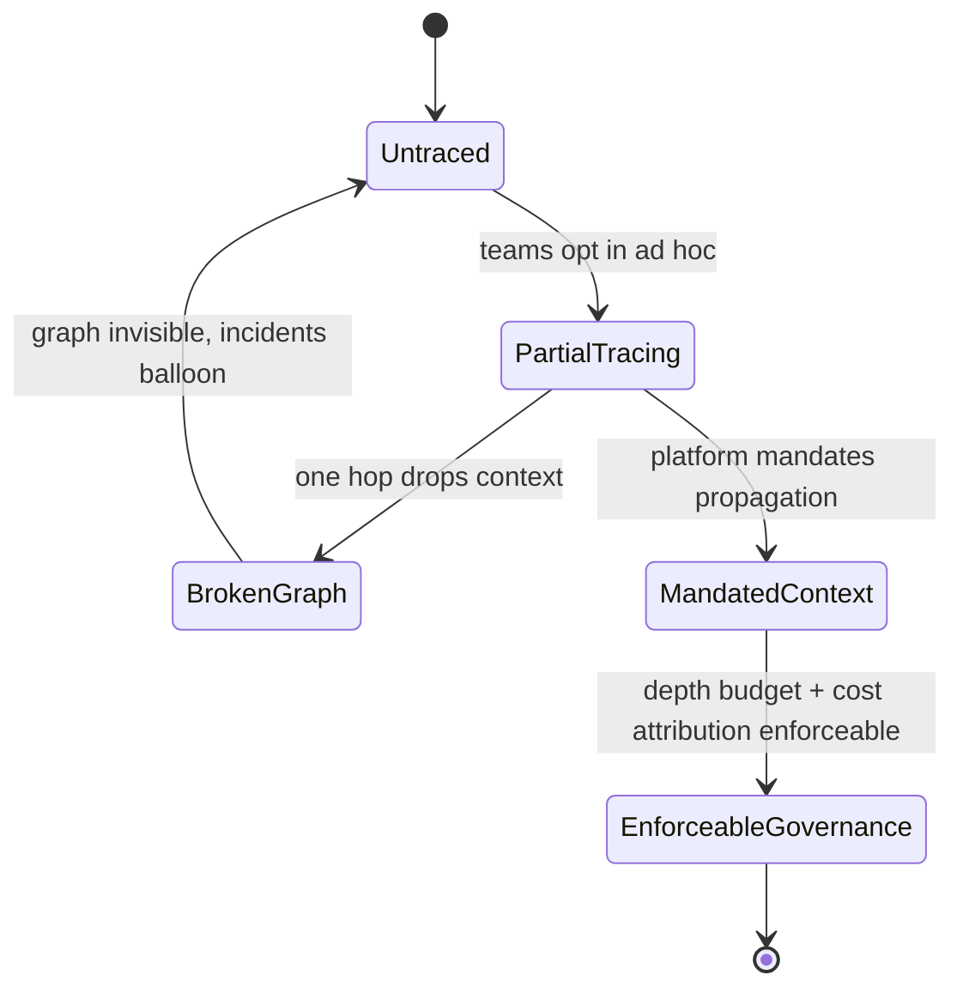

# API Composition — Staff

At Staff and Principal scope, API composition stops being "how do I aggregate three service calls into one response" and becomes a question about *who owns the aggregation layer, how deep the call graph is allowed to go, and what that graph costs the organization in latency, coupling, and on-call load over years.* The mechanism — fan-out, scatter-gather, joining partial results — is a solved problem you learned two tiers ago. The Staff problem is that a composition layer is a *shared surface every product team pushes their coupling through*, and if you let it grow without governance it becomes both the tightest bottleneck in the org chart and the deepest source of latency debt in the request path. This page treats composition as an organizational and cost decision, not a coding one.

## Table of Contents

1. [The framing: composition is where coupling goes to hide](#1-the-framing-composition-is-where-coupling-goes-to-hide)
2. [Who owns the composition layer: central gateway vs BFF-per-team](#2-who-owns-the-composition-layer-central-gateway-vs-bff-per-team)
3. [The central-gateway bottleneck, staged](#3-the-central-gateway-bottleneck-staged)
4. [Governing fan-out: depth, width, and latency debt](#4-governing-fan-out-depth-width-and-latency-debt)
5. [Live composition vs precomputed read models (CQRS) as a cost call](#5-live-composition-vs-precomputed-read-models-cqrs-as-a-cost-call)
6. [Observability of composed request graphs is a requirement, not a nicety](#6-observability-of-composed-request-graphs-is-a-requirement-not-a-nicety)
7. [Comparison tables](#7-comparison-tables)
8. [Failure modes and second-order consequences](#8-failure-modes-and-second-order-consequences)
9. [What to standardize as a platform organization](#9-what-to-standardize-as-a-platform-organization)
10. [Staff-level takeaways](#10-staff-level-takeaways)

---

## 1. The framing: composition is where coupling goes to hide

Every product surface — a mobile home screen, a web dashboard, a partner API — needs data assembled from many services. Someone has to make the fan-out calls, wait for the slowest one, stitch the results, and hand back a single payload. That "someone" is the composition layer, and the Staff observation is that **whoever owns it inherits the coupling of every team upstream of it.** A field added to the user service, a latency regression in the pricing service, a breaking change in the inventory schema — all of it surfaces first, and most painfully, in the composition tier.

This is why composition decisions cannot be evaluated per endpoint. A single team building an aggregator for their screen is making a local, reasonable choice. But if the org has one aggregator that all screens route through, that team's local choices become everyone's constraints: their deploy cadence gates everyone's releases, their p99 becomes everyone's p99 floor, and their on-call carries pages for failures in services they do not own. The Principal question is never "how do I compose these three calls" — it is "across fifty product surfaces and three hundred backend services, *where* does composition live, *how deep* is the graph allowed to go, and *who gets paged* when the graph is slow."

Three properties make composition an org-scale concern rather than an implementation detail:

- **It concentrates fan-out.** The composition tier is where N downstream calls converge into one response. Its latency is `max()` of its slowest dependency plus its own overhead — so it inherits the *tail* of every service it touches. Tail latency composes multiplicatively as the graph deepens.
- **It concentrates coupling.** Every schema, every field, every breaking change from upstream lands here first. The team that owns composition spends its time reacting to changes it did not initiate.
- **It concentrates blast radius.** A composed endpoint is only as available as the product of its hard dependencies. Ten dependencies at 99.9% each, all required, yields ~99.0% — the aggregator is *less* available than any single service behind it.

## 2. Who owns the composition layer: central gateway vs BFF-per-team

The two org shapes are a **central gateway/aggregation team** and **BFF-per-team** (Backend-for-Frontend, one composition service owned by each product team). This is the single most consequential Staff decision in this topic, because it is a decision about the org chart as much as the architecture — Conway's Law is not a footnote here, it is the whole point.

**Central gateway aggregation.** One team owns a shared aggregation layer (or a shared GraphQL gateway / federation router) that every product surface calls. It is attractive on paper: one place for cross-cutting concerns (auth, rate limiting, caching, schema governance), one team to build deep composition expertise, no duplicated fan-out logic. The failure mode is organizational, not technical: the central team becomes a **queue**. Every product team that needs a new field, a new join, or a new downstream integration files a ticket against the gateway team and waits. The gateway team's deploy pipeline gates every product launch. The gateway's release cadence sets the org's release cadence. You have built a central bottleneck out of humans, and it does not scale with headcount because the coupling is inherent, not a staffing gap.

**BFF-per-team.** Each product team owns its own composition service, tailored to *its* surface's exact needs — the iOS home screen has a BFF that returns exactly what the iOS home screen renders; the partner API has its own. The BFF pattern (popularized by SoundCloud and Netflix) deliberately trades duplication for autonomy: yes, three BFFs may each call the user service, but each team ships on its own cadence, owns its own p99, and shapes its own payload without negotiating with a central owner. The cost is real — shared logic (auth, tracing, retry policy) must be distributed as a *library or sidecar*, not a shared service, or you smuggle the bottleneck back in through the platform layer.

The Staff judgment is a governance decision, not a purity one. The dominant pattern at scale is **BFF-per-team on top of a thin, shared platform layer**: each team owns composition (autonomy where coupling is highest), while a platform team owns the *substrate* — the service mesh, the tracing standard, the auth middleware, the schema registry — that every BFF consumes but no BFF is blocked on. Central logic lives in libraries and sidecars; central *services* on the critical path are the bottleneck you are trying to avoid. GraphQL federation is a middle path: a shared router with team-owned subgraphs, which restores per-team schema ownership *if* the router itself does not become the gated team.

## 3. The central-gateway bottleneck, staged

The bottleneck is easiest to see as an evolution over time. A central gateway is genuinely the right call early — it is the wrong call at scale, and the transition is predictable.

**Stage 1 — Central gateway, few teams (correct).** Three product teams, one gateway team. Coupling is low, the gateway team keeps up, cross-cutting concerns live in one clean place.



**Stage 2 — Central gateway, many teams (the bottleneck).** Fifteen product teams, still one gateway team. Every new field, join, or downstream integration is a ticket. The gateway's deploy pipeline serializes fifteen teams' launches. The queue is now the constraint.



**Stage 3 — BFF-per-team on a shared platform (the resolution).** Each product team owns its BFF and ships independently. A platform team owns only the substrate — mesh, tracing, auth, schema registry — that every BFF consumes without being blocked on it.



The transition from Stage 2 to Stage 3 is one of the more common large-scale migrations a Staff engineer runs. The mistake is waiting until Stage 2 is on fire; the tell is when "waiting on the gateway team" starts appearing in retros and launch post-mortems as a recurring blocker. That is the signal that the shared *service* needs to become a shared *substrate*.

## 4. Governing fan-out: depth, width, and latency debt

Fan-out has two dimensions, and both need explicit governance because both accumulate silently until they cause an incident.

**Width** is how many downstream calls one composition makes in parallel. A BFF that scatters to twenty services and gathers the results has width 20. Width drives two costs: the composed endpoint's tail latency is the `max()` of all twenty (so it inherits the worst tail in the set), and its availability is the *product* of every hard dependency. The governance lever is **required vs optional dependencies.** A Staff-run composition layer classifies every downstream call: is this data *required* (the response is useless without it) or *optional* (degrade gracefully, return partial with a null field and a flag)? Ten required dependencies at 99.9% each is 99.0% composed availability — worse than any component. Convert eight of them to optional-with-fallback and the endpoint's availability decouples from their failures. This is the single highest-leverage fan-out governance rule: **most fan-out edges should be optional, and the payload contract must express partial results.**

**Depth** is how many hops a request traverses: BFF → order service → pricing service → tax service → currency service. Depth is more dangerous than width because it is *invisible in any single service's code* — each hop looks like one downstream call, and no team sees the full chain. Depth causes latency debt (each hop adds its own overhead and its own tail) and hidden coupling (a schema change five hops down breaks the top, and nobody in between knew the chain existed). It is also how you get *cyclic* and *amplifying* call graphs where one user request becomes thousands of internal calls — the read-amplification incidents that take down whole platforms.

The governance mechanism is a **depth budget** enforced by the tracing system, not a code review. You set an org-wide invariant — for example, "no synchronous request path may exceed 4 service hops on the critical path" — and you *enforce it with distributed tracing*: any trace that exceeds the depth budget is flagged, surfaced on a dashboard, and treated as latency debt to be paid down. Without tracing (Section 6), the depth budget is unenforceable because no one can see the graph.

```mermaid
sequenceDiagram
    autonumber
    participant BFF
    participant Order
    participant Pricing
    participant Tax
    participant Currency
    BFF->>Order: 1. getOrder (hop 1)
    Order->>Pricing: 2. getPrice (hop 2)
    Pricing->>Tax: 3. calcTax (hop 3)
    Tax->>Currency: 4. convert (hop 4)
    Currency-->>Tax: 5.
    Tax-->>Pricing: 6.
    Pricing-->>Order: 7.
    Order-->>BFF: 8.
    Note over BFF,Currency: Depth 4 · tail latency and coupling both compound per hop
    Note over BFF,Currency: Depth budget = 4 → this trace is at the limit; a 5th hop trips the alert
```

The two levers combine into a simple Staff rule: **govern width with the required/optional classification (protect availability), govern depth with a traced budget (protect latency and prevent hidden coupling).** Neither is a per-service concern; both are org invariants that only a platform-scoped owner can hold.

## 5. Live composition vs precomputed read models (CQRS) as a cost call

Live composition assembles the response *on the read path*, at request time, by fanning out to source-of-truth services. A precomputed read model (the read side of CQRS) does the assembly *ahead of time* — an asynchronous pipeline consumes change events from the source services and maintains a denormalized, query-optimized view that the read path serves directly with zero fan-out.

The Staff framing is that this is **a cost and complexity investment decision, not a correctness one.** Both are correct; they trade different resources. Live composition costs *read-path latency and downstream load* (every read re-does the fan-out). Precomputed read models cost *write-path complexity, storage, and staleness* — you now run and operate an ingestion pipeline, tolerate eventual consistency, and pay engineers to maintain denormalization logic and backfills. The naive engineer reaches for CQRS because it is architecturally impressive; the Staff engineer reaches for it only when the numbers demand it, because a read model is a *permanent operational liability* — a whole new failure domain with its own on-call, its own lag metric, and its own reconciliation jobs.

The decision hinges on read/write ratio and fan-out cost:

- **Read:write ratio.** A read model is precomputation amortized across reads. If a composed view is read 1000× per write, precomputing it once per write and serving 1000 zero-fan-out reads is enormously cheaper than 1000 live fan-outs. At 1:1, the pipeline is pure overhead — you did the work *and* added a failure domain. The break-even is roughly where `read_freq × live_fanout_cost > write_freq × precompute_cost + operational_carrying_cost`, and the carrying cost term is the one juniors omit and the one that dominates.
- **Fan-out cost and depth.** A composition that is 2 shallow calls is cheap live; one that is a 20-wide, 5-deep scatter-gather is expensive on every read and a strong precompute candidate.
- **Staleness tolerance.** Read models are eventually consistent by construction. A pricing or inventory view where "300 ms stale" is a correctness bug must be composed live or use read-your-writes; a social feed or a search index where seconds of lag is invisible is an ideal read-model candidate.

The Staff move is to **start with live composition, instrument it, and only invest in a precomputed read model when a specific hot composed view proves — with traces and cost data — that its live fan-out is the bottleneck.** Precomputing everything up front is speculative complexity; precomputing the one view that a trace shows is 40% of your read-path cost is a justified, targeted investment with a clear break-even. The read model is not "better architecture" — it is capital expenditure you justify with a measured ROI, and the interview.md tier drills the numbers behind that call.

## 6. Observability of composed request graphs is a requirement, not a nicety

**Distributed tracing is a hard requirement for any organization that does non-trivial API composition — not an operational upgrade you add later.** This is a genuine Staff position, not a preference. The reason is structural: composition creates call graphs whose depth and width live *across* service boundaries, so no single service's logs or metrics can show you the graph. A p99 regression in a composed endpoint could be any of twenty downstream services at any of five depths, and without a trace that ties the whole request together by a propagated trace ID, diagnosing it is guesswork that scales to hour-long incidents.

Concretely, tracing is what makes every governance mechanism in this document *enforceable* rather than aspirational:

- The **depth budget** of Section 4 is meaningless without traces — you cannot enforce "max 4 hops" if you cannot see the hops. Traces are the enforcement substrate.
- The **required/optional fan-out** classification is validated by traces showing which dependencies actually gate the response.
- The **live-vs-precompute** decision of Section 5 needs per-edge latency and cost attribution, which is exactly what span-level trace data provides — you cannot find "the one view worth precomputing" without it.
- **Hidden coupling** — the five-hops-down schema change that breaks the top — becomes visible only when the trace shows the full chain that no individual team knew existed.

The organizational implication is that context propagation (W3C Trace Context / OpenTelemetry) must be a **platform-mandated, non-negotiable substrate** that every service and every BFF inherits automatically — not something each team opts into. A single service that drops the trace context breaks the graph for every trace that flows through it, so tracing has the same shared-fate property as the composition layer itself. This is precisely the kind of cross-cutting concern that justifies the "thin shared platform" of Section 2: the platform team does not own composition, but it *does* own the mandate that every hop propagates trace context, because a composition org without end-to-end traces is flying blind through its most coupled, highest-blast-radius surface.



## 7. Comparison tables

Central gateway aggregation vs BFF-per-team — the org-shape decision:

| Dimension | Central gateway aggregation | BFF-per-team |
| --- | --- | --- |
| Ownership | One gateway/platform team owns composition | Each product team owns its own composition |
| Autonomy / release cadence | Product teams gated on the gateway team's pipeline | Teams ship independently |
| Cross-cutting concerns | Clean single place for auth/rate-limit/schema | Must be distributed as library/sidecar to avoid re-centralizing |
| Duplication | Minimal — one fan-out implementation | Deliberate duplication (multiple BFFs call same service) |
| Bottleneck risk | High — the gateway team becomes a human queue | Low — coupling stays inside each team |
| Payload fit | Generic, one-size-fits-many | Tailored exactly to each surface |
| Best when | Few teams, early stage, strong central governance need | Many teams, high launch velocity, autonomy prioritized |
| Failure mode | Deploy cadence and schema changes serialize org-wide | Shared logic drift; must invest in the platform substrate |

Live composition vs precomputed read model (CQRS read side) — the cost/complexity call:

| Dimension | Live composition | Precomputed read model (CQRS) |
| --- | --- | --- |
| When work happens | On the read path, at request time | Ahead of time, on the write path (async pipeline) |
| Read latency | High — full fan-out per read | Low — single lookup, zero fan-out |
| Downstream load | Every read re-fans-out to sources | Reads hit only the materialized view |
| Consistency | Fresh (source of truth) | Eventually consistent (pipeline lag) |
| Operational cost | Low — no extra pipeline | High — ingestion pipeline, lag metric, backfills, new on-call |
| New failure domain | None added | Yes — the pipeline and view are a whole new failure surface |
| Economic break-even | Wins at low read:write and shallow fan-out | Wins at high read:write × expensive/deep fan-out |
| Staff default | Start here; instrument | Invest only when a traced hot view proves the ROI |

## 8. Failure modes and second-order consequences

| Failure mode | Root cause | Second-order consequence | Metric to watch |
| --- | --- | --- | --- |
| Gateway team becomes a launch blocker | Central composition serializes many teams | Org release velocity drops; teams route around gateway with shadow BFFs | Lead-time-to-launch; "blocked on gateway" in retros |
| Composed endpoint less available than any dependency | Too many *required* fan-out edges | User-visible outages from non-critical service failures | Composed availability vs product of dependency SLOs |
| Latency debt from creeping depth | Each team adds one hop, nobody sees the chain | p99 climbs slowly then trips SLO; hidden coupling breaks on upstream change | Max trace depth on critical paths vs depth budget |
| Read-amplification incident | One user request fans into thousands of internal calls | Cascading overload of a shared downstream; platform-wide outage | Internal-calls-per-user-request; downstream QPS amplification |
| Read model rots / lags | CQRS pipeline speculative or under-invested | Stale data served as fresh; reconciliation firefights | Pipeline lag; view-vs-source divergence rate |
| Broken trace graph | One hop drops context propagation | Composed incidents undiagnosable; MTTR balloons | Trace completeness / orphaned-span rate |

The connecting thread is that every one of these is a *slow-accumulating* failure that is invisible until a threshold, then org-wide — which is exactly why they need standing governance (budgets, classifications, mandated tracing) rather than case-by-case review. A Staff engineer's job here is to install the invariants and the dashboards that make the accumulation visible before it becomes an incident.

## 9. What to standardize as a platform organization

- **A mandated distributed-tracing substrate** (W3C Trace Context / OpenTelemetry context propagation) that every service and BFF inherits automatically — non-negotiable, because it is the enforcement layer for everything else.
- **A depth budget** for synchronous critical paths, enforced by the tracing system with a dashboard and an alert, not by code review.
- **A required/optional dependency classification** as a first-class part of every composed endpoint's contract, with a payload schema that can express partial results and degradation flags.
- **BFF-per-team as the default org shape at scale, with a thin shared platform** — mesh, auth, tracing, schema registry as *substrate consumed via libraries/sidecars*, never as a gating central service on the critical path.
- **A documented live-vs-precompute decision rubric** tied to measured read:write ratio and traced fan-out cost, so read models are justified by ROI rather than architectural fashion.
- **An ADR** capturing the composition ownership decision with explicit reversal criteria (e.g., "revisit central gateway when >8 teams report launch blockage").

## 10. Staff-level takeaways

- Composition is where organizational coupling concentrates — own the *question of where it lives*, not the fan-out code.
- Central gateway is right for few teams and becomes a human queue at scale; BFF-per-team on a thin shared platform is the standard resolution, and the migration between them is a predictable Staff project.
- Govern fan-out on two axes: **width** via required/optional classification (protects availability), **depth** via a traced budget (protects latency and prevents hidden coupling).
- A composed endpoint is only as available as the *product* of its hard dependencies — make most dependencies optional-with-fallback.
- Precomputed read models are capital expenditure justified by measured ROI, not better architecture; default to live composition and precompute the one hot view a trace proves is the bottleneck.
- Distributed tracing is a hard requirement, not an upgrade — it is the substrate that makes every other governance mechanism enforceable rather than aspirational.

*Next step:* [API Composition — Interview](interview.md)
