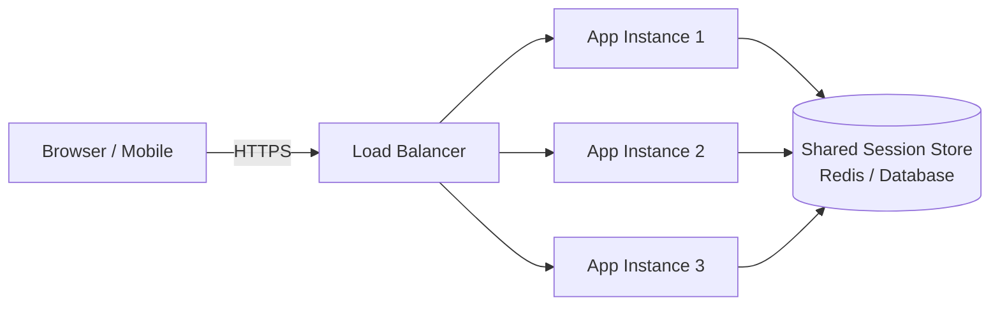
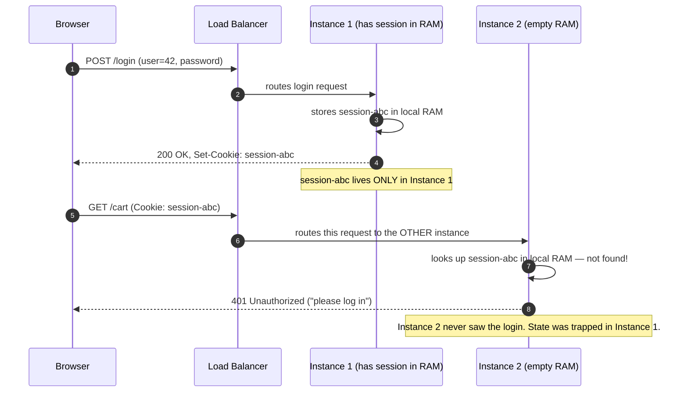
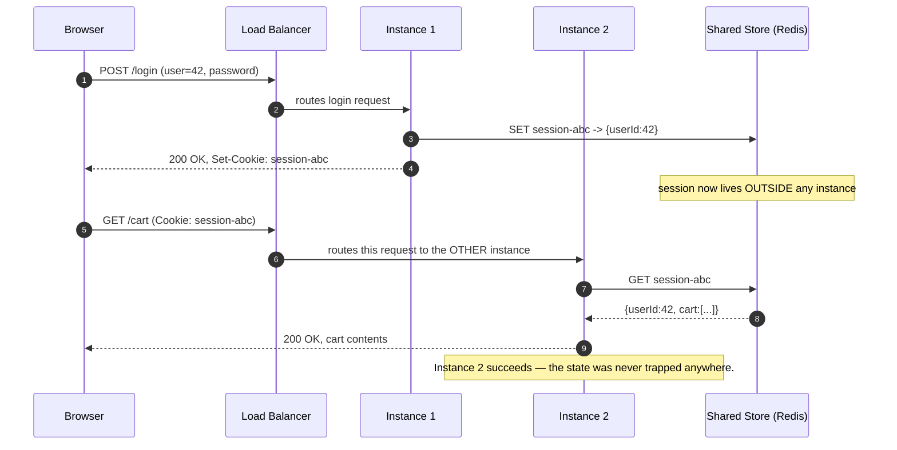
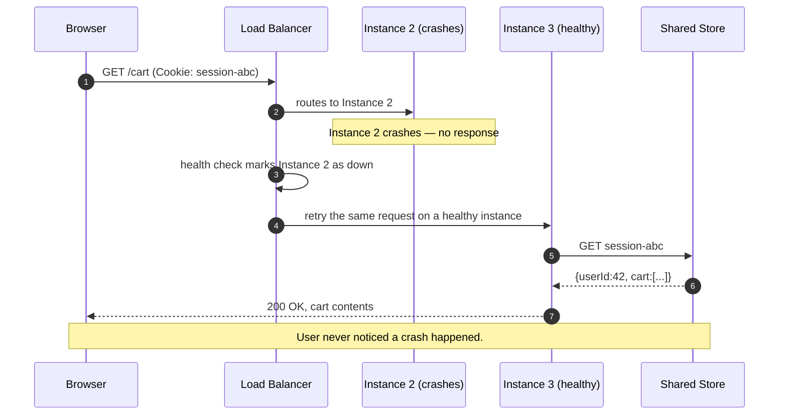

# Stateless Design — Junior

<!-- level-focus -->
At junior level, focus on this question:

> How can I apply **Stateless Design** in one small example and prove the result?

Use the smallest realistic scenario that exposes the decision and its failure behavior.
---

## 1. What Is It?

Think about logging into a website — say, an online store. You sign in, browse, add items to a cart, and check out. Between each click your browser sends a separate HTTP request to the server. The natural question is: **how does the server know it's still *you* on the third click?**

There are two fundamentally different answers, and the choice defines everything downstream.

- **Stateful answer:** the server *remembers* you. When you log in, it stores `"user 42 is logged in, cart = [socks, mug]"` in its own memory (RAM). Every later request is matched back to that in-memory record.
- **Stateless answer:** the server *remembers nothing*. Every request from your browser re-proves who you are (via a token or cookie) and, if there's a cart, it lives in a shared database that any server can read — not in one particular server's memory.

A **stateless service** is one built the second way. Formally: *no per-client information is retained in the service instance between requests.* The instance is like a calculator — you press `2 + 2`, it answers `4`, and it retains no memory that you ever asked. Ask again on a different calculator and you get the same answer, because the answer depended only on what you handed it, not on any private memory the calculator was keeping.

"Stateless" does **not** mean "there is no state anywhere." Your cart still exists — it just doesn't live *inside the service instance*. It lives in a **shared store** (a database, a cache like Redis) that every instance can reach. The service reads it fresh on each request. The distinction is about *where* state lives, not *whether* it exists.

You already rely on this every day. When Instagram serves your feed, the request could be handled by any one of thousands of identical servers. None of them "knows" you personally between requests. Each one authenticates your request, fetches your data from shared storage, renders a response, and forgets you. That is stateless design at planetary scale.

---

## 2. The Core Idea in One Picture

A typical web system runs **many identical copies** of the application (call them *instances* or *replicas*) behind a **load balancer** — a component whose job is to spread incoming requests across those copies. The stateless rule says: any instance can handle any request, because none of them holds private per-user memory.



Read the diagram from the shape of the arrows: **every instance points to the same shared store.** That single fact is what lets the load balancer send request #1 to instance 1 and request #2 to instance 3 without anything breaking — because the state both requests need lives in the store, not in any one instance's head. Remove the shared store and give each instance its own private memory, and the picture quietly falls apart (that's §3).

---

## 3. The Failure That Teaches the Lesson

The fastest way to *understand* stateless design is to watch a **stateful** design break. This is the single most common bug a junior engineer ships when they move from "runs on my laptop" to "runs on more than one server."

**The setup.** You build a login system. When a user logs in successfully, you store their session in a plain variable in the server's memory:

```text
// In-memory session table living inside ONE instance's RAM
sessions = {
    "session-abc": { userId: 42, cart: ["socks", "mug"] }
}
```

On my laptop, this works perfectly. There is exactly one server, so the session is always there when the next request comes in. Then you deploy to production, where the load balancer spreads traffic across **two identical instances** for reliability. Now watch what happens.



The user logged in successfully (step 3) and got a session cookie — yet one click later they are thrown back to the login screen (step 8). Nothing is wrong with their password. The bug is architectural: **the session was trapped inside Instance 1's memory, and the second request happened to land on Instance 2**, which has no idea who this user is.

It gets worse in practice. Sometimes the load balancer sends the *next* request back to Instance 1 and it works; sometimes it lands on Instance 2 and fails. The result is a flaky, "I'm randomly logged out every few clicks" experience that is maddening to debug — because it works on your one-instance laptop and only misbehaves in production where there is more than one instance.

**The stateless fix.** Move the session out of local RAM and into a **shared store** both instances can read:



Same routing (login on Instance 1, cart on Instance 2), but now step 10 succeeds because Instance 2 fetches the session from the shared store instead of hunting through its own empty memory. The instances became **interchangeable**. Neither one "owns" the user. This is the whole game.

---

## 4. Where Does the State Go Instead?

If the instance can't keep state, the state has to live somewhere. There are two honest homes for it, and a good design uses both deliberately.

**1. Carry it in the request.** The client sends everything the server needs, on every request. The classic example is a **signed token** (such as a JWT). Instead of the server remembering "session-abc = user 42," the client presents a token that itself *says* "I am user 42," cryptographically signed so the server can trust it without looking anything up. The server verifies the signature and knows who you are — with zero stored session memory. The identity travelled *with* the request.

**2. Fetch it from a shared store.** Some state is too big or too sensitive to hand to the client — a shopping cart, a user's saved documents, order history. That lives in a **shared backend store** (a database, or a fast cache like Redis) that every instance can reach. The instance stays stateless because it *borrows* the state fresh for the duration of one request and lets go of it when the response is sent.

The mental test for "is this instance stateless?" is simple:

> **If I killed this instance right now, mid-traffic, and the load balancer sent every one of its in-flight users to a different instance — would anything be lost?**

If the answer is "no, they'd be fine," the instance is stateless. If the answer is "they'd lose their cart / get logged out / lose their upload progress," then some state is trapped inside that instance and the design is stateful whether you meant it to be or not.

---

## 5. Stateful vs Stateless — Side by Side

| Dimension | Stateful service | Stateless service |
|---|---|---|
| Where per-client state lives | Inside one instance's memory (RAM) | In a shared store, or carried in the request |
| Can any instance serve any request? | No — must route back to the instance that holds the state | Yes — all instances are interchangeable |
| Adding a new instance helps immediately? | No — new instance holds no sessions, warms up slowly | Yes — it can serve any request from second one |
| What happens if an instance crashes? | Its clients lose their state (logged out, cart gone) | Nothing lost — other instances pick up seamlessly |
| Load balancing | Needs "sticky sessions" pinning a user to one instance | Free to send any request anywhere |
| Scaling out (adding machines) | Hard and uneven; hot instances stay hot | Easy and linear — just add more identical copies |
| Deploying a new version | Risky — restarting an instance drops live sessions | Safe — drain and replace instances one at a time |
| Where complexity moves | Simpler single-server code, painful in a cluster | Slightly more setup (a store), trivial to scale |

The row that matters most for a junior engineer is **"what happens if an instance crashes."** In a stateful design, a crash is a user-visible incident: real people get logged out. In a stateless design, a crash is a non-event: the load balancer notices the instance is gone and quietly routes around it, and no user can tell.

---

## 6. Why This Makes Scaling and Failover Easy

Everything good about stateless design flows from one property: **interchangeable instances.** When every instance is identical and holds no private state, two hard problems become easy.

**Scaling out.** Traffic doubles on Black Friday. In a stateless system, you launch more identical instances and register them with the load balancer — and they can serve real traffic from their very first second, because there is nothing to "warm up" and no sessions they're missing. Throughput grows roughly *linearly* with instance count: ten instances handle about ten times the traffic of one. This is **horizontal scaling**, and stateless design is precisely what makes it possible. (A stateful system can't do this cleanly — a fresh instance holds nobody's session, so it can only help *new* users, not spread the existing load.)

**Failover.** An instance dies — a crash, a bad deploy, a machine the cloud provider reclaimed. The load balancer runs periodic **health checks**; when one instance stops answering, the balancer simply stops sending it traffic and spreads those requests across the survivors. Because the survivors are interchangeable and the state lives in the shared store, **no user loses anything.** The failed instance held no unique memory, so its death costs nothing beyond a little capacity — which auto-scaling can replace.



The same picture — interchangeable instances, state in a shared store — solves *both* problems at once. That is why stateless design is one of the first architectural rules you learn: it is the cheapest possible way to buy both scalability and reliability.

---

## 7. Key Terms

| Term | Definition |
|---|---|
| Stateless service | A service that keeps no per-client state between requests; any instance can serve any request |
| State | Data that must be remembered between requests (session, cart, upload progress) |
| Instance / Replica | One running copy of the application; many identical copies run in production |
| Load balancer | A component that distributes incoming requests across the available instances |
| Shared store | Storage (database, Redis) that every instance can read/write, holding state outside the instances |
| Session | The data identifying and tracking a logged-in user across multiple requests |
| Sticky session | Load-balancer trick that pins one user to one instance; a stateful crutch, avoided in stateless design |
| Token (e.g. JWT) | A signed credential the client sends on every request so the server needn't store a session |
| Health check | A periodic probe the load balancer uses to detect and route around dead instances |
| Horizontal scaling | Handling more load by adding more identical instances (only clean when they're stateless) |
| Failover | Automatically shifting work away from a failed instance to healthy ones |

---

## 8. Common Mistakes at This Level

1. **Storing sessions in local memory.** The classic bug from §3 — an in-memory session table works on one server and breaks the instant a second instance exists. Sessions belong in a shared store or a signed token.
2. **"Fixing" it with sticky sessions and calling it done.** Pinning each user to one instance (session affinity) hides the symptom but keeps the state trapped: if *that* instance dies, *those* users still lose everything. It also unbalances load. Sticky sessions are a patch, not a design.
3. **Hidden state you didn't notice.** In-memory caches, per-instance counters, files written to the local disk, upload progress held in RAM, or an in-process queue — all quietly make an instance stateful. Any of these fails the "kill this instance — is anything lost?" test.
4. **Confusing "stateless" with "no database."** Stateless doesn't mean the system forgets everything. It means the *instance* forgets; the state moves to a shared store. There is still a database.
5. **Testing only on one instance.** The bug is invisible with a single instance. Always test with at least two instances behind a load balancer, or you'll ship the §3 failure straight to production.

---

## 9. Hands-On Exercise

Take a simple "to-do list" web app where a logged-in user can add and view tasks. Assume it will run behind a load balancer across **three identical instances.**

1. **Spot the trap.** List every place the app might be tempted to keep state *inside an instance* — where does the login session go? Where do the to-do items go? Is anything cached in memory or written to a local file?
2. **Move the state out.** For each item you listed, decide its new home: does it get *carried in the request* (a signed token) or *fetched from a shared store* (a database / Redis)? Justify each choice.
3. **Apply the kill test.** For your redesigned app, answer honestly: *if I terminate one instance mid-request and the load balancer reroutes its users to another instance, does any user lose anything?* If yes, you still have trapped state — find it and move it.
4. **Sketch the failure.** Draw the §3 sequence diagram for the *broken* version of your app (session in local RAM) and show the exact request that returns "please log in again." Then draw the fixed version. Being able to reproduce the bug on paper means you truly understand why the rule exists.

---

*Next step:* [Stateless Design — Middle](middle.md)

---

## Apply it

1. Choose one small, known input for **Stateless Design**.
2. Predict the output or observable behavior.
3. Run the smallest example or probe that exercises the concept.
4. Change one input to trigger a failure or boundary case.
5. Explain the evidence using the guide's vocabulary.

## Verify your work

- Record the exact input, command or code path, and output.
- Repeat the probe and confirm the result is consistent.
- Show one expected success and one expected failure.
- Resolve any difference between the prediction and the evidence.

## Review questions

- What problem does Stateless Design solve in the example?
- Which input changes the observed result, and why?
- What is the smallest useful success check?
- Which beginner mistake would your evidence catch?
