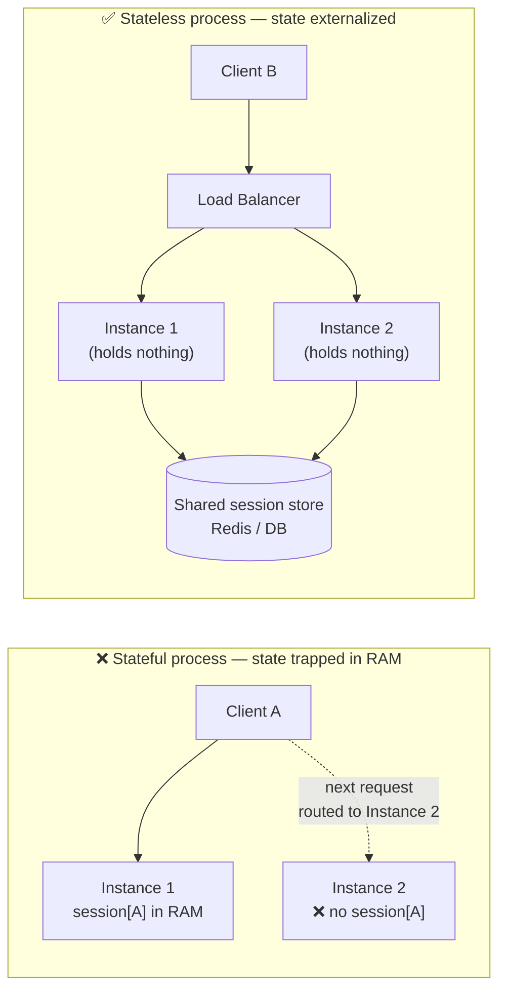
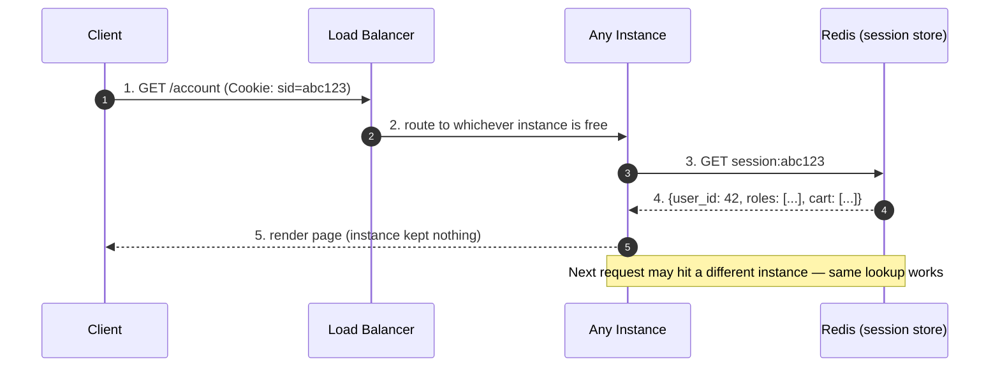
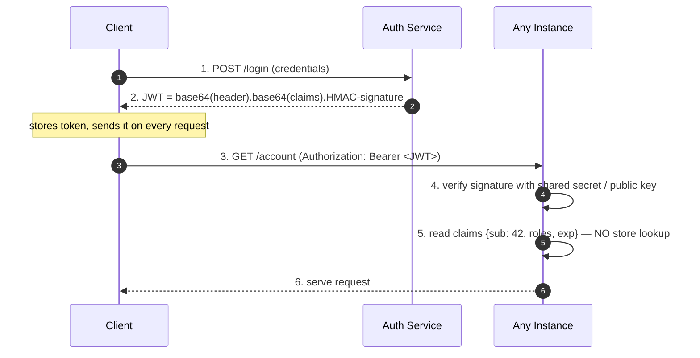
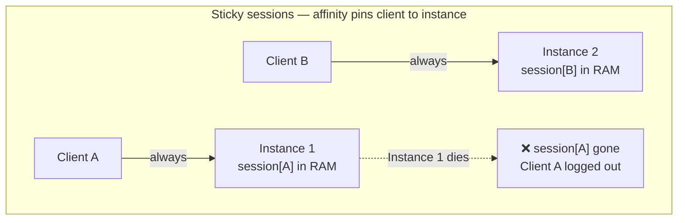
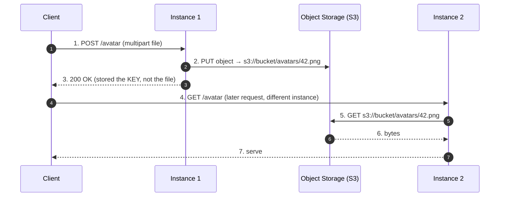

# Stateless Design — Middle

<!-- level-focus -->
At middle level, focus on this question:

> Where does **Stateless Design** belong in a maintainable component, and which trade-off selects the design?

Use the smallest realistic scenario that exposes the decision and its failure behavior.
## 2. The Core Idea: State Has to Live *Somewhere*

"Stateless" does not mean the *system* has no state — a login still has to be remembered,
a shopping cart still has to survive a page reload. It means the **application process**
holds no client-specific state *between requests*. The state is pushed out of the process
into a shared, durable, or client-carried location.



In the stateful case, request 2 landing on Instance 2 finds no session and logs the user
out. In the stateless case, both instances read the same externalized state, so it does
not matter where the request lands. **The entire discipline is: move each piece of state
to the box on the right that fits it.**

---

## 3. Where State Goes: The Four Buckets

Every piece of "state" a naive app keeps in process memory falls into one of four buckets,
and each has a canonical home:

| In-process state (the smell) | Where it actually belongs | Mechanism |
|---|---|---|
| User session / login | Shared session store **or** the client | Redis/DB session, or a signed token |
| Uploaded file / temp file on local disk | Object storage | S3-compatible bucket, presigned URLs |
| In-progress / long-running work | Durable queue or job store | Message queue + job record in DB |
| Cached computation held in a local `map` | Shared cache | Redis / Memcached, keyed and TTL'd |

The refactor pattern is identical in all four cases: **find the thing that lives in the
instance's RAM or local disk, and replace it with a network call to a store that every
instance shares.** The remaining sections drill into the two that dominate real systems —
sessions and uploads/caches — because they are where teams get it wrong most often.

---

## 4. Externalized Sessions (Redis / DB)

The client holds an **opaque session ID** (a random, unguessable string) in a cookie. The
server keeps the actual session data — user ID, roles, cart, CSRF token — in a shared
store keyed by that ID. Every instance can look it up.



**Properties that matter:**
- **Opaque ID, not data**, travels to the client. The client cannot read or forge session
  contents; it only holds a random handle. All authority lives server-side.
- **Instant revocation**: to log a user out everywhere, `DEL session:abc123`. The next
  request finds nothing and is unauthenticated. This is the killer feature of server-side
  sessions.
- **TTL for expiry**: set the key with an expiry (`SET session:abc123 ... EX 1800`) so
  idle sessions self-clean. "Sliding expiry" = refresh the TTL on each request.
- **Store choice**: Redis is the default (sub-millisecond, TTL built in, cheap). A SQL
  table works at low scale but adds write load and needs a cleanup job. Redis's weakness
  is durability — if the store is wiped, everyone is logged out; run it replicated.

**The one hard dependency this creates:** the session store is now on the hot path of
*every* authenticated request. It must be highly available and low latency, or your
"stateless" app has just moved its single point of failure. This is the trade-off JWTs try
to eliminate.

---

## 5. Self-Contained Sessions (Signed Tokens / JWT)

Instead of storing session data server-side and handing out a lookup key, you put the data
**in the token itself** and cryptographically sign it. The client carries the whole
session. The server stores nothing; it only verifies the signature.



A JWT has three parts: a **header** (algorithm), a **payload** of claims (`sub`, `exp`,
roles, etc.), and a **signature** over the first two. The instance recomputes the signature
with the shared secret (HMAC) or verifies it with a public key (RS/ES). If it matches, the
claims are trusted — **no network call, no store**. This is maximally stateless: the token
*is* the session.

**What you gain:** zero session-store dependency on the read path, trivial horizontal
scaling, and cross-service auth (any service holding the public key can validate).

**What you pay — and this is the crux for middle-level engineers:**
- **You cannot un-issue a token.** It is valid until `exp`. There is no `DEL`. If a token
  leaks or a user is banned, they stay authenticated until expiry. Mitigations: short
  expiry (5–15 min) + a refresh token, and a server-side **deny-list** of revoked token
  IDs — but a deny-list reintroduces exactly the shared store you were trying to avoid.
- **Claims go stale.** If a role is baked into the token and you demote the user, the old
  token still says "admin" until it expires.
- **Size.** A JWT rides on every request header; fat claims bloat every request. Keep them
  minimal.
- **Never put secrets in the payload.** It is base64-encoded, *not* encrypted — anyone can
  read it. The signature guarantees integrity, not confidentiality.

The practical resolution most systems land on: **short-lived access JWT** (stateless, fast,
covers 99% of requests) **+ a long-lived refresh token** checked against a store only when
minting a new access token. This confines the stateful store to the rare refresh path
instead of every request.

---

## 6. External Session Store vs JWT — The Decision

| Dimension | External session store (Redis/DB) | Self-contained token (JWT) |
|---|---|---|
| Where state lives | Server-side, keyed by opaque ID | In the client-held token |
| Read-path lookup | One store call per request | None — verify signature locally |
| Store dependency on hot path | **Yes** — store must be HA + fast | No (until you add a deny-list) |
| Revocation | Instant (`DEL key`) | Hard — valid until `exp`; needs deny-list |
| Change roles / claims live | Immediate (edit server-side record) | Stale until token expires |
| Payload size on the wire | Tiny (just the ID) | Larger (whole payload every request) |
| Data confidentiality | Full (data never leaves server) | Payload is readable by anyone |
| Cross-service / cross-domain | Extra plumbing to share the store | Natural — share the key, validate anywhere |
| Failure mode | Store down → everyone logged out | Key rotation / clock skew issues |
| Best fit | Session-heavy web apps, need revocation | APIs, microservices, mobile, SSO |

**Rule of thumb:** if you need **instant revocation and live role changes** (banking,
admin consoles, anything security-sensitive), use a server-side session store. If you need
**scale, low latency, and stateless microservice-to-microservice auth**, use short-lived
JWTs with refresh tokens. Most mature systems use *both*: JWT for service-to-service and
API access, server-side sessions for the browser login where revocation matters.

---

## 7. Sticky Sessions vs True Statelessness

Before externalizing state, many teams reach for the load balancer's **sticky sessions**
(session affinity): the LB pins each client to the same instance so the in-memory session
is always found. It looks like it makes a stateful app "work" behind a load balancer — and
it is a trap.



| Aspect | Sticky sessions (affinity) | True statelessness (externalized) |
|---|---|---|
| Session storage | In-instance RAM | Shared store or client token |
| Instance failure | Sessions on that instance are **lost** | No impact — any instance serves |
| Rolling deploy | Drains/disrupts pinned users | Free — replace instances anytime |
| Load distribution | **Uneven** — long-lived clients create hot instances | Even — LB routes freely |
| Auto-scaling | New instances get no existing traffic | New instances immediately useful |
| Complexity | Simple to enable, hard to operate | Slightly more infra, easy to operate |
| Verdict | Band-aid / migration crutch | The actual goal |

Sticky sessions are acceptable only as a **temporary migration step** while you externalize
state, or for genuinely connection-oriented protocols (e.g. long-lived WebSocket
connections that must stay on one node — though even there the *session data* should be
external). Treating affinity as your scaling strategy means you cannot deploy without
disrupting users and you lose sessions on every node failure. It defeats the entire point
of running multiple instances.

---

## 8. File Uploads, In-Progress Work, and Local Caches

Sessions are the obvious state. The subtle killers are the ones that sneak in as "just a
temp file" or "just a small in-memory cache."

**File uploads and temp files.** The naive handler writes the upload to `/tmp/upload.png`
on local disk, then a *later* request (maybe on another instance, maybe after the pod is
recycled) tries to read it — and it is gone.



Rule: **local disk is scratch space that can vanish; anything that must survive the request
goes to object storage.** For large uploads, hand the client a **presigned URL** so it
uploads directly to storage, bypassing your app instance entirely — the instance stays
stateless and never buffers the file.

**In-progress / long-running work.** A request that kicks off a 30-second export cannot
hold that work in the handler's memory — the instance may be killed mid-flight. Externalize
it: write a **job record to the DB**, push a message to a **durable queue**, and let a
worker process it. The client polls a job-status endpoint (backed by the DB), which any
instance can answer. The work now survives instance death and restarts.

**Local caches.** An in-process `map[string]T` cache is technically state, but it is
usually fine *as long as it is a pure performance optimization that any instance can rebuild
from the source of truth on a miss.* It becomes a bug the moment it holds the *only* copy of
something, or the moment instances must agree (e.g. per-user rate-limit counters — those
must go in a **shared cache** like Redis, or one instance's counter is invisible to
another). Litmus test: *if I kill this instance, is any correctness lost, or just a warm
cache?* If correctness is lost, it is not a cache — it is hidden state, and it must be
externalized.

---

## 9. The 12-Factor "Processes Are Stateless" Principle

The externalization discipline is codified in Factor VI of the [Twelve-Factor App](https://12factor.net/processes):

> "Twelve-factor processes are stateless and share-nothing. Any data that needs to persist
> must be stored in a stateful backing service, typically a database."

The methodology is explicit that the in-memory or local-disk state a process accumulates is
a **single-transaction cache at best** and must never be relied on for future requests:

> "The memory space or filesystem of the process can be used as a brief, single-transaction
> cache. ... The twelve-factor app never assumes that anything cached in memory or on disk
> will be available on a future request or job — with many processes of each type running,
> chances are high that a future request will be served by a different process."

It also names the two anti-patterns this level has been dismantling:

- **Sticky sessions** — Factor VI calls them "a violation of twelve-factor and should never
  be used or relied upon," directing that session state go into a store like Redis instead.
- **Compile/build-time state on disk** — assets and artifacts belong in the build/release
  stages ([Factor V](https://12factor.net/build-release-run)) and in backing services, not
  in the running process.

The payoff Factor VI promises is exactly the operational freedom we opened with: because
processes are disposable, the app can **scale out by adding processes** and survive
**crashes and restarts** without data loss, since nothing durable lived in the process to
begin with. This dovetails with Factor IX, [Disposability](https://12factor.net/disposability),
which requires processes to start fast and shut down gracefully precisely *because* they can
be created and destroyed at any moment.

---

## 10. Before/After: In-Memory Session → Stateless

Here is the whole refactor in one place — the single most common statelessness fix.

**BEFORE — session trapped in process memory (breaks behind a load balancer):**

```text
// A global map living in the instance's RAM.
sessions = {}   // sessionId -> { userId, cart }

POST /login:
    validate(credentials)
    sid = randomId()
    sessions[sid] = { userId: user.id, cart: [] }   // ❌ stored in THIS process
    setCookie("sid", sid)
    return 200

GET /cart:
    sid = cookie("sid")
    session = sessions[sid]        // ❌ only exists on the instance that handled /login
    if session == null: return 401 // logs the user out when routed elsewhere
    return session.cart
```

Failure: `/login` lands on Instance 1, populating *its* map. The next request `/cart` is
load-balanced to Instance 2, whose map has no `sid` → 401. The user appears randomly logged
out. A deploy that replaces Instance 1 loses every session on it.

**AFTER (Option A) — externalized session in Redis:**

```text
POST /login:
    validate(credentials)
    sid = randomId()
    redis.SET("session:" + sid, { userId, cart: [] }, EX=1800)  // shared store, 30-min TTL
    setCookie("sid", sid)
    return 200

GET /cart:
    sid = cookie("sid")
    session = redis.GET("session:" + sid)   // ✅ any instance sees it
    if session == null: return 401
    redis.EXPIRE("session:" + sid, 1800)     // sliding expiry
    return session.cart

POST /logout:
    redis.DEL("session:" + cookie("sid"))    // ✅ instant, global revocation
```

**AFTER (Option B) — self-contained JWT (no server-side store):**

```text
POST /login:
    validate(credentials)
    token = sign({ sub: user.id, roles: user.roles, exp: now + 15min }, SECRET)
    return { access_token: token }          // client stores and re-sends it

GET /cart:
    token = bearerToken(request)
    claims = verify(token, SECRET)           // ✅ no store lookup; local crypto only
    if claims == null or claims.exp < now: return 401
    return loadCart(claims.sub)              // cart itself lives in DB, not the token

// Note: no /logout that revokes instantly — the token is valid until exp.
// Add a short-lived access token + refresh token, and a deny-list if you need cutoff.
```

Both after-versions make **any instance able to serve any request**, so the app scales
horizontally, deploys without draining, and survives node loss. Option A keeps
revocation and confidentiality on the server; Option B removes the hot-path store
dependency. Pick per §6 — and know that production systems frequently run both.

---

## 11. Middle Checklist
- [ ] No client-specific state is read from a process-local variable or map between requests.
- [ ] Sessions are externalized (Redis/DB) **or** self-contained (signed token) — decided per §6.
- [ ] If using JWT, tokens are short-lived, carry no secrets, and there is a revocation plan.
- [ ] If using a session store, it is HA and low-latency (it is now on every request's hot path).
- [ ] Sticky sessions are used only as a migration crutch, not as the scaling strategy.
- [ ] File uploads go to object storage (or presigned direct upload), never local disk.
- [ ] Long-running work is externalized to a queue + DB job record, not held in a handler.
- [ ] Every in-process cache is a pure optimization rebuildable from the source of truth on a miss.
- [ ] Killing any instance mid-traffic loses at most a warm cache — never correctness or a session.

*Next step:* [Stateless Design — Senior](senior.md)

---

## Apply it

1. Find a real component where **Stateless Design** affects an interface or dependency.
2. Write two plausible choices and the constraint that favors each one.
3. Make the smallest reversible change at that boundary.
4. Exercise the component alone, then exercise the integrated flow.
5. Keep the decision note with the evidence that selected the option.

## Verify your work

- A focused check proves the local behavior.
- An integrated check proves callers and dependencies still agree.
- Logs, traces, compiler output, or benchmarks expose the boundary.
- Reverting the change restores the previous behavior without unrelated edits.

## Review questions

- Which boundary is most affected by Stateless Design?
- What constraint would make you choose the alternative design?
- How would you isolate a local defect from an integration defect?
- What evidence shows that the change remains maintainable?
