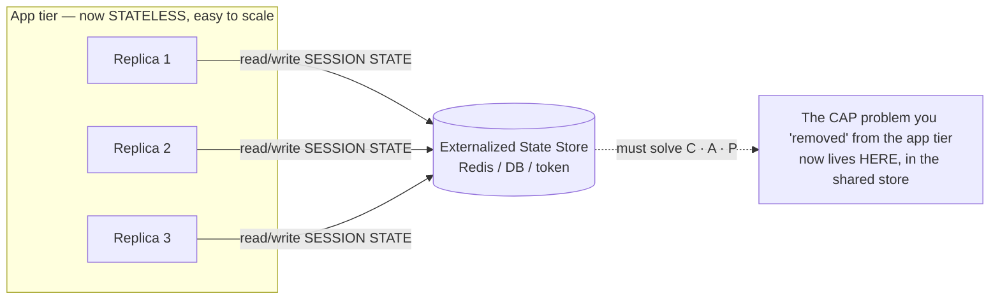

# Stateless Design — Professional

<!-- level-focus -->
At professional level, focus on this question:

> How should teams adopt and operate **Stateless Design** with measurable outcomes and limited coordination?

Use the smallest realistic scenario that exposes the decision and its failure behavior.
---

## 1. The Formal Definition: Handlers as Pure Functions

Statelessness is not "the server has no state." Every server has state — CPU registers, TCP buffers,
open file descriptors, a connection pool. The precise claim is narrower and stronger:

> **A stateless handler is a pure function of the tuple `(request, external state)` → `response`.**
> Its output depends only on the inputs it is *given*, and it retains no per-client mutable state
> **across** requests. Any two invocations with identical inputs produce identical outputs.

Write it as a signature:

```text
handle : (Request, Snapshot(ExternalState)) → (Response, Effect*)

where
  Request        = method + path + headers + body + credentials
  ExternalState  = the shared, externalized stores (DB, cache, token) the handler may READ
  Snapshot(...)  = the observed values of that state at request time
  Effect*        = writes the handler emits INTO external state (never into itself)
```

The invariant that makes it "stateless" is precisely:

```text
∀ requests r_i, r_j on the same logical session:
    handle(r_j, S) does NOT depend on any in-process residue left by handle(r_i, ·)
```

Two distinctions sharpen this:

- **No *hidden* mutable state across requests.** A handler may keep local variables, allocate memory,
  and mutate them *within* a single request — that is not shared and dies when the request returns.
  What it must not do is carry a per-client mutation forward (a server-side `sessions[userId]` map,
  a request counter pinned to a user, an in-memory shopping cart). Such residue makes the output a
  function of *history*, not of inputs — the definition of a stateful (non-pure) handler.
- **Purity is relative to the externalized state.** `handle` is a *pure* function only once you thread
  the external state in as an explicit argument. The database is manifestly mutable; the trick is that
  the handler treats it as an **input snapshot** and an **output effect**, never as private memory. This
  is the same move functional programming makes with the `State` monad: you don't eliminate state, you
  make it explicit and external so the function over `(input, state)` is pure.

**Idempotency vs. statelessness.** These are orthogonal and frequently conflated. A `POST /charge`
handler can be perfectly stateless (it reads the idempotency key from the request and the ledger from
the DB) yet its *effect* is not idempotent unless it dedupes on that key. Statelessness constrains where
state *lives*; idempotency constrains what *repeating the effect* does. You want both, for different
reasons.

**The referential-transparency test.** A handler is stateless iff you can take any live instance, kill
it mid-fleet, route the *next* request from the same client to a *different, cold* instance, and get a
correct response. If that breaks, some state is hiding in the process. This test is exactly the operational
definition Kubernetes relies on (§2).

---

## 2. Why Purity Buys Horizontal Scalability and Disposability

The pure-function framing is not academic decoration — three of the most important operational properties
of modern services are *corollaries* of it.

### 2.1 Horizontal scalability = interchangeable replicas

If `handle` is a pure function of `(request, external state)`, then every replica computes the **same
function**. Replicas are interchangeable. A load balancer may therefore send request `N` to instance A
and request `N+1` to instance B with zero coordination, because neither instance carries client-specific
history. Capacity becomes a scalar you dial:

```text
Throughput(fleet) ≈ Σ Throughput(replica_i)          # near-linear, no cross-replica coordination
Replicas needed   = ceil( PeakQPS / PerReplicaQPS )
```

The moment a handler keeps in-process session state, this breaks: request `N+1` *must* return to
instance A, capacity is no longer a free scalar, and you have re-introduced a coordination problem
(sticky routing, §6). Statelessness is the precondition that makes "add more boxes" actually work.

### 2.2 Disposability (12-factor factor IX)

The [12-factor methodology](https://12factor.net/) states processes should be **disposable** —
"they can be started or stopped at a moment's notice." This is only *safe* if killing a process destroys
no authoritative state. A pure handler holds nothing authoritative in-process (factor VI, "processes
are stateless and share-nothing; any data that must persist is stored in a stateful backing service"),
so SIGTERM at any instant loses at most the in-flight requests, which the client retries against another
replica. Disposability is *definitionally* the disposability of a pure function's process: the function
survives, only one evaluation is interrupted.

### 2.3 Kubernetes exploits exactly this

Every core k8s mechanism assumes a disposable, interchangeable Pod:

```mermaid
sequenceDiagram
    autonumber
    participant HPA as HorizontalPodAutoscaler
    participant K8s as kube-scheduler
    participant P1 as Pod A (old)
    participant P2 as Pod B (new)
    participant Cl as Client
    Note over HPA: CPU > target → scale out
    HPA->>K8s: 1. desired replicas 3 → 6
    K8s->>P2: 2. schedule fresh Pod (cold, no client history)
    Cl->>P2: 3. request routed to brand-new Pod
    Note over P2: correct response — handler is pure over (req, external state)
    Note over K8s,P1: 4. node drain / rollout → SIGTERM Pod A
    P1-->>K8s: 5. terminates; in-flight retried elsewhere
    Note over Cl,P2: 6. no session lost — nothing authoritative lived in Pod A
```

- **HPA / autoscaling** adds cold Pods and expects them to serve the *next* request correctly — only
  true for pure handlers.
- **Rolling updates & rollbacks** replace every Pod; if any held session state, the rollout would drop
  sessions.
- **Rescheduling / node drains / spot preemption** move Pods freely across nodes.
- **Liveness/readiness probes** let k8s kill a "wedged" Pod at will.

A stateful handler forces you into `StatefulSet` + stable network identity + persistent volumes — a much
heavier, coordination-laden abstraction — precisely because the disposability corollary no longer holds.

---

## 3. The JWT Cryptographic Model

The canonical way to keep the *auth* handler stateless is to move session state **into the request
itself**, cryptographically sealed, as a [JSON Web Token (RFC 7519)](https://datatracker.ietf.org/doc/html/rfc7519).
Instead of the server looking up `sessions[sid]` (in-process state — forbidden) or hitting a session
store on every call (a network round trip), the client *presents* the state and the server *verifies*
it as a pure computation over the token bytes plus a key.

### 3.1 Structure and the signature invariant

```text
JWT = base64url(header) . base64url(payload) . base64url(signature)

header  = { "alg": "RS256", "typ": "JWT", "kid": "2026-07-key-a" }
payload = registered claims + custom claims:
            iss  issuer          exp  expiry (NumericDate, seconds since epoch)
            sub  subject (user)  iat  issued-at
            aud  audience        nbf  not-before
            jti  unique token id (the hook for denylisting — §5)

signature = Sign( key, base64url(header) || "." || base64url(payload) )
```

The header and payload are **not encrypted** — they are signed. A JWT provides *integrity and
authenticity*, not confidentiality; never put a secret in a plain JWS. (Use JWE if you need
confidentiality.) The verification is a pure function:

```text
verify(token, key, now) =
      valid_signature(token, key)           # tamper-evidence: any bit flip breaks the MAC/sig
   ∧  now < exp                             # not expired
   ∧  now ≥ nbf                             # active
   ∧  aud == expected_audience             # token minted for THIS service
   ∧  iss == trusted_issuer
```

Because `verify` reads only the token, a public key (or shared secret), and the clock, **any replica can
authenticate any request with no session lookup** — this is what preserves statelessness. The security
rests entirely on the signature: an attacker cannot forge a token without the signing key, and cannot
alter claims (e.g., escalate `role`) without invalidating the signature.

### 3.2 `alg` choice and the two classic vulnerabilities

- **HS256 (HMAC, symmetric):** one shared secret both signs and verifies. Simple, fast, but every
  verifier can also *mint* tokens — bad for multi-service fleets. Keep the secret ≥ 256 bits of entropy.
- **RS256 / ES256 (asymmetric):** private key signs at the auth server; services hold only the **public**
  key to verify. A compromised resource server cannot forge tokens. Preferred for microservices; the
  `kid` header selects the verifying key (§5.3).
- **`alg: none` attack:** RFC 7519 permits an unsecured "none" algorithm. A verifier that honors the
  token's *self-declared* `alg` can be tricked into accepting an unsigned token. **Mitigation:** pin the
  accepted algorithm(s) server-side; never let the token choose its own verification algorithm. Never
  accept `none` on a protected endpoint.
- **RS→HS confusion:** if a library uses the token's `alg` to pick the verify path, an attacker submits
  an HS256 token signed with the *public* RSA key (which is not secret) as the HMAC secret. Same fix:
  pin the algorithm.

### 3.3 The lifecycle

---

## 4. The Revocation Problem and the TTL Tradeoff Math

Here is the fundamental tension, and it falls directly out of the design. **Self-contained tokens are
verified without contacting the issuer.** That is the whole point — it is what keeps the handler stateless
and lookup-free. But it means the issuer has **no natural chokepoint** at which to say "stop honoring this
token." A signed JWT is valid until `exp` no matter what happens in the meantime: the user logs out, an
admin disables the account, the token is stolen. The credential is *bearer* and *offline-verifiable*, so
**there is a window between "we decided to revoke" and "the token actually stops working."**

Define that window precisely:

```text
RevocationWindow_max = exp − t_compromise_detected  ≤  TTL

In the worst case, an attacker steals a freshly-issued token, so the residual validity
is the full TTL. Therefore:

    Worst-case exposure after theft  =  TTL          (with pure stateless verification)
```

### 4.1 The tradeoff, worked

TTL is the single knob, and it pulls two costs in opposite directions:

```text
Let:
  TTL      = access-token lifetime (seconds)
  R        = refresh rate = 1 / TTL   refreshes per session-second
  C_refr   = cost of one refresh round trip (auth-server CPU + DB read + network ≈ fixed)
  N        = concurrent active sessions

(A) Security cost  ∝  RevocationWindow  =  TTL
      Larger TTL  → longer a stolen/should-be-dead token keeps working.  Linear in TTL.

(B) Overhead cost  ∝  refresh QPS       =  N / TTL
      Smaller TTL → clients refresh more often → more load on the (stateful!) auth path.
      Inversely proportional to TTL.

You are trading a LINEAR security cost against an INVERSE-LINEAR overhead cost.
```

**Concrete numbers.** Suppose `N = 1,000,000` active sessions.

| Access-token TTL | Worst-case exposure after theft | Refresh QPS = N / TTL | Interpretation |
|---|---|---|---|
| 24 h (86,400 s) | up to **24 h** of abuse | 1,000,000 / 86,400 ≈ **11.6 QPS** | Cheap to run; a stolen token is a full day of liability. |
| 1 h (3,600 s) | up to **1 h** | ≈ **278 QPS** | Common default; ~1 h blast radius. |
| 15 min (900 s) | up to **15 min** | ≈ **1,111 QPS** | Industry sweet spot for sensitive apps. |
| 5 min (300 s) | up to **5 min** | ≈ **3,333 QPS** | Near real-time revocation, at ~3.3k QPS of refresh traffic. |
| 60 s | up to **60 s** | ≈ **16,667 QPS** | Approaches "call the DB every request" — you've spent the stateless win. |

The last row exposes the reductio: as `TTL → 0`, refresh QPS → the request rate itself, and the refresh
endpoint (which *is* stateful — it reads the refresh-token store) does as much work as a per-request
session lookup would have. **Driving the revocation window to zero re-introduces exactly the stateful
lookup JWTs were meant to avoid.** The design space is a spectrum between "stateless but slow to revoke"
and "instantly revocable but stateful," and TTL is where you sit on it.

**Choosing the operating point.** Solve for the TTL that keeps refresh load within a budget `Q_max`:

```text
Refresh QPS ≤ Q_max   ⇒   N / TTL ≤ Q_max   ⇒   TTL ≥ N / Q_max

e.g. N = 1e6, Q_max = 2,000 QPS  ⇒  TTL ≥ 500 s  (~8.3 min).
Then pick the SMALLEST TTL ≥ that bound to minimize the revocation window:
TTL ≈ 10 min gives ~1,667 refresh QPS and a ≤10-min blast radius.
```

This is the "TTL/revocation-window tradeoff math" made explicit: pick TTL as the *minimum* value your
refresh infrastructure can sustain, because smaller TTL is strictly better for security and strictly
worse for load, and the two meet at your capacity budget.

---

## 5. Mitigations: Short TTL + Refresh, Denylist, Key Rotation

No single mechanism resolves the revocation problem; production systems layer three.

### 5.1 Short-TTL access + long-lived refresh (the standard split)

Issue a **short-TTL access token** (minutes) that is stateless and verified offline, paired with a
**long-lived refresh token** (days/weeks) that is **stateful** — it lives in the auth-server DB and is
checked (and ideally *rotated*) on each use.

```text
- Access token  (TTL 5–15 min): bounds the revocation window to the TTL. Verified with no lookup.
- Refresh token (TTL days):     the revocation chokepoint. To "log out everyone," delete/flag it in
                                the DB; the next refresh fails and access dies within one access-TTL.

Refresh-token ROTATION: each refresh returns a NEW refresh token and invalidates the old one.
  → A stolen-then-used refresh token creates a detectable fork: two clients present the same rotated
    token; the server sees reuse of an already-consumed token and revokes the whole family (breach signal).
```

This concentrates statefulness on the *low-frequency* refresh path (once per TTL) instead of the
*high-frequency* request path (every call) — you keep the stateless win on 99%+ of traffic and pay the
stateful cost only at refresh time.

### 5.2 Denylist (revocation list) keyed on `jti`

For "revoke *this specific* token *now*" (logout, compromised token), maintain a denylist of `jti`
values. Verification becomes:

```text
verify'(token) = verify(token) ∧ jti ∉ denylist
```

The denylist reintroduces a lookup — but a **cheap and bounded** one:

- Store only *revoked-and-not-yet-expired* `jti`s. Set each entry's own TTL = the token's remaining
  lifetime, so the list self-cleans and its size is bounded by `(revocation rate × access-TTL)` — small
  because access TTL is short (§5.1).
- Back it with an in-memory store (Redis) replicated near each region; a `jti` membership check is
  sub-millisecond and can be cache-warmed. This is a *partial* violation of pure statelessness — a small,
  fast, shared read — and a deliberate one, weighed against the exposure window.

The elegance: because access-token TTL is already short, the denylist only ever holds a tiny, transient
set, so the stateful cost is minimized. Long TTL would make the denylist grow unbounded.

### 5.3 Rotating signing keys (`kid`)

Rotate the signing key periodically; publish public keys at a JWKS endpoint, and stamp each token's
header with its `kid`. This gives a *coarse, fleet-wide* revocation lever and limits key-compromise
blast radius:

```text
- Normal rotation: overlap old+new keys for one max-TTL window so in-flight tokens still verify,
  then retire the old kid.
- EMERGENCY (signing key leaked): drop the compromised kid from the JWKS immediately.
  Every token signed by it fails verification at once → instant fleet-wide revocation of that cohort,
  at the cost of forcing all those users to re-authenticate.
```

Key rotation is the "big red button": it invalidates *all* tokens from a key generation simultaneously,
independent of their `exp`. Use it for key compromise; use the denylist for single-token revocation; use
short TTL for the routine case.

---

## 6. Session Affinity as a Controlled Violation

**Session affinity** (sticky sessions) pins a client to a specific replica — by cookie, source-IP hash,
or a consistent-hash ring at the load balancer — so its requests always return to the same instance. This
is a **deliberate, scoped violation of the statelessness invariant**: the whole point is to let a replica
keep per-client in-process state (a local session, a warmed cache, an open WebSocket) across requests.

```text
Affinity re-introduces exactly the residue §1 forbids:
    handle(r_j, S) NOW depends on in-process state left by handle(r_i, ·) on that pinned replica.
So it forfeits the corollaries of §2:
```

| Property lost | Consequence of stickiness |
|---|---|
| Interchangeable replicas | LB must track and honor the pin; not a free scalar anymore |
| Disposability | Killing the pinned Pod loses that client's in-process session |
| Clean autoscaling | New Pods get no share of *existing* sticky sessions until they expire ("cold" scale-out) |
| Even load | A whale client or long-lived connections skew load onto one replica ("session hotspotting") |
| Rolling updates | Draining a Pod severs its sticky sessions; needs connection-draining grace |

**When the controlled violation is justified:**

- **Stateful-by-nature protocols:** WebSocket/SSE connections are inherently pinned to the terminating
  instance for their lifetime; affinity is not optional there.
- **Expensive per-connection warmup** (TLS session cache, a large per-user model loaded into RAM) where
  re-establishing on every request is costlier than the scalability you give up.
- **Migration bridges:** temporarily sticky while you externalize state to move a legacy stateful app
  toward true statelessness.

**The disciplined form.** Even when using affinity, treat it as a *performance optimization over a
correct stateless baseline*, not a correctness dependency: the pinned in-process state should be
**reconstructible** from external state, so a lost pin degrades to a cache miss (slower) rather than a
broken session (incorrect). That way you keep disposability *modulo* a latency penalty. "Sticky for speed,
correct without it" is the staff-grade posture; "correct only when sticky" is the trap.

---

## 7. You Did Not Remove State — You Relocated It

The deepest point, and the one that separates principal-level reasoning from cargo-culting: **stateless
design does not eliminate state. It relocates it.** The session did not vanish when you made the handler
pure — it moved into the request (a JWT), into a shared cache (Redis session store), or into the database.
The pure-function framing of §1 makes this explicit: `handle(request, externalState)` *names* the state as
an argument. You have not deleted the state term; you have **externalized** it.

And externalized state must now be **consistent, available, and partition-tolerant** — so you have simply
handed the hard problem to whatever store now owns it. This is CAP resurfacing one layer down:



Concretely, the consistency tax reappears:

- **Relocate into the token (JWT):** the state is *immutable and distributed by copy*. This trivially
  scales reads but makes the state **impossible to update or revoke in place** — which is *exactly* why
  §4's revocation window exists. You traded a consistency problem for a *staleness* problem.
- **Relocate into a shared cache (Redis session store):** now that store is a single point of shared
  truth. If it is a cluster, *it* faces CAP: during a partition it must choose to reject session
  reads/writes (CP, hurting availability) or serve possibly-stale sessions (AP, hurting consistency).
  Its failure becomes a *fleet-wide* auth outage — you concentrated the risk you spread out of the app tier.
- **Relocate into the database:** every request now carries a session read; you've re-created the
  per-request lookup, loading the one component that is hardest to scale horizontally.

The invariant to internalize:

```text
State is conserved. Making a tier stateless = moving its state to another tier,
along with that state's consistency/availability obligations.

The right question is never "can I be stateless?" but:
   "WHERE should this state live, and can THAT owner afford its CAP bill?"
```

This reframes statelessness from a goal into a *placement decision*. Stateless app tiers are cheap and
scalable **because** you concentrated the state — and its consistency cost — into fewer, specialized,
harder-to-scale components chosen precisely because they are built to pay that bill (a replicated cache,
a consensus store, a durable DB). Statelessness at the edge is bought with statefulness at the core; the
engineering skill is putting the state in the component best equipped to be consistent, available, and
partition-tolerant for *that particular* state's requirements.

---

## 8. Comparison Tables

### 8.1 JWT TTL choices → revocation window vs. overhead (N = 1M sessions)

| TTL | Revocation window (worst-case exposure) | Refresh QPS (N/TTL) | Denylist size (bounded by TTL) | Best fit |
|---|---|---|---|---|
| 24 h | ≤ 24 h | ~11.6 | large (revoked jtis live ~24 h) | Low-sensitivity, internal, low-churn |
| 1 h | ≤ 1 h | ~278 | moderate | General web apps |
| 15 min | ≤ 15 min | ~1,111 | small | Sensitive apps (fintech, admin) — sweet spot |
| 5 min | ≤ 5 min | ~3,333 | very small | High-sensitivity, near-real-time revoke |
| 60 s | ≤ 60 s | ~16,667 | trivial | Degenerate — approaches per-request lookup |

> Trend: revocation window is **linear** in TTL (smaller = safer); refresh overhead is **inverse-linear**
> in TTL (smaller = costlier). Choose the smallest TTL your refresh path can sustain (§4.1).

### 8.2 Stateless vs. relocated-state — what actually changed

| Dimension | "Stateless" app tier | The state store you relocated INTO |
|---|---|---|
| Where session state lives | Nowhere in-process (pure over inputs) | Token / Redis / DB — the shared owner |
| Horizontal scaling | Near-linear, no coordination | Hard: needs replication, sharding, or consensus |
| Failure of one node | Client retries elsewhere; no loss | Can be a fleet-wide auth/session outage |
| CAP obligation | Pushed downstream | **Lives here** — must pick C vs A under partition |
| Revocation / update | Instant to redeploy; can't edit a live token | Denylist/DB write, or token staleness window |
| Cost profile | Cheap, elastic, disposable | Specialized, carefully-operated, the real bottleneck |

### 8.3 State-relocation targets compared

| Relocate into… | Consistency model | Revocability | Read scaling | Main risk |
|---|---|---|---|---|
| JWT (in request) | Immutable copy; stale until `exp` | Poor (window = TTL) | Excellent (no lookup) | Can't revoke in place |
| Shared cache (Redis) | Tunable; CP or AP under partition | Good (delete key) | Very good | Store outage = auth outage |
| Database | Strong (usually) | Excellent (row update) | Poor (per-request read) | Re-creates the bottleneck |

---

## 9. Professional Checklist

- [ ] Every request handler is a **pure function of `(request, external state)`** — verified by the
      "kill-instance, route-to-cold-replica, still-correct" test (§1).
- [ ] No per-client mutable state survives across requests in-process; the referential-transparency
      test passes fleet-wide.
- [ ] Disposability (12-factor IX) holds: SIGTERM at any instant loses only in-flight requests, nothing
      authoritative.
- [ ] JWT verification **pins the algorithm** server-side; `alg: none` and RS→HS confusion are impossible.
- [ ] JWTs carry `exp`, `aud`, `iss`, `jti`; header carries `kid`; secrets/keys are never placed in the
      (unencrypted) payload.
- [ ] Access-token TTL chosen as the **smallest value the refresh path can sustain** (`TTL ≥ N / Q_max`),
      with the revocation-window/overhead tradeoff computed, not guessed (§4.1).
- [ ] Revocation is layered: short TTL (routine) + `jti` denylist (single token) + key rotation
      (compromise), with refresh-token **rotation and reuse-detection** enabled.
- [ ] Denylist is bounded — entries expire with the token's residual TTL — and served from a fast,
      replicated store.
- [ ] Session affinity, where used, is a **performance optimization over a correct stateless baseline**:
      pinned state is reconstructible; a lost pin degrades to latency, not incorrectness.
- [ ] The **relocation** is explicit: the team knows *where* session state now lives and can articulate
      that store's CAP posture (CP vs AP under partition) and its blast radius.


---

## Apply it

1. Define the user or business outcome that **Stateless Design** should improve.
2. Assign one owner for code, contracts, operations, and incidents.
3. Split delivery into reversible increments that produce evidence early.
4. Publish responsibilities, escalation paths, and compatibility windows.
5. Stop or expand only when the agreed measures support that decision.

## Verify your work

- Each increment has an owner, rollback path, and observable exit condition.
- Adoption, reliability, delivery time, and coordination cost are measured.
- Incident and migration exercises prove that responsibility is executable.
- The old path is removed only after telemetry proves it is unused.

## Review questions

- Which measurable outcome justifies investing in Stateless Design?
- Which team owns the full lifecycle and incident response?
- What reversible increment produces the earliest useful evidence?
- Which exit condition proves that migration or adoption is complete?
