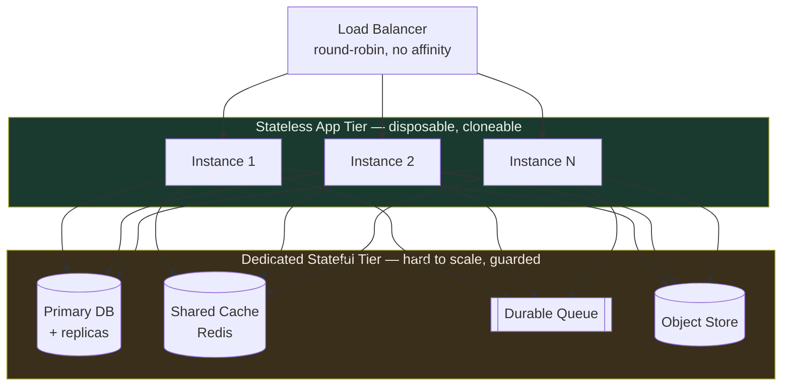

# Stateless Design — Senior

<!-- level-focus -->
At senior level, focus on this question:

> Which system invariant is affected by **Stateless Design** under failure, load, and change?

Use the smallest realistic scenario that exposes the decision and its failure behavior.
---

## 1. What "stateless" precisely means

A service is stateless when **the response to a request is a pure function of (the request, the shared backing stores)** — never of any per-instance memory that survived a previous request. "Stateless" does *not* mean "the system has no state." Every real system has state. It means the *compute tier holds none of it that a request depends on*.

Draw the line at request boundaries:

- **Allowed in-instance state:** anything scoped to the lifetime of one request (parsed body, transaction handle, request-local logger), plus *derived, reconstructible* caches (a compiled regex, a config snapshot, a connection pool) whose loss costs latency but never correctness.
- **Forbidden in-instance state:** anything a *later* request assumes is there — a user's shopping cart in a `map`, an upload's partial bytes on local disk, a "logged-in" flag, a rate-limit counter, a saga's progress.

The test: **can I destroy this instance mid-traffic and lose nothing but the in-flight requests it was actively serving?** If yes, stateless. If a *future* request would misbehave, you have hidden state (§6).

Note the subtlety around caches. A local read-through cache is fine *as an optimization* — a cold instance repopulates it and is merely slower. It becomes forbidden the moment code *writes* authoritative data there and *reads it back expecting it* (e.g. "I stored the OTP in a local `map`, I'll verify against it next request"). The next request may land on a different instance. That is the most common way "stateless" services are secretly stateful.

---

## 2. Statelessness as the enabler of elastic operations

Statelessness is the precondition for three operational capabilities that define modern horizontally-scaled systems. Each one is *equivalent* to "any instance is interchangeable with any other."

- **Horizontal scaling.** Add capacity by adding identical instances behind a load balancer. Because no instance is special, the balancer can use round-robin / least-connections without session affinity, and autoscalers can spin instances up on CPU/QPS with no warm-up handshake beyond cache fill.
- **Rolling deploys & instant failover.** Kill an old instance, start a new one; drain connections, reschedule the pod. No state migration, no session handoff. **Kill any instance and lose no data** — because the data was never there. A crash is operationally identical to a scale-in.
- **Fault isolation.** A poisoned instance (memory leak, wedged goroutine) is *disposable* — the fix is `kill`. Health checks + orchestration turn a failure into a non-event.



The economic asymmetry is the whole point. The app tier is *cheap to scale* (linear, no coordination). The stateful tier is *expensive to scale* (replication, consensus, resharding, conflict resolution). So you make the cheap tier absorb all the load elasticity and keep the expensive tier as small and as few as possible.

---

## 3. The state-pushing discipline: edges and dedicated tiers

The design maxim is **"push state to the edges."** Concretely, for every piece of state a request touches, route it to a system engineered for its access pattern rather than leaving it in application memory:

| State kind | Wrong home (in-instance) | Right home (dedicated tier) | Why that tier |
|---|---|---|---|
| Session / auth identity | local session map | shared cache or signed token | needs cross-instance visibility |
| Domain data | in-memory objects | RDBMS / durable store | needs ACID + durability |
| Hot derived data | local cache expecting writes | Redis / Memcached | shared, evictable, fast |
| Large blobs / uploads | local disk | object store (S3-class) | durable, unbounded, cheap |
| Work-in-progress | goroutine / thread state | durable queue | survives worker death |
| Coordination / locks | in-process mutex | Redis / etcd / ZooKeeper | correct across instances |

Each destination is *purpose-built and harder to scale* than a stateless replica — which is exactly why you consolidate onto a few of them instead of smearing state across every app instance. You are trading "state everywhere, impossible to reason about" for "state in a handful of named systems, each with a known scaling story (replication, sharding, consensus)." When you later have a scaling problem, it is *localized* to one of those systems, not diffused through your fleet.

The discipline also clarifies *cost*. Every round-trip to a stateful tier adds latency and a network failure mode. So the goal is not "zero local state" for its own sake — it is **"only reconstructible local state,"** so that pushing durable state out is a correctness requirement while keeping derived caches local is a permitted optimization.

---

## 4. JWT vs server-side sessions — the deep tradeoff

Authentication is where the stateless ideal collides hardest with reality, because *identity is inherently stateful* — and you must decide *where* that state lives.

**Server-side session:** the server stores session state (in a shared store like Redis) and hands the client an opaque session ID. Every request re-reads the store. The app tier stays stateless *only if the session store is shared* — a session in per-instance memory is the classic hidden-state bug (§6).

**JWT (stateless token):** the server signs a token containing the claims (user ID, roles, expiry). The client presents it; the server *verifies the signature* and trusts the payload with **no lookup**. The state now lives *in the token, at the edge (the client)*. This is the purest form of "push state to the edge" — but it moves the hard problem, it does not remove it.

The core tension is **revocation**. A server session is revocable instantly: delete the row, the next request fails. A JWT is *valid until it expires* by construction — there is nothing to delete, because the server holds nothing. To revoke a JWT early you must reintroduce shared state (a denylist / token-version check), which reintroduces the per-request lookup you adopted JWTs to avoid.

| Dimension | JWT (self-contained) | Server-side session |
|---|---|---|
| Where state lives | in the token (client edge) | in shared store (server) |
| Per-request lookup | none (verify signature) | yes (read session) |
| App tier stateless? | yes, natively | yes, *only if store is shared* |
| Instant revocation | no — valid until expiry | yes — delete the record |
| Payload size on wire | grows with claims (bloat) | tiny opaque ID |
| Blast radius of key/secret leak | forge any token until rotation | limited to stored sessions |
| Logout / permission change | delayed until token TTL | immediate |
| Extra infra | signing keys + rotation | fast shared session store |

**Practical senior stance — the hybrid.** Short-lived access JWT (minutes) + long-lived refresh token that *is* checked against a store. The access token stays lookup-free and self-contained; revocation is achieved by refusing to mint a new access token at refresh time. This bounds the revocation window to the access-token TTL — you trade "instant" for "small," and the trade is tunable. Keep JWTs *small* (IDs and roles, not profiles) to avoid header bloat on every request, and plan **key rotation** (`kid` header + overlapping active keys) from day one, because a signing key you cannot rotate is a signing key you cannot revoke.

```mermaid
sequenceDiagram
    participant C as Client
    participant App as Stateless App
    participant Store as Denylist / Refresh Store
    Note over C,App: Pure JWT — the revocation gap
    C->>App: request + access JWT
    App->>App: verify signature only (no lookup)
    App-->>C: 200 — even for a "logged out" user until TTL
    Note over C,Store: Hybrid closes the gap
    C->>App: refresh (long-lived token)
    App->>Store: is this session revoked?
    Store-->>App: revoked → deny; else mint new short access JWT
    App-->>C: new access JWT (bounded lifetime)
```

---

## 5. Where true statelessness is impossible

Some workloads are *irreducibly stateful*: the state is the point, and pushing it out either destroys the semantics or the performance. The senior move is to (a) recognize these, (b) *contain* the stateful part behind a clear boundary, and (c) keep the rest of the system stateless around it.

- **Stateful stream processing.** Windowed aggregations, joins, and sessionization (Flink, Kafka Streams) must accumulate state per key. You cannot make this stateless — but you *externalize durability*: state is checkpointed to durable storage and *partitioned by key*, so a failed worker's partitions are reassigned and rebuilt from the last checkpoint. The worker holds state, but it holds *recoverable, owned* state, and any given key lives on exactly one worker at a time.
- **Long-lived connections (WebSocket / SSE / gRPC streams).** The TCP connection *is* per-instance state — it is pinned to one process. You cannot round-robin an established socket. The pattern: keep the *connection* on a thin, horizontally-scaled gateway tier, but push all *durable* conversation state to shared stores, and fan messages *to the connection* via a pub/sub bus (any backend can publish; the gateway that owns the socket delivers). The socket is unavoidable local state; everything behind it stays stateless.
- **Leader election / coordination.** Exactly one node must be the leader — that *is* durable, shared, consensus-backed state. Delegate it to a system built for it (etcd, ZooKeeper, Consul) rather than inventing it in your app. Your app instances stay interchangeable; the "who is leader" fact lives in the coordination tier.

The unifying principle: **when statelessness is impossible, make the state (1) owned by a single node at a time, (2) externally recoverable, and (3) confined to the smallest possible tier.** You never eliminate it — you *quarantine* it.

---

## 6. Failure modes: hidden local state & sticky lock-in

**Hidden local state.** The insidious failures are the ones that *pass every test on a single instance* and only surface under a load balancer. The archetype: an in-memory cache the developer *assumed was shared*. It works in dev (one process), works in staging (low traffic, one instance often serves a user's whole flow), and corrupts in production the moment two requests from the same user hit different instances. Symptoms are **intermittent and non-reproducible**: a cart that "loses" items, an OTP that "expires" instantly, a rate limiter that lets 3× traffic through (each instance counts independently). The tell is any read that assumes a prior request's *write* landed in this same process. **Test it structurally:** run ≥2 instances in every non-trivial environment and route round-robin; single-instance testing is a stateless-design blind spot.

**Sticky-session lock-in.** Sticky sessions (session affinity — the LB pins a client to one instance) are the *tempting shortcut* that "fixes" hidden local state without removing it. It makes the map-in-memory bug disappear because the same user keeps hitting the same instance. But it is a trap:

- **Uneven load** — long-lived clients pin traffic to a subset of instances; the balancer can no longer balance.
- **Broken failover** — when the pinned instance dies, *its users lose their state*, precisely the "no data lost on instance kill" guarantee you were supposed to have.
- **Deploy friction** — draining an instance evicts *stateful* sessions, so rolling deploys risk user-visible disruption.
- **Autoscaling defeated** — new instances get no existing sticky clients, so scale-out doesn't relieve the hot instances.

Affinity is acceptable only as a *performance* optimization over *reconstructible* state (e.g. cache locality), never as a *correctness* crutch. If your system *stops working* without sticky sessions, you have hidden local state you haven't externalized yet — affinity is masking the bug, not fixing it. The senior instinct on seeing "we need sticky sessions to work" is to hunt for the in-memory state that should have been pushed to a shared tier.

---

## 7. Senior review checklist

- **Instance-kill test.** Can any instance be killed mid-traffic losing only in-flight requests? If not, locate the surviving-request dependency.
- **Two-instance test.** Does every environment run ≥2 instances round-robin? Single-instance testing hides all state bugs.
- **Cache write-back audit.** Does any code *write* authoritative data to a local cache and *read it back* on a later request? That's hidden state.
- **Affinity audit.** Are sticky sessions required for *correctness* (bug) or merely *performance* (acceptable)?
- **Revocation window.** For JWTs, what is the maximum time between "revoke" and "actually denied"? Is that bounded and acceptable?
- **Token bloat.** How large is the auth token on *every* request? Are you carrying claims you could look up?
- **Key rotation.** Can signing keys be rotated without downtime (`kid` + overlapping keys)?
- **Stateful quarantine.** For each irreducibly-stateful component, is its state single-owner, externally recoverable, and confined to the smallest tier?

---

*Next step:* [Stateless Design — Professional](professional.md)

---

## Apply it

1. State the system invariant that **Stateless Design** must protect.
2. Mark ownership, state, and failure propagation at each boundary.
3. Compare two designs under load, dependency failure, and future change.
4. Define recovery and compatibility behavior before implementation.
5. Test the riskiest assumption with a focused experiment.

## Verify your work

- The experiment supports the design with evidence, not preference.
- Failure injection shows the blast radius and recovery path.
- Compatibility checks cover old and new callers or data.
- Operational signals reveal invariant violations and recovery progress.

## Review questions

- Which invariant must remain true when Stateless Design fails?
- Where should recovery responsibility live, and why?
- Which assumption deserves an experiment before implementation?
- How can the design evolve without changing every consumer at once?
