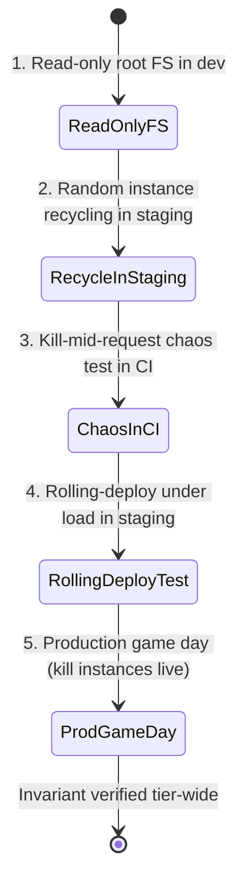

# Stateless Design — Staff

At staff level, statelessness is not a property you engineer into one service — it is a *standard* you set across an organization, so that autoscaling, zero-downtime deploys, and instance failover work by default for every team without any of them having to think about it. The junior lesson is "don't keep session in local memory." The staff lesson is the mirror image: build a platform and a culture where keeping session in local memory is *not even possible* — where instances are ephemeral by construction, local disk is a scratch space that vanishes on restart, and the shared state services teams reach for are so obviously the paved road that no one rolls their own. The payoff is organizational, not architectural: an elastic, self-healing app tier is the substrate on which every other reliability and cost initiative rests, and it is nearly free to run once the default is right — and nearly impossible to retrofit once thousands of endpoints have quietly accreted state. This document is about wielding statelessness as an org-wide default and defending it against entropy, not about the mechanics of externalizing a session (that is `senior.md`) or the queueing math of a stateless tier (that is `professional.md`).

## Table of Contents

1. [The strategic reframe: statelessness is an org standard, not a service property](#1-the-strategic-reframe-statelessness-is-an-org-standard-not-a-service-property)
2. [What statelessness buys the whole organization](#2-what-statelessness-buys-the-whole-organization)
3. [The platform enforces it: making stateful the hard path](#3-the-platform-enforces-it-making-stateful-the-hard-path)
4. [Where state is allowed to live: the few well-run stateful systems](#4-where-state-is-allowed-to-live-the-few-well-run-stateful-systems)
5. [The org auth decision: central token strategy and revocation policy](#5-the-org-auth-decision-central-token-strategy-and-revocation-policy)
6. [Staged diagram: the paved-road stateless tier and its state services](#6-staged-diagram-the-paved-road-stateless-tier-and-its-state-services)
7. [Testing for accidental statefulness: chaos as the enforcement mechanism](#7-testing-for-accidental-statefulness-chaos-as-the-enforcement-mechanism)
8. [When statelessness is the wrong default](#8-when-statelessness-is-the-wrong-default)
9. [Second-order consequences and the metrics that reveal them](#9-second-order-consequences-and-the-metrics-that-reveal-them)
10. [Staff checklist](#10-staff-checklist)

---

## 1. The strategic reframe: statelessness is an org standard, not a service property

Any single team can make its own service stateless. That is a middle-level skill. What a staff engineer owns is the observation that statelessness only pays off *at the tier level* — and a tier is the sum of every team's services. One team that leaks session into local memory does not just hurt itself; it poisons the shared assumption the platform is built on. Autoscaling that works for nine services and silently corrupts the tenth is worse than no autoscaling, because the failure is intermittent, load-dependent, and surfaces as "some users randomly get logged out during traffic spikes" — a bug that takes weeks to trace back to one endpoint that stashed a counter in a package-level variable.

So the real deliverable is not a stateless service. It is an **invariant that holds across the fleet**: *any instance can serve any request, and killing any instance at any moment loses no committed work and no user's session.* Once that invariant holds tier-wide, an entire class of operational capability becomes free and automatic — the load balancer needs no sticky sessions, the autoscaler can add and remove instances on raw CPU without coordination, a rolling deploy can replace every instance one by one, and a crashed node is simply a node the scheduler reschedules. None of these require per-service work *if the invariant holds*. All of them break, subtly and expensively, the moment one service violates it.

This is why statelessness is governed like a standard, not proposed like a design. The staff move is to make the invariant the default that teams inherit, to make violating it require deliberate effort and review, and to *test* that no one has violated it — because the whole value proposition collapses to the weakest service in the tier. The canonical articulation of this default is [The Twelve-Factor App](https://12factor.net/), whose Factor VI ("Processes: execute the app as one or more stateless processes") and Factor IX ("Disposability: maximize robustness with fast startup and graceful shutdown") are not style advice — they are the two load-bearing rules that make an elastic, self-healing tier possible. A staff engineer treats them as organizational law.

## 2. What statelessness buys the whole organization

The reason to invest in a tier-wide stateless standard is that a small number of high-value operational capabilities all *derive from the same invariant*. You are not buying them one at a time; you buy them all at once by holding one line.

| Capability | Why statelessness unlocks it | What it costs when the tier is stateful |
|---|---|---|
| **Horizontal autoscaling** | Any instance is interchangeable, so the scheduler adds/removes them on load with zero coordination | Scaling down evicts sessions; scaling up gives new instances no warm state; users hit "who are you?" errors under load |
| **Zero-downtime rolling deploys** | Instances are disposable, so they can be replaced one at a time behind the LB | In-flight sessions live on the instance being killed; deploys drop sessions or require slow, sticky drains |
| **Instant failover / self-healing** | A dead instance loses nothing; the scheduler just replaces it | A dead instance loses whatever it held; failover means data loss, not just a blip |
| **No sticky sessions at the LB** | Requests route to any instance freely, so the LB balances on health/load alone | Sticky routing pins users to instances, defeating balancing and turning one hot instance into a cascading failure |
| **Trivial capacity planning** | Capacity is `sum of instances`; add instances = add capacity, linearly | Per-instance state means instances aren't fungible; you can't reason about the tier as a pool |
| **Cheap spot / preemptible compute** | Instances can be reclaimed at any moment with no loss | Reclaiming an instance loses state; you're forced onto expensive on-demand capacity |
| **Blast-radius containment** | One instance's failure is one instance's failure | State on a failed instance is gone, so one failure becomes a data-loss incident |

The strategic point is the *coupling* of this table: every row is the same invariant seen from a different angle. This is why you cannot get "most of the benefit" from "mostly stateless." An autoscaler that is correct for 95% of requests and wrong for 5% is not 95% good — it is a source of rare, load-correlated, nearly-unreproducible incidents, which is the most expensive kind. The value is a step function that turns on only when the invariant holds across the whole tier, which is precisely why it must be enforced as a standard rather than encouraged as a practice.

## 3. The platform enforces it: making stateful the hard path

Statelessness maintained by discipline decays. Every new hire, every deadline, every "just cache it in memory for now" erodes it, and because the erosion is invisible until an instance dies at the wrong moment, it accumulates silently for months. The only durable strategy is to make the *platform* enforce the invariant, so that the stateless path is the default and the easy one, and the stateful path requires swimming upstream against infrastructure that keeps washing state away.

The enforcement mechanisms a platform team provides, roughly in order of leverage:

| Enforcement | What it does | What it prevents |
|---|---|---|
| **Ephemeral containers, read-only root filesystem** | Instances have no durable local disk; the root FS is read-only, only a `tmpfs` scratch is writable and wiped on restart | Writing session/upload/cache data to local disk and assuming it persists |
| **Frequent, random instance recycling** | The platform kills and reschedules instances continuously, even when healthy | State from accreting on long-lived instances; forces disposability to stay real |
| **No node affinity by default** | Scheduler places instances anywhere; the LB has sticky sessions disabled | Teams from quietly relying on "requests come back to the same box" |
| **Paved-road session/state services** | A `new-service` scaffold wires in the shared session store, cache, and object storage clients already configured | Teams from rolling their own in-memory session and calling it good enough |
| **Graceful-shutdown contract (SIGTERM → drain → exit fast)** | The platform sends SIGTERM and gives a short deadline; slow shutdown is killed | Reliance on shutdown hooks flushing in-memory state to somewhere durable |
| **Chaos in CI/staging** | Automated tests kill instances mid-request (see §7) | Accidental statefulness from reaching production undetected |

The mindset shift is that you do not *ask* teams to be stateless — you build an environment in which statefulness *doesn't work*. A read-only root filesystem is a wonderful teacher: the first time a developer tries to write an uploaded file to `/app/uploads` and gets `EROFS`, they learn the rule in a way no wiki page ever taught. Random instance recycling is the same lesson applied to memory: if instances are recycled every few minutes anyway, the in-memory session cache that "works fine in dev" fails loudly and immediately in staging, not mysteriously in production six months later. The platform's job is to move the discovery of accidental state as far left as possible — ideally to the developer's first attempt, at worst to CI, and *never* to a 2 a.m. page during a scaling event.

Critically, the platform must make the *right* thing effortless, not just the wrong thing hard. If you take away local disk but do not hand teams a paved-road object store client and a paved-road session store, you have not enforced statelessness — you have created friction that teams will route around with something worse. The paved road and the guardrail are two halves of one policy: `new-service` must ship with the shared state clients pre-wired so that the stateless path is also the path of least resistance.

## 4. Where state is allowed to live: the few well-run stateful systems

Statelessness at the app tier does not abolish state — it *relocates* it. State is conserved; the discipline is to push it out of the many, cheap, disposable app instances and concentrate it into a small number of purpose-built, well-operated stateful systems that are designed for durability, replication, and failover. The staff judgment is not "eliminate state" but "state lives in a *few* blessed places run by people who specialize in running stateful systems, and *nowhere else*." Sprinkling state across the app tier is the anti-pattern; concentrating it is the goal.

| State type | Where it belongs | Where it must NOT live | Why |
|---|---|---|---|
| **User session / auth** | Shared session store (Redis/Memcached) or stateless token (JWT) | App-instance memory or local disk | Sessions must survive the death of any single instance |
| **Business data of record** | The primary database (RDBMS / distributed SQL) | Anywhere else — there is one source of truth | Durability, transactions, and a single authoritative copy |
| **Cache / derived data** | Shared cache tier (Redis/Memcached) | App-instance memory *as the only copy* | A local cache is fine as an optimization; it must be reconstructable, never authoritative |
| **File / blob uploads** | Object storage (S3-compatible) | App-instance local filesystem | Uploads on local disk vanish when the instance is recycled |
| **Long-running / in-flight work** | Durable queue or workflow engine | An in-memory job list on one instance | Work must survive an instance dying mid-processing |
| **Coordination / locks / config** | A coordination service (etcd / ZooKeeper / Consul) | Ad-hoc in-process locks | Cross-instance coordination cannot live inside one instance |

Two nuances separate a staff answer from a middling one. First, a *local* cache is not a statelessness violation as long as it is a pure performance optimization over an authoritative shared source — the test is "if this instance dies and its local cache is lost, is any correctness lost?" If the answer is no, the local cache is fine and even encouraged; if the answer is yes, it is illicit state masquerading as a cache. Second, the goal is deliberately to keep the *number* of blessed stateful systems small. Every stateful system carries an operational tax — backups, replication, failover drills, capacity planning, on-call expertise — that the stateless app tier does not. An organization that runs three well-understood stateful systems (a database, a cache, an object store) operates them far better than one that has let twelve bespoke stateful things bloom, each half-operated. Concentrating state is not just an app-tier property; it is a decision about where the organization chooses to spend its scarce stateful-systems operational competence.

## 5. The org auth decision: central token strategy and revocation policy

Nothing forces the statelessness question harder than authentication, because auth is state — "who is this user, and are they still allowed in?" — that every request needs and every service touches. Left to individual teams, auth fragments into a dozen incompatible session schemes, and the tier's statelessness dies by a thousand cuts. So a staff engineer owns the auth strategy as a single, central, org-wide decision, and the central axis of that decision is the classic trade between two ways of keeping the app tier stateless.

| Approach | How it keeps the app tier stateless | The cost it imposes |
|---|---|---|
| **Stateless tokens (self-contained JWT)** | The token carries signed claims; any instance verifies it locally with a public key — no session lookup, no shared session store on the hot path | **Revocation is the hard problem.** A signed token is valid until it expires; you cannot un-issue it. Logout, ban, and "force re-auth" all become non-trivial |
| **Server-side sessions (opaque token → shared store)** | The token is a random ID; the app tier is still stateless because the *session data* lives in a shared store (Redis), not on the instance | Every request pays a lookup to the session store — that store becomes a critical, hot dependency the whole tier leans on |

The naïve reading is "JWTs are stateless, so JWTs win." The staff reading is that *both* approaches keep the app tier stateless — the JWT pushes the state into the token itself, the opaque session pushes it into a shared store — and the real decision is **where you want to pay the revocation cost.** This is why the token strategy and the revocation policy are one inseparable decision, not two:

- **If you choose stateless JWTs,** you must design revocation *up front*, because a self-contained token cannot be un-issued. The standard org answer is short-lived access tokens (minutes) plus longer-lived refresh tokens, so a compromised or logged-out session dies quickly on its own; for "revoke *now*" cases (a fired employee, a stolen device) you add a **denylist of revoked token IDs** that every instance checks — which quietly reintroduces a small piece of shared state, but a bounded one (only currently-revoked tokens, not all sessions). The revocation window — how long a token stays valid after revocation — is an explicit org security decision, not an accident of the default expiry.
- **If you choose opaque server-side sessions,** revocation is trivial (delete the row) but the session store is now on the critical path for *every* request, so it must be as available and low-latency as the tier it serves, and its failure is a tier-wide outage.

The decision must be made *once*, centrally, and provided as paved-road infrastructure — a shared auth library and token-issuance service that every team consumes — precisely so that revocation policy is uniform. A revocation policy that is strong in the payments service and absent in the notifications service is only as strong as its weakest service, exactly like statelessness itself. The org-wide questions a staff engineer must answer and publish: What is the access-token lifetime? What is the refresh lifetime and rotation policy? How fast must a "revoke now" take effect, and what mechanism delivers that? Who can force a global re-auth, and what event triggers it (key rotation, breach)? These are governance answers, written down once, enforced by shared infrastructure — not choices each team rediscovers.

## 6. Staged diagram: the paved-road stateless tier and its state services

The target architecture is a fleet of interchangeable, disposable app instances behind a load balancer, with all durable state pushed into a small set of shared, well-operated stateful services. The sequence below shows why the invariant matters: an instance can die mid-flight and the user notices nothing, because nothing the user cares about lived on that instance.

```mermaid
sequenceDiagram
    autonumber
    participant U as User
    participant LB as Load Balancer<br/>(no sticky sessions)
    participant A1 as App Instance 1<br/>(ephemeral, read-only FS)
    participant A2 as App Instance 2<br/>(ephemeral, read-only FS)
    participant S as Shared Session Store<br/>(Redis)
    participant DB as Primary Database
    participant OBJ as Object Storage

    U->>LB: 1. Request (Bearer token)
    LB->>A1: 2. Route to ANY instance
    A1->>S: 3. Validate session / check revocation denylist
    A1->>DB: 4. Read/write data of record
    Note over A1: 5. Instance 1 is killed<br/>(deploy, scale-in, or crash)
    U->>LB: 6. Next request (same token)
    LB->>A2: 7. Route to a DIFFERENT instance
    A2->>S: 8. Same session, same token — validated identically
    A2->>OBJ: 9. Serve upload from object store, not local disk
    A2-->>U: 10. Response — user never noticed the instance died
    Note over U,OBJ: Invariant held: any instance served any request;<br/>killing one lost no session and no committed work
```

The load-bearing steps are 5 through 8: an instance vanishes between two requests from the same user, the next request lands on a completely different instance, and the session validates identically because it never lived on the first instance in the first place. That is statelessness paying its dividend — and step 3's revocation check is where the auth decision from §5 lands in the request path. If step 3 or step 9 had instead read from Instance 1's local memory or local disk, step 8 would fail after step 5, and the "user never noticed" guarantee would collapse into an intermittent, load-correlated logout bug.

## 7. Testing for accidental statefulness: chaos as the enforcement mechanism

A standard you cannot verify is a standard that is already being violated somewhere. Statelessness is unusually treacherous here because a stateful service *works perfectly* in every test that doesn't kill an instance mid-request — it passes unit tests, integration tests, and manual QA, and only reveals itself when an instance dies at exactly the wrong moment under real traffic. The only test that catches accidental statefulness is one that does precisely that: **kill instances mid-request and assert nothing was lost.** This is why chaos testing is not a nice-to-have for a stateless tier — it is the *enforcement mechanism* for the whole standard.

The staged testing discipline, from cheapest/leftmost to most production-realistic:



Each stage catches a different failure earlier than the last:

1. **Read-only root filesystem in dev** — the developer discovers accidental disk-state on their first `EROFS` error, before a single commit.
2. **Random instance recycling in staging** — instances are killed every few minutes regardless of health, so any in-memory session cache fails loudly in staging rather than silently in production.
3. **Kill-mid-request chaos test in CI** — an automated test fires a request, kills the serving instance while the request is in flight, and asserts the retried request succeeds against a fresh instance with no lost session and no lost committed work. This is the gate: a service that fails it does not ship.
4. **Rolling-deploy-under-load test in staging** — replay production-like traffic while rolling every instance; assert zero dropped sessions and zero failed in-flight writes. This catches statefulness that only appears at deploy time.
5. **Production game day** — periodically kill real instances in production under real load (the Chaos Monkey discipline). This is the ultimate proof that the invariant holds where it counts, and it doubles as a forcing function that keeps disposability real over time.

The organizational point is that the chaos test in CI is what makes the standard *enforceable* rather than aspirational. Without it, "be stateless" is a code-review opinion that erodes under deadline pressure. With it, statelessness is a red/green fact: a service either survives having its instance killed mid-request or it does not, and the ones that do not are caught by machines, not by a reviewer's memory. A staff engineer's highest-leverage move here is to make that test part of the paved-road CI template so every new service inherits it by default — the same principle as §3, applied to verification.

## 8. When statelessness is the wrong default

A staff engineer earns the title partly by knowing where the org standard *shouldn't* apply, so that teams neither cargo-cult it into inappropriate places nor treat every exception as a violation. Statelessness is the right default for the request-serving app tier; it is the wrong tool for a small set of genuinely stateful workloads, and forcing it there produces worse systems, not better ones.

- **Systems whose entire purpose is to hold state.** The database, the cache, the message broker, the object store — these *are* the blessed stateful systems from §4. Demanding they be stateless is a category error; the discipline is to run them well, not to pretend they are stateless.
- **Stateful stream processing and windowed aggregation.** Systems like Flink or Kafka Streams maintain large local state (windows, aggregations, joins) for performance, and externalizing every keystroke to a shared store would be catastrophically slow. The correct pattern is *checkpointed local state* — state lives locally for speed but is periodically snapshotted to durable storage so it survives instance death. This is neither classic statelessness nor accidental statefulness; it is deliberate, recoverable local state.
- **Long-lived stateful connections (WebSockets, game servers, video sessions).** When a user holds an open connection to a specific instance for the duration of a session, some affinity is inherent. The staff move is to keep the *durable* state (the game world, the document of record) externalized while accepting that the ephemeral connection state is instance-local — and to design reconnection so that a dropped connection re-establishes against any instance, recovering its context from the externalized source of truth.
- **Latency-critical hot paths where a shared-store round trip is unacceptable.** Occasionally the round trip to a shared session or cache is itself the bottleneck. The answer is a *reconstructable* local cache (illicit only if it is authoritative — see §4), not a wholesale abandonment of the standard.

The unifying judgment: statelessness is the default for the many, cheap, disposable instances that serve requests, and the exceptions are the few systems that exist *to* hold state or that hold recoverable local state for performance. An engineer who cannot articulate that boundary either under-applies the standard (leaking session everywhere) or over-applies it (demanding a database be stateless) — both are junior errors wearing different clothes.

## 9. Second-order consequences and the metrics that reveal them

Holding the stateless invariant tier-wide has downstream effects, mostly positive, that show up months after the decision and that a staff engineer should anticipate and instrument.

- **The shared state services become the new critical path.** Pushing state out of the app tier concentrates it, and a concentrated dependency is a concentrated risk: the session store and primary database are now single points of tier-wide failure, and they must be operated to a higher availability bar than any app instance. The trade is deliberate — you exchange diffuse, unmanageable state for concentrated, well-managed state — but the concentration must be matched with replication, failover drills, and capacity headroom. **Watch:** session-store and database availability and P99 latency; these are now tier-wide SLIs, not per-service ones.
- **Autoscaling that "just works" hides cost signals.** An elastic tier absorbs load growth invisibly by adding instances, which is exactly the point — but it also means inefficiency (a memory leak, an N+1 query, an accidental fan-out) shows up as a quietly climbing instance count and cloud bill rather than as a visible outage. **Watch:** instances-per-unit-load over time; a rising trend is the tier telling you something got less efficient while autoscaling papered over it.
- **The revocation window is a latent security surface.** With stateless JWTs, the gap between "we revoked this token" and "this token stops working" is a real exposure that only matters during an incident (a breach, a fired employee). It is invisible until the day it isn't. **Watch:** the actual measured revocation latency in game days, not the configured value — verify that a "revoke now" propagates to every instance within the SLA you published in §5.
- **Statefulness re-accretes silently.** The most important second-order effect is entropy: over months, teams under deadline pressure reintroduce local state, and each instance passes every test that doesn't kill it mid-flight. **Watch:** the pass rate of the kill-mid-request chaos test across the fleet, and the count of services that have opted out of it. A single opted-out service is the crack through which the whole tier-wide invariant leaks.

The meta-metric behind all of these: **the invariant is only as strong as the weakest service in the tier.** The single number a staff engineer watches to know the standard is holding is the fraction of the fleet that passes the kill-mid-request chaos gate. When that number drops below 100%, the elastic, self-healing tier is a story you are telling yourself, not a property you have.

## 10. Staff checklist

- [ ] Statelessness is a **written org standard** with a testable invariant ("any instance serves any request; killing any instance loses no session and no committed work"), not per-team folklore.
- [ ] The **platform enforces it**: ephemeral containers, read-only root filesystem, random instance recycling, graceful-shutdown contract, and no default node affinity or LB sticky sessions.
- [ ] The **paved road provides the alternatives**: `new-service` ships with shared session-store, cache, and object-storage clients pre-wired, so the stateless path is also the easiest path.
- [ ] State is **concentrated in a few blessed stateful systems** (database, cache, object store, queue, coordination service) — and the org deliberately keeps that number small.
- [ ] The **auth strategy is a single central decision** (stateless JWT vs opaque server-side session) provided as shared infrastructure, with the **revocation policy** (token lifetimes, refresh rotation, revoke-now mechanism, revocation SLA) written down and enforced uniformly.
- [ ] A **kill-mid-request chaos test** is part of the paved-road CI template and is a hard gate; new services inherit it by default.
- [ ] **Production game days** periodically kill real instances under load to keep disposability real and to measure actual revocation latency.
- [ ] The **exceptions are documented** (stateful stores, checkpointed stream processors, long-lived connections) so teams neither cargo-cult statelessness into stateful systems nor leak state into the app tier.
- [ ] Tier-wide **SLIs** are tracked: shared state-service availability/latency, instances-per-unit-load, and the fleet's chaos-gate pass rate — with the last treated as the health signal for the whole standard.

*Next step:* [Stateless Design — Interview](interview.md)
