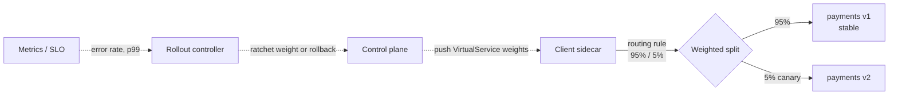

# Service Mesh — Interview

A tiered Q&A bank, from fundamentals to staff-level judgment. Each answer is written to be spoken aloud in a few sentences — precise, not padded.

1. [What problem does a service mesh actually solve?](#q1-what-problem-does-a-service-mesh-actually-solve)
2. [Data plane vs control plane](#q2-what-is-the-difference-between-the-data-plane-and-the-control-plane)
3. [How does a sidecar intercept traffic?](#q3-how-does-a-sidecar-proxy-actually-intercept-a-services-traffic)
4. [Sidecar vs ambient/eBPF](#q4-sidecar-per-pod-vs-ambient--ebpf-what-changed-and-why)
5. [mTLS and workload identity (SPIFFE)](#q5-how-does-the-mesh-establish-mtls-and-what-is-spiffe)
6. [Traffic shifting and canary releases](#q6-how-does-a-mesh-do-traffic-shifting-and-canary-releases)
7. [Retries, timeouts, circuit breaking — and retry storms](#q7-the-mesh-gives-me-automatic-retries-and-timeouts-what-goes-wrong)
8. [Latency and resource overhead](#q8-what-is-the-real-latency-and-resource-cost-of-a-mesh)
9. [What happens when the control plane goes down?](#q9-what-happens-to-my-traffic-when-the-control-plane-goes-down)
10. [When should you NOT adopt a mesh?](#q10-when-would-you-advise-against-adopting-a-service-mesh)
11. [Mesh vs API gateway](#q11-mesh-vs-api-gateway-do-i-need-both)
12. [Istio vs Linkerd](#q12-istio-vs-linkerd-how-do-you-choose)
13. [Who owns the mesh org-wise?](#q13-who-should-own-the-service-mesh-in-an-organization)
14. [Rolling out a mesh to a live fleet](#q14-staff-level-how-would-you-roll-a-mesh-into-a-live-500-service-fleet)

---

## Q1: What problem does a service mesh actually solve?

Once you have more than a handful of services, every one of them needs the same cross-cutting network concerns: mutual TLS, retries with backoff, timeouts, load balancing, circuit breaking, and consistent telemetry (golden metrics, distributed traces). Without a mesh, each team reimplements this inside every service, in every language, with subtle inconsistencies and drift. A mesh moves that logic *out* of the application and into a uniform infrastructure layer — a fleet of proxies — so the behavior is declared centrally and enforced identically regardless of what language the service is written in. The pitch is "encryption, resilience, and observability for service-to-service traffic, without touching application code."

## Q2: What is the difference between the data plane and the control plane?

The **data plane** is the set of proxies (Envoy in Istio, the Linkerd2-proxy micro-proxy in Linkerd) that sit next to every workload and actually carry request traffic — they do the mTLS handshakes, load balancing, retries, and metric emission on the hot path. The **control plane** (Istiod, Linkerd's `destination`/`identity`/`proxy-injector` controllers) never touches request bytes; it watches the platform API (Kubernetes), compiles your high-level intent — VirtualServices, mTLS policies, authorization rules — into low-level proxy configuration, and pushes it out. The key mental model: the data plane is on the critical path of every request, the control plane is on the *configuration* path. That separation is why a control-plane outage doesn't immediately stop traffic (see Q9).

## Q3: How does a sidecar proxy actually intercept a service's traffic?

In the classic sidecar model, a proxy container runs in the same pod as the application, sharing its network namespace. An init container (or a CNI plugin) installs iptables rules that redirect all inbound and outbound TCP through the proxy's ports, so the application's own sockets are transparently captured without the app knowing. The app thinks it's calling `payments:8080` directly; in reality the connection terminates at the local sidecar, which applies policy and opens a *new* mTLS connection to the destination pod's sidecar. This transparency is the selling point and also the tax: you now have two extra hops (out-sidecar and in-sidecar) and two extra containers per pod.

## Q4: Sidecar (per-pod) vs ambient / eBPF — what changed and why?

The sidecar model's cost is structural: one proxy per pod means thousands of proxies, each with its own memory footprint, CPU, and config to push — and every proxy upgrade forces a pod restart. Newer architectures split the work. Istio **ambient mesh** runs a per-node L4 component (`ztunnel`) for mTLS and TCP routing, and adds an optional per-namespace **waypoint** proxy only for workloads that need L7 features. eBPF-based approaches (Cilium) push identity-aware routing and some policy into the kernel, avoiding a userspace hop entirely for L4. The trade-off is capability vs. footprint:

| Dimension | Sidecar (per-pod) | Ambient / eBPF |
|---|---|---|
| Proxy count | One per workload pod | One per node (+ optional L7 waypoint) |
| Resource overhead | High (multiplied by pod count) | Lower, shared per node |
| Data-path hops | 2 userspace proxies per call | L4 in kernel/ztunnel; L7 only when needed |
| Upgrade cost | Restart every pod | Restart node components only |
| L7 features (retries, header routing) | Everywhere, always | Only where a waypoint is deployed |
| Isolation / blast radius | Per-pod, strong | Shared node component, larger blast radius |
| Maturity | Battle-tested | Newer, evolving fast |

For a senior answer: ambient is compelling at scale but you're trading strong per-pod isolation for a shared, node-level failure domain — evaluate that, don't just chase the lower CPU number.

## Q5: How does the mesh establish mTLS, and what is SPIFFE?

Every workload gets a cryptographic identity issued by the control plane, not a hand-managed certificate. That identity follows the **SPIFFE** standard: an identity is a URI like `spiffe://cluster.local/ns/payments/sa/checkout`, encoded into the SAN field of a short-lived X.509 certificate (the SVID). The sidecars perform a mutual TLS handshake and verify each other's SPIFFE ID, so authentication is based on *who the workload is*, not on its IP — which is essential in Kubernetes where IPs are ephemeral. Certificates are rotated automatically on a short TTL (often ~24h or less), so a leaked cert has a small window of validity. Authorization policies then reference these identities: "only the `checkout` service account may call `payments`," enforced at the proxy rather than in application code.

## Q6: How does a mesh do traffic shifting and canary releases?

Because the data plane makes the routing decision for every request, you can split traffic by weight without any DNS change or new load balancer. You deploy v2 alongside v1, then declare a rule — e.g., an Istio VirtualService — that sends 95% of traffic to v1 and 5% to v2, and you ratchet the weight up while watching error rate and latency on v2's golden metrics. Because routing is L7, you can also do subset routing: send only requests with a specific header (or from internal users) to the canary. This decouples *deploy* (v2 is running) from *release* (v2 receives production traffic), which is the whole point of progressive delivery. In practice you drive this with a controller like Flagger or Argo Rollouts that automates the weight steps and auto-rolls-back on SLO breach.

## Q7: The mesh gives me automatic retries and timeouts — what goes wrong?

The classic failure is a **retry storm**. If every layer of a call chain independently retries three times, a single deep failure multiplies: 3 × 3 × 3 = 27× the load hits the struggling backend precisely when it's already overloaded, turning a blip into a full outage. Meshes make retries trivial to turn on, which makes this trap easy to fall into. The disciplines that avoid it: enable retries only at *one* layer (usually the edge or the client closest to the caller), only for **idempotent** operations, always with a **retry budget** (cap retries to a small percentage of total requests) plus jittered backoff, and set **timeouts** that shrink as you go deeper so an inner call can't exceed its caller's budget. Circuit breaking is the backstop — when a destination's error rate or outstanding-request count crosses a threshold, the proxy sheds load (fails fast, ejects the bad host) instead of piling on, giving the backend room to recover.

## Q8: What is the real latency and resource cost of a mesh?

Every hop adds two proxy traversals — the caller's sidecar out and the callee's sidecar in — so per-request latency typically grows by single-digit to low-double-digit milliseconds depending on payload, mTLS work, and whether you enabled heavy L7 features; the tail (p99) is what usually hurts, not the median. Resource cost is the bigger surprise at scale: each sidecar consumes memory and CPU, so a 5,000-pod fleet means 5,000 extra proxies to provision and pay for, plus the control plane's own footprint for pushing config to all of them. This is exactly the pressure that drives ambient/eBPF models. The honest senior framing: the mesh isn't free, so you must be able to name the concrete benefit (uniform mTLS, zero-code observability, fleet-wide policy) that justifies the CPU, the added tail latency, and the operational complexity — otherwise you're paying a tax for nothing.

## Q9: What happens to my traffic when the control plane goes down?

This is the reassuring part of the data-plane/control-plane split: existing traffic keeps flowing. The sidecars already hold their compiled config and cached certificates, so they continue routing, load balancing, and doing mTLS with what they last received. What you lose is the ability to *change* things — new config won't propagate, and crucially, **certificate rotation stalls**, so a prolonged control-plane outage eventually causes SVIDs to expire and mTLS handshakes to start failing across the fleet. Newly scheduled pods also can't get injected or configured. So the failure mode is "the mesh freezes in its last-known-good state and slowly degrades," not "traffic stops instantly" — which is why control-plane HA and monitoring cert-expiry as a first-class alert both matter.

## Q10: When would you advise against adopting a service mesh?

When the problems it solves aren't yet your problems. A handful of services, a single language, low call-chain depth, and no hard mTLS/compliance requirement — a mesh here is pure overhead: more moving parts, more failure modes, a steep operational learning curve, and a team now on the hook for debugging Envoy/iptables issues at 3 a.m. You can get mTLS from a simpler cert-manager setup, resilience from a good client library, and observability from OpenTelemetry SDKs, without a mesh. The rule of thumb: adopt a mesh when the *cost of inconsistency* across many polyglot services exceeds the cost of running the mesh. If your teams can't articulate that pain concretely, it's premature — and you should also verify you have the platform maturity (Kubernetes fluency, on-call depth) to operate one before committing.

## Q11: Mesh vs API gateway — do I need both?

They operate on different traffic axes and frequently coexist. An **API gateway** handles **north-south** traffic — requests entering your cluster from the outside world — and its concerns are edge concerns: external authentication (OAuth, API keys), rate limiting per consumer, request transformation, API versioning, and exposing a public contract. A **service mesh** handles **east-west** traffic — service-to-service calls *inside* the cluster — and its concerns are internal: workload-identity mTLS, resilience between services, and internal observability.

| Aspect | API Gateway | Service Mesh |
|---|---|---|
| Traffic direction | North-south (ingress) | East-west (internal) |
| Primary users | External clients / partners | Your own services |
| Auth model | End-user / API-consumer auth | Workload identity (SPIFFE mTLS) |
| Typical features | Rate limiting, API keys, transformation, versioning | mTLS, retries/timeouts, circuit breaking, tracing |
| Deployment | Centralized edge | Distributed proxies alongside every workload |

A large system usually has both: the gateway is the front door, the mesh governs the hallways. Some meshes provide a gateway component so they share config primitives, but that's convenience, not the same job.

## Q12: Istio vs Linkerd — how do you choose?

**Istio** is the feature-maximal, Envoy-based mesh: enormous capability surface (rich L7 routing, WASM extensibility, multi-cluster, ambient mode) at the cost of more complexity and a larger proxy footprint. **Linkerd** deliberately optimizes for simplicity and operational cost — its purpose-built Rust micro-proxy is small and fast, and its scope is narrower — which makes it dramatically easier to run but less of a Swiss-army knife. The honest tie-breaker is rarely a feature checklist; it's "what can your team actually operate." If you need advanced traffic-management features, deep Envoy customization, or multi-cluster topologies, Istio earns its complexity. If you mainly want mTLS, golden metrics, and reliable retries with the least operational burden, Linkerd is often the better fit. Cilium's eBPF approach is the third option when you want mesh-like L4 identity/policy fused with your CNI.

## Q13: Who should own the service mesh in an organization?

The mesh is **platform-owned**, not per-service-team-owned — it's shared infrastructure with a fleet-wide blast radius, so a central platform/infra team must own the control plane, upgrades, default policies, and the on-call for mesh incidents. But ownership can't be fully centralized either, because meshes fail badly when the platform team becomes a bottleneck approving every routing change. The healthy model is a paved road: the platform team owns and operates the mesh and provides sane, secure defaults (mTLS on by default, sensible timeouts, standard dashboards), while application teams self-serve the per-service knobs — their canary weights, their retry budgets, their authorization rules — within guardrails. Clear separation of what's centrally governed (identity, encryption baseline, upgrade cadence) from what's team-delegated (routing, canaries) is what keeps a mesh from becoming either a bottleneck or a free-for-all.

## Q14: Staff-level — how would you roll a mesh into a live 500-service fleet?

Incrementally, and observability-first. You never flip a mesh on for 500 services at once, because you'd be adding an unfamiliar failure domain to your entire fleet simultaneously. Start by installing the control plane and onboarding a couple of *low-risk, low-traffic* services in **permissive mTLS** mode, where the mesh accepts both plaintext and mTLS so nothing breaks during migration. Prove out the golden signals, the dashboards, and your team's ability to debug an Envoy/iptables issue on those canaries first. Then expand namespace by namespace, only flipping mTLS from permissive to **strict** once *both* ends of every dependency are meshed — flipping strict too early is the classic outage, because a meshed caller can't talk plaintext to an un-meshed callee. Keep retries and circuit breaking *off* initially and enable them deliberately per service with budgets, so you don't introduce a retry storm during migration. Throughout, treat control-plane HA, cert-expiry alerting, and a tested rollback (you can always remove the sidecar injection label and restart) as non-negotiable prerequisites, not afterthoughts.

---

*Next step:* [Serverless / FaaS — Junior](../07-serverless-faas/junior.md)
