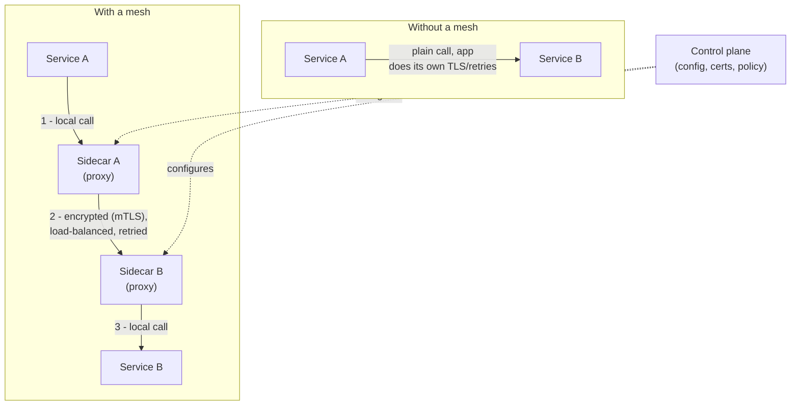

# Service Mesh — Junior

<!-- level-focus -->
At junior level, focus on this question:

> How can I apply **Service Mesh** in one small example and prove the result?

Use the smallest realistic scenario that exposes the decision and its failure behavior.
## 1. The problem: cross-cutting network concerns

In a microservice system, every service talks to other services over the network. That network is unreliable: connections drop, a downstream service is briefly overloaded, a slow instance stalls a request. On top of reliability, production also demands:

- **Security** — traffic between services should be encrypted and authenticated, not plain HTTP over the internal network.
- **Resilience** — transient failures should be retried; a failing instance should be skipped; a persistently broken dependency should be short-circuited.
- **Load balancing** — requests should be spread across the healthy instances of a target service.
- **Observability** — every call needs metrics (latency, error rate) and traces so you can see what is happening.

These are **cross-cutting concerns**: they are not the business logic of any one service, yet *every* service needs them. The traditional answer is a shared client library that each service imports. That works, but it has real costs:

- The same logic is **duplicated across every service** — and re-implemented for **every language** you use (a Go service and a Python service need two separate libraries).
- Upgrading the logic (say, changing the retry policy) means **rebuilding and redeploying every service**.
- Application teams end up owning networking code they'd rather not maintain.

A service mesh solves this by moving those concerns *out* of the application entirely.

---

## 2. What a service mesh is

A **service mesh** is a dedicated infrastructure layer that handles all service-to-service communication for you. Instead of putting retry/mTLS/load-balancing logic inside each service, the mesh intercepts the network traffic *around* each service and applies that logic there.

The core idea: your application sends a normal request to another service. It doesn't know about certificates, retries, or which instance is healthy. A small proxy running next to your service quietly takes over the request, does all the networking work, and delivers it. The same happens on the receiving side.

Because the logic lives in the proxy layer — not the app — it is:

- **Language-agnostic** — a Go service and a Python service get identical behavior, because neither one implements it.
- **Uniform** — every service gets the same encryption, retry, and observability policy.
- **Centrally managed** — you change a policy once, and it applies fleet-wide without touching application code.

Common implementations: **Istio** (built on the Envoy proxy) and **Linkerd**. See [istio.io](https://istio.io) and [linkerd.io](https://linkerd.io).

---

## 3. The sidecar proxy

A **sidecar** is a helper process that runs alongside your application, sharing its local environment (in Kubernetes, in the same Pod). The name comes from a motorcycle sidecar: attached to the main vehicle, moving with it, but a separate compartment.

In a service mesh, the sidecar is a **network proxy**. The mesh configures the environment so that:

- Every request **leaving** your service is transparently routed through its sidecar first.
- Every request **arriving** at your service passes through its sidecar first.

Your application still thinks it is making a plain call to `orders-service`. In reality the sidecar intercepts that call and does the heavy lifting — establishing an encrypted connection, picking a healthy target instance, retrying on failure, and recording metrics. The application code is unchanged; often it isn't even aware the sidecar exists.

Because there is one sidecar per service instance, the proxy is close to the app (low latency) and its failure only affects that one instance.

---

## 4. Data plane vs control plane

Every mesh has two layers, and separating them is the central concept to understand.

- **Data plane** — the set of all the sidecar proxies. This is where the actual traffic flows. The data plane *does the work*: encrypts connections, load-balances, retries, collects metrics. Every byte of service-to-service traffic passes through it.

- **Control plane** — the brain. It does *not* touch request traffic. Instead it configures the proxies: it tells them which services exist and where their instances are, hands out the certificates used for encryption, and distributes the routing and retry policies you define. When you change a policy, you change it in the control plane, and it pushes the new config down to every proxy.

A useful analogy: the **control plane is air-traffic control** (planning, instructions, no cargo), and the **data plane is the aircraft** (carrying the actual load). If the control plane briefly goes down, existing proxies keep routing traffic with their last-known config — the data plane is what keeps requests flowing.

| Aspect | Data plane | Control plane |
|---|---|---|
| Made of | The sidecar proxies | The management service(s) |
| Handles request traffic? | Yes — every request flows through it | No — it only configures the proxies |
| Job | Encrypt, load-balance, retry, collect metrics | Distribute config, policy, certificates, service locations |
| If it fails | Requests stop flowing | Existing proxies keep running on last-known config |

---

## 5. Request flow through the mesh

The diagram below contrasts a direct call (no mesh) with the same call routed through two sidecars, while the control plane configures both from the side.

Step by step, in the *with a mesh* case:

1. **Service A** makes what looks like an ordinary call to Service B. It hands the request to its own sidecar without knowing it.
2. **Sidecar A** encrypts the connection (mutual TLS), picks a healthy instance of Service B, applies retry/timeout policy, and records metrics — then sends it to **Sidecar B**.
3. **Sidecar B** terminates the encrypted connection, verifies the caller's identity, records its own metrics, and forwards a plain local call to **Service B**.

The two application services never had to implement any of the encryption, load balancing, or retry logic. The control plane (dashed lines) supplied both sidecars with the config and certificates to make it happen.

---

## 6. Library vs mesh: who owns the concern

The mesh doesn't invent new capabilities — retries and mTLS existed long before meshes. What changes is *where the logic lives and who maintains it*.

| Concern | Library-based (in the app) | Service mesh (in the sidecar) |
|---|---|---|
| Where the logic runs | Inside each service's process | In the proxy next to each service |
| Languages | One implementation **per language** | One proxy, works for **all** languages |
| Changing a policy | Rebuild + redeploy every service | Update control plane, config pushed to proxies |
| Consistency across services | Depends on each team keeping up | Uniform, enforced centrally |
| Coupling to app code | Tight — networking mixed into business logic | Decoupled — app makes plain calls |
| Owned by | Application teams | Platform / infra team |
| Extra cost | Library upkeep, version drift | A proxy per instance: some latency + resource use |

The mesh's big win is **decoupling**: cross-cutting networking becomes an operational concern managed by the platform, not code sprinkled through every service. Its main cost is the extra proxy hop and the resources each sidecar consumes.

---

## 7. When you do (and don't) need one

A service mesh is not free — it adds proxies, moving parts, and a control plane to operate. It earns its place when the problems it solves are real for you.

You likely benefit when:

- You run **many microservices**, especially in **multiple languages**, and re-implementing networking logic per language hurts.
- You need **encryption and identity between services** (mTLS everywhere) without asking every team to build it.
- You want **uniform observability** — consistent metrics and traces across all services with no app changes.

You probably don't need one when:

- You have a **monolith or a handful of services** — the complexity outweighs the benefit.
- Your team is **small** and can't take on operating a control plane.
- A simpler tool (a shared library, an API gateway) already covers your needs.

As a junior engineer, the goal is to recognize the mesh's *purpose*: it exists so that reliability, security, and observability of service-to-service traffic become a shared platform capability rather than duplicated application code.

---

## 8. Key terms

- **Service mesh** — an infrastructure layer that handles service-to-service networking (mTLS, retries, load balancing, observability) so application code doesn't have to.
- **Cross-cutting concern** — logic that many or all services need but that isn't any one service's business logic.
- **Sidecar** — a helper process running alongside a service instance; in a mesh, it is a network proxy.
- **Proxy** — software that intercepts traffic on behalf of a service and applies networking logic to it.
- **Data plane** — all the sidecar proxies; the layer that request traffic actually flows through.
- **Control plane** — the management layer that configures the proxies with policy, certificates, and service locations; it does not carry request traffic.
- **mTLS (mutual TLS)** — encrypted connections where *both* the caller and the callee prove their identity.

---

*Next step:* [Service Mesh — Middle](middle.md)

---

## Apply it

1. Choose one small, known input for **Service Mesh**.
2. Predict the output or observable behavior.
3. Run the smallest example or probe that exercises the concept.
4. Change one input to trigger a failure or boundary case.
5. Explain the evidence using the guide's vocabulary.

## Verify your work

- Record the exact input, command or code path, and output.
- Repeat the probe and confirm the result is consistent.
- Show one expected success and one expected failure.
- Resolve any difference between the prediction and the evidence.

## Review questions

- What problem does Service Mesh solve in the example?
- Which input changes the observed result, and why?
- What is the smallest useful success check?
- Which beginner mistake would your evidence catch?
