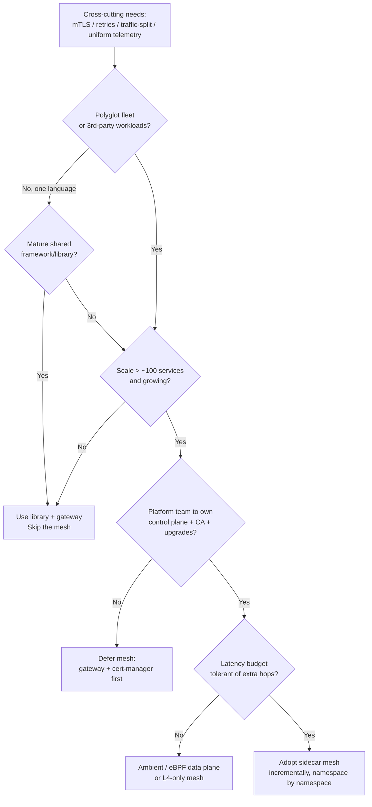
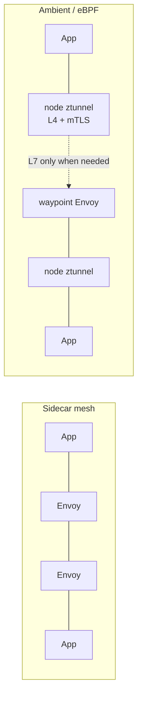

# Service Mesh — Senior

<!-- level-focus -->
At senior level, focus on this question:

> Which system invariant is affected by **Service Mesh** under failure, load, and change?

Use the smallest realistic scenario that exposes the decision and its failure behavior.
## 1. What a mesh actually buys you

A mesh moves cross-cutting L7 concerns out of application code and into a uniform, language-agnostic proxy layer. The capabilities cluster into three buckets:

- **Connectivity** — mutual TLS between every workload, retries, timeouts, circuit breaking, outlier ejection, locality-aware and weighted load balancing, traffic splitting for canaries and blue/green.
- **Security** — identity per workload (SPIFFE-style), automatic cert issuance and rotation, and authorization policy (who may call whom) enforced at the proxy rather than trusted in code.
- **Observability** — golden signals (latency, error rate, request volume) and distributed-trace propagation emitted uniformly for *every* service, including the ones nobody instrumented.

The value proposition is *uniformity across a polyglot fleet*. If you have one language and a good shared library, most of this can live in that library. The mesh earns its keep precisely when you *cannot* mandate one library everywhere — many languages, teams moving at different speeds, or third-party workloads you don't own.

---

## 2. When a mesh is worth it — and when it is not

Treat the mesh as a cost you must justify, not a default.

**Costs you are signing up for:**

- **Latency** — every hop now traverses two extra proxies (caller sidecar out, callee sidecar in). Expect single-digit-millisecond added tail latency per hop in a healthy sidecar mesh; more under CPU pressure. For deep call chains this compounds.
- **Resource overhead** — a sidecar per pod means N proxies for N pods. Each carries a CPU and memory floor (tens to low-hundreds of MB, plus CPU proportional to throughput). At thousands of pods this is a material fraction of cluster spend.
- **Operational complexity** — you now run a control plane, a certificate authority, an xDS config-distribution pipeline, and a proxy fleet that is in the hot path. This is a full platform surface with its own on-call.
- **Cognitive load** — engineers debugging a 503 must now reason about whether it came from the app, the local proxy, the remote proxy, or a policy.

**Worth it when:** polyglot fleet at real scale (hundreds+ of services), a hard mTLS/zero-trust mandate, you need consistent traffic-shifting and observability without touching app code, and you have a platform team that can own it.

**Not worth it when:** a handful of services, a single language with a mature framework, a team with no capacity to run a control plane, or latency budgets so tight that extra hops are unacceptable. In these cases a shared library, a smart ingress/gateway, plus mTLS via cert-manager often covers 80% of the need at 20% of the cost.

---

## 3. The decision: do you need a mesh?

The two gates that most often kill a mesh proposal are the *ownership* gate (nobody to run it) and the *scale* gate (too few services to amortize the cost). Do not skip them because the technology is fashionable.

---

## 4. Data-plane architectures: sidecar vs ambient vs library

The data plane is where the real architectural fork lives.

**Sidecar mesh (classic Istio + Envoy, Linkerd with its micro-proxy).** One proxy container injected next to every application container, sharing the pod's network namespace. Full L7 features per workload; strong isolation (a proxy crash affects one pod); but N proxies means N times the resource floor and N processes to upgrade.

**Ambient / sidecar-less mesh.** Splits the data plane into two layers: a per-node L4 component (in Istio ambient, the *ztunnel*) that handles mTLS and TCP routing for all pods on the node, and an optional per-namespace L7 proxy (a *waypoint*) that you deploy only where you actually need L7 policy, retries, or traffic splitting. This removes the per-pod proxy tax: workloads that need only encrypted transport pay for a shared node agent, and only the subset needing L7 pays for an Envoy. Trade-off: the per-node component is now a shared fate boundary for every pod on that node, and the operational model is newer.

**eBPF-assisted data planes.** Meshes such as Cilium push L3/L4 policy, identity, and load balancing into the kernel via eBPF, avoiding user-space proxy hops for those layers; L7 still typically needs a proxy (often a shared per-node Envoy). This can cut latency and CPU for the L4 path substantially, at the cost of tying you to kernel/eBPF capabilities and a different debugging surface.

**Library / gRPC-native (e.g. proxyless gRPC via xDS).** The application links a library that speaks the mesh control plane's config protocol directly — no proxy at all. Lowest latency and overhead, but you are back to per-language coverage, so it only works cleanly in a monoglot or gRPC-heavy world.

---

## 5. Architecture comparison table

| Dimension | Sidecar mesh (Istio/Envoy, Linkerd) | Ambient / sidecar-less | eBPF-assisted (Cilium) | Library / proxyless | API gateway only |
|---|---|---|---|---|---|
| Proxies per workload | 1 per pod | 0 (shared node L4 + optional per-ns L7) | 0 for L4, shared node proxy for L7 | 0 | 1 shared at edge |
| Per-hop latency cost | Highest (2 user-space hops) | Low for L4; L7 only where deployed | Lowest for L4 path | Lowest | N/A (edge only) |
| Resource overhead | Scales with pod count | Scales with node count | Low, kernel-side | Minimal | Minimal |
| Language coverage | Any (transparent) | Any (transparent) | Any for L4 | Per-language only | Any at edge |
| L7 features per service | Full, everywhere | Full, only where waypoint deployed | L4 rich, L7 via proxy | Full, in-process | Only north-south |
| Blast radius of a data-plane fault | 1 pod | All pods on a node | All pods on a node | 1 process | All ingress traffic |
| East-west (service-to-service) | Yes | Yes | Yes | No |
| Operational maturity | Highest | Newer | Growing | Niche | Very mature |
| Best fit | Large polyglot fleet needing L7 everywhere | Large fleet, mostly L4 + selective L7 | Latency/CPU-sensitive, kernel control | Monoglot / gRPC shop | Small fleet, north-south only |

The honest reading: a sidecar mesh is the most capable and most expensive; ambient/eBPF trades some maturity for a much lower tax; a gateway alone handles only north-south traffic and is not a mesh substitute for east-west concerns.

---

## 6. Build vs adopt

Building a bespoke mesh — writing your own control plane, or heavily forking a proxy — is almost never justified. Envoy, Istio, and Linkerd represent enormous, battle-tested investment in the exact hard parts (xDS config distribution, cert rotation, connection management). A rational build-vs-adopt stance:

- **Adopt an off-the-shelf mesh** as the default. Choose **Linkerd** when you want the simplest operationally-sound sidecar mesh with a purpose-built lightweight proxy and low ceremony; choose **Istio** when you need the full L7 policy surface, ambient mode, and multi-cluster reach and can staff its complexity; choose an **eBPF-native** option when L4 performance and kernel-level policy dominate.
- **Build thin adapters, not a mesh.** The legitimate "build" is integration glue: policy-as-code around the mesh, CI checks for config, golden dashboards, and paved-road defaults so app teams never hand-write raw proxy config.
- **Reserve real building** for the rare case where an existing platform investment (a custom control plane already running xDS) makes extending cheaper than adopting — and even then, extend Envoy rather than replace it.

The buy decision is really an *ownership* decision: adopting a mesh means committing a team to track upstream releases, run the CA, and be paged when the control plane misbehaves.

---

## 7. Failure modes and blast radius

A mesh introduces failure surfaces that did not exist before. Design for each explicitly.

- **Control-plane outage.** A well-designed mesh degrades to *static* rather than *down*: sidecars keep serving the last-known-good config from cache, so existing traffic survives a control-plane restart. What you lose is *convergence* — new pods can't get config, certs can't rotate, and policy changes don't propagate. The hard failure is a control-plane outage that outlasts your certificate TTL, at which point mTLS handshakes start failing fleet-wide. Mitigation: run the control plane HA, generous cert lifetimes with early rotation, and alert on config staleness, not just on control-plane liveness.
- **Sidecar as a per-pod SPOF.** The proxy is now in the critical path of a pod it shares fate with. If the sidecar OOMs or crashes, that pod's traffic stops even though the app is healthy. Startup ordering matters: the app can start before the proxy is ready and see connection failures (why proxies expose readiness gating and hold-application-start hooks). Size sidecar resources deliberately and monitor proxy health as a first-class signal.
- **Config blast radius.** The mesh's strength — one config change affecting the whole fleet — is also its worst failure mode. A bad `DestinationRule`, an over-broad authorization policy, or a mistaken mTLS `STRICT` flip can take down every service at once. This is a *human* failure surface. Contain it with policy-as-code review, staged rollout (namespace by namespace), dry-run/analysis before apply, and a fast, rehearsed rollback.
- **Shared-node fate (ambient/eBPF).** Moving the proxy per-node concentrates blast radius: a ztunnel or node-agent fault affects every pod on that node, not one. You trade N small blast radii for fewer, larger ones — acceptable, but plan node-level redundancy and PodDisruptionBudgets accordingly.
- **Version skew.** Data-plane and control-plane versions must stay within a supported window; a botched proxy-upgrade rollout is its own outage class. Canary the data-plane upgrade, never big-bang it.

---

## 8. Incremental adoption and migration

Never flip a mesh on across a live fleet. Adopt it as a migration with reversible steps.

1. **Start at the edge of the mesh's value.** Pick one non-critical namespace. Enable the mesh in **permissive/observe mode** — sidecars injected, mTLS accepted but not required, no enforcement. You get telemetry immediately and break nothing.
2. **Expand namespace by namespace.** Add sidecar injection per namespace, watching latency and error budgets at each step. Keep the option to remove injection and roll back.
3. **Tighten mTLS gradually.** Move from `PERMISSIVE` (accept both plaintext and mTLS) to `STRICT` only once every caller in the trust boundary is meshed — otherwise you sever unmeshed callers. This is the single most common self-inflicted outage in mesh adoption.
4. **Introduce policy last.** Turn on authorization policies and retries/timeouts after connectivity and identity are stable, again per-namespace, in dry-run first.
5. **Handle the un-meshable.** Legacy VMs, managed databases, and third-party endpoints won't have sidecars. Model them as external services / mesh-external entries and keep them on `PERMISSIVE` boundaries so the mesh doesn't try to mTLS something that can't speak it.

The guiding principle: every step must be independently observable and independently reversible, and the trust-boundary tightening (`STRICT` mTLS) must lag the sidecar rollout, never lead it.

---

## 9. Interaction with API gateways and existing infra

A mesh and an API gateway solve *different* problems and should coexist, not compete.

- **Gateway = north-south (edge).** It terminates external TLS, does authN/authZ for outside callers, rate-limits, handles WAF concerns, and routes public traffic into the cluster. It is the trust boundary between the internet and your services.
- **Mesh = east-west (internal).** It secures and observes service-to-service calls *inside* the trust zone.

The clean pattern is a gateway at the edge that is *itself meshed* — external traffic hits the gateway (often an Envoy-based ingress the mesh already understands), which then forwards into the mesh where mTLS and policy take over. Avoid duplicating retries/timeouts in both layers with conflicting settings; decide where each concern lives (typically edge policy at the gateway, service-to-service resilience in the mesh) and enforce that split.

Also reconcile with what you already run: an existing L4/L7 load balancer, `cert-manager` issuing certs, an ingress controller, and your service-discovery/DNS. A mesh subsumes some of these (internal LB, service-to-service cert issuance) and must be layered carefully behind others (the cloud LB still fronts the gateway). Map every existing responsibility to "keep / replace / coexist" *before* rollout — surprise overlaps are where the outages hide.

---

## 10. Ownership and the senior checklist

Owning a mesh means owning a critical-path distributed system. Before you commit:

- **Justify it.** Write down the specific capability the mesh provides that a library + gateway cannot, at your scale. If you can't, don't adopt.
- **Name the owner.** A platform team that tracks releases, runs the CA, owns the SLO for the control plane, and is on-call for it. No owner, no mesh.
- **Budget the tax.** Model the latency per hop and the sidecar resource cost against real pod counts; feed it into capacity planning, not as an afterthought.
- **Pick the data plane deliberately.** Sidecar for maximum L7 coverage and maturity; ambient/eBPF when the per-pod tax or latency is the binding constraint and you can accept newer tooling and node-level blast radius.
- **Design for the control plane being gone.** Confirm data-plane degrades to last-known-good; alert on config staleness and cert expiry, not just liveness.
- **Contain config blast radius.** Policy-as-code, staged/dry-run rollout, rehearsed rollback, and `STRICT` mTLS only after full sidecar coverage.
- **Adopt incrementally and reversibly.** Namespace by namespace, permissive before strict, telemetry before enforcement.

The senior signal is treating the mesh as a *liability to be justified and contained*, not a feature to be enabled — and being able to articulate, for your specific fleet, exactly which failure modes you are accepting in exchange for which uniformity gains.

*Next step:* [Service Mesh — Professional](professional.md)

---

## Apply it

1. State the system invariant that **Service Mesh** must protect.
2. Mark ownership, state, and failure propagation at each boundary.
3. Compare two designs under load, dependency failure, and future change.
4. Define recovery and compatibility behavior before implementation.
5. Test the riskiest assumption with a focused experiment.

## Verify your work

- The experiment supports the design with evidence, not preference.
- Failure injection shows the blast radius and recovery path.
- Compatibility checks cover old and new callers or data.
- Operational signals reveal invariant violations and recovery progress.

## Review questions

- Which invariant must remain true when Service Mesh fails?
- Where should recovery responsibility live, and why?
- Which assumption deserves an experiment before implementation?
- How can the design evolve without changing every consumer at once?
