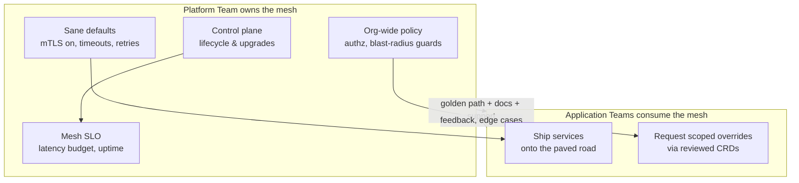
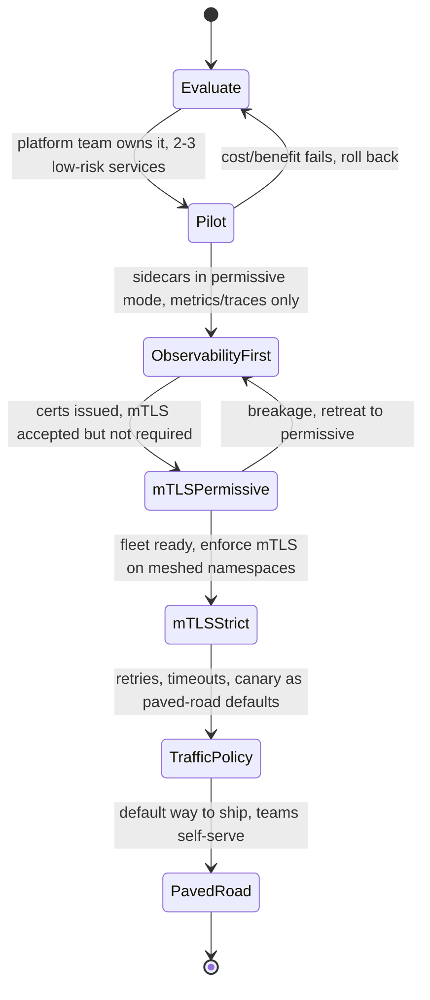

# Service Mesh — Staff

At the staff level, a service mesh stops being a technology decision and becomes an **organizational** one. The question is no longer "can Envoy do mTLS?" (it can) but "should our company run a mesh at all, who owns it, what does it cost us for the next five years, and what does it buy leadership that nothing cheaper does?" A mesh is a platform product with a permanent operational tax. Adopting one is easy; *un*-adopting one after 300 services depend on its mTLS and traffic policy is a multi-quarter migration. Your job is to make the bet deliberately, size the ownership cost honestly, and frame the trade-off to leadership in terms they can act on.

## Table of Contents

1. [What a mesh actually sells at org scale](#1-what-a-mesh-actually-sells-at-org-scale)
2. [The platform team owns the mesh as a product](#2-the-platform-team-owns-the-mesh-as-a-product)
3. [The paved-road argument](#3-the-paved-road-argument)
4. [Total cost of ownership](#4-total-cost-of-ownership)
5. [When a mesh is org-premature](#5-when-a-mesh-is-org-premature)
6. [Adoption maturity: the staged rollout](#6-adoption-maturity-the-staged-rollout)
7. [Buy vs build vs managed](#7-buy-vs-build-vs-managed)
8. [mTLS / zero-trust as a compliance lever](#8-mtls--zero-trust-as-a-compliance-lever)
9. [Governance and blast-radius policy](#9-governance-and-blast-radius-policy)
10. [Framing the trade-off to leadership](#10-framing-the-trade-off-to-leadership)
11. [Staff takeaways](#11-staff-takeaways)

---

## 1. What a mesh actually sells at org scale

A mesh solves three cross-cutting problems *uniformly*, across every service, in every language, without touching application code:

- **Security** — mutual TLS between every pod, workload identity (SPIFFE), authorization policy expressed centrally rather than re-implemented per service.
- **Observability** — golden signals (latency, traffic, errors, saturation) and distributed traces emitted from the sidecar, so a Python service and a Rust service report the same metrics the same way.
- **Traffic control** — retries, timeouts, circuit breaking, canary/weighted routing, fault injection — configured declaratively, changed without a redeploy.

The staff insight: **none of these are new capabilities.** A disciplined team can already do mTLS with a cert library, tracing with an SDK, and retries with a resilience library. What the mesh sells is *uniformity at fleet scale* — the guarantee that the 300th service, written by a team that joined last month, behaves like the first. You are buying **consistency and centralized control**, and paying for it with **operational surface**. That framing is the whole decision.

## 2. The platform team owns the mesh as a product

A mesh with no owner is a liability with a countdown timer. The control plane needs upgrades, the sidecars need version pinning, the CRDs need governance, and someone gets paged when mesh-injected latency spikes at 3 a.m. If that "someone" is every product team, you have distributed the cost without distributing the expertise — the worst outcome.

The correct model: a **platform team owns the mesh as an internal product**, with product-owner responsibilities.

Product-owner responsibilities that distinguish a real owner from a Kubernetes cluster with Istio installed:

- **An SLO on the mesh itself** — added p99 latency budget (single-digit ms), control-plane availability, config-propagation time. Publish it; be held to it.
- **A support model** — office hours, a channel, an on-call rotation. Teams must have someone to escalate to when the sidecar is the suspect.
- **A deprecation and upgrade policy** — you own the treadmill (see §4), teams should not feel it more than once or twice a year.
- **Adoption metrics** — percentage of services meshed, percentage on mTLS-strict, number of teams self-serving vs. hand-held.

If no team can credibly sign up for this, the org is not ready to run a mesh — full stop. That is often the single most important finding you will deliver.

## 3. The paved-road argument

The strategic value of a mesh is realized only when it becomes the **paved road** (golden path): the easiest, most-supported, default way to ship a service. On the paved road a team gets mTLS, tracing, metrics, retries, and canary routing *for free*, by doing nothing except deploying onto the platform.

The economics:

- **Without a paved road**, every team re-solves cross-cutting concerns. N teams pay the cost N times, inconsistently, and the security posture is only as strong as the weakest team's cert handling.
- **With a paved road**, the platform team pays the cost once. The marginal service inherits security and observability at near-zero effort. This is the *only* argument that justifies the mesh's fixed cost — it must amortize across enough services.

The paved road must remain **optional but overwhelmingly attractive**, not mandatory-by-force. Mandating a mesh onto teams that see no benefit breeds circumvention (annotations to disable injection, out-of-mesh "temporary" services that become permanent). You win adoption by making the road smoother than the ditch, not by fencing the ditch.

## 4. Total cost of ownership

The demo is free. The five-year bill is not. Name every line item explicitly when you socialize the decision.

| Cost category | What it actually means | Who feels it |
|---|---|---|
| **Upgrade treadmill** | Control plane + sidecar proxies must be upgraded on the vendor's cadence (Istio ships frequently; skipping versions is unsupported). Sidecar upgrades touch every pod. | Platform team, continuously |
| **On-call surface** | The sidecar is now on the critical path of *every* request. New failure mode ("is it the app or the proxy?") and a new class of pages. | Platform on-call + confused app teams |
| **Resource overhead** | Each pod carries a proxy: CPU, memory, and per-hop latency. At thousands of pods this is a real cloud-bill line item. | Finance / capacity |
| **Cognitive load** | New CRDs, new concepts (VirtualService, DestinationRule, PeerAuthentication…), new debugging skills for every engineer near the platform. | The whole org |
| **Config blast radius** | One bad policy push can degrade the entire fleet at once (see §9). Centralized control centralizes risk. | Everyone, occasionally catastrophically |
| **Expertise concentration** | Deep mesh knowledge is rare and hard to hire; bus-factor risk on the platform team. | Org resilience |

The staff move is to **quantify** these where possible (proxy CPU/mem × pod count × cloud rate; estimated FTEs to run the treadmill) rather than wave at "operational overhead." Leadership funds numbers, not adjectives.

## 5. When a mesh is org-premature

A mesh is premature — technically feasible but organizationally wrong — when any of these hold:

- **Too few services.** Below roughly 10–20 services, the fixed cost dwarfs the amortized benefit. A shared resilience library, an API gateway, and platform-issued certs deliver 80% of the value at a fraction of the cost.
- **No platform team.** If no one can own the control plane, upgrades, and on-call, the mesh will rot into an un-upgraded, un-owned liability. This is the disqualifier that overrides all others.
- **The pain is elsewhere.** If your incidents are database contention, deploy flakiness, or unclear ownership, a mesh solves none of them and adds a new thing to break. Solve the actual top-of-funnel pain first.
- **Monolith or few-language shop.** A mostly-monolith or single-language estate can get uniform mTLS/observability from a shared library far more cheaply. The mesh's language-agnostic superpower is wasted.
- **No compliance forcing function.** Absent a real mandate for fleet-wide encryption/zero-trust (§8), the security argument is "nice to have," which rarely funds a permanent team.

Signals table for the go/no-go conversation:

| Adopt now | Defer / choose a cheaper alternative |
|---|---|
| 50+ services across multiple languages | <20 services, one or two languages |
| A funded platform team ready to own it | Cross-cutting concerns owned by nobody |
| Compliance mandate for fleet-wide mTLS/zero-trust | Security is "we should probably" |
| Frequent need for canary / traffic-shifting / fault injection | Deploys are rare; routing is static |
| Observability gaps that per-team SDKs can't close consistently | Observability already solved by one shared library |
| Leadership accepts a standing operational tax | No appetite for ongoing platform spend |

## 6. Adoption maturity: the staged rollout

Never big-bang a mesh across the fleet. Adoption is a staged program with reversible checkpoints; each stage earns the right to the next.

Two staged-rollout disciplines worth calling out:

- **Observability before enforcement.** Turn the sidecars on in a mode that *reports* before one that *blocks*. mTLS in permissive mode reveals which callers are not yet mesh-ready without breaking them; only flip to strict once the graph is clean. Skipping this stage is the classic self-inflicted fleet-wide outage.
- **Each arrow is reversible.** Every stage must have a documented rollback. Centralized control means a bad flip is fleet-wide; the ability to retreat one stage is your safety net.

## 7. Buy vs build vs managed

Three viable postures, chosen by team maturity and appetite, not by fashion.

| Option | What it is | Choose when |
|---|---|---|
| **Managed** | Cloud-provider or vendor-run mesh; control plane operated for you | You want the paved-road benefits but not the treadmill; you trust the provider's upgrade cadence and can live with its opinionations and lock-in |
| **Buy / self-host open source** | Run Istio, Linkerd, or similar yourself | You have a platform team that can own upgrades and on-call, and you need control the managed offering won't give |
| **Build** | In-house proxy/control-plane, or a lighter alternative (shared resilience library + gateway) | Almost never build a full mesh — it is a decade-long product commitment. "Build" here usually means the *deliberately-less* alternative, not a bespoke mesh |

Framing for the decision:

- **Linkerd vs Istio** is itself an org-cost decision, not just a feature comparison. Linkerd is simpler with a purpose-built lightweight proxy and a lower operational and cognitive tax; Istio (on Envoy) is more powerful and extensible with a correspondingly heavier operational surface. **Choose the least mesh that meets your requirements** — simplicity is a feature that pays every day for years.
- **Managed offloads the treadmill but adds lock-in.** You trade one cost for another; be explicit about which cost your org tolerates better.
- **"Build" is almost always a trap.** A hand-rolled mesh is a distributed-systems product your company is not in the business of shipping. If the requirements are modest, the honest "build" answer is *don't build a mesh* — use a library and a gateway.

## 8. mTLS / zero-trust as a compliance lever

The most durable business case for a mesh is not developer convenience — it is **fleet-wide, automatic, mutually-authenticated encryption in transit**, delivered without asking every team to implement it. This is exactly what auditors, regulated frameworks, and zero-trust architectures demand: encryption everywhere, workload identity everywhere, no team's forgetfulness able to open a hole.

Why this is the strongest staff argument:

- **It is a forcing function leadership already believes in.** Compliance mandates come with budget and executive sponsorship that "better observability" never gets. A mesh turns a costly, error-prone per-team obligation into an infrastructure default.
- **It converts a distributed risk into a centralized guarantee.** Instead of auditing 300 services' cert handling, you audit one control plane's policy. mTLS-strict on a namespace is a single, provable, enforceable statement.
- **It anchors the paved road.** "Ship onto the platform and you are compliant by default" is the sentence that makes the golden path mandatory-by-desire rather than mandatory-by-decree.

If your org has a real zero-trust or encryption-in-transit mandate, lead the leadership conversation with this. It is the line item that funds the whole platform.

## 9. Governance and blast-radius policy

Centralized control is the mesh's superpower and its most dangerous property. One policy push can improve *or* degrade every service simultaneously. Governance is not bureaucracy here — it is the guardrail on a fleet-wide lever.

Non-negotiable governance controls:

- **Config as code, reviewed and staged.** Mesh policy (routing, authz, mTLS mode) lives in version control, goes through review, and rolls out progressively (canary the *config*, not just the code) — never hand-applied to prod.
- **Scoped ownership of CRDs.** Fleet-wide policy (default mTLS mode, org authz) is platform-owned. Service-scoped policy (a team's own timeouts, canary weights) is team-owned within reviewed guardrails. Draw this line explicitly or teams will fight over it during incidents.
- **Blast-radius limits.** Guard against a single change touching the whole fleet: default-deny where feasible, per-namespace rollout, and a validated **kill switch** to disable the mesh data-plane behavior (or fail-open) if the control plane misbehaves.
- **Rehearsed rollback.** Because a bad flip is fleet-wide, the platform team must have practiced reverting the control plane and re-pinning sidecars. Untested rollback is not rollback.

The staff framing: a mesh **centralizes both the reward and the risk.** Governance is what keeps the centralized risk from becoming a centralized outage.

## 10. Framing the trade-off to leadership

Leadership does not fund "service mesh." They fund outcomes and accept costs. Translate:

- **Lead with the forcing function.** If there is a compliance/zero-trust mandate (§8), that is the headline — the mesh is how you meet it cheaply and provably.
- **Name the standing cost honestly.** Present the mesh as a **permanent platform investment** with an FTE and cloud-overhead line item, not a one-time project. Quantify the treadmill and the proxy overhead. Leaders distrust proposals that hide the tail.
- **Frame it as buying uniformity, not capability.** "We can already do mTLS; we cannot do it *the same way everywhere* without paying per-team forever. The mesh pays that cost once." That is the amortization argument in one sentence.
- **Tie the go/no-go to service count and team ownership.** Make the premature-adoption signals (§5) explicit so the decision is evidence-based and revisitable, not a fashion purchase.
- **Offer the cheaper alternative on the table.** Presenting "library + gateway" alongside the mesh signals rigor and earns trust — and is genuinely the right answer below the adoption threshold.

The strongest staff position is often *"not yet, and here is exactly what has to be true before we do."*

## 11. Staff takeaways

- A mesh is bought for **fleet-scale uniformity of security, observability, and traffic control** — not for capabilities you couldn't otherwise obtain. That framing drives the whole decision.
- It requires a **platform team to own it as a product**, with an SLO, a support model, and the upgrade treadmill. No credible owner = do not adopt.
- The **paved-road / amortization argument** is the only thing that justifies the fixed cost: pay once, every marginal service inherits the benefits. It only works above a service-count threshold.
- **TCO is a permanent tax** — upgrade treadmill, on-call surface, resource overhead, cognitive load, config blast radius. Quantify it; leaders fund numbers.
- It is **org-premature** with too few services, no platform team, a monolith, or no compliance forcing function. The honest answer is often "not yet."
- Roll out in **reversible stages**: observability before enforcement, mTLS permissive before strict, then paved-road defaults.
- Prefer **managed or the simplest mesh** that meets requirements; almost never build one. "Least mesh" is a feature.
- **mTLS / zero-trust as a compliance lever** is the most durable business case — it comes with sponsorship and budget the convenience arguments never get.
- **Governance and blast-radius controls** are mandatory because the mesh centralizes both reward and risk; a rehearsed kill switch and staged config rollout are the guardrails.

*Next step:* [Service Mesh — Interview](interview.md)