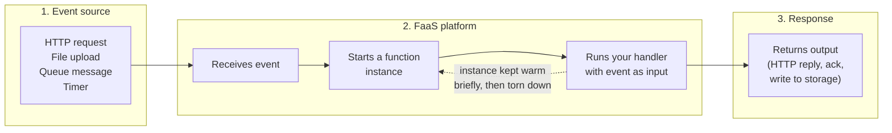
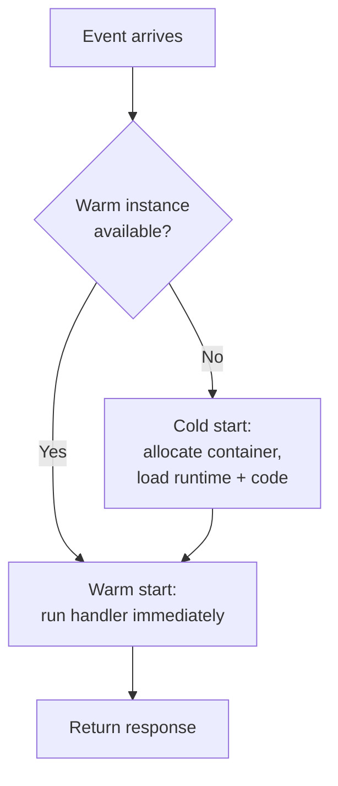

# Serverless / FaaS — Junior

<!-- level-focus -->
At junior level, focus on this question:

> How can I apply **Serverless / FaaS** in one small example and prove the result?

Use the smallest realistic scenario that exposes the decision and its failure behavior.
## 1. What "serverless" and "FaaS" actually mean

**Serverless** is a way of running code where the cloud provider owns and operates the servers, the operating system, patching, capacity planning, and scaling. You are responsible only for your application code and its configuration.

**Function-as-a-Service (FaaS)** is the most common form of serverless. You write a single, small function — a self-contained unit of code with an entry point (a "handler"). You deploy just that function. The provider runs a copy of it whenever something triggers it.

The three most widely used FaaS platforms are:

| Provider | Product | Docs |
|----------|---------|------|
| Amazon Web Services | AWS Lambda | aws.amazon.com/lambda |
| Google Cloud | Cloud Functions | cloud.google.com/functions |
| Microsoft Azure | Azure Functions | azure.microsoft.com |

The mental shift from traditional hosting: instead of renting a machine that is always on and waiting, you hand the provider a function and say "run this when X happens." Everything else — provisioning, starting, load balancing, shutting down — is the provider's job.

---

## 2. The event-driven execution model

A serverless function does not run continuously. It runs in response to an **event**. An event is any signal the platform is configured to watch for. Common event sources include:

- An **HTTP request** arriving at an API endpoint.
- A **file uploaded** to object storage (for example, a new image landing in a bucket).
- A **message** appearing in a queue.
- A **scheduled timer** (for example, run every night at 2 a.m.).
- A **database change** (a new row inserted).

When the event source fires, the platform *invokes* your function: it starts a copy of it, passes the event data as input, waits for the function to finish, and returns the result (or forwards it onward). This is the fundamental loop of FaaS: **event → invocation → response**.

Each stage is handled for you. You only write the code inside stage 2's handler; the platform wires up the trigger, spins the instance up, and delivers the response.

---

## 3. Auto-scaling and scaling to zero

Because the platform starts a fresh function copy per event, scaling is automatic. If one request arrives, one instance runs. If a thousand requests arrive at the same moment, the platform starts many instances in parallel — you did nothing to configure this.

Two consequences matter most for beginners:

- **Scale up on demand.** Traffic spikes are absorbed by the provider adding instances. You do not pre-provision servers "just in case."
- **Scale to zero.** When no events arrive, zero instances run. Nothing is idling in the background. This is unusual compared to a normal server, which stays powered on (and billable) even when nobody is using it.

Scaling to zero is the defining trait of serverless economics: an application with no traffic costs essentially nothing to keep deployed.

---

## 4. Pay-per-use billing

Traditional servers bill for *time the machine is on*, whether busy or not. Serverless bills for *work actually done*. You are typically charged on two axes:

- **Number of invocations** — how many times your function ran.
- **Execution duration × memory** — how long each run took, multiplied by the memory you allocated to it (measured in fine-grained units, often per millisecond).

If your function is invoked zero times this month, you pay (close to) zero. If it is invoked ten million times, you pay for exactly those ten million short runs and nothing more. This aligns cost directly with usage, which is attractive for workloads that are spiky or unpredictable.

---

## 5. Statelessness — why your function keeps no memory

A serverless function is **stateless**: you must not assume anything you store in memory or on local disk will survive to the next invocation.

The reason follows directly from the model. The platform may run your next event on a brand-new instance, on a different machine, or reuse an old instance that already handled other requests. You have no control over which. So any of these are unreliable:

- A counter kept in a global variable.
- A user's session held in local memory.
- A file written to the local filesystem.

Instead, **state lives outside the function** in a shared service — a database, a cache like Redis, or object storage. The function reads what it needs at the start, does its work, and writes results back before finishing. Treat every invocation as if it starts from a clean slate.

---

## 6. Cold starts, explained simply

When an event arrives and *no ready instance exists*, the platform must build one from scratch: allocate a container, load the runtime (for example, the Node.js or Python environment), load your code, and run any startup logic. Only then does your handler execute. This first-time setup delay is called a **cold start**.

Once an instance has started, the platform usually keeps it around for a short while. If another event arrives during that window, it reuses the already-running instance and skips the setup entirely — this is a **warm start**, and it is fast.

For a beginner, the key takeaways are:

- Cold starts add extra latency to the *first* request (often tens to hundreds of milliseconds, sometimes more).
- After that, follow-up requests are usually warm and fast.
- Cold starts happen again after the function has been idle long enough for the instance to be torn down, or when the platform scales up many new instances at once.

Cold starts are a normal, expected trade-off of scaling to zero — not a bug.

---

## 7. Traditional server vs serverless function

| Dimension | Traditional server | Serverless function (FaaS) |
|-----------|--------------------|----------------------------|
| Who manages the OS and hardware | You (or your ops team) | The cloud provider |
| Runs continuously | Yes — always on, waiting | No — runs only per event |
| Scaling | You add/remove machines and configure it | Automatic, per invocation |
| Idle cost | You pay while it sits idle | Scales to zero — near-zero idle cost |
| Billing basis | Time the machine is on | Number of invocations + duration × memory |
| State | Can live in local memory / disk | Must be external (DB, cache, storage) |
| Startup latency | Started once, stays up | Cold start possible on first/scaled invocation |
| Unit you deploy | A whole application / server | A single function with a handler |

Neither model is universally "better." Serverless shines for event-driven, spiky, or low-traffic workloads where you want zero operations overhead and pay-per-use cost. Traditional servers remain a better fit for steady, high-throughput, long-running, or latency-sensitive workloads — topics you will weigh more carefully in later tiers.

---

## Apply it

1. Choose one small, known input for **Serverless / FaaS**.
2. Predict the output or observable behavior.
3. Run the smallest example or probe that exercises the concept.
4. Change one input to trigger a failure or boundary case.
5. Explain the evidence using the guide's vocabulary.

## Verify your work

- Record the exact input, command or code path, and output.
- Repeat the probe and confirm the result is consistent.
- Show one expected success and one expected failure.
- Resolve any difference between the prediction and the evidence.

## Review questions

- What problem does Serverless / FaaS solve in the example?
- Which input changes the observed result, and why?
- What is the smallest useful success check?
- Which beginner mistake would your evidence catch?
