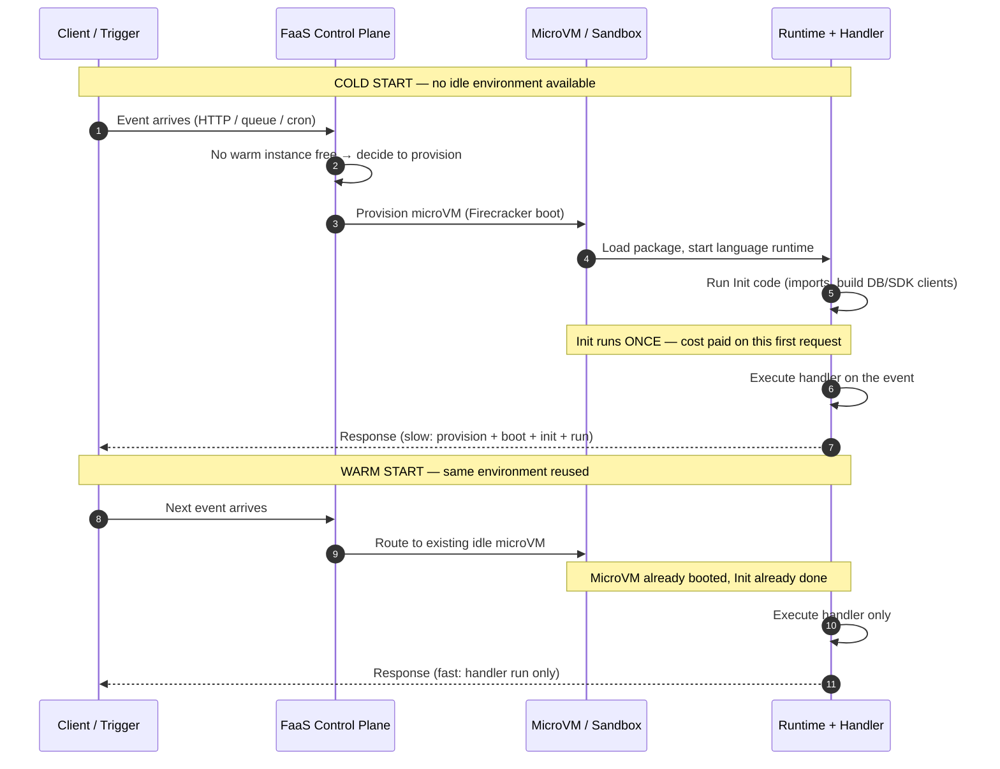

# Serverless / FaaS — Middle

<!-- level-focus -->
At middle level, focus on this question:

> Where does **Serverless / FaaS** belong in a maintainable component, and which trade-off selects the design?

Use the smallest realistic scenario that exposes the decision and its failure behavior.
## 1. The Execution Unit: What Actually Runs Your Code

Your function does not run "in the cloud" abstractly. It runs inside an **execution environment** — an isolated sandbox that the provider provisions on demand. The isolation primitive differs by provider:

- **AWS Lambda** uses **Firecracker microVMs**: lightweight virtual machines that boot in tens of milliseconds and give each function a hardware-virtualized boundary. Each microVM hosts your language runtime and your handler code.
- **Google Cloud Functions** and **Azure Functions** run on managed container-style sandboxes (gVisor / container isolation) with comparable properties.

Whatever the primitive, the model is the same: an environment is **created**, your code is **loaded and initialized once**, and then it is **kept alive** to serve subsequent requests until the provider decides to reclaim it. Understanding this create/reuse split is the key to everything else in this tier.

An environment has two logical phases in its life:

| Phase | Runs how often | What happens |
|-------|----------------|--------------|
| **Init** | Once, when the environment is created | Download/mount your package, boot the language runtime, run top-level/global code (imports, config load, client construction) |
| **Invoke** | Once per request | Run your handler function against the incoming event |

Code you place *outside* the handler runs during Init and its results survive across invocations on the same environment. Code *inside* the handler runs every time. This distinction is the single most important optimization lever in FaaS.

---

## 2. Invocation Lifecycle: Cold Start vs Warm Start

When a request arrives, the platform must route it to an execution environment. Two paths exist:

- **Cold start** — no idle environment is available, so one must be provisioned from scratch. This adds provisioning + runtime boot + Init latency to the request.
- **Warm start** — an already-initialized, idle environment exists and is reused. The request skips straight to the handler.

The diagram below stages both paths against each other.

The practical consequences:

| Aspect | Cold start | Warm start |
|--------|-----------|------------|
| Environment provisioning | Boot microVM/sandbox from scratch | Skipped — reuse existing |
| Runtime boot | Full language runtime startup | Skipped |
| Init code (globals) | Executed once, cost on this request | Skipped |
| Typical added latency | Tens of ms to a few seconds (language- and package-dependent) | Near zero |
| When it happens | First request, after scale-out, after idle reclaim, after deploy | Steady-state traffic to a live instance |
| Handler execution | Runs | Runs |

Cold starts are triggered by: the very first invocation, any invocation that needs a *new* instance because all existing ones are busy (scale-out), invocations after an idle instance has been reclaimed, and the first invocation after a new deployment (old environments are retired).

**Reuse is not guaranteed and not permanent.** The provider keeps an idle environment around for an unspecified window (commonly minutes) and reclaims it when it judges the capacity is no longer needed. You cannot rely on a specific instance surviving between two requests — only that reuse *often* happens under steady traffic.

---

## 3. The Concurrency Model: One Request per Instance

This is the rule that surprises engineers coming from thread-pooled servers: **a single FaaS execution environment processes exactly one request at a time.** There is no in-process request multiplexing. While your handler is running, that instance is busy and unavailable to any other request.

Consequences that follow directly from this rule:

- Your handler does **not** need to be thread-safe with respect to concurrent requests inside the same process — no two requests share the instance simultaneously.
- Global (Init-phase) objects such as a database client or SDK connection *are* safely shared across the sequential invocations that a warm instance serves — one after another, never in parallel.
- To serve **N simultaneous requests, the platform needs N live instances.** Concurrency is achieved horizontally, by having many single-request environments, not vertically inside one process.

So "concurrency" in FaaS means *number of instances running at once*, which is exactly the quantity the platform scales.

---

## 4. Scaling by Spinning Instances

Because each instance handles one request at a time, the platform scales the only way it can: by **spinning up more instances**.

The mechanism:

1. A request arrives. The platform looks for an idle warm instance.
2. If one exists → warm start, route to it.
3. If none is free (all busy) → **provision a new instance** (cold start) to handle this request.
4. As traffic falls, idle instances are eventually reclaimed.

Under a traffic spike, the platform provisions instances rapidly in parallel — the count tracks concurrent in-flight requests, not total request rate. If 500 requests are in flight at the same moment, you converge toward roughly 500 instances (subject to account/region concurrency limits). Each *newly created* instance pays a cold start; instances created during the spike stay warm to absorb the ongoing load.

This is why serverless scaling is described as **automatic and per-request**: you never configure a thread pool or an instance count. But it also explains the classic failure modes:

- **Cold-start amplification during spikes** — a sudden surge needs many new instances at once, and each one's first request is slow.
- **Concurrency limits** — accounts have a ceiling on simultaneous instances; beyond it, invocations are throttled or queued.
- **Downstream overload** — hundreds of instances can each open a database connection at once, exhausting connection pools that a fixed-size server never would have stressed.

---

## 5. Triggers and Event Sources

A function does nothing until an **event source** invokes it. The event source shapes the invocation semantics — synchronous vs asynchronous, retry behavior, batching, and the event payload structure.

| Trigger type | Example source | Invocation style | Notes |
|--------------|----------------|------------------|-------|
| **HTTP / API gateway** | API Gateway, HTTP endpoint | Synchronous | Caller waits for the response; request/response mapping; client-facing |
| **Queue** | SQS, Pub/Sub subscription, Storage Queue | Asynchronous, often batched | Messages pulled and passed as a batch; failed messages retried / sent to a dead-letter queue |
| **Event bus / pub-sub** | EventBridge, Event Grid, Pub/Sub topic | Asynchronous | Fan-out; one event can trigger many functions; at-least-once delivery |
| **Storage / stream event** | S3 object created, DynamoDB/Cloud stream change | Asynchronous | Reacts to data changes; stream sources deliver ordered batches per shard/partition |
| **Cron / schedule** | EventBridge Scheduler, Cloud Scheduler, timer trigger | Asynchronous | Time-driven; no external caller; ideal for periodic jobs |

Two properties matter at this tier:

- **Sync vs async changes retry semantics.** Synchronous (HTTP) invocations return errors to the caller, who decides what to do. Asynchronous invocations (queue, event bus, schedule) are retried by the platform on failure and typically deliver **at-least-once**, so your handler must be **idempotent** — processing the same event twice must not corrupt state.
- **Batching changes the handler contract.** Queue and stream triggers hand your function an *array* of records, not a single event. You loop over them, and partial-batch failure handling becomes your responsibility.

---

## 6. State Externalization: Why You Can't Keep State

Because instances are ephemeral — created, reused for a while, then reclaimed without notice — **you cannot store durable application state in the function process.** Any variable you mutate in memory, any file you write to local disk, vanishes when the instance is reclaimed, and is invisible to every *other* instance serving concurrent requests.

Therefore all state that must survive across requests lives in **external stores**:

- Databases (managed SQL, DynamoDB, Firestore, Cosmos DB)
- Object storage (S3, Cloud Storage, Blob Storage)
- Caches / key-value stores (Redis, Memcached)
- Message queues for in-flight work

What you *can* legitimately keep in memory is **caching within an instance's lifetime** — Init-phase objects like a database client, a parsed config, or a warmed connection. These are an optimization: a warm instance reuses them, a cold instance rebuilds them. They must be treated as a best-effort cache, never as a source of truth, because:

- Another concurrent instance has its own separate copy.
- The instance may be reclaimed at any time, discarding the cache.

The design rule: **functions are stateless; the system's state is external.** This is what makes horizontal scaling by spinning instances possible in the first place — any instance can serve any request because none of them own the truth.

---

## 7. Resource Coupling: Memory, CPU, and Timeouts

FaaS platforms expose a deliberately small set of configuration knobs, and they are coupled in ways worth understanding.

**Memory is the primary dial, and CPU is coupled to it.** You configure a memory size for the function; the platform allocates CPU (and network/IO bandwidth) *proportionally* to that memory. Doubling memory roughly doubles CPU. This means a CPU-bound function can sometimes run faster *and cheaper* at a higher memory setting: it finishes in less than half the time, and since you pay for `memory × duration`, the total can drop even though the per-millisecond rate went up. Memory is not just "how much RAM" — it is the throttle for the whole compute allocation.

**Timeout bounds the maximum handler duration.** Every function has a configurable maximum execution time (with a hard platform ceiling — on the order of minutes, e.g. 15 minutes on Lambda). If the handler exceeds it, the invocation is forcibly killed. Implications:

- FaaS is unsuitable for long-running or unbounded workloads; those belong in a container/worker service.
- Long jobs should be **decomposed** into shorter functions chained via queues or step/workflow orchestration.
- Downstream calls need their own client timeouts *shorter* than the function timeout, so a hung dependency fails fast instead of consuming your whole budget.

**Billing follows this coupling.** You are typically billed on `allocated-memory × execution-duration` plus a per-invocation fee. That is why both duration (fix cold starts, tune memory) and memory size directly move cost.

---

## 8. Packaging and Deployment Basics

To deploy a function you must give the platform three things: your **code**, its **dependencies**, and a **handler entry point** (the `file.function` the runtime calls per invocation), plus configuration (runtime version, memory, timeout, triggers, environment variables).

Two packaging formats dominate:

- **Archive (zip) package** — your code plus vendored dependencies bundled into an archive and uploaded (directly or via object storage for larger bundles). Simple; the platform supplies the base runtime.
- **Container image** — you build an image against the provider's runtime base image and push it to a registry. Gives you full control over OS-level dependencies and larger size limits; useful for heavy native dependencies.

Shared libraries can be factored out (e.g. Lambda **Layers**) so multiple functions reuse a common dependency bundle without re-uploading it each time.

Two packaging facts have direct performance consequences you should already connect to Section 2:

- **Package size affects cold start.** A larger deployment takes longer to load into a fresh environment, lengthening cold-start Init. Keep bundles lean.
- **Init code is your cold-start budget.** Everything at module scope (imports, client construction, config parsing) runs during Init on every cold start. Heavy top-level work you don't strictly need on every path is pure cold-start tax.

Deployments are typically driven by infrastructure-as-code / framework tooling (SAM, Serverless Framework, CDK, Terraform, provider CLIs) that packages the artifact, wires the triggers and IAM permissions, and publishes a new version. Publishing a new version retires old environments, so the next invocation is a cold start.

---

## 9. Mental Model Summary

Hold these mechanical facts together and the platform stops being magic:

- Your code runs in an **isolated environment** (microVM/sandbox) with a one-time **Init** phase and a per-request **Invoke** phase.
- The **first** request to a new environment is a **cold start** (provision + boot + Init); reused environments give fast **warm starts**.
- Each environment serves **one request at a time**, so the platform **scales by spinning up more environments** — concurrency equals instance count.
- **Triggers** define invocation semantics; async triggers retry and deliver at-least-once, demanding **idempotent** handlers.
- Instances are ephemeral, so **all durable state is externalized**; in-memory data is a best-effort per-instance cache only.
- **Memory sets CPU**, **timeouts bound duration**, and **billing = memory × duration**, so these three knobs are one intertwined system.
- **Packaging** (zip vs container, size, Init code) is where cold-start cost is won or lost.

The senior tier builds on this to reason about cold-start mitigation strategies (provisioned/pre-warmed concurrency, snapshot restore), connection management to protected downstreams, orchestration of long workflows, and when *not* to reach for FaaS at all.

*Next step:* [Serverless / FaaS — Senior](senior.md)

---

## Apply it

1. Find a real component where **Serverless / FaaS** affects an interface or dependency.
2. Write two plausible choices and the constraint that favors each one.
3. Make the smallest reversible change at that boundary.
4. Exercise the component alone, then exercise the integrated flow.
5. Keep the decision note with the evidence that selected the option.

## Verify your work

- A focused check proves the local behavior.
- An integrated check proves callers and dependencies still agree.
- Logs, traces, compiler output, or benchmarks expose the boundary.
- Reverting the change restores the previous behavior without unrelated edits.

## Review questions

- Which boundary is most affected by Serverless / FaaS?
- What constraint would make you choose the alternative design?
- How would you isolate a local defect from an integration defect?
- What evidence shows that the change remains maintainable?
