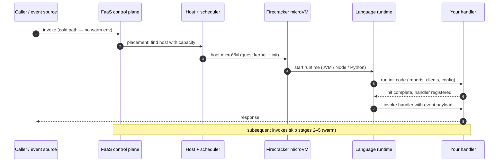

# Serverless / FaaS — Professional

<!-- level-focus -->
At professional level, focus on this question:

> How should teams adopt and operate **Serverless / FaaS** with measurable outcomes and limited coordination?

Use the smallest realistic scenario that exposes the decision and its failure behavior.
---

## 1. The isolation problem: what actually runs the function

A FaaS platform is a multi-tenant compute service. Code from thousands of unrelated
customers runs on the same fleet of physical hosts. The central engineering
constraint is therefore *isolation with density*: each tenant's code must be unable
to read another's memory, observe another's syscalls, or exhaust another's CPU,
while the platform still packs enough workloads per host to be economical and
starts new environments fast enough to hide behind request latency.

These three goals are in tension:

- **Containers** (namespaces + cgroups) start in tens of milliseconds and pack
  densely, but they share the host kernel. A kernel privilege-escalation bug is a
  cross-tenant breakout. Container isolation is *good enough* for code you trust;
  it is not a hard security boundary for arbitrary untrusted code.
- **Full virtual machines** (QEMU/KVM with a general-purpose guest) give a hardware
  virtualization boundary — a separate guest kernel, so a guest-kernel bug does not
  reach the host — but a traditional VM boots in seconds and carries a heavy memory
  footprint (device model, BIOS, full OS). You cannot start one per request.

The FaaS breakthrough was building an isolation primitive that has VM-grade security
with container-grade startup and density. That primitive is the **microVM**.

---

## 2. Firecracker microVMs and sub-second boot

**Firecracker** is the open-source virtual machine monitor (VMM) that AWS built to
back Lambda and Fargate. It runs each function environment inside a KVM guest — a
real hardware-virtualized boundary — but strips the VMM down to almost nothing.

What makes microVM boot fast enough to sit on the request path:

- **Minimal device model.** A Firecracker microVM exposes only a handful of
  paravirtualized devices (virtio-net, virtio-block, a serial console, a
  one-button keyboard controller for shutdown). There is no PCI bus enumeration,
  no BIOS, no legacy device probing — the slow, sequential parts of classic VM
  boot are simply absent.
- **Direct kernel boot.** Firecracker loads an uncompressed Linux kernel image and
  jumps to it, skipping the bootloader stage.
- **Trimmed guest.** A purpose-built minimal guest userspace boots to a running
  init in tens of milliseconds rather than seconds.
- **Small footprint.** The VMM itself adds only a few MB of memory overhead per
  microVM, which is what makes thousands-per-host density viable.
- **Defense in depth.** Firecracker further sandboxes the VMM process itself with a
  jailer (seccomp filters, cgroups, chroot, namespaces), so even a compromised VMM
  is contained on the host.

The result: a Firecracker microVM boots to a usable guest in roughly 100–150 ms,
which is small enough to amortize inside a cold-start budget. **Sub-second microVM
boot is the enabling mechanism of the entire per-request-isolation model** — without
it you would be forced to choose between reused (less isolated) containers or
seconds-long VM starts.

**gVisor** (used by Google Cloud) takes a different route to the same goal: instead
of a hardware VM, it runs a user-space kernel (the *Sentry*) that intercepts guest
syscalls and re-implements them, so the workload never touches the host kernel
directly. It trades some syscall-heavy performance for very fast startup and a
strong software isolation boundary.

---

## 3. Isolation technologies compared

| Property | Plain container (namespaces+cgroups) | gVisor (user-space kernel) | Firecracker microVM | Traditional VM (QEMU) |
|---|---|---|---|---|
| Isolation boundary | Shared host kernel | User-space kernel intercepts syscalls | Hardware virtualization (KVM) | Hardware virtualization (KVM) |
| Guest kernel | None (host kernel) | Sentry re-implements syscalls | Real, minimal guest kernel | Full guest kernel |
| Startup time | ~10–50 ms | ~100–150 ms | ~100–150 ms | seconds |
| Per-instance memory overhead | Very low | Low | Few MB | Tens–hundreds of MB |
| Syscall performance | Native | Reduced (interception cost) | Near-native | Near-native |
| Density per host | Very high | High | High | Low |
| Security for untrusted code | Weak (kernel is shared attack surface) | Strong | Strong | Strong |
| Representative user | trusted internal workloads | Google Cloud Functions / Cloud Run | AWS Lambda / Fargate | classic IaaS |

The takeaway: microVMs and gVisor both deliver a *hard* isolation boundary at
*container-like* startup, which is precisely the property FaaS needs. Plain
containers are faster and denser but are unsuitable as the sole boundary between
untrusted tenants; traditional VMs are secure but too slow and heavy to start
per request.

---

## 4. Cold-start anatomy, stage by stage

"Cold start" is not a single event. It is a pipeline of stages that only run when no
warm execution environment is available. Decomposing it is essential because
different stages are controlled by different parties (platform vs. you) and are
optimized by different techniques.



Breaking the latency down:

| Stage | What happens | Who controls it | Typical cost |
|---|---|---|---|
| 1. Placement | Control plane finds a host with capacity and pulls/mounts your code artifact | Platform | tens of ms |
| 2. microVM boot | Firecracker starts the guest kernel and reaches init | Platform | ~100–150 ms |
| 3. Runtime init | Language runtime process starts (JVM class loading, Node/Python interpreter) | Platform + language | 10 ms – 1 s+ |
| 4. Code init | Your top-of-file/module-scope code: imports, SDK client construction, config fetch, connection setup | **You** | 0 ms – multiple seconds |
| 5. Handler | Your actual per-request logic runs | You | request-dependent |

Two practical consequences:

- **Stages 1–3 are the platform's problem** and are the target of snapshot/restore
  (Section 9) and of choosing a lighter runtime. You cannot make microVM boot
  faster, but you can pick a runtime with cheap init.
- **Stage 4 is your problem and often the largest controllable cost.** A JVM
  function that constructs heavyweight clients and reflectively scans classpaths at
  module scope can spend seconds here. The engineering levers are: minimize
  dependencies, lazily construct clients, defer non-critical work out of the init
  path, and keep the deployment artifact small so stage 1 is cheap. Init code runs
  *once per environment*, not once per request — so work you can push into init
  (and reuse across warm invocations) is amortized, but work that bloats init
  inflates every cold start.

---

## 5. Execution-environment reuse and /tmp state caveats

After a cold start, the platform keeps the execution environment ("warm") and
routes subsequent invocations to it, skipping stages 2–5 of Section 4. This reuse
is the single most important performance property to reason about, and it has sharp
edges.

**What survives between invocations in the same environment:**

- Process memory: module-scope globals, initialized SDK clients, cached
  configuration, and open connections all persist. This is the correct place to
  memoize expensive setup — a database connection or a compiled regex constructed
  in init is reused across every warm invocation on that environment.
- The writable scratch directory (`/tmp`, 512 MB by default on Lambda, larger if
  configured) persists too. Files written by one invocation are visible to the
  next invocation *in the same environment*.

**Why this is a trap:**

- **`/tmp` is per-environment, not global.** Under concurrency the platform runs
  many environments in parallel. Anything you write to `/tmp` is visible only to
  the invocations that land on that particular instance. Treating `/tmp` as a cache
  gives you inconsistent hit rates; treating it as shared state gives you
  correctness bugs.
- **No cleanup guarantee.** A warm environment carries over whatever the previous
  invocation left in `/tmp` and in globals. A function that accumulates temp files
  without deleting them can exhaust `/tmp` after enough warm reuse and then fail
  with a disk-full error on an otherwise identical request. Always clean up what you
  write, or write to unique names and delete on exit.
- **Leaked mutable globals cause cross-request contamination.** If invocation *N*
  stashes request-specific data in a module global and invocation *N+1* reuses it
  without resetting, you leak one user's data into another user's response. Globals
  are for immutable/shared resources (clients, config), never for per-request state.
- **Reuse is not guaranteed and not durable.** The platform reaps idle
  environments, and you never control which environment serves a request. Never
  rely on `/tmp` or globals for persistence — they are a cache with an unknowable
  eviction policy, not storage.

Rule of thumb: **globals and `/tmp` are per-environment caches you may read and must
reset; durable and shared state belongs in an external store.**

---

## 6. Concurrency and scaling math

Serverless autoscaling is governed by a simple and exact relationship. The number
of concurrent execution environments a platform must hold to serve a workload is:

```
concurrency ≈ arrival_rate × average_duration
```

This is Little's Law applied to functions. If requests arrive at 500/s and each
invocation runs for 200 ms, then:

```
concurrency ≈ 500 req/s × 0.2 s = 100 concurrent environments
```

Every FaaS platform maps one environment to one in-flight invocation (Lambda's
model: a single environment serves exactly one request at a time; GCF is similar,
with an optional concurrency-per-instance setting on newer generations). So the
formula tells you directly how many environments — and therefore how many database
connections, how much memory, how much cost — a given load implies.

Two important corollaries fall out of this:

- **Duration multiplies your footprint.** Halving average duration halves required
  concurrency. A function that does slow synchronous I/O (e.g., waiting on a
  downstream API) holds an environment open the whole time, inflating concurrency
  and cost even though it does almost no CPU work. Reducing duration — parallelizing
  downstream calls, moving fan-out to async — directly reduces the concurrency you
  must provision and pay for.
- **Spikes in either factor scale linearly.** A traffic spike *or* a downstream
  slowdown that increases duration both raise concurrency. A downstream that gets
  slower under load is especially dangerous: rising duration raises concurrency,
  which raises load on the downstream, which raises duration further — a positive
  feedback loop that can blow past your concurrency limit.

Concurrency is the quantity every limit and every cost is denominated in — internalize
this formula and you can predict throttling, connection counts, and bills.

---

## 7. Burst limits and throttling

Platforms cap concurrency for two reasons: to protect their own fleet from a single
tenant, and to protect your downstream dependencies (and bill) from a runaway
function. Two distinct limits apply.

- **Steady-state concurrency limit.** A ceiling on total simultaneous environments
  per account/region (e.g., Lambda's account concurrency limit, adjustable via
  quota increase). When `arrival_rate × duration` exceeds this, excess invocations
  are **throttled**.
- **Burst / scale-up rate.** The platform will not instantiate unlimited new
  environments per second. There is a burst allowance plus a sustained scale-up
  rate. A sudden jump from 0 to 10,000 concurrent requests cannot all get an
  environment in the same instant; the platform grants an initial burst, then adds
  capacity at a bounded rate until it catches up (or hits the concurrency ceiling).

What throttling looks like depends on the invocation type:

- **Synchronous invokes** (API Gateway → Lambda) return an error (HTTP 429 /
  `TooManyRequestsException`) to the caller. The caller must retry with backoff.
- **Asynchronous invokes** and **poll-based event sources** (queues, streams) are
  retried by the platform, with events buffered and, on repeated failure, sent to a
  dead-letter destination.

Engineering implications:

- **Reserved concurrency** carves out a guaranteed slice for a critical function and
  simultaneously *caps* it — useful both to guarantee capacity and to protect a
  fragile downstream by refusing to scale past what it can handle.
- **Provisioned concurrency** pre-warms a pool of environments so they skip the cold
  path entirely, trading always-on cost for predictable latency on the pre-warmed
  slice. It addresses cold-start tail latency, not the concurrency ceiling.
- **Design for throttling as a normal event.** Under a spike, some fraction of
  synchronous requests *will* be throttled during the scale-up window. Callers need
  retry-with-backoff-and-jitter; queue-backed async patterns absorb bursts far more
  gracefully than synchronous ones.

---

## 8. The database-connection problem at scale

Serverless concurrency collides violently with traditional relational databases.
The mismatch is fundamental and is the classic production failure of FaaS
architectures.

**The connection storm.** A relational database (Postgres, MySQL) allocates a
non-trivial amount of memory and a backend process/thread per connection, and caps
total connections (Postgres `max_connections` is often a few hundred). Now recall
Section 6: under load the platform spins up hundreds or thousands of independent
execution environments. Each environment that opens its own connection contributes
one connection. A spike that drives concurrency to 2,000 environments will try to
open 2,000 connections against a database sized for 300 — and the database rejects
the excess, or thrashes on connection memory, or falls over entirely.

Why the usual fix (a connection pool) doesn't work here: a pool amortizes
connections *across requests within one process*. In FaaS each environment is its
own process, and each serves one request at a time, so an in-process pool of size N
per environment just multiplies the problem by N. There is no shared process to
pool within.

**Mitigations, in order of leverage:**

- **A managed connection proxy / pooler in front of the database.** RDS Proxy
  (AWS), or PgBouncer in transaction-pooling mode, sits between the functions and
  the database. Functions connect to the proxy (cheap, many allowed); the proxy
  multiplexes those onto a small, bounded set of real database connections and
  reuses them across function invocations. This is the standard, correct fix: it
  decouples "connections the functions want" from "connections the database can
  bear."
- **One connection per environment, memoized in init.** Construct the connection at
  module scope (Section 5) so a warm environment reuses a single connection across
  invocations rather than opening one per request. This bounds connections to
  *concurrency*, not to *request rate* — necessary but, at high concurrency, still
  not sufficient without a proxy.
- **Cap concurrency at the fragile resource.** Use reserved concurrency (Section 7)
  to hard-limit how many environments — and therefore connections — can exist,
  trading throttled requests for a database that stays up.
- **Prefer connection-light data stores at the edge of scale.** HTTP-based data
  APIs and serverless-native databases (which accept many stateless HTTP requests
  instead of long-lived TCP connections) sidestep the connection model entirely and
  are often a better structural fit for FaaS than a classic RDBMS.

The failure mode to recognize in an interview or a postmortem: *"latency and errors
spiked, and the database showed connection exhaustion — but the app servers looked
fine."* That is the connection storm, and the answer is a pooler/proxy plus
init-scoped connection reuse plus a concurrency cap.

---

## 9. Snapshot-restore acceleration and the uniqueness pitfall

Cold start's platform-controlled stages (2–4 in Section 4) can be collapsed with a
snapshot-and-restore trick, and Firecracker's design makes this practical.

**How snapshot restore works.** Instead of booting the microVM, starting the
runtime, and running your init code afresh on every cold start, the platform does
that expensive work *once*, then captures a **snapshot** of the entire microVM state
— guest memory pages, CPU registers, device state — after init has completed. On a
subsequent cold start it **restores** from that snapshot: it maps the saved memory
and resumes the already-initialized process. Firecracker exposes exactly this
pause/snapshot/resume capability, and AWS packages it for the JVM as **Lambda
SnapStart**, which snapshots the environment after your init code has run and
resumes from the snapshot on later starts. The heavy JVM class loading and your
init code are paid once and replayed as a memory restore, cutting cold-start
latency dramatically.

**The uniqueness / entropy pitfall.** A snapshot freezes program state at a single
moment — and then that exact frozen state is restored into *many* concurrent
environments. Anything that was supposed to be unique per environment is now
identical across all of them. The classic hazards:

- **Seeded pseudo-random generators.** A PRNG seeded during init (from the clock, or
  from a fixed default) is captured mid-stream. Every restored environment resumes
  with the identical PRNG state and produces the identical "random" sequence —
  catastrophic for security tokens, nonces, UUIDs used as secrets, or anything
  requiring unpredictability.
- **Cached "unique" identifiers.** A hostname, instance ID, or connection ID
  computed in init and cached is now shared by every restored copy.
- **Time and TTLs frozen at snapshot.** A timestamp or expiry captured at snapshot
  time is stale on restore; anything that assumed "now" was init-time is wrong.
- **Open network connections in the snapshot.** A TCP connection or DB session
  captured in the snapshot is invalid after restore (the peer knows nothing about
  the resumed copy) and cannot be shared across the many restored environments.

**The correct discipline:** treat restore as a distinct lifecycle event.
Re-seed cryptographic RNGs *after* restore (frameworks expose an afterRestore hook;
AWS documents SnapStart's uniqueness guidance explicitly — re-initialize anything
that must be unique or fresh in a post-restore hook rather than in init). Do not
cache anything that must be unique per environment across the snapshot boundary; do
not hold open connections across it — open them lazily post-restore or on first use.
Snapshotting is a strict win *only* when you have audited what must be regenerated
after the freeze.

---

## Apply it

1. Define the user or business outcome that **Serverless / FaaS** should improve.
2. Assign one owner for code, contracts, operations, and incidents.
3. Split delivery into reversible increments that produce evidence early.
4. Publish responsibilities, escalation paths, and compatibility windows.
5. Stop or expand only when the agreed measures support that decision.

## Verify your work

- Each increment has an owner, rollback path, and observable exit condition.
- Adoption, reliability, delivery time, and coordination cost are measured.
- Incident and migration exercises prove that responsibility is executable.
- The old path is removed only after telemetry proves it is unused.

## Review questions

- Which measurable outcome justifies investing in Serverless / FaaS?
- Which team owns the full lifecycle and incident response?
- What reversible increment produces the earliest useful evidence?
- Which exit condition proves that migration or adoption is complete?
