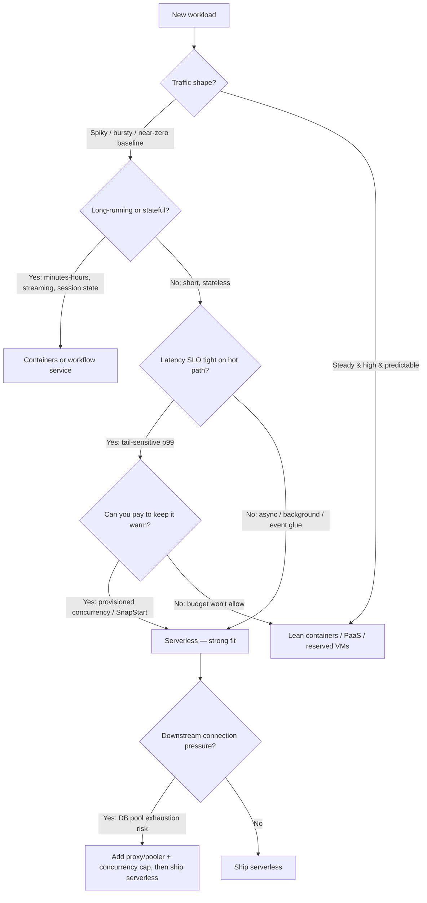

# Serverless / FaaS — Senior

<!-- level-focus -->
At senior level, focus on this question:

> Which system invariant is affected by **Serverless / FaaS** under failure, load, and change?

Use the smallest realistic scenario that exposes the decision and its failure behavior.
## 1. What "serverless" actually trades away

A FaaS platform (AWS Lambda, Google Cloud Functions, Azure Functions) gives you four properties that are genuinely hard to replicate yourself:

- **Scale-to-zero** — you pay nothing when no requests arrive.
- **Elastic burst** — the platform provisions thousands of concurrent execution environments in seconds without capacity planning.
- **Managed operations** — no OS patching, no autoscaler tuning, no instance health checks.
- **Event-native integration** — first-class triggers from queues, object stores, databases, HTTP gateways, and schedulers.

Every one of these is paid for elsewhere. The execution model is **stateless, short-lived, and single-request-per-instance**. That constraint is the root of almost every serverless pain point:

| Property you gain | Constraint it imposes |
|---|---|
| Scale-to-zero | Cold starts when scaling from zero (or up) |
| One request per instance | No in-process request batching; connection count ≈ concurrency |
| Ephemeral instances | No reliable in-memory cache, no long-lived local state |
| Managed runtime | You do not control the OS, kernel, or often the language version cadence |
| Per-ms billing | Steady high-throughput workloads can cost more than a reserved instance |
| Platform-owned triggers/events | Integration code is written against a specific vendor's API surface |

The senior mental model: **serverless converts a capacity-planning problem into a per-invocation cost problem and a latency-tail problem.** Whether that's a good trade depends entirely on the traffic shape.

---

## 2. When serverless fits — and when it hurts

### Strong fits

- **Spiky, unpredictable, or bursty load.** Traffic that swings from 0 to thousands of QPS and back. You pay only for the peaks you actually serve, and you never provision for a peak that may not come.
- **Event glue and integration plumbing.** S3-object-created → thumbnail, queue-message → enrichment, webhook → fan-out, "when a row lands, do X." These are short, stateless, independently triggered — exactly the execution model.
- **Low-ops / small-team leverage.** A team that cannot afford to run a Kubernetes platform gets production-grade autoscaling and HA for free.
- **Cron and scheduled jobs.** Nightly rollups, periodic cleanup. Always-on capacity for a job that runs 5 minutes a day is pure waste.
- **Cost-sensitive low-traffic services.** Internal tools, admin backends, early-stage products where most endpoints see near-zero traffic.

### Where it hurts

- **Steady, high, predictable throughput.** A service doing 5,000 QPS around the clock will almost always be cheaper on reserved containers/instances. Per-invocation pricing loses to amortized always-on pricing once utilization is high and constant. (See §4.)
- **Latency-sensitive request paths with tight tails.** If a p99 SLO is, say, 100 ms and a cold start adds hundreds of ms to seconds, cold starts blow the budget. Interactive, user-facing hot paths are risky unless you pay to keep instances warm.
- **Long-running or stateful work.** Platform execution-time caps (minutes, not hours) and forced statelessness make long jobs, streaming connections, and in-memory session state a poor fit. Reach for containers or a workflow/orchestration service instead.
- **Heavy downstream connection pressure.** Because each concurrent invocation is its own instance with its own connections, a spike to 3,000 concurrent functions can open 3,000 DB connections and exhaust the pool. (See §6.)
- **Chatty, high-fan-out internal call graphs.** If function A calls B calls C, you stack cold starts and pay per hop. This is where microservice-on-FaaS becomes a distributed-latency and distributed-billing problem.

### Decision flow

Read the diagram as a series of disqualifiers: serverless is the default answer for short, stateless, spiky, event-driven work, and each "yes" on the right-hand branches is a reason to reconsider or to add mitigation before committing.

---

## 3. The decision: FaaS vs containers vs PaaS vs VMs

These four sit on a spectrum from most-managed/least-control (FaaS) to least-managed/most-control (raw VMs). Containers-as-a-service (ECS/Fargate, Cloud Run, Container Apps) and PaaS (App Engine, Heroku-style) fill the middle and blur the lines — Cloud Run in particular is "serverless containers" and erases much of the FaaS-vs-container gap.

| Dimension | FaaS (Lambda/GCF/Azure Fn) | Containers (Cloud Run / Fargate / K8s) | PaaS (App Engine, etc.) | VMs (EC2/GCE) |
|---|---|---|---|---|
| Scaling unit | Single invocation | Container instance (N concurrent reqs each) | App instance | Whole machine |
| Scale-to-zero | Yes (native) | Some (Cloud Run yes; K8s needs KEDA) | Sometimes | No |
| Cold start | Yes, per new instance | Yes, but instance serves many reqs | Yes | N/A (always on) |
| Idle cost | Zero | Zero (if scale-to-zero) → else per-instance | Per-instance | Full always-on |
| Max exec time | Minutes (capped) | Effectively unbounded | Unbounded | Unbounded |
| Statefulness | Forced stateless | Stateless-preferred, can hold conns/cache | Stateless-preferred | Anything |
| Ops burden | Lowest | Medium (esp. self-managed K8s) | Low | Highest |
| Connection footprint | 1 pool per concurrent invocation | 1 pool per instance (shared across reqs) | Per instance | Per host |
| Cost at high steady load | Highest | Low-medium | Medium | Lowest (reserved) |
| Portability | Lowest (event/runtime coupling) | Highest (OCI image) | Low-medium | High |

Heuristics a senior should carry into the room:

- **Event-driven, spiky, short** → FaaS.
- **Steady HTTP service, moderate-to-high QPS, want portability** → containers (Cloud Run / Fargate; K8s if you already run it).
- **Want a managed runtime with less config than K8s and don't need scale-to-zero** → PaaS.
- **Specialized hardware, GPUs, custom kernels, licensing tied to a host, or bottom-dollar cost at high sustained utilization** → reserved VMs.

The strongest real-world answer is frequently **a mix**: FaaS for the spiky event glue and cron, containers for the steady request-serving core. Don't force one model across the whole system.

---

## 4. Cost model reasoning: per-invocation vs always-on

Serverless billing is roughly **(number of invocations) × (per-request fee) + (GB-seconds of memory-time consumed)**, plus data transfer. Always-on billing is **(instances) × (hourly rate) × (hours)** regardless of whether requests arrive.

The crossover is a utilization question. Work it as back-of-envelope, not gut feel:

- **Serverless cost scales with actual work done.** At 1% utilization you pay ~1% of a busy day. This is the whole point.
- **Always-on cost is fixed against provisioned capacity.** At 1% utilization you still pay 100% of the reservation — you're buying idle.
- **The break-even is the utilization at which the always-on box is busy enough to be cheaper per unit of work than the metered price.** Below it, serverless wins on cost; above it, the reserved instance wins.

Practical reasoning steps:

1. **Estimate steady-state utilization.** If a service is busy 80–100% of the time, price a reserved/committed instance and compare — always-on likely wins.
2. **Estimate the duty cycle.** A function that runs 200 ms per request at 10 req/day is essentially free on FaaS and absurdly wasteful as an always-on box.
3. **Right-size memory.** FaaS couples CPU to the memory setting, so more memory can mean the function finishes faster, and faster × per-ms billing sometimes lowers total cost. Benchmark it; don't assume the smallest memory is the cheapest.
4. **Count the hidden costs.** API Gateway per-request fees, data transfer, per-invocation cost of downstream calls, and provisioned concurrency (which reintroduces always-on charges — see §5). These can dominate at scale.
5. **Watch the fan-out multiplier.** A request that triggers a chain of functions is billed at every hop. High-fan-out call graphs erode the cost advantage quickly.

The senior framing: **serverless is cheapest when utilization is low or spiky; always-on is cheapest when utilization is high and constant.** When you turn on provisioned concurrency to fix cold starts, you are moving toward the always-on cost curve — so if you need a lot of it, that's a signal you may have wanted containers.

---

## 5. Cold starts and their mitigations

A cold start is the latency to create a fresh execution environment: download/unpack the deployment artifact, initialize the runtime, and run your init code (imports, SDK clients, connection setup) before the first request is served. Subsequent requests to a warm instance skip all of that. Cold starts hurt most on **latency-sensitive hot paths** and after **scale-from-zero or scale-up bursts**.

Mitigations, ordered from cheapest to most committing:

- **Trim the init path.** Lazy-load heavy dependencies, initialize only clients you need on the request path, and keep the deployment package small. Init code runs on every cold start — treat it as latency-critical.
- **Choose a lighter runtime.** Interpreted/JIT runtimes with large frameworks generally cold-start slower than compact ones (e.g., Go and lightweight Node bundles tend to start fast; heavy JVM/.NET stacks are slower unless mitigated). Runtime choice is a first-class latency lever.
- **Snapshot-based startup.** AWS Lambda **SnapStart** takes a snapshot of an initialized environment and restores from it, cutting the init tax for runtimes that pay a heavy startup cost (notably JVM). It's near-free relative to keeping instances warm.
- **Provisioned concurrency (Lambda) / minimum instances (GCF, Azure Functions premium).** Keep N environments pre-initialized and warm so requests hit no cold start. This works and is the standard fix for tail-sensitive paths — but it **reintroduces always-on cost**, so size it to your baseline concurrency and let on-demand absorb the peaks above it.
- **Architectural avoidance.** Move latency-sensitive work off the synchronous path entirely: answer the user from a warm container and use FaaS for the async follow-up, or push the hot path to a containers/PaaS tier and keep FaaS for background events.

Key judgment: don't reflexively buy provisioned concurrency. First measure whether cold starts actually breach your SLO, then apply the cheapest mitigation that closes the gap. If you find yourself provisioning enough warm capacity to cover most of your traffic, you've priced yourself back into an always-on model and should reconsider the platform choice (§3).

---

## 6. Connection pressure and downstream state

This is the failure mode that surprises teams migrating a database-backed service to FaaS. Because each concurrent invocation is an isolated instance, **connection count tracks concurrency**, not request rate over time. A burst to 2,000 concurrent functions can attempt 2,000 database connections. Traditional relational databases hold connections open with real memory per connection and fall over well before that.

Mitigations:

- **Put a connection pooler / proxy in front of the database** (e.g., a managed DB proxy or an external pooler) so thousands of function instances multiplex onto a small, bounded server-side pool.
- **Cap function concurrency** to protect the datastore, accepting throttling at the FaaS edge instead of connection exhaustion at the DB.
- **Prefer HTTP/stateless data APIs** or serverless-native datastores that scale connections horizontally, rather than a single relational primary.
- **Reuse clients across invocations.** Initialize SDK clients and connections in the module/init scope, not per handler, so warm instances reuse them. This reduces churn but does not solve the concurrency-fan-out ceiling.

The senior point: statelessness is not free — it externalizes all state and all connection management to downstream systems, and those systems must be sized for the platform's concurrency, not for your request rate.

---

## 7. Observability and debugging in a stateless fabric

FaaS is harder to observe than a long-lived process, and this is a real cost in the operations column:

- **No SSH, no long-lived process to attach to.** You cannot log into "the box." Debugging is done through logs, traces, and metrics after the fact.
- **Ephemeral, distributed execution.** A single logical request may span an API gateway, several functions, a queue, and a datastore. Without **distributed tracing** (correlation/trace IDs propagated across every hop) you cannot reconstruct what happened.
- **Cold-start noise in latency metrics.** Aggregate p99 mixes warm and cold invocations; you must be able to segment them, or you'll misdiagnose a cold-start tail as a general regression.
- **Async trigger failures are invisible without dead-letter handling.** Event-driven invocations that fail retry and then vanish. Configure dead-letter queues / failure destinations and alert on them, or you will silently lose events.
- **Local reproduction is weak.** The production environment (triggers, IAM, event shapes) is hard to fully emulate locally, lengthening the debug loop.

Non-negotiables for a senior-owned serverless system: structured logs with a correlation ID on every invocation, distributed tracing across the whole event chain, dead-letter queues on every async trigger with alerting, and dashboards that separate cold from warm latency.

---

## 8. Vendor lock-in and portability

Portability is the trade-off most often underweighted in the design review. The function *body* is usually portable; everything around it is not:

- **Trigger and event contracts** are vendor-specific (event JSON shapes, gateway integrations, IAM/permission models).
- **The managed ecosystem is the value and the lock-in.** The reason you chose Lambda is the seamless integration with that cloud's queues, object store, and identity — and that integration is exactly what you cannot lift and shift.
- **Runtime and packaging conventions differ** across Lambda, GCF, and Azure Functions.

Mitigation strategies (each with its own cost):

- **Hexagonal / ports-and-adapters structure.** Keep business logic in plain, framework-free modules; make the cloud handler a thin adapter. This makes the core portable and testable even if the wiring isn't.
- **Abstraction frameworks** (Serverless Framework, SAM, or a compatibility layer) reduce provider coupling — at the cost of a new dependency and lowest-common-denominator features.
- **Serverless containers (Cloud Run / Knative-style)** deliver much of the FaaS benefit while keeping an OCI image you can run anywhere — often the best portability/benefit balance if lock-in is a real concern.
- **Accept the lock-in deliberately.** For many teams the productivity gain outweighs a low probability of ever migrating clouds. Just make it a *decision*, documented with its exit cost, not an accident.

---

## 9. Senior checklist

- Characterize the **traffic shape** first (spiky vs steady, baseline vs peak) — it drives the entire FaaS-vs-always-on decision.
- Do the **cost crossover** as back-of-envelope math (utilization × metered price vs reserved price), including gateway fees, data transfer, fan-out, and provisioned concurrency.
- On latency-sensitive paths, **measure cold-start impact against the SLO** before buying warm capacity; apply the cheapest sufficient mitigation (trim init → lighter runtime → SnapStart → provisioned concurrency → move off the hot path).
- Size **downstream connections for peak concurrency**, not request rate; put a pooler/proxy in front of relational databases and cap concurrency.
- Build observability in from day one: **correlation IDs, distributed tracing, dead-letter queues with alerts, cold/warm latency separation.**
- Treat **lock-in as a documented decision** — isolate business logic behind adapters, and consider serverless containers when portability matters.
- Don't force one model system-wide: **mix FaaS (event glue, cron, spiky) with containers/PaaS (steady request core).**

---

*Next step:* [Serverless / FaaS — Professional](professional.md)

---

## Apply it

1. State the system invariant that **Serverless / FaaS** must protect.
2. Mark ownership, state, and failure propagation at each boundary.
3. Compare two designs under load, dependency failure, and future change.
4. Define recovery and compatibility behavior before implementation.
5. Test the riskiest assumption with a focused experiment.

## Verify your work

- The experiment supports the design with evidence, not preference.
- Failure injection shows the blast radius and recovery path.
- Compatibility checks cover old and new callers or data.
- Operational signals reveal invariant violations and recovery progress.

## Review questions

- Which invariant must remain true when Serverless / FaaS fails?
- Where should recovery responsibility live, and why?
- Which assumption deserves an experiment before implementation?
- How can the design evolve without changing every consumer at once?
