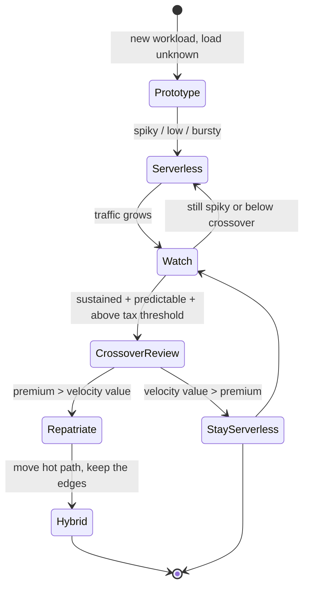

# Serverless / FaaS — Staff

At the staff level, serverless stops being a runtime choice and becomes an **organizational lever**. The question is not "can Lambda handle this workload" — of course it can — but "does buying our way out of undifferentiated operational toil, at a metered per-invocation price, make sense for *this team*, at *this scale*, given *this* rate of change." Serverless is fundamentally a trade: you pay a premium per unit of compute to delete an entire operational surface. Your job is to know when that trade is winning and when it has quietly inverted.

This document is about judgment: the cost cliff and the repatriation decision, lock-in as a strategic risk, paving a road across teams, governance of cost and blast radius and IAM sprawl, team-topology fit, hybrid architectures, and how to frame all of it to leadership.

---

## Table of Contents

1. [The core trade: buying out of ops](#1-the-core-trade-buying-out-of-ops)
2. [The serverless tax and the cost cliff](#2-the-serverless-tax-and-the-cost-cliff)
3. [The repatriation decision](#3-the-repatriation-decision)
4. [Adopt vs repatriate signals](#4-adopt-vs-repatriate-signals)
5. [Lock-in as a strategic risk](#5-lock-in-as-a-strategic-risk)
6. [Paving the road across teams](#6-paving-the-road-across-teams)
7. [Governance: cost, blast radius, IAM sprawl](#7-governance-cost-blast-radius-iam-sprawl)
8. [Team topology fit](#8-team-topology-fit)
9. [Hybrid architectures: edges vs core](#9-hybrid-architectures-edges-vs-core)
10. [Framing to leadership](#10-framing-to-leadership)
11. [Staff-level takeaways](#11-staff-level-takeaways)

---

## 1. The core trade: buying out of ops

Every serverless decision reduces to one sentence: **you are renting elasticity and operational absence at a per-request markup.** What you delete is real and valuable — no capacity planning, no patching the OS, no autoscaling groups, no idle-node bill on nights and weekends, no pager for "the instance is unhealthy." For a team of five shipping a new product, that deleted surface is often worth more than the compute markup costs.

The premium is also real. On steady, predictable load, per-invocation pricing is 3–8x the raw cost of an equivalent always-on container fleet running at healthy utilization. You are not being cheated — you are paying for the option to *not think about capacity*. The staff-level mistake is treating that premium as a bug to be optimized away. It is the product. The right question is whether you still need the option you are paying for.

Frame it as **opportunity cost, not just dollars.** A small team that adopts serverless ships weeks earlier because it never builds a deployment pipeline for long-lived infra, never staffs an on-call rotation for host health, and never blocks on a platform team. Those weeks are frequently worth more than the entire year-one compute bill. The trade is favorable precisely when engineering time is your scarcest resource and load is spiky or unknown.

---

## 2. The serverless tax and the cost cliff

The "serverless tax" is the sum of premiums you pay beyond raw compute:

- **Per-invocation and per-GB-second markup** over always-on compute at good utilization.
- **Cold-start engineering** — provisioned concurrency, keep-warm tricks, runtime-slimming — which is ops work you thought you deleted, reappearing in a new costume.
- **Fan-out amplification** — one API call becomes fifty function invocations across a step-function or event chain, each metered.
- **Adjacent-service pull** — Lambda rarely bills alone; it drags API Gateway, managed queues, managed streams, and per-request data-transfer charges into the invoice.

The **cost cliff** is the crossover point where steady utilization makes always-on compute cheaper *even after* accounting for the ops you'd re-absorb. It is not a single number; it is the intersection of two curves. Serverless cost scales roughly linearly with invocations and has near-zero floor. Container/VM cost has a fixed floor (you pay for the fleet whether or not traffic arrives) but a much shallower slope. Below the crossover, serverless wins on total cost of ownership. Above it, and especially when load is *flat* (high utilization, low variance), the always-on floor is amortized across so many requests that per-unit cost collapses below the serverless meter.

The discipline is to **make the crossover visible before finance does.** Instrument per-function cost per request, plot it against a modeled always-on equivalent, and set a review trigger — e.g. "when a function's monthly bill exceeds the fully-loaded cost of a right-sized always-on service, including the on-call we'd add, open a repatriation review." The trigger is a *review*, not an automatic migration; the point is to force the conversation with data rather than let a workload silently drift into a 5x-overpay.

---

## 3. The repatriation decision

Repatriation — moving a hot workload off serverless onto containers or VMs — is a legitimate, healthy outcome, not an admission that serverless was a mistake. Serverless very often did its job: it let you ship, discover product-market fit, and learn the load shape *for free* in ops terms. Repatriation is what success looks like when a workload matures from unknown-and-spiky to known-and-steady.

Run it as a real decision, not a reflex:

- **Model the true delta.** The saving is not "container compute vs Lambda compute." It is Lambda's all-in bill minus (container fleet + the ops you re-absorb: patching, autoscaling, capacity planning, on-call, deploy pipeline). Teams routinely forget the second bracket and repatriate into a *worse* total cost.
- **Repatriate the hot path, not everything.** The 80/20 rule dominates: a handful of high-invocation functions usually drive most of the bill. Move those to a container service; leave the long tail of glue functions on serverless where their near-zero floor is unbeatable. This *is* the hybrid architecture (§9) — it's the natural endpoint of a crossover review, not a separate project.
- **Price the migration.** Rewriting handlers, standing up orchestration, building the deploy pipeline, and training the team all cost real money. Amortize the migration cost against projected savings; if payback is beyond ~12–18 months, the crossover hasn't earned the move yet.
- **Don't repatriate for cold starts alone.** Provisioned concurrency, right-sized memory, or a language-runtime swap usually solves latency far cheaper than a platform migration.

---

## 4. Adopt vs repatriate signals

| Dimension | Signal to **adopt / stay serverless** | Signal to **repatriate / go always-on** |
|---|---|---|
| Load shape | Spiky, bursty, unpredictable, or long idle gaps | Flat, high, sustained, high utilization |
| Scale of invocations | Low-to-moderate, below the cost crossover | High enough that the meter dwarfs a fleet's floor |
| Team maturity | Small team, no platform/ops function, ops is a distraction | Dedicated platform team exists; can absorb ops cheaply |
| Rate of change | Rapid iteration, unproven product, exploring load shape | Stable, well-understood, mature workload |
| Latency profile | Async/event-driven; occasional cold start acceptable | Strict tail-latency SLO; cold starts unacceptable at price |
| Cost visibility | Serverless bill < modeled fully-loaded always-on cost | Serverless bill > fully-loaded always-on cost incl. on-call |
| Long-running / heavy compute | Short, stateless, bursty jobs | Long jobs, sustained CPU, large memory, GPU |
| Strategic priority | Speed-to-market is the scarce resource | Unit economics at scale is the scarce resource |

No single row decides it. Read the *weight* of the pattern: a small team with a spiky, unproven workload should stay serverless almost regardless of the compute premium, because velocity is scarcest. A mature product with flat 24/7 load and a platform team already on payroll should repatriate the hot path, because there the premium buys an option nobody is exercising.

---

## 5. Lock-in as a strategic risk

Serverless is the highest lock-in tier of cloud consumption. You couple not only to a runtime but to the provider's event model, IAM, invocation semantics, deployment tooling, and the ecosystem of managed services the functions glue together. Portability claims (open FaaS frameworks, container-image-based functions) reduce the surface but never eliminate it — the *event and identity fabric* is the sticky part, not the handler code.

The staff framing is that **lock-in is a deliberate trade against velocity, and both sides must be sized.** Fighting lock-in has a cost: multi-cloud abstraction layers, self-hosted FaaS, and provider-neutral event buses all slow you down and add operational weight — frequently reintroducing exactly the ops burden serverless was meant to delete. Paying to stay portable is rational only when the risk it hedges is real and large.

Size the risk on three axes: **concentration** (how much of the business rides on one provider's serverless fabric), **switching cost** (weeks or quarters to move the critical path), and **probability of forced move** (pricing shocks, acquisition, compliance, or a strategic pivot). Most organizations are best served by *bounded* lock-in: accept it for the glue and the long tail, but keep genuinely business-critical logic in provider-neutral containers so the core is portable even while the edges are not. Isolate provider-specific code behind thin interfaces at the boundary — not to guarantee a migration you'll never do, but to keep the option open at low ongoing cost.

---

## 6. Paving the road across teams

Once serverless spreads past one team, the failure mode is not any single function — it's **fifty teams each solving cold starts, IAM, observability, and deploy in fifty incompatible ways.** The staff move is to build a **paved road**: an opinionated, well-supported default path that makes the right thing the easy thing.

A serverless paved road typically standardizes:

- **A blessed framework and deploy pipeline** — one way to define, package, and ship functions, with CI, staged rollout, and rollback built in.
- **Baked-in observability** — structured logging, tracing, and per-function cost tags applied automatically, so no team has to remember to instrument.
- **Least-privilege IAM templates and guardrails** — starter roles, policy linting, and rejection of overly broad permissions in CI, so security is the default, not a review-time argument.
- **Sane defaults with escape hatches** — timeouts, memory, concurrency limits, and dead-letter queues preconfigured, but overridable by teams that know why.

The road must be **genuinely easier than going off-road**, or teams route around it and you get governance theater. Adoption is a product problem, not a mandate problem: measure paved-road usage, treat off-road workloads as feedback about missing capability, and keep the golden path so good that non-compliance is a choice nobody rationally makes.

---

## 7. Governance: cost, blast radius, IAM sprawl

Serverless removes host-level ops but introduces new, subtler governance surfaces. Three matter most.

**Cost attribution.** Thousands of functions across dozens of teams produce an opaque bill nobody owns. Enforce **mandatory cost-allocation tags** (team, service, environment) at deploy time via the paved road — untagged, undeployable. Without per-function, per-team attribution you cannot run the crossover reviews of §2, cannot hold teams accountable, and cannot tell an efficiency problem from a scale problem.

**Runaway-invocation blast radius.** Serverless auto-scales, which means a bug, a retry storm, a recursive trigger (a function that writes to the bucket that triggers it), or an abuse spike can scale your *bill* and your *downstream dependencies* to the moon before anyone notices. Governance controls:

- **Per-function concurrency limits and account-level reservations** so one runaway can't starve every other function.
- **Budget alarms and hard spend guardrails** wired to alert — and, for non-critical paths, to throttle.
- **Circuit breakers on downstream calls** so a fan-out storm degrades gracefully instead of hammering a database into an outage.
- **Recursion and loop detection** in the event topology review.

**Permission / IAM sprawl.** Per-function least privilege is a genuine security win — each function can be scoped to exactly what it needs. At scale it becomes hundreds or thousands of roles nobody audits, quietly accreting permissions until "least privilege" is a fiction. Contain it with generated, templated roles from the paved road, automated policy linting in CI, and periodic access reviews that flag unused permissions. The security posture of serverless is only as good as the automation that maintains it — hand-rolled IAM at this cardinality always rots.

---

## 8. Team topology fit

Serverless changes the *shape* of teams as much as the shape of systems. Its natural fit is the **small, autonomous, stream-aligned team that must own a slice end-to-end without a platform team underneath it.** Serverless lets that team ship to production without ever standing up infrastructure — it is the ultimate "you build it, you run it" enabler for teams that have no one to hand the "run it" to.

The corollary: serverless is often a **substitute for a platform team you don't have yet.** For an early-stage org or a lean new-product squad, the cloud provider *is* the platform team, rented by the invocation. That is exactly the trade of §1 expressed in org terms.

The tension appears as the org grows. When you *do* build a platform team, its job is to own the paved road (§6), not to own each team's functions. The anti-pattern is a platform team that becomes a bottleneck approving every function or hand-crafting every IAM role — that recreates the centralized-ops drag serverless was meant to dissolve. The platform team's product is the golden path and the guardrails; the stream-aligned teams stay autonomous on top of it. Match the topology to the stage: rent the platform while lean, build the paved road when scale demands consistency, and keep the road as a *product for* teams rather than a *gate over* them.

---

## 9. Hybrid architectures: edges vs core

The mature end-state for most organizations at scale is not "all serverless" or "all containers" — it's **hybrid, deliberately partitioned by workload character.** The heuristic: **serverless at the edges, containers at the core.**

- **Serverless at the edges** — event glue, webhooks, cron jobs, ETL steps, image/thumbnail processing, notification fan-out, low-and-spiky APIs, integration adapters. Work that is bursty, embarrassingly parallel, or idle most of the time. Here the near-zero floor and instant scale are unbeatable, and the per-invocation premium is trivial in absolute dollars because volume is modest or intermittent.
- **Containers/VMs at the core** — the high-throughput hot path, long-running or stateful services, latency-critical request handling, heavy or sustained compute. Here steady utilization amortizes an always-on fleet's floor to a per-unit cost far below the serverless meter, and cold starts are unacceptable.

This partition is the direct output of the repatriation review (§3): you don't migrate a monolith, you migrate the *hot functions* and leave the tail where it belongs. The staff challenge in hybrid is not the split itself — it's the **seams**: consistent observability across both planes (a trace must span a Lambda edge and a container core), a shared event backbone both can publish and subscribe to, and unified IAM/security policy so the boundary isn't a soft spot. Design the seams first; the split is easy, coherent operability across it is the hard part.

---

## 10. Framing to leadership

Leadership does not fund runtimes; it funds outcomes. Translate every serverless argument into their language.

- **Adoption is a velocity and headcount argument, not a cost argument.** "This lets us ship the new product a quarter earlier with the team we have, and defer hiring an ops function until we've proven the market" beats any per-request price comparison. Lead with speed-to-market and avoided headcount.
- **The cost cliff is a maturity milestone, not a failure.** Frame the crossover as *"this workload graduated from experiment to core, so we're moving it to steady-state economics"* — a sign the bet paid off. Never let repatriation read as "we chose wrong"; that punishes the correct early decision and teaches teams to over-engineer up front.
- **Lock-in is a sized, deliberate risk with a hedge, not an open-ended liability.** Present concentration, switching cost, and probability of a forced move, and state which parts of the estate are intentionally portable and which are intentionally locked-in for velocity. Leadership can accept a named, bounded risk; they cannot govern an unnamed one.
- **Governance is the story of the invisible bill made visible.** Cost attribution, blast-radius guardrails, and IAM automation are what keep serverless from becoming an unaccountable, ungoverned sprawl. Frame the paved road as the mechanism that turns "fifty teams doing fifty things" into a predictable, auditable, attributable platform.

The consistent thread: serverless is a **portfolio of trades**, and staff engineering is the discipline of sizing each trade, making its crossovers visible, and giving leadership a decision they can reason about — not a religion to adopt or reject wholesale.

---

## 11. Staff-level takeaways

- Serverless is a lever, not a religion: it buys elasticity and the *absence of ops* at a per-request premium. Judge the trade, don't optimize the premium away — the premium is the product.
- The cost cliff is real and predictable. Instrument per-function cost per request, model the always-on equivalent, and set an explicit *review* trigger before finance finds the crossover first.
- Repatriation is what success looks like when a workload matures from spiky-and-unknown to steady-and-known. Model the *true* delta (re-absorbed ops included), move the hot path, and leave the long tail on serverless.
- Lock-in is a deliberate, sizeable trade against velocity. Accept bounded lock-in for glue; keep business-critical logic portable behind thin boundaries — hedge the risk you can name, don't pay to hedge one that's tiny.
- At org scale, the paved road is the deliverable: a golden path that makes least-privilege IAM, cost tags, observability, and safe deploys the default — and is genuinely easier than going off-road.
- Governance is the new ops surface: cost attribution, runaway-invocation blast radius, and IAM sprawl. Automate them or they rot.
- Match topology to stage: rent the cloud as your platform while lean, build the paved road when scale demands consistency, and keep the platform team a *product for* teams, not a *gate over* them.
- The steady state is hybrid — serverless at the edges, containers at the core — partitioned by workload character. Design the seams first; the split is easy, coherent cross-plane operability is the hard part.
- Frame everything to leadership as sized trades and maturity milestones, never as adopt-or-reject dogma.

---

*Next step:* [Serverless / FaaS — Interview](interview.md)