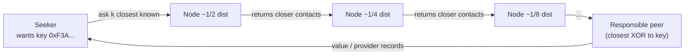
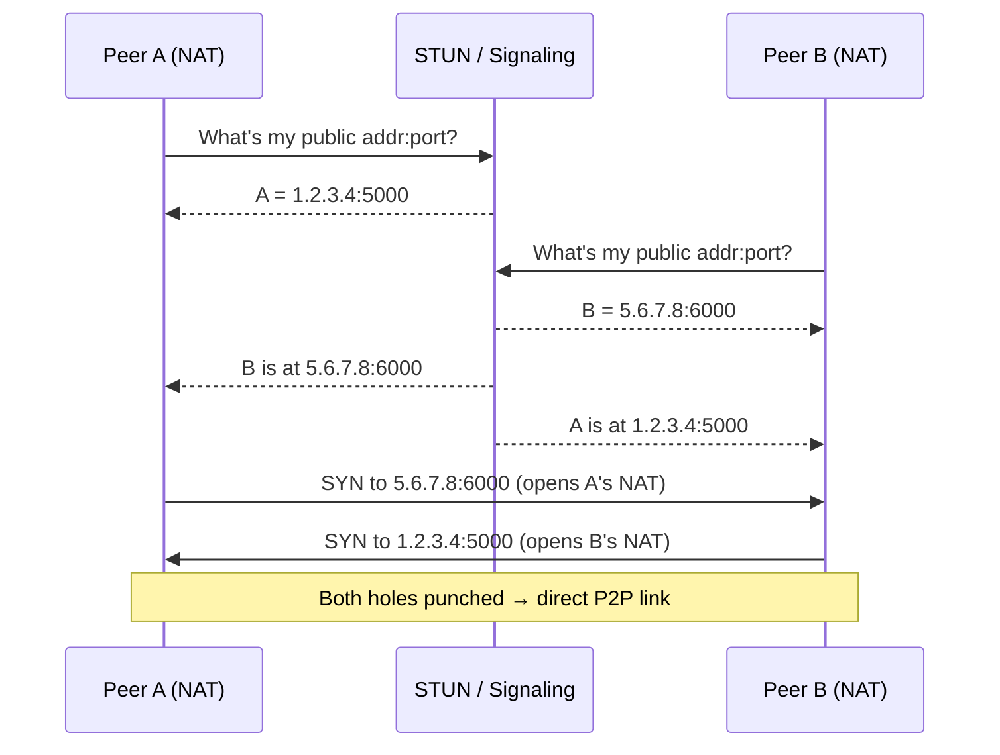

# Peer-to-Peer Architecture — Interview

A tiered question bank, from fundamentals to staff-level judgment. Answers are written the way you'd want to hear them in a real interview: precise, concrete, and honest about trade-offs.

1. What is P2P architecture, and how does it differ from client-server?
2. Structured vs unstructured overlays — what's the distinction?
3. Walk me through a DHT lookup. Why is Kademlia O(log n)?
4. How does a new peer join the network? Explain bootstrap and discovery.
5. What is a gossip protocol, and how fast does it disseminate?
6. What is churn, and how do robust P2P systems handle it?
7. How do two peers behind NATs connect? Explain STUN, TURN, and hole punching.
8. Explain Sybil and eclipse attacks. How do you defend against them?
9. What is the free-rider problem, and how does BitTorrent's tit-for-tat address it?
10. When is P2P the wrong choice?
11. What is a hybrid or super-peer design, and why use one?
12. How does BitTorrent actually work end to end?
13. What is content addressing, and why does IPFS use it?
14. (Staff) You're asked to "decentralize" a product. What's the real operational and moderation reality?

---

## Q1: What is P2P architecture, and how does it differ from client-server?

In client-server, roles are fixed and asymmetric: clients originate requests, servers hold authoritative state and serve responses. Capacity is centrally provisioned, so serving N users costs the operator O(N) resources. In peer-to-peer, every node is both a client and a server — a *peer*. Peers contribute their own storage, bandwidth, and compute to the collective, so as the network grows the *supply* of resources grows with the demand. There is no single authoritative node; state, routing, and content are distributed across participants.

The consequences flow from that symmetry. P2P systems scale their capacity with membership, have no single point of failure by construction, and are cheap for the operator (users pay in their own resources). In exchange you give up central control: you can't trivially enforce consistency, authenticate identity, moderate content, or guarantee any given peer is online. The engineering of P2P is largely the engineering of getting useful, reliable behavior out of an untrusted, unreliable, constantly-changing set of nodes.

| Dimension | Client-Server | Peer-to-Peer |
|---|---|---|
| Node roles | Fixed (client / server) | Symmetric (peer = both) |
| Capacity vs. load | Operator provisions O(N) | Grows with membership |
| Single point of failure | Yes (the server tier) | No (by design) |
| Authoritative state | Centralized | Distributed / replicated |
| Trust model | Trust the server | Trust no one; verify |
| Moderation & control | Easy | Hard to impossible |
| Operator cost | High (they pay) | Low (peers pay) |

## Q2: Structured vs unstructured overlays — what's the distinction?

An *overlay* is the logical network peers form on top of the physical internet — who each peer knows about and forwards to. The distinction is how that topology is organized.

An **unstructured overlay** places peers and content with no global rule. A peer connects to whoever it happens to meet, and to find data you flood or random-walk the network asking neighbors. This is simple and extremely resilient to churn — there's no structure to repair when nodes leave — but search is inefficient and, worse, *incomplete*: flooding with a TTL may never reach the one peer holding a rare item. Gnutella and early Gnutella-style networks are the classic example.

A **structured overlay** imposes a global rule mapping keys to peers — almost always a Distributed Hash Table (DHT). Both content and peers get identifiers in the same key space, and the protocol guarantees that a lookup for any key deterministically routes to the responsible peer in a bounded number of hops (typically O(log n)). This makes even rare items findable, but the structure must be actively maintained under churn. Kademlia (used by BitTorrent's Mainline DHT and IPFS), Chord, and Pastry are structured.

| Property | Unstructured | Structured (DHT) |
|---|---|---|
| Topology rule | None / ad hoc | Global key→peer mapping |
| Lookup method | Flooding / random walk | Deterministic routing |
| Lookup cost | O(N) worst case, TTL-bounded | O(log N) hops |
| Finds rare items | Not guaranteed | Guaranteed |
| Churn resilience | Very high (nothing to repair) | Requires active maintenance |
| Examples | Gnutella | Kademlia, Chord, Pastry |

## Q3: Walk me through a DHT lookup. Why is Kademlia O(log n)?

A DHT assigns every peer and every key a fixed-length identifier from the same space (Kademlia uses 160-bit IDs). A key is "owned" by the peer(s) whose IDs are closest to it under a distance metric. Kademlia's metric is **XOR**: distance(a, b) = a ⊕ b, interpreted as an integer. XOR is symmetric and satisfies the triangle inequality, which lets routing tables be built and queried consistently.

Each peer keeps its contacts in **k-buckets**: bucket *i* holds up to *k* peers whose ID shares an (n−i)-bit prefix — i.e., peers at XOR-distance in the range [2^i, 2^{i+1}). The peer knows *many* nodes close to itself and progressively *fewer* far away. A lookup for a key proceeds iteratively: the seeker asks the k closest nodes it knows to the target; each responds with the k closest nodes *it* knows; the seeker picks the closest new candidates and repeats. Every round the XOR distance to the target at least halves, because each hop resolves one more prefix bit. Halving a distance in a 160-bit space takes at most ~log₂(N) rounds for N nodes — hence **O(log n)** hops, each round contacting a small constant number of peers in parallel.

The elegance is that k-buckets self-heal: every query teaches a peer about live nodes, and buckets prefer long-lived contacts, which both maintains routing and resists churn.

## Q4: How does a new peer join the network? Explain bootstrap and discovery.

A brand-new peer knows nothing about the overlay, so it faces a chicken-and-egg problem: to find peers you must already know a peer. **Bootstrapping** breaks it with out-of-band knowledge — a hardcoded list of stable *bootstrap nodes* (DNS names or IPs shipped with the client), a cached list of peers from a previous session, or a rendezvous mechanism. BitTorrent also uses **trackers** (a central-ish HTTP endpoint that returns a peer list) and, for tracker-less operation, well-known DHT bootstrap nodes like `router.bittorrent.com`.

Once connected to even one live peer, **discovery** becomes self-sustaining. In a DHT, the joining node performs a lookup *for its own ID*; this naturally populates its k-buckets with the peers closest to it and announces its presence to them. In unstructured or LAN contexts, peers discover each other via gossip/peer-exchange (PEX — peers trade their neighbor lists) or local multicast (mDNS). The design goal is that bootstrap nodes are only needed for the *first* contact; after that the network's own structure carries discovery, so a small set of bootstrap servers doesn't become a hard central dependency or bottleneck.

## Q5: What is a gossip protocol, and how fast does it disseminate?

Gossip (epidemic) protocols spread information the way a rumor spreads: in each round, every node picks a small random set of peers and shares what it knows; those peers do the same next round. No node needs a global view or a spanning tree. It's used for membership dissemination, failure detection (SWIM), and propagating updates or transactions — blockchain networks gossip new blocks and transactions this way.

The reason it's beloved is the math: information reaches all N nodes in **O(log N) rounds** with high probability. Each round the number of informed nodes roughly multiplies (like a doubling process), so 1 million nodes converge in ~20 rounds. It's also robust — random peer selection means no single node's failure stalls dissemination, and a few dropped messages barely dent convergence. The costs are redundancy (nodes receive the same update multiple times, so you add anti-entropy/deduplication) and *eventual*, not immediate, consistency: gossip guarantees everyone converges, not that they converge at the same instant. You accept some wasted bandwidth and staleness in exchange for extreme fault tolerance and no coordination.

## Q6: What is churn, and how do robust P2P systems handle it?

Churn is the continuous arrival and departure of peers — nodes joining, leaving gracefully, and (mostly) vanishing abruptly. In consumer P2P networks median session times can be minutes, so a large fraction of the network turns over constantly. Churn is *the* defining operational stress: it invalidates routing entries, orphans content stored on departed nodes, and can partition the overlay if unmanaged.

Robust systems assume churn is the normal case, not an exception, and design in several defenses. **Replication**: store each key on the k closest nodes, not one, so a single departure never loses data; DHTs periodically republish keys to refresh replicas as the responsible set shifts. **Redundant routing state**: k-buckets hold multiple contacts per range, so a dead contact just falls back to another. **Preferring stable nodes**: Kademlia keeps the *oldest* live contact in a bucket, exploiting the empirical fact that a node up for an hour is likely up for the next hour. **Active maintenance**: periodic pings/heartbeats evict dead entries, and lookups double as liveness probes. **Graceful degradation**: lookups tolerate some failed hops by contacting several candidates in parallel. The theme is redundancy plus continuous self-repair rather than any assumption of stability.

## Q7: How do two peers behind NATs connect? Explain STUN, TURN, and hole punching.

Most peers sit behind NATs or firewalls with no publicly reachable address, which is fatal for a model where every peer must accept inbound connections. The toolkit is ICE, built from STUN, TURN, and hole punching.

**STUN** (Session Traversal Utilities for NAT) lets a peer discover its own public-facing address and port: it asks a STUN server "what source address do you see me coming from?", learning the mapping the NAT assigned. Two peers exchange these discovered candidate addresses (via a signaling channel — a rendezvous server or the DHT). **Hole punching** then exploits how NATs work: if both peers simultaneously send packets *to each other's* public mapping, each NAT sees an outbound packet first and creates a mapping that permits the incoming reply — a hole is punched from both sides at once, and a direct peer-to-peer path is established without either being "the server."

Hole punching fails against **symmetric NATs**, which assign a *different* mapping per destination, so the address STUN learned doesn't match what the peer actually needs. The fallback is **TURN** (Traversal Using Relays around NAT): a public relay server that both peers connect to, which forwards traffic between them. TURN always works but reintroduces a central, bandwidth-costly server — it's a last resort, used for the minority of connections that can't be punched directly.

## Q8: Explain Sybil and eclipse attacks. How do you defend against them?

Both exploit the fact that in an open P2P network, identity is cheap. In a **Sybil attack**, one adversary spins up many fake peer identities. Because DHTs and voting/reputation schemes assume distinct identities map to distinct principals, a Sybil-heavy attacker can gain outsized routing influence, dominate a region of the key space, or subvert any majority-based mechanism. In an **eclipse attack** — often built on Sybils — the attacker fills a specific victim's routing table with attacker-controlled nodes, so *all* of the victim's lookups and traffic pass through the adversary. The victim is "eclipsed" from the honest network: its view of content and peers is whatever the attacker chooses to show, enabling censorship, fake data, or (in blockchains) double-spend setups.

Defenses make identity or position costly and diversify a peer's contacts. **Cost/proof-of-work identities** or requiring a resource commitment (stake, PoW) raise the price of forging many nodes. **Deriving node IDs from IP/crypto keys** (rather than letting a peer pick its ID freely) prevents an attacker from targeting a specific key range or a specific victim's buckets. **Diverse routing tables** — requiring contacts to span different IP subnets/ASes and preferring long-lived nodes — make it hard to fully surround a victim. **Redundant, disjoint lookups** (querying via multiple independent paths and cross-checking) detect a poisoned path. None of these are absolute; open P2P security is a game of raising attacker cost, and permissioned designs sidestep it by not admitting arbitrary identities.

## Q9: What is the free-rider problem, and how does BitTorrent's tit-for-tat address it?

P2P depends on peers contributing resources, but a rational peer would prefer to *consume* (download) without *contributing* (upload) — a free-rider. If everyone free-rides, the commons collapses: no one serves, no one downloads. Early Gnutella suffered badly from this; measurements found a large majority of nodes shared nothing.

BitTorrent's answer is **tit-for-tat**, a local incentive that makes cooperation each peer's self-interested choice. Each peer uploads preferentially to the peers who upload the most *to it* — it "unchokes" its best few reciprocators and "chokes" the rest. If you don't upload, peers stop uploading to you, so your download slows; contributing is directly rewarded with faster downloads. To bootstrap new peers (who have nothing to offer yet) and discover better partners, BitTorrent periodically **optimistically unchokes** a random peer, giving strangers a chance to prove themselves. The design is deliberately *local and pairwise* — no global reputation ledger to attack — which makes it Sybil-resistant and cheap, though it's imperfect (strategic clients like BitTyrant have gamed it). The broader lesson: in an untrusted network, align incentives so that the cooperative action is also the individually optimal one.

## Q10: When is P2P the wrong choice?

P2P is a specialized tool, and defaulting to it is a common mistake. It's the wrong choice when you need **strong consistency or a single source of truth** — coordinating agreement across untrusted, churning nodes is expensive and slow (this is exactly why blockchains sacrifice throughput and latency for it). It's wrong when you need **low, predictable latency**: multi-hop DHT lookups and relay fallbacks add unbounded tail latency versus a nearby server. It's wrong when **trust, authentication, moderation, or compliance** matter — you cannot easily revoke bad actors, take down illegal content, or prove who did what without central control. It's wrong for **small or private user bases**, where the "capacity scales with users" benefit never materializes and you just inherit the complexity.

The honest framing: most products that "could be P2P" are better as client-server or, at most, hybrid. P2P earns its complexity only when the specific wins — censorship resistance, no central operator cost, capacity that scales with membership, no single point of control/failure — are genuine hard requirements, not aesthetic preferences. If a CDN plus replicated databases solves it, use that.

## Q11: What is a hybrid or super-peer design, and why use one?

Pure P2P (every peer equal) is elegant but pays for it: slow lookups, weak search, hard coordination. **Hybrid** designs reintroduce a small amount of centralization to buy those back while keeping most of P2P's benefits. The **super-peer** (or supernode) pattern promotes well-provisioned, stable, high-bandwidth peers to a coordinating tier: super-peers form a smaller overlay among themselves and each serves a cluster of ordinary "leaf" peers, handling indexing, search, and relaying for their cluster. Skype's original architecture and later Gnutella (ultrapeers) worked this way — leaf nodes query their super-peer, which either answers or routes among the super-peer mesh, so search hits far fewer hops.

Other hybrids keep a central component for the *hard* parts and let peers do the *heavy* parts: BitTorrent uses a central-ish **tracker** for peer discovery but moves all bulk data transfer peer-to-peer; WebRTC apps use a central **signaling/STUN/TURN** server to establish connections but stream media directly between peers. The pattern is always the same trade: centralize the low-bandwidth control plane (discovery, coordination, index) where central logic is cheap and valuable, and decentralize the high-bandwidth data plane where scaling with membership is the whole point.

| Aspect | Pure P2P | Super-peer / Hybrid |
|---|---|---|
| All peers equal? | Yes | No — tiered by capability |
| Search / lookup cost | O(log N) or flooding | Fewer hops via super-peers |
| Single point of failure | None | Reduced but present (control plane) |
| Complexity of coordination | High | Lower (delegated to super-peers) |
| Examples | Kademlia, classic Gnutella | Skype (early), Gnutella ultrapeers, BitTorrent trackers, WebRTC signaling |

## Q12: How does BitTorrent actually work end to end?

A publisher creates a **.torrent** (or magnet link) containing metadata: the file split into fixed-size pieces, a SHA-1 hash of each piece, and how to find peers. To find peers a client contacts a **tracker** (returns a peer list) and/or the **Mainline DHT** (Kademlia — tracker-less discovery) and **PEX** (peers trade neighbor lists). The set of peers on one torrent is a **swarm**; peers with the complete file are **seeders**, incomplete ones are **leechers**.

Downloading is piece-by-piece and highly parallel. A peer exchanges bitfields advertising which pieces it has, then requests missing pieces from multiple peers at once. Two policies make it fast and healthy: **rarest-first** piece selection (fetch the least-available piece next, so rare pieces spread and the swarm doesn't lose them when a seed leaves), and **tit-for-tat** choking (upload to your best reciprocators, plus optimistic unchoke). Every received piece is verified against its hash, so corrupt or malicious data is rejected — content integrity doesn't depend on trusting the sender. The result: a single publisher can seed a file to millions because every downloader simultaneously uploads to others, and total swarm capacity grows with swarm size.

## Q13: What is content addressing, and why does IPFS use it?

In *location* addressing (HTTP/URLs) you name *where* data lives — a host and path — and you must trust that host to return the right bytes. In **content addressing** you name data by *what it is*: the address is a cryptographic hash of the content itself (in IPFS, a CID — Content Identifier). This has three powerful properties. **Integrity**: anyone can verify the bytes match the hash, so you don't need to trust the source — tampered data simply won't match its address. **Deduplication**: identical content has one identical address, stored once. **Location independence**: because the name isn't tied to a host, the same content can be fetched from *any* peer that has it.

That last property is exactly why P2P wants content addressing. IPFS stores content-addressed blocks (structured as a Merkle DAG, so large files/directories are trees of hashed chunks) and uses a **Kademlia DHT** to map "who has the block with this CID?" to provider peers. To fetch a CID, you DHT-lookup providers, then pull blocks from them (via Bitswap, IPFS's block-exchange protocol) and verify each against its hash. The DHT solves discovery; content addressing makes it safe to fetch from untrusted peers. The trade-off is that content addressing is immutable — a new version is a new CID — so mutable references need a separate naming layer (IPNS) on top.

## Q14: (Staff) You're asked to "decentralize" a product. What's the real operational and moderation reality?

The first job is to interrogate the requirement, because "decentralize" is usually a means mistaken for a goal. Ask *which* property they actually want: censorship resistance, no single operator cost, no single point of failure, data sovereignty, or just the buzzword. Most of those have cheaper answers than full P2P — multi-region replication and a CDN give you availability and scale; a well-run managed service gives you low cost of ownership. Genuine P2P is justified only when *removal of central control itself* is the requirement (e.g., the threat model includes your own company being compelled to censor or shut down). I'd push hard here, because the costs are severe and permanent.

The operational reality that engineers underestimate: **you give up the levers you rely on.** You can't ship a hotfix and have it take effect everywhere — you have old client versions in the wild forever, so protocol evolution needs backward compatibility and negotiated upgrades. You can't observe the system; there's no central log to query, so debugging and abuse-detection are dramatically harder. NAT traversal means a meaningful fraction of "P2P" traffic actually flows through TURN relays *you* pay for, quietly reintroducing central cost. And churn/Sybil/eclipse defenses are ongoing security work, not a one-time build.

The reality that gets companies in trouble is **moderation and liability.** Decentralization is often sold as "we're not responsible for what users share" — legally and reputationally that rarely holds, and once illegal or abusive content is content-addressed and replicated across peers, you have no takedown button. Every successful "P2P" product I'd point to is actually **hybrid**: keep a central control plane for identity, discovery, moderation signals, and policy (where central logic is cheap and legally necessary), and decentralize only the data plane where scaling with membership is the real win. My recommendation is almost always: start client-server, extract the specific decentralization property you truly need, and adopt the *minimum* P2P surface (usually a super-peer or hybrid model) that delivers it — with a written plan for abuse handling before launch, not after.

---

*Next step:* [API Gateway — Junior](../../11-api-design-at-scale/01-api-gateway/junior.md)
