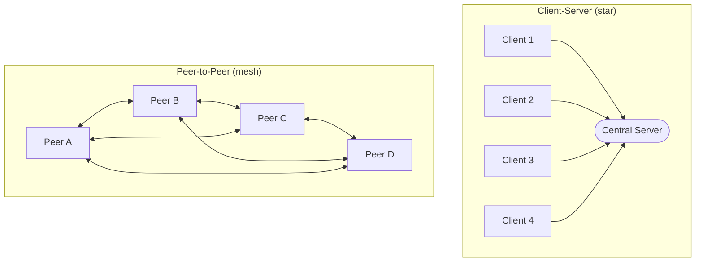
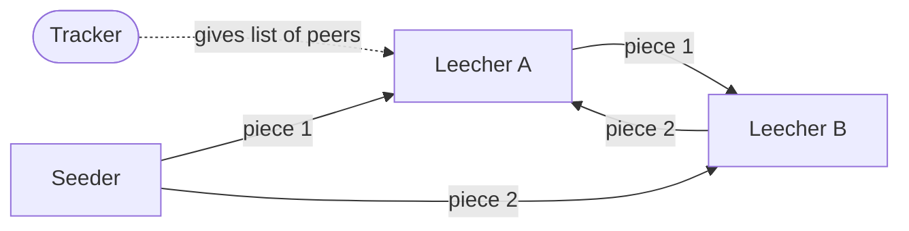

# Peer-to-Peer Architecture — Junior

<!-- level-focus -->
At junior level, focus on this question:

> How can I apply **Peer-to-Peer Architecture** in one small example and prove the result?

Use the smallest realistic scenario that exposes the decision and its failure behavior.
## 1. The Client-Server Model You Already Know

Most systems you have used start out as **client-server**. There is a clear split of roles:

- A **server** owns the resource (a website, a database, a file) and waits for requests.
- A **client** (your browser, your phone app) sends requests and receives responses.

When you open a website, thousands of clients all talk to the same set of servers. The server is the single authority: it stores the data, enforces the rules, and answers everyone. This is simple to reason about, but the server is also the one thing everything depends on. If it goes down, no client can be served.

---

## 2. What "Peer-to-Peer" Actually Means

In a peer-to-peer system, there is **no fixed client and no fixed server**. Every node plays both roles:

- As a **client**, a peer requests data it does not yet have.
- As a **server**, that same peer hands out data it *does* have to other peers.

There is **no single central coordinator** that all traffic must pass through. Peers discover each other and exchange resources directly. The more peers join, the more total capacity the network has — because each new peer brings its own upload bandwidth, storage, and CPU with it.

A useful one-line definition:

> **P2P** is a decentralized architecture in which nodes of equal privilege share resources directly with one another, each acting as both consumer and provider.

---

## 3. Client-Server vs P2P: Topology

The clearest way to feel the difference is to look at the shape of the network. Client-server is a **star**: every client points at the center. P2P is a **mesh**: peers connect to many other peers.

Notice two things:

1. In the star, **remove the server and the whole thing stops working** — the clients cannot talk to each other.
2. In the mesh, **remove any single peer and the rest keep going** — there are other paths, and any peer can serve any other.

---

## 4. Side-by-Side Comparison

| Aspect | Client-Server | Peer-to-Peer |
|---|---|---|
| **Roles** | Fixed: server serves, client consumes | Every peer is both client and server |
| **Coordination** | Central server is the single authority | No central coordinator; peers coordinate directly |
| **Single point of failure (SPOF)** | Yes — the server | No inherent SPOF; work spreads across peers |
| **How it scales** | Add/upgrade servers to serve more clients | Capacity grows as more peers join |
| **Finding the resource** | Easy — always ask the known server | Hard — must discover which peer has what |
| **Trust** | Trust the one server operator | Must handle untrusted, unknown peers |
| **Cost owner** | Operator pays for servers and bandwidth | Cost is shared across all participants |

The pattern to remember: **client-server trades a single point of failure for simplicity; P2P trades simplicity for resilience and shared cost.**

---

## 5. Benefits of P2P

- **No single bottleneck or SPOF.** There is no one server whose failure takes everyone down. Load is spread across many peers, so no single machine has to serve the whole crowd.
- **Scales with participants.** In client-server, more users means more load on *your* servers. In P2P, more users often means *more capacity*, because each newcomer also contributes upload bandwidth and storage.
- **Lower cost for the operator.** Resources come from the participants themselves. A popular file can be distributed to millions without any one party paying for all the bandwidth.
- **Resilience.** With no central chokepoint, the network can keep functioning even as individual peers appear and disappear.

---

## 6. Challenges of P2P

The same decentralization that gives P2P its strengths also creates hard problems:

- **Finding peers (discovery).** Without a central directory, how does a new peer find others who have the data it wants? This is the *bootstrapping* problem, usually solved with a small known starting point (a tracker, a set of seed nodes, or a distributed lookup).
- **Trust and security.** Peers are strangers. A peer might send corrupted data, lie about what it has, or try to disrupt the network. The system must verify data (e.g., with cryptographic hashes) rather than trusting the sender.
- **Churn.** Peers join and leave constantly and unpredictably. Data and responsibilities that lived on a peer must survive that peer going offline, which requires redundancy.
- **No single authority.** There is nobody to enforce rules, ban bad actors globally, or guarantee that data stays available. These guarantees must be engineered into the protocol itself.

---

## 7. Concrete Example: BitTorrent

**BitTorrent** is the classic P2P file-sharing protocol, and it makes every concept above tangible. Suppose one large file needs to reach thousands of people.

The file is split into many small **pieces**. A group of peers all interested in the same file form a **swarm**. Two roles appear inside a swarm:

- A **seeder** is a peer that already has the *complete* file and only uploads.
- A **leecher** is a peer that is still downloading; it uploads the pieces it already has while it fetches the ones it lacks.

Crucially, a leecher does not wait until it has the whole file to start helping others — as soon as it has a piece, it can serve that piece to someone else. This is P2P in action: **downloading and uploading at the same time.**

How BitTorrent answers the challenges from Section 6:

- **Discovery:** a **tracker** (or a distributed alternative) hands a new peer a list of others in the same swarm, so it knows who to contact. This is the small central hint that bootstraps an otherwise decentralized exchange.
- **Trust:** each piece has a known cryptographic **hash** recorded in the `.torrent` file. A peer verifies every received piece against its hash, so corrupted or malicious data is detected and rejected — no need to trust the sender.
- **Churn:** because the file is spread across many peers and copied redundantly, any single peer can leave without the file becoming unavailable, as long as the pieces still exist somewhere in the swarm.
- **Scaling:** the more people download a popular file, the more seeders and leechers exist to serve pieces — so a spike in demand *adds* capacity instead of overwhelming a single server.

The official protocol specification lives at the BitTorrent Enhancement Proposals site (bittorrent.org).

---

## 8. Key Terms

| Term | Meaning |
|---|---|
| **Peer / node** | A participant that is both client and server |
| **Swarm** | The group of peers sharing one particular file |
| **Seeder** | A peer that has the complete file and only uploads |
| **Leecher** | A peer still downloading (uploads what it already has) |
| **Piece** | A small chunk the file is split into |
| **Tracker** | A helper that tells peers who else is in the swarm |
| **Churn** | The constant joining and leaving of peers |
| **SPOF** | Single point of failure — a component whose failure breaks the system |

---

## Apply it

1. Choose one small, known input for **Peer-to-Peer Architecture**.
2. Predict the output or observable behavior.
3. Run the smallest example or probe that exercises the concept.
4. Change one input to trigger a failure or boundary case.
5. Explain the evidence using the guide's vocabulary.

## Verify your work

- Record the exact input, command or code path, and output.
- Repeat the probe and confirm the result is consistent.
- Show one expected success and one expected failure.
- Resolve any difference between the prediction and the evidence.

## Review questions

- What problem does Peer-to-Peer Architecture solve in the example?
- Which input changes the observed result, and why?
- What is the smallest useful success check?
- Which beginner mistake would your evidence catch?
