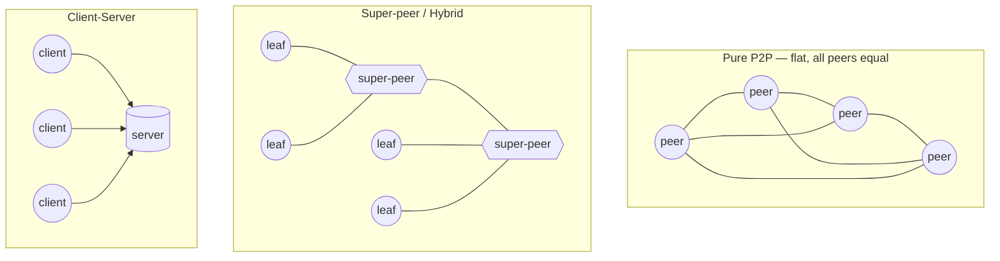
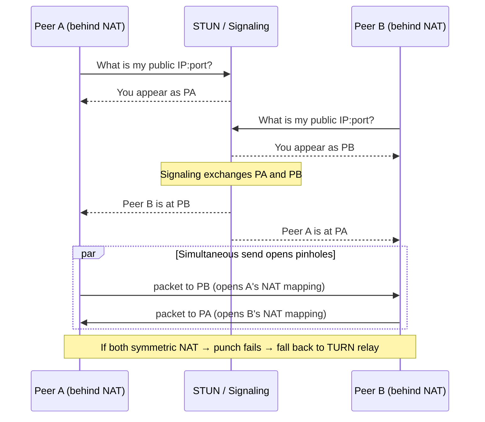

# Peer-to-Peer Architecture — Senior

<!-- level-focus -->
At senior level, focus on this question:

> Which system invariant is affected by **Peer-to-Peer Architecture** under failure, load, and change?

Use the smallest realistic scenario that exposes the decision and its failure behavior.
## 1. When P2P is the right architecture — and when it is wrong

P2P is not a general-purpose alternative to client-server. It buys you three specific things, and each has a cost paid elsewhere.

**What P2P actually buys you:**

- **Marginal infrastructure cost that trends toward zero.** Every joining peer contributes upload bandwidth and storage. A flash crowd that would melt a centralized origin *strengthens* a BitTorrent swarm. This is the single strongest reason to choose P2P: content distribution where popularity and available capacity are positively correlated.
- **Censorship and single-point-of-control resistance.** There is no origin server to subpoena, block, or take down. IPFS content addressing and blockchain ledgers derive their value almost entirely from this property.
- **No single point of failure by construction.** A well-designed overlay tolerates the loss of any individual node, including any node the operator runs.

**When P2P is the wrong architecture** — reach for client-server (or a hybrid) instead if any of these hold:

- **You need strong consistency or transactions.** Coordinating linearizable writes across untrusted, churning peers is either impossible or catastrophically expensive. Blockchains achieve a form of it only by burning enormous resources (PoW/PoS) and accepting probabilistic finality and low throughput. If your workload needs "read-your-writes" at interactive speed, P2P is the wrong tool.
- **You need low-latency guarantees.** A DHT lookup is `O(log N)` *hops*, each a real internet round-trip to an arbitrary peer of arbitrary quality. Tail latency is unbounded and uncontrollable. You cannot offer a p99 SLA over a network of strangers' laptops behind residential NAT.
- **You need moderation, access control, or the ability to delete data.** The censorship resistance that is a feature for one use case is a compliance and safety nightmare for another. You cannot reliably retract content from a P2P network. GDPR "right to erasure," CSAM takedown, and legal holds are structurally hard to honor.
- **The workload is not naturally shardable/replicable content.** P2P shines for distributing *the same bytes to many parties*. It does not help with a request/response API, a search index that must be globally consistent, or per-user private state.

> Senior heuristic: choose P2P for the *bulk data plane* (moving large, cacheable, shareable content), and keep a centralized *control plane* for coordination, trust, discovery, and anything requiring authority. Almost every successful "P2P" system in production is actually this hybrid.

---

## 2. Structured vs unstructured overlays: lookup guarantees vs resilience

The core architectural fork inside P2P is how peers organize into an overlay.

**Unstructured** overlays (early Gnutella, Kazaa's leaf layer) let peers connect to arbitrary neighbors. Lookup is by flooding or random walk.

- Strength: extreme resilience. There is no invariant to violate, so nodes joining and leaving cause no structural damage. Robust to churn and to targeted attack.
- Weakness: **no lookup guarantee.** A search may fail even though the item exists, because flooding is bounded by a TTL. Great for finding *popular* content (many replicas, short walk), poor for finding *rare* content. Flooding is bandwidth-expensive and scales badly.

**Structured** overlays (Chord, Kademlia, Pastry) impose a topology — typically a Distributed Hash Table where keys and nodes share an ID space and each key maps to a deterministic set of nodes.

- Strength: **deterministic lookup in `O(log N)` hops**, and you *will* find the item if it exists. Precise, scalable routing.
- Weakness: the routing invariants (finger tables, k-buckets) must be maintained. High churn constantly damages them, forcing repair traffic. More brittle under adversarial conditions and harder to bootstrap.

| Dimension | Unstructured | Structured (DHT) |
|---|---|---|
| Lookup guarantee | Best-effort (may miss rare items) | Deterministic — found if present |
| Lookup cost | Flood/random-walk, high bandwidth | `O(log N)` hops |
| Churn resilience | High — no invariants to break | Lower — routing tables need repair |
| Rare-content search | Poor | Good |
| Attack surface | Diffuse, hard to target | Routing-table poisoning (eclipse) |
| Example | Gnutella, Kazaa leaves | Kademlia (BitTorrent DHT, IPFS), Chord |

Kademlia is the pragmatic winner in the wild (BitTorrent's trackerless DHT, IPFS, Ethereum's discovery). Its XOR metric makes routing tables symmetric and self-healing, and it learns liveness passively from ordinary traffic, which softens the structured overlay's churn weakness.

---

## 3. The topology spectrum: pure P2P, super-peer, client-server

Real systems sit on a spectrum, not at a pole. The super-peer (or "hybrid") model — where capable, well-connected nodes take on indexing/relaying duties for a cluster of ordinary leaf peers — is where most production P2P actually lives.

| Property | Pure P2P | Super-peer / Hybrid | Client-Server |
|---|---|---|---|
| Resilience to node loss | Highest | High (super-peers are the weak point) | Lowest (single origin) |
| Lookup / control latency | Worst (multi-hop) | Middle (leaf → super-peer is one hop) | Best (one hop to authority) |
| Operator control & moderation | None | Partial (via super-peers/trackers) | Full |
| Infra cost per user | ~0 | Low (operator runs a thin control plane) | Scales with users |
| Consistency achievable | Weak / eventual | Eventual + coordinated hotspots | Strong |
| Bootstrapping / discovery | Hard | Easy (known super-peers) | Trivial |
| Bandwidth scaling with popularity | Improves | Improves | Degrades |

The insight: super-peers let you keep the *economics* of P2P (leaves still trade data peer-to-peer) while restoring the *operability* of client-server for the small, coordination-heavy slice (indexing, discovery, some policy enforcement). You pay for it with a partial centralization risk and the complexity of two node roles.

---

## 4. NAT traversal: the pain that dominates real deployments

The academic model assumes every peer can accept inbound connections. On the real internet, the large majority of peers sit behind NAT and stateful firewalls and *cannot*. This, not routing theory, is what dominates engineering effort in production P2P.

The toolkit:

- **STUN** (Session Traversal Utilities for NAT): a peer asks a public STUN server "what public IP:port do you see me coming from?" Cheap, stateless, and enough for *cone* NATs where the mapping is stable. This is the discovery step.
- **Hole punching:** once two peers each know their public mapping (via STUN) and exchange it through a rendezvous/signaling channel, they simultaneously send packets to each other. The outbound packet from each side opens the NAT pinhole that lets the other's packet in. Works for UDP against most NAT types; TCP hole punching is far less reliable.
- **TURN** (Traversal Using Relays around NAT): when both peers sit behind *symmetric* NATs (mapping differs per destination, defeating hole punching), direct connection is impossible. TURN relays all traffic through a public server. It works universally but **breaks the P2P cost model** — you are now paying for centralized relay bandwidth for those flows.

Senior takeaways:

- Budget for a **STUN/signaling/TURN control plane** even in a "pure" P2P design. A rendezvous service to exchange candidates is unavoidable; it is a small, cheap, but *centralized* dependency that quietly makes your system a hybrid.
- Measure your **connectable fraction**. A meaningful percentage of peers (double digits in many consumer populations) will require TURN relaying. Provision relay capacity and treat it as a cost line, not an afterthought.
- ICE (Interactive Connectivity Establishment) is the standard orchestration of STUN/TURN candidate gathering and is what WebRTC uses — reuse it rather than hand-rolling.

---

## 5. Security: Sybil, eclipse, and free-riders

An open P2P network admits anonymous, unvetted participants. Three attack/incentive failures recur and every design must answer them.

**Sybil attack.** One adversary cheaply creates many identities to gain disproportionate influence — control a majority of a key's replica set, dominate voting, or skew a DHT. The root cause is that identity is free. Countermeasures make identity *costly or scarce*:
- Proof-of-Work / proof-of-stake (blockchains bind influence to real cost, not to identity count).
- Binding node IDs to a scarce resource, e.g. deriving the ID from IP address / subnet (limits IDs per attacker) or requiring a crypto-puzzle to generate an ID.
- A trusted or federated identity authority — which, again, reintroduces centralization.

**Eclipse attack.** A weaker, cheaper cousin: instead of controlling the whole network, the attacker surrounds *one victim*, filling its routing table with attacker-controlled peers so all of the victim's traffic flows through the adversary. This enables censorship of the victim's view, or feeding it a forked history. Defenses: constrain routing-table membership (Kademlia's preference for long-lived nodes and bounded k-buckets helps), use multiple disjoint lookup paths, verify results against several peers, and diversify neighbors by network locality so an attacker cannot monopolize buckets from one address block.

**Free-riders.** Not an attack but an incentive failure: peers that consume without contributing (classic Gnutella measurements found the vast majority of users shared nothing). If unchecked, the network's capacity advantage evaporates. BitTorrent's answer is the canonical case study: **tit-for-tat** choking gives upload priority to peers who reciprocate, and **optimistic unchoking** periodically probes new peers to bootstrap reciprocity and discover better partners. The lesson is that P2P economics only work if the protocol makes contribution rationally self-interested.

| Threat | Root cause | Primary mitigation | Residual cost |
|---|---|---|---|
| Sybil | Identity is free | Make IDs costly/scarce (PoW, resource-bound IDs) | Reintroduces cost or central authority |
| Eclipse | Attacker controls a victim's neighbor set | Multiple disjoint paths, locality diversity, prefer stable nodes | More lookup traffic |
| Free-riding | No incentive to contribute | Tit-for-tat + optimistic unchoke | Slightly lower efficiency |

---

## 6. Consistency and data availability under churn

**Churn** — the continuous, high-rate joining and departing of peers — is the defining environmental hazard of P2P and the reason strong consistency is out of reach.

- **Availability requires replication with margin.** A block stored on a single peer vanishes when that peer leaves. Systems replicate each key across *k* nodes (Kademlia's replication parameter), and must *re-replicate* proactively as nodes drop, spending background bandwidth to keep the effective replica count above threshold. Under-provision *k* and popular-but-unpinned content silently disappears — this is exactly why IPFS content is not durable unless someone *pins* it (or pays a pinning service); the network gives you addressing, not guaranteed persistence.
- **Consistency is eventual at best.** With no coordinator and constant membership change, you cannot get linearizability affordably. The workable models are: **immutable, content-addressed data** (IPFS, Git — the key *is* the hash, so there is nothing to make inconsistent), and **CRDTs / eventual convergence** for mutable state. Blockchains reach eventual agreement on a single history via costly consensus and accept probabilistic finality (a confirmed block can still be reorganized).
- **Content addressing sidesteps the hardest problem.** If you address data by its hash, integrity is self-verifying (any peer can serve it and you can check it) and there is no update-consistency question because the content never changes — you publish a *new* hash. This is why so many durable P2P designs are immutable-first and push mutability to a thin mutable-pointer layer (e.g. IPNS) that is small enough to handle with weaker guarantees.

Design consequence: architect P2P storage as **immutable content + explicit durability policy (pinning/erasure coding) + a small mutable pointer layer**, rather than trying to build a mutable, strongly-consistent store over churning peers.

---

## 7. Hybrid architectures as the default answer

The recurring senior conclusion is that "pure P2P vs pure client-server" is a false binary. Nearly every shipped system that gets P2P's benefits is a hybrid that centralizes a *thin, cheap control plane* and decentralizes the *fat data plane*:

- **Trackers / signaling servers** for peer discovery and NAT rendezvous — small, stateless, cheap, but a coordination point. BitTorrent then adds a *trackerless* DHT as a fallback so the tracker is not a single point of failure.
- **Bootstrap nodes** — new peers must contact *some* known address to join. Even fully decentralized networks ship hardcoded bootstrap peers; the discovery moment is inherently centralized.
- **Super-peers** — elevate capable nodes to carry indexing/relaying for leaves, concentrating the coordination cost on a few strong nodes.
- **Optional centralized fallbacks** — TURN relays for un-punchable peers, and often a CDN/origin fallback so first-view latency does not depend on swarm warmth.

The engineering skill is choosing the *smallest possible* centralized surface: enough to solve bootstrapping, discovery, NAT, and trust, while keeping bulk bandwidth and storage on the peers where the economics win. Every gram of centralization you add trades a little censorship-resistance and cost-savings for a large gain in operability and latency — spend it deliberately.

---

## 8. Decision checklist

Before committing to P2P for a subsystem, answer these:

- **Is the payload large, cacheable, and shared by many?** If no → P2P's core advantage is absent; use client-server.
- **Can the workload tolerate eventual consistency and unbounded tail latency?** If no → do not put it on the peers.
- **Do you need to moderate, access-control, or delete content?** If yes → keep it centralized; P2P fights you here.
- **What is your connectable fraction, and can you fund the TURN relay tail?** Budget it before you commit.
- **How will you resist Sybil/eclipse given open membership?** Have a concrete answer, not a hope.
- **What guarantees durability under churn** — replication factor, re-replication policy, pinning, erasure coding? Addressing is not persistence.
- **What is the minimal centralized control plane** (bootstrap, discovery, signaling, trust) you can get away with? Design it explicitly; it will exist whether you plan it or not.

If the honest answers push you toward centralization on most of these, the right architecture is client-server with, at most, a P2P-accelerated data plane for the specific content that benefits.

---

*Next step:* [Peer-to-Peer Architecture — Professional](professional.md)

---

## Apply it

1. State the system invariant that **Peer-to-Peer Architecture** must protect.
2. Mark ownership, state, and failure propagation at each boundary.
3. Compare two designs under load, dependency failure, and future change.
4. Define recovery and compatibility behavior before implementation.
5. Test the riskiest assumption with a focused experiment.

## Verify your work

- The experiment supports the design with evidence, not preference.
- Failure injection shows the blast radius and recovery path.
- Compatibility checks cover old and new callers or data.
- Operational signals reveal invariant violations and recovery progress.

## Review questions

- Which invariant must remain true when Peer-to-Peer Architecture fails?
- Where should recovery responsibility live, and why?
- Which assumption deserves an experiment before implementation?
- How can the design evolve without changing every consumer at once?
