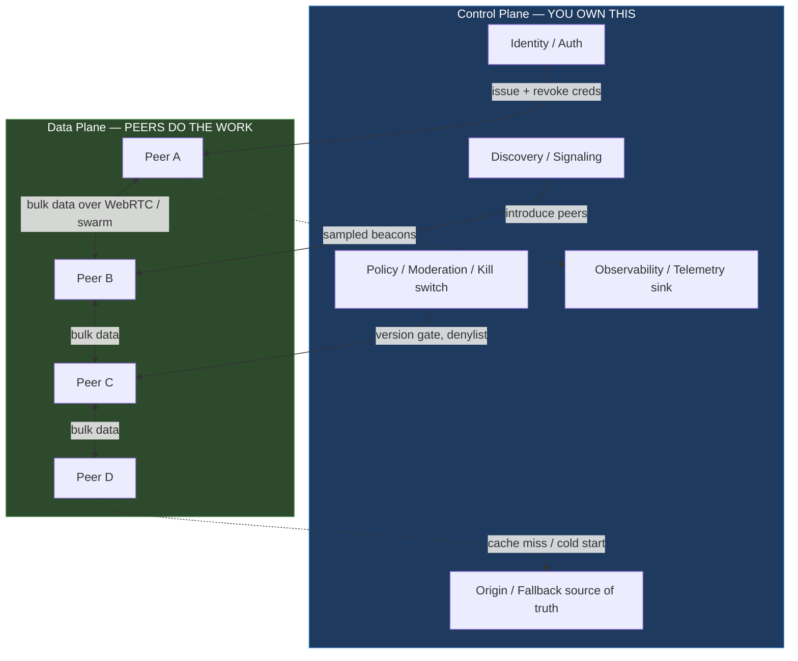
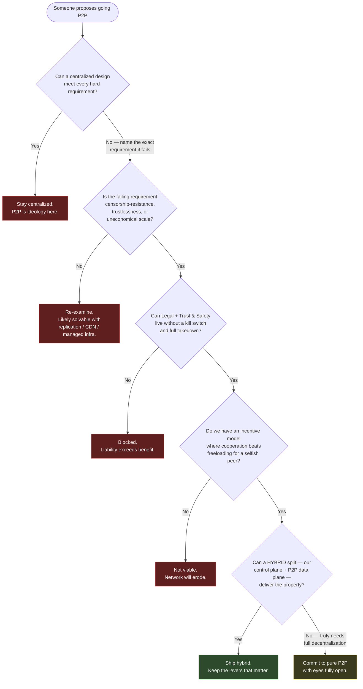

# Peer-to-Peer Architecture — Staff

At the staff level, "should we go peer-to-peer?" is rarely a technology question. It is a question about **what kind of control you are willing to give up**, and whether you are giving it up because a real constraint forces you to — or because decentralization sounds progressive in a design review. Most business systems that reach for P2P do not need it. Your job is not to build the most elegant swarm; it is to make sure the organization chooses decentralization with its eyes open, and to reserve it for the narrow set of problems where centralized control is the actual liability.

This file is about judgment: when P2P is a genuine requirement versus an ideological reflex, the operational reality of running something you don't own, the legal and moderation exposure of decentralized content, incentive design as a systems problem, and the hybrid pattern that captures most of the upside without betting the company.

---

## Table of Contents

1. [The Staff Framing: Control Is the Real Currency](#1-the-staff-framing-control-is-the-real-currency)
2. [Requirement vs. Ideology: When P2P Is Genuinely Warranted](#2-requirement-vs-ideology-when-p2p-is-genuinely-warranted)
3. [The Operational Reality You Can't Undo](#3-the-operational-reality-you-cant-undo)
4. [Legal, Abuse, and Moderation Liability](#4-legal-abuse-and-moderation-liability)
5. [Incentive Design as a Systems Problem](#5-incentive-design-as-a-systems-problem)
6. [Hybrid Pragmatism: Centralized Control Plane, P2P Data Plane](#6-hybrid-pragmatism-centralized-control-plane-p2p-data-plane)
7. [The Decision Framework](#7-the-decision-framework)
8. [Framing It Honestly to Leadership](#8-framing-it-honestly-to-leadership)
9. [Staff Judgment Checklist](#9-staff-judgment-checklist)

---

## 1. The Staff Framing: Control Is the Real Currency

Every architecture you own comes with implicit powers you rarely notice until they're gone:

- You can **page** the thing when it breaks — you own the servers, the logs, the dashboards.
- You can **ship a fix** and have it live everywhere in minutes.
- You can **flip a kill switch** — revoke a key, block an IP, pull a bad release, delete illegal content.
- You can **see** what's happening end to end.

Peer-to-peer architecture trades those powers away in exchange for properties centralized systems can't cheaply offer: **survivability without a coordinator, censorship resistance, cost that scales with participants rather than with your budget, and trust that doesn't route through you.** BitTorrent survives because no single tracker matters. IPFS content is addressed by its hash, so it is location-independent and tamper-evident. A blockchain's whole value proposition is that *no one* — including you — can quietly rewrite history.

The staff-level mistake is to adopt the architecture while assuming you keep the powers. You don't. Decentralization is not a feature you bolt on; it is a **set of powers you permanently surrender.** The only good reason to surrender them is that keeping them is precisely what makes the system fail its purpose.

---

## 2. Requirement vs. Ideology: When P2P Is Genuinely Warranted

The honest test is subtractive: **assume a boring centralized design, and find the specific requirement it cannot meet.** If you can't name one, you don't have a P2P requirement — you have a preference.

| Signal that P2P is a *genuine requirement* | Signal that you should stay *centralized* |
|---|---|
| **Censorship resistance is the product.** The system must survive a hostile government, ISP, or the failure/seizure of the operator itself. | You want "no single point of failure" — solvable with multi-region, replication, and a managed control plane. |
| **No party can be trusted to hold the canonical state**, including you (mutually distrusting participants, adversarial actors). | You trust yourself to run the system; the "trustless" pitch is aesthetic. |
| **The network *is* the asset** — value comes from participants contributing bandwidth/storage/compute you could never afford to buy (BitTorrent, live-video mesh). | You could just buy more servers or a CDN; you're chasing cost savings you haven't sized. |
| **Data must outlive any single operator** and remain verifiable by content hash (archival, provenance, tamper-evidence via IPFS-style addressing). | You need durability and integrity — object storage with checksums and versioning already gives you this. |
| **Regulatory / structural requirement** for a decentralized ledger with no privileged writer. | "We might want a token someday" or a board that likes the word blockchain. |
| **Scale of distribution exceeds any origin's egress budget** and edge peers are abundant and willing. | Traffic is modest, bursty, or your users are on metered/asymmetric links that won't seed. |

If your row lands consistently on the right, the correct staff move is to **say no to P2P and mean it.** The decentralized version will cost you more engineering, more operational pain, and more legal exposure — and deliver properties nobody asked for. "We don't need decentralization here" is a senior conclusion, not a failure of ambition.

A useful gut check: **the three canonical wins map to three distinct requirements.** BitTorrent solves *cost of distribution at scale*. IPFS solves *content integrity and location-independence*. Blockchain solves *trustless consensus among adversaries*. If your problem doesn't clearly rhyme with one of those, be suspicious.

---

## 3. The Operational Reality You Can't Undo

Assume you've cleared the requirement bar. Now inherit the operational world you're signing up for. This is where enthusiastic teams get hurt, because these costs don't appear in the design doc — they appear at 3 a.m. two quarters later.

**You can't page a network you don't own.** In a centralized system, an incident has an owner: a service, a team, a runbook. In a swarm, the "incident" might be a bad client version 40% of peers refuse to upgrade, an ISP throttling a protocol port, or emergent behavior from thousands of nodes you have no login to. There is no on-call rotation for *the internet.* Your levers shrink to: what you can change in the code peers *choose* to run, and what you control in whatever centralized components you kept.

**Observability stops at your peers.** You can instrument your own nodes and your control plane richly. You cannot see inside peers you don't run, and you often can't even reliably count them or trust their self-reported state. Debugging becomes statistical rather than causal: you reason about *distributions* of peer behavior, not a specific broken box. Plan for aggregate telemetry, sampled beacons from consenting clients, and synthetic probes you deploy yourself — and accept that a real fraction of the system is permanently dark.

**There is no central kill switch.** You cannot recall a bad release; you can only publish a good one and hope adoption is fast. You cannot un-publish content that's been replicated across the swarm. You cannot instantly ban an abuser everywhere. Whatever emergency controls you need, you must **design them in on purpose** (protocol-level version gating, revocation lists peers agree to honor, an optional trusted directory) — knowing that any such control is itself a partial recentralization, and adversarial peers can simply run a fork that ignores it.

**Upgrades are a negotiation, not a deployment.** Protocol changes must be backward-compatible for a long tail, or coordinated as forks. The client population is a distribution of versions you don't command. Treat every wire-format decision as near-permanent.

The staff takeaway: **the loss of the kill switch and the loss of paging are not bugs to be mitigated — they are the deal.** If your risk, compliance, or SRE org cannot live with them, you have found your answer before writing a line of code.

---

## 4. Legal, Abuse, and Moderation Liability

Decentralization does not decentralize accountability — regulators, courts, and the press still look for a name, and your company's is the one on the door. A system that "can't take content down" is a system whose operator gets asked why the content is still up.

Concrete exposure to raise *before* build:

- **Illegal and abusive content propagates by design.** A content-addressed store or a swarm will happily replicate CSAM, malware, stolen data, or infringing media. "The protocol is neutral" is an engineering statement, not a legal defense in most jurisdictions. If your infrastructure (gateways, bootstrap nodes, pinning services, seed nodes) touches that content, you may be treated as touching the content.
- **Gateways are chokepoints of liability.** The moment you run an IPFS gateway, a WebRTC signaling server, a tracker, or a default seed node, you've created a place that *can* be compelled to filter, log, or block — and therefore a place regulators expect you to. Ironically, your one centralized component becomes your primary moderation surface and your primary legal target.
- **Moderation without a kill switch is denylists, not takedowns.** You can refuse to serve a hash at your gateway; you cannot erase it from the network. Design content-policy enforcement as *"we won't help you reach it"* rather than *"it's gone."* Know that this is weaker than stakeholders assume.
- **Jurisdiction and data-residency get murky.** Peers are everywhere. Data replicates across borders you didn't choose. GDPR "right to erasure" against an immutable, replicated store is a genuine architectural conflict, not a checkbox.
- **Financial/regulatory overlay for token systems.** The moment incentives involve anything token-like, you may attract securities, AML/KYC, and money-transmission scrutiny. That's a legal workstream, not a smart contract.

Staff move: **bring Legal and Trust & Safety into the design review as first-class stakeholders, not a late compliance pass.** The right question isn't "is this legal?" — it's "when this network carries something toxic, what exactly can we do, how fast, and who signs off?" If the honest answer is "very little, slowly, nobody's sure" — that risk must be named to leadership explicitly, in writing.

---

## 5. Incentive Design as a Systems Problem

In a network of peers you don't own, **cooperation is not guaranteed — it is engineered.** The default outcome of a resource-sharing network among rational strangers is the tragedy of the commons: everyone consumes, no one contributes, the network starves. Freeloading is not an edge case; it is the *equilibrium* unless you design against it. This is the part most engineers under-weight, because it's a mechanism-design and economics problem wearing a distributed-systems costume.

The canonical mechanisms, and what they teach:

- **Tit-for-tat (BitTorrent).** Peers preferentially upload to peers who upload back, with a little "optimistic unchoking" to seed new relationships. It's cheap, local, needs no global accounting, and makes cooperation the *dominant strategy* for a selfish peer. This is the gold standard: incentives enforced by protocol behavior, not by a bank.
- **Reputation systems.** Peers accrue standing from good behavior; low-reputation peers get deprioritized. Powerful but attackable — Sybil attacks (spin up many fake identities) and whitewashing (abandon a bad reputation, rejoin fresh) are the perennial failures. Reputation without a costly, hard-to-forge identity is theater.
- **Token / ledger incentives (blockchain, Filecoin-style storage).** Contribution earns a scarce, tradeable unit. This aligns incentives with real economic force — and imports the entire apparatus of market manipulation, speculation, regulatory exposure, and "the token became the product." Powerful and dangerous in equal measure.

The staff lens: treat incentive design with the same rigor as your consistency model. Ask explicitly:

- **What does a purely selfish peer do?** If the answer is "take and never give," your protocol is broken regardless of how clean the code is.
- **What does a *malicious* peer do?** Sybil, eclipse, free-ride, poison, censor. Enumerate the attacks and show the mechanism's answer.
- **Is cooperation the cheapest path for the participant?** If being honest is more expensive than cheating, honesty loses at scale.

Incentive bugs don't crash — they **erode**, silently, over months, until the network quietly dies of freeloading or gets captured by a Sybil. That failure mode is invisible to ordinary monitoring, which is exactly why it must be designed for up front.

---

## 6. Hybrid Pragmatism: Centralized Control Plane, P2P Data Plane

Here is the pattern that captures most of the real value while keeping the powers you actually need: **centralize coordination, decentralize the bulk work.** You keep a control plane you own — for identity, policy, discovery, kill switches, and observability — and you push the expensive, high-volume data movement out to peers.

Real systems that live here:

- **CDN offload / peer-assisted delivery.** A live stream or large download is served partly by the origin/CDN and partly by other viewers over WebRTC. The origin stays the source of truth and the fallback; peers absorb the egress spike. You get CDN cost relief without surrendering control of the content or the experience.
- **WebRTC with a centralized signaling server.** Peers talk directly (the data plane is P2P), but they *find* each other, authenticate, and negotiate through your signaling and TURN infrastructure (the control plane is yours). You can revoke, log at the join point, and shut the whole thing down by killing signaling.
- **Managed IPFS / pinning.** Content is content-addressed and can live anywhere, but a pinning service and gateway you operate guarantee availability and give you a moderation and compliance chokepoint.

Why staff engineers reach for this: it lets you **keep the levers that matter** — you can page the control plane, ship policy through it, revoke and gate through it, and observe the network at its edges — while the P2P data plane delivers the one property you actually needed (usually cost-at-scale or direct low-latency peer connectivity). Pure decentralization is an ideology; hybrid is an engineering compromise, and compromises are what ship. The failure mode to watch is **recentralization creep**: if the control plane grows until it's on the critical path of every byte, you've paid the P2P complexity tax and kept none of the benefit. The discipline is to keep the control plane on the *coordination* path, not the *data* path.

---

## 7. The Decision Framework

Run any P2P proposal through this before it reaches a design review. Most proposals exit at the top.

The shape of this diagram is the point: **there are four ways to correctly say no and only two ways to say yes**, and the more common "yes" is the hybrid. A framework that makes it easy to decline decentralization is doing its job, because the base rate of genuine P2P need in a business context is low.

---

## 8. Framing It Honestly to Leadership

When this reaches an exec or an architecture board, your credibility depends on refusing to sell decentralization as free magic. The failure mode is a staff engineer who pitches "trustless, unstoppable, infinitely scalable" and buries the surrendered powers in an appendix. Lead with the trade, not the buzzword.

A framing that lands:

- **Name the one property we're buying and the powers we're selling to get it.** "This buys us censorship resistance / CDN cost relief. In exchange we permanently give up: the kill switch, full observability, instant takedown, and one-click rollback. Here's why that trade is worth it *for this specific system.*"
- **Put the liability on the table, in writing.** "When this network carries illegal content, our fastest response is a gateway denylist that doesn't erase it. Legal has reviewed this and signed off / has these concerns." Don't let leadership discover the takedown gap during an incident.
- **Distinguish requirement from fashion out loud.** "We are choosing this because centralized cannot meet X, not because decentralized is on-trend. If X changes, the correct move is to go back to centralized." This signals you'll change your mind on evidence — which is what makes the "yes" trustworthy.
- **Default to the hybrid and say why.** "We recommend keeping a control plane we own and pushing only the data plane to peers. We keep the levers we'd regret losing and still capture the benefit." Reserve pure P2P for when the requirement genuinely forbids any central component.
- **Cost the total, not the servers.** The bill includes the extra engineering, the permanent legal/T&S workstream, the harder hiring, the incident response you can't fully perform, and the incentive model you must maintain. Decentralization often *saves* infrastructure dollars and *spends* far more organizational ones. Say so.

The staff signature here isn't advocacy for or against P2P. It's the ability to make the trade legible enough that leadership can make an informed bet — and to be the person in the room willing to say "we don't actually need this" when the honest answer is that we don't.

---

## 9. Staff Judgment Checklist

- [ ] We named the **exact requirement** a centralized design cannot meet. If we couldn't, we stayed centralized.
- [ ] The failing requirement is **censorship resistance, trustlessness, or genuinely uneconomical scale** — not "no single point of failure" (which replication solves).
- [ ] We mapped our need to one of the **three canonical wins** (distribution cost / content integrity / trustless consensus). If it didn't rhyme with one, we got suspicious.
- [ ] We accepted, explicitly, the **permanent loss of paging, full observability, kill switch, and instant rollback** across peers we don't own.
- [ ] **Legal and Trust & Safety** reviewed the takedown/moderation gap as first-class stakeholders, and the residual risk is documented for leadership.
- [ ] Any **gateway/signaling/seed node** we run is treated as our primary moderation and legal surface — and instrumented accordingly.
- [ ] The **incentive model** makes cooperation the cheapest path for a selfish peer, and we enumerated Sybil / freeload / eclipse attacks with the mechanism's answer.
- [ ] We defaulted to the **hybrid** (owned control plane + P2P data plane) and only chose pure P2P where a central component is genuinely forbidden.
- [ ] We guarded against **recentralization creep** — the control plane stays on the coordination path, not the per-byte data path.
- [ ] Leadership heard the **trade** ("buying X by selling these powers"), not the buzzword, and the total organizational cost — legal, hiring, incident response — was on the table.

---

*Next step:* [Peer-to-Peer Architecture — Interview](interview.md)
