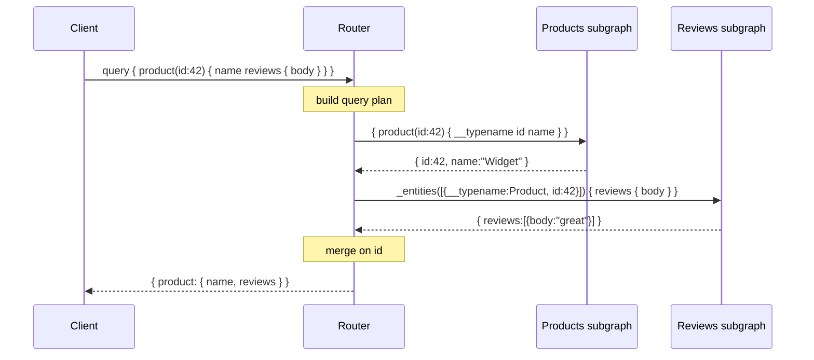

# GraphQL Federation — Interview

A tiered Q&A bank, fundamentals first, ending in staff-level judgment. Answers are meant to be spoken in 60–120 seconds each.

1. What is GraphQL Federation and what problem does it solve?
2. Subgraph, supergraph, router — define each.
3. What is an entity and what does `@key` do?
4. How does a reference resolver (`__resolveReference` / `_entities`) work?
5. Walk through how the router builds a query plan and fans out.
6. Explain `@external`, `@requires`, and `@provides`.
7. Where does N+1 bite in federation, and how does DataLoader fix it?
8. How do you reason about query-plan latency?
9. Federation vs schema-stitching vs BFF vs a single monolithic graph?
10. What is the "distributed monolith" pitfall in federation?
11. What is managed federation, and how do schema checks work in CI?
12. How does auth work across subgraphs?
13. Who owns the graph, organizationally? (staff)
14. When would you *not* choose federation?

---

## Q1: What is GraphQL Federation and what problem does it solve?

Federation is a way to compose one unified GraphQL API — the *supergraph* — out of many independently owned, independently deployed GraphQL services called *subgraphs*. The problem it solves is organizational, not just technical. A single monolithic GraphQL schema forces every team to commit to the same repo, deploy cadence, and release train; the schema becomes a shared choke point. Federation lets the Users team own the `User` type, the Reviews team own `Review`, and the Products team own `Product`, each in its own service, while clients still see a single endpoint with a single coherent schema. The magic is that types can be *split across services*: `Product` can carry `name` from the products subgraph and `reviews` from the reviews subgraph, and the router stitches them together at query time. So it solves "how do we scale a GraphQL API across dozens of teams without a shared monolith."

## Q2: Subgraph, supergraph, router — define each.

A **subgraph** is a normal GraphQL service that additionally speaks the federation spec — it exposes federation directives (`@key`, `@external`, etc.) and an `_entities` query so other services can resolve its types. It owns a slice of the overall schema. The **supergraph** is the composed artifact: a single schema produced by *composition*, which merges all subgraph schemas plus routing metadata (which field lives in which subgraph, which keys exist). It is a build-time output, not a running server. The **router** (formerly the gateway) is the runtime process clients actually talk to. It holds the composed supergraph, receives client queries, produces a *query plan*, fans out sub-requests to the relevant subgraphs, and assembles the response. Clients never talk to subgraphs directly.

## Q3: What is an entity and what does `@key` do?

An **entity** is a type whose representation can be resolved by more than one subgraph — the join point of the graph. You declare it with `@key(fields: "id")`, which names the field(s) that uniquely identify an instance. `@key` does two things: it tells composition "this type is shared and here's its identity," and it lets the router pass a minimal *representation* (`{ __typename: "Product", id: "42" }`) from one subgraph to another to fetch the missing fields. Any subgraph that wants to contribute fields to `Product` re-declares the type with the same `@key` and resolves it from that representation. A type can have multiple keys if different subgraphs identify it differently (e.g. `id` in one, `sku` in another). No `@key`, no cross-subgraph joins for that type.

## Q4: How does a reference resolver (`__resolveReference` / `_entities`) work?

Every federated subgraph automatically exposes a special root query, `_entities(representations: [_Any!]!)`, which takes a list of entity stubs — each a `__typename` plus its key fields — and returns the fully hydrated objects. Under the hood, for each representation the subgraph calls the entity's **reference resolver** (`__resolveReference` in Apollo Server), whose job is: given `{ __typename: "Product", id: "42" }`, load and return the `Product` fields this subgraph owns. This is the mechanism the router uses to "enter" a subgraph mid-query. So when a client asks for `product { name reviews }` and `reviews` lives elsewhere, the router first gets `Product` (with its `id`) from products, then calls `_entities` on the reviews subgraph with `{ __typename: "Product", id: "42" }`, and `__resolveReference` returns the reviews. It's the seam that makes a split type behave like one type.

## Q5: Walk through how the router builds a query plan and fans out.

The router parses the client operation, validates it against the supergraph, and then compiles a **query plan** — a tree of steps that says which subgraph to hit, in what order, what to send, and how to merge results. It uses the composition metadata to know that `name` is in products and `reviews` is in reviews, joined on `Product.id`. Sequential dependencies (you need the `id` from products before you can fetch reviews) become ordered `Fetch` nodes; independent branches become parallel fetches. Then it executes: fan out, collect, merge into the shape the client asked for. Critically, the router batches — if a list of ten products all need reviews, it sends one `_entities` call with ten representations, not ten calls.

## Q6: Explain `@external`, `@requires`, and `@provides`.

These three tune how fields flow across subgraph boundaries. `@external` marks a field as *owned by another subgraph but referenced here* — you're declaring it so you can depend on it, not resolving it yourself. `@requires(fields: "...")` says "to resolve *my* field, the router must first fetch these external fields and hand them to my reference resolver." Example: a shipping subgraph computes `shippingEstimate` but needs the product's `weight` and `dimensions`, which are owned by products — mark those `@external` and put `@requires(fields: "weight dimensions")` on `shippingEstimate`. `@provides(fields: "...")` is the optimization inverse: it tells the router "when you resolve this field from *my* subgraph, I can *also* hand back these normally-external fields for free," letting the planner skip an extra hop. `@requires` adds a dependency (a fetch); `@provides` removes one.

| Directive | Placed on | Meaning | Effect on query plan |
|---|---|---|---|
| `@key` | type | Identity for the entity | Enables cross-subgraph joins via `_entities` |
| `@external` | field | Field owned by another subgraph | Marks a dependency, resolved elsewhere |
| `@requires` | field | Needs external fields to resolve | Adds a fetch before this field |
| `@provides` | field | Can supply external fields inline | Removes a fetch (fast path) |

## Q7: Where does N+1 bite in federation, and how does DataLoader fix it?

N+1 shows up in two places. First, the router already avoids the *coarse* N+1 by batching representations into a single `_entities` call. But inside a subgraph, `__resolveReference` (and any nested field resolver) is invoked *once per entity in that batch* — so if each reference resolver naively hits the database, you get N queries for N entities, plus the parent query: the classic N+1. **DataLoader** fixes this by deferring individual `.load(id)` calls within a tick and firing one batched `SELECT ... WHERE id IN (...)`. The pattern is: reference resolvers and field resolvers call `loader.load(id)` instead of querying directly; the loader coalesces. It also de-dupes and per-request caches. Rule of thumb: any resolver that talks to a datastore behind an entity or a list field needs a DataLoader (or an equivalent batching layer), created fresh per request to avoid cross-request cache bleed.

## Q8: How do you reason about query-plan latency?

Federated latency is dominated by the **critical path** — the longest chain of *sequentially dependent* fetches, not the total number of fetches. Parallel fetches to different subgraphs overlap, so five independent calls cost roughly one call's latency; but a `@requires` that forces products → shipping → tax in strict order pays the sum. So when you profile a slow federated query, you look at the query plan's dependency depth: how many hops must happen in series before the client gets an answer. Levers: reduce depth with `@provides` to fold a hop away, denormalize a hot key so a downstream subgraph doesn't need an extra round trip, or push a costly join into a single subgraph. Also watch the *tail* — the router waits for the slowest subgraph in each parallel wave, so P99 of the whole query is gated by the P99 of the worst participant. Budget accordingly and consider timeouts/partial results for non-critical fields.

## Q9: Federation vs schema-stitching vs BFF vs a single monolithic graph?

All four unify data for clients, but the ownership and coupling differ sharply.

| Approach | Composition | Who owns schema | Coupling | Best when |
|---|---|---|---|---|
| **Monolithic graph** | One service, one schema | One team/repo | Tightest | Small org, one team, few services |
| **Schema stitching** | Gateway merges at runtime, manual type mapping | Gateway team, imperatively | High — gateway knows internals | Legacy; largely superseded by federation |
| **Federation** | Declarative, composed from subgraph SDL | Each team owns its subgraph | Loose, spec-driven | Many teams, shared entities, one client API |
| **BFF (backend-for-frontend)** | Per-client aggregation layer | The client team | N/A — orchestration, not a shared graph | Client-specific shaping over disparate/non-GraphQL backends |

Federation is stitching done declaratively and correctly: the gateway/router derives routing from directives instead of hand-written merge logic, so subgraph teams evolve independently. A BFF is a different axis entirely — it's an orchestration layer *for one client*, and you can even put a BFF in front of a federated supergraph.

## Q10: What is the "distributed monolith" pitfall in federation?

It's when you split into subgraphs but the teams remain so coupled that you get all the operational cost of microservices with none of the independence. Symptoms: every meaningful change requires coordinated deploys across three subgraphs; one team's schema change breaks composition for everyone; entities are so finely sliced that a single client query fans out to eight subgraphs on the critical path; ownership boundaries follow technical layers ("the ID service," "the join service") instead of domains. The root cause is drawing subgraph boundaries by data shape rather than by team/domain ownership. The fix is the same as for microservices: align subgraph boundaries with bounded contexts, keep entities coarse enough that most queries resolve within one or two subgraphs, and treat cross-subgraph `@requires` chains as a coupling smell to minimize.

## Q11: What is managed federation, and how do schema checks work in CI?

In **managed federation**, composition doesn't happen in the router at boot — it happens in a schema registry (Apollo GraphOS or equivalent). Each subgraph *publishes* its schema to the registry; the registry composes the supergraph and hands the router a signed, validated supergraph artifact out of band. The router polls for updates, so you roll out schema changes without redeploying the router, and a subgraph that would break composition is *rejected at publish time* rather than taking down the gateway. **Schema checks** are the CI gate: on every PR, the subgraph's proposed schema is validated against (a) composition — does it still compose with the current supergraph? — and (b) *operation checks* against real recorded client traffic — would this change break any query fields clients actually use? A field deletion that no live operation touches passes; one that breaks a live query fails the check. This is how you get safe, independent schema evolution.

## Q12: How does auth work across subgraphs?

The standard pattern is: **authenticate at the router, authorize in the subgraphs.** The router terminates the client's token (validates the JWT / session), and then propagates identity to subgraphs — typically by forwarding the token or by injecting trusted headers (user id, roles, scopes) after verifying it. Each subgraph enforces its own field- and object-level authorization against that context, because only the owning subgraph knows the rules for its data. You must not let a subgraph implicitly trust a client-supplied header; lock the network so subgraphs only accept traffic from the router, or sign the propagated context. A subtle federation-specific issue: a field resolved via `_entities` in subgraph B must still enforce B's auth for that entity, even though the client "entered" through subgraph A — authorization can't leak across the join. For declarative rules, `@authenticated` / `@requiresScopes` / policy directives push enforcement into the schema itself.

## Q13: Who owns the graph, organizationally? (staff)

This is the question that decides whether federation succeeds. Federation is a *federated* model precisely so that no single team owns the whole schema — but "no owner" fails differently: naming drift, duplicated entities, inconsistent pagination, incompatible error conventions, and turf wars over who owns `User`. The working model is **federated ownership with central governance.** Domain teams own their subgraphs end to end (schema, resolvers, SLAs, on-call). A small central *graph platform / graph guild* owns the router, the schema registry, CI schema checks, composition health, and — crucially — the *conventions*: naming, entity-key discipline, error and pagination standards, deprecation policy, and who arbitrates ownership of shared entities. Think of it like the API-council model: the platform team doesn't write domain schema, it makes it *safe and consistent* for many teams to write schema concurrently. Getting this wrong is the number-one reason federation programs stall — the technology composes fine, the org doesn't.

## Q14: When would you *not* choose federation?

When the coordination cost outweighs the independence benefit. If you have one team and a handful of services, a single monolithic GraphQL server is simpler, has no query-plan latency, no composition pipeline, and no router to operate — federation is premature. If your backends aren't GraphQL and you only need to shape data for one or two clients, a BFF is a lighter answer than standing up a supergraph. If your "entities" don't actually share join keys across domains — services are genuinely independent with no cross-cutting types — then federation buys you nothing but a router hop. And if the org isn't ready to invest in graph governance (Q13), federation will decay into a distributed monolith. Reach for federation when you have *many teams*, *genuinely shared entities*, and *one client-facing graph* as hard requirements — that intersection is where it pays.

---

*Next step:* [gRPC and Streaming — Junior](../04-grpc-and-streaming/junior.md)
