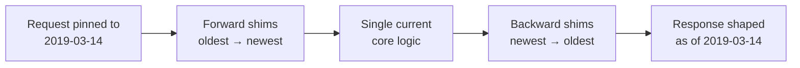

# Versioning and Deprecation — Interview

A tiered Q&A bank. Questions run from fundamentals to staff-level judgment. Answers are tight and assume a working knowledge of HTTP APIs.

1. Why version an API at all?
2. What separates a breaking change from a non-breaking one?
3. What are the main versioning styles and their trade-offs?
4. Does SemVer apply cleanly to web APIs?
5. What is the additive-only / "tolerant reader" alternative to versioning?
6. How do date-pinned versions and transformation shims work (the Stripe model)?
7. How do you signal deprecation over the wire?
8. What does schema-registry compatibility (BACKWARD/FORWARD/FULL) actually mean?
9. What is consumer-driven contract testing and when do you reach for it?
10. How do you detect breaking changes automatically in CI?
11. What does a deprecation policy and sunset SLA look like at org scale?
12. How do you handle a forced breaking change you cannot avoid?
13. Path vs header versioning — which would you pick and defend?
14. Walk through the full deprecation lifecycle for a public endpoint.

---

## Q1: Why version an API at all?

Because an API is a contract with clients you do not control and cannot redeploy in lockstep. The moment a third party — or another team — writes code against your response shape, that shape becomes load-bearing. Versioning is the mechanism that lets the *server* evolve while existing *clients* keep working. The goal is not "having versions"; it is decoupling your release cadence from your consumers' upgrade cadence. If you could redeploy every client atomically with the server (a single monorepo, one deploy pipeline), you would barely need versioning at all — you would just change both sides together. Versioning is fundamentally a distributed-systems problem: two independently deployed parties must agree on a wire format across time.

## Q2: What separates a breaking change from a non-breaking one?

A change is breaking if a correctly-written existing client can observe different behavior that violates its assumptions. The reliable test is: *could a reasonable consumer's code fail because of this?* Removing or renaming a field, tightening validation, changing a type, changing default behavior, altering error codes, or making an optional request field required are all breaking. Adding an optional field, adding a new endpoint, adding a new enum value *if clients were told to tolerate unknowns*, or adding a new optional query parameter are generally non-breaking.

| Change | Breaking? | Why |
|---|---|---|
| Add a new optional response field | No | Old clients ignore unknown fields |
| Add a new endpoint | No | Nothing existing references it |
| Remove or rename a response field | Yes | Client reads a field that vanishes |
| Change a field's type (`string` → `int`) | Yes | Deserialization / parsing breaks |
| Make an optional request field required | Yes | Existing calls now rejected |
| Tighten validation on an input | Yes | Previously-valid requests now fail |
| Add a new enum value | Maybe | Breaks clients that switch exhaustively |
| Loosen validation / widen an accepted range | No | Superset of prior behavior |
| Change pagination default page size | Yes | Silent behavior change clients depend on |
| Add a new error code for an existing condition | Maybe | Breaks clients matching on specific codes |

The "Maybe" rows are the interesting ones — they are breaking *unless* you established a tolerance contract up front (Q5).

## Q3: What are the main versioning styles and their trade-offs?

There are four common places to carry the version: the URI path, a custom header, the `Accept` media type, or a query parameter.

| Style | Example | Pros | Cons |
|---|---|---|---|
| URI path | `GET /v2/users/42` | Obvious, cacheable, easy to route and curl, visible in logs | Pollutes URLs; same resource has multiple canonical URIs; encourages coarse v1→v2 jumps |
| Header | `API-Version: 2` | Clean URLs; one canonical URI per resource | Invisible in browser/logs; easy to forget; harder to cache; needs tooling to test |
| Media type | `Accept: application/vnd.acme.v2+json` | Purest REST (content negotiation); per-representation granularity | Verbose; poor tooling/CDN support; steep client learning curve |
| Query param | `GET /users/42?version=2` | Trivial to add; visible | Muddies query semantics; easy to strip by proxies/caches; weak convention |

In practice URI path versioning dominates public APIs because it is the most legible and the easiest to route at the edge, while large platforms that want fine-grained evolution lean on header or date-based schemes (Q6). There is no "correct" answer — pick based on who your consumers are and how much control you have over their tooling.

## Q4: Does SemVer apply cleanly to web APIs?

Partially. SemVer's *concepts* map well — MAJOR = breaking, MINOR = additive, PATCH = fix — but the *format* does not survive contact with HTTP. You rarely see `/v2.3.1/` in a URL because minor and patch changes are, by definition, backward-compatible and therefore should not force clients to change the version they call. So the practical convention is: expose only the MAJOR version on the wire (`/v2`), and let minor/patch changes ship silently under it. SemVer stays useful internally — for your SDKs, your changelog, and your OpenAPI document version — but the URL surface only ever needs the breaking-change counter. If you find yourself wanting `/v2.1/`, that is usually a smell that you are shipping breaking changes and mislabeling them as minor.

## Q5: What is the additive-only / "tolerant reader" alternative to versioning?

It is the discipline of *never* introducing a breaking change, so you never need a v2 at all. You only ever add fields, add endpoints, and widen inputs; you never remove, rename, or tighten. The client side of the bargain is the *tolerant reader* (Postel's Law): clients must ignore fields they don't recognize, not fail on unexpected enum values, and not assume field ordering. Google's API design guide and much of Stripe's philosophy live here — they treat a new major version as a near-failure of design, something to avoid for years. The payoff is that there is only one version to operate, monitor, and secure. The cost is discipline and a bit of accreted cruft (fields you wish you could rename but can't). This is often the *best* answer in an interview: the cheapest version to maintain is the one you never had to create.

## Q6: How do date-pinned versions and transformation shims work (the Stripe model)?

Stripe's approach combines additive-only internals with per-account *date-pinned* versions on the boundary. Each account is pinned to the API version (a date, e.g. `2024-06-20`) that was current when it first integrated; a request can override this per-call with a `Stripe-Version` header. Internally, Stripe maintains *one* current codebase. When they must make a breaking change, they don't fork the code — they write a small, ordered **transformation shim** (a "version change") that rewrites the current response *backward* into the shape each older version expected, and rewrites old requests *forward* into the current shape.

Each breaking change is one composable shim in a chain. A very old client passes through many shims; a current client passes through none. This gives you effectively infinite live versions with only *one* code path to maintain and test — the shims are the only version-specific code. The trade-off is that the shim chain accretes forever and eventually motivates a real deprecation of the oldest versions.

## Q7: How do you signal deprecation over the wire?

Use the standard HTTP headers so tooling can react automatically rather than relying on humans reading a blog post. **RFC 8594** defines the `Sunset` header — an HTTP-date after which the resource is expected to stop working: `Sunset: Sat, 30 Nov 2024 23:59:59 GMT`. The complementary `Deprecation` header (from the "Deprecation HTTP Header Field" draft) marks a resource as deprecated, optionally with the date it became so. Pair both with a `Link` header pointing at the migration docs and the successor version: `Link: <https://api.acme.com/docs/v2-migration>; rel="deprecation"`. Return these on *every* response from the deprecated endpoint, not just once, so a client scanning its logs will see them regardless of which call it inspects. Well-behaved SDKs surface these as warnings; internal platforms can alert on them centrally.

## Q8: What does schema-registry compatibility (BACKWARD/FORWARD/FULL) actually mean?

For event/message schemas (protobuf, Avro, JSON Schema) a schema registry enforces evolution rules so producers and consumers can be deployed independently. The modes describe *which side can be old*:

- **BACKWARD** — new schema can read data written with the *previous* schema. This is what lets you upgrade **consumers first**. You can add optional fields with defaults and remove fields. Most common default.
- **FORWARD** — old schema can read data written with the *new* schema. This lets you upgrade **producers first** — new data must still be readable by consumers on the old schema. You can add fields and remove optional ones.
- **FULL** — both hold simultaneously: only changes that are safe in either deployment order are allowed (essentially, add/remove optional fields with defaults).
- **TRANSITIVE** variants check compatibility against *all* prior versions, not just the immediately previous one.

Protobuf makes much of this structurally cheap because it keys on field *numbers*, never names — you must never reuse or renumber a field tag, and you `reserved` retired ones. Avro relies on writer/reader schema resolution with defaults. The registry turns "did I break the pipeline?" from a production incident into a rejected commit.

## Q9: What is consumer-driven contract testing and when do you reach for it?

Consumer-driven contracts (CDC, e.g. Pact) invert who owns the spec: each *consumer* publishes the subset of the provider's behavior it actually relies on — the specific fields, endpoints, and shapes it reads — as an executable contract. The *provider* then runs all its consumers' contracts against its build. The moment the provider makes a change that breaks any real consumer's expectation, the provider's CI goes red, *before* deploy. This is powerful for internal microservices where you own both sides and want to know the blast radius of a change without integration-testing the whole mesh. It answers a question OpenAPI diffing cannot: "does anyone *actually use* the thing I'm about to change?" — a field can be removed safely if no consumer contract references it. It is less applicable to large public APIs where you don't know or control your consumers; there you fall back on additive discipline plus usage analytics.

## Q10: How do you detect breaking changes automatically in CI?

Make the spec the source of truth and diff it on every PR. For OpenAPI, tools like `oasdiff`, `openapi-diff`, or Optic compare the proposed spec against the deployed baseline and classify each change as breaking / non-breaking, failing the build on a breaking one unless explicitly acknowledged. For protobuf, `buf breaking` checks against a baseline (a git ref or a registry) and enforces rules like "no field renumbering, no wire-incompatible type changes." For GraphQL, schema-diff tools flag removed fields or narrowed types. Layer contract tests (Q9) on top for the "is it *used*" signal. The principle: a breaking change should never be able to reach production silently — it should require a human to look at a red check and consciously decide to bump the major version or write a shim. Cheap gate, enormous payoff.

## Q11: What does a deprecation policy and sunset SLA at org scale look like?

At scale, deprecation is a *governed process*, not an ad-hoc decision. A mature policy specifies: (1) a **guaranteed support window** per version tier — e.g. a public major version is supported for N months after its successor GA's, longer for enterprise contracts; (2) a **communication protocol** — announcement, `Deprecation`/`Sunset` headers on responses, changelog, direct outreach to top consumers identified via usage analytics; (3) **usage-gated retirement** — you do not turn off a version while meaningful traffic remains; you watch the call volume decay and chase the long tail of stragglers directly; (4) **brownouts** — scheduled short outages of the deprecated version before final sunset, so clients that ignored every warning discover the dependency in a controlled window rather than at final cutoff. The staff-level insight is that *deprecation is a product and comms problem as much as an engineering one* — the technical removal is trivial; safely getting thousands of consumers to migrate without breaking their businesses is the hard part. You measure success by "traffic to the old version at sunset," and you never sunset on a Friday.

## Q12: How do you handle a forced breaking change you cannot avoid?

Some breaks are non-negotiable — a security vulnerability, a legal requirement (GDPR field removal), or a data-integrity bug where the *old* behavior is actively wrong. When additive-only isn't an option, you minimize blast radius and maximize warning. First, scope it as narrowly as possible: change one field or one endpoint, not the whole surface. Second, if the change is a *fix* to broken behavior, consider gating the corrected behavior behind an opt-in flag/header initially, then flipping the default after a migration window. Third, for genuine security issues you may have to break fast — but you still communicate loudly, provide a clear migration path, and where possible ship a compatibility shim (Q6) so most clients are unaffected. Fourth, instrument heavily so you can see exactly who breaks and reach them. The honest interview answer: you cannot always keep the promise, so you invest in the tools (usage analytics, shims, contract tests) that let you break *surgically* when you must, rather than pretending it never happens.

## Q13: Path vs header versioning — which would you pick and defend?

For a **public** API consumed by developers writing against docs and testing with curl, I'd default to **URI path** (`/v2`). It is legible, it shows up in logs and analytics for free, it caches cleanly, and it is trivial to route at the gateway. The cost — impure REST semantics and coarse-grained jumps — is acceptable because most public APIs bump majors rarely and want maximum discoverability. For an **internal** platform or a system that wants fine-grained, frequent, backward-compatible evolution — where consumers are your own services and you control their SDKs — I'd lean toward **header or date-based** versioning, because it keeps one canonical URI per resource and pairs naturally with additive-only evolution and shims. The defense in both cases is the same: match the mechanism to the consumer's tooling and your evolution frequency. The wrong answer is dogmatism about REST purity; the right answer is picking for the humans and machines that will actually call the thing.

## Q14: Walk through the full deprecation lifecycle for a public endpoint.

```mermaid
stateDiagram-v2
  [*] --> Active
  Active --> Deprecated: successor GA'd;<br/>Deprecation header on
  Deprecated --> Sunsetting: Sunset date set;<br/>outreach to top callers
  Sunsetting --> Brownout: scheduled short<br/>outages test dependents
  Brownout --> Retired: traffic decayed;<br/>endpoint removed
  Retired --> [*]
  Deprecated --> Deprecated: monitor usage decay
```

The stages: **Active** (fully supported). **Deprecated** — the successor is generally available, you emit `Deprecation` headers, publish the migration guide, and announce; the endpoint keeps working with zero behavior change. **Sunsetting** — you set a concrete `Sunset` date (respecting your support-window SLA), identify the top remaining consumers via analytics, and reach out directly. **Brownout** — before the hard cutoff you run short, announced outages so silent dependents surface in a controlled window. **Retired** — once traffic has decayed to a negligible long tail, you remove the endpoint (or return `410 Gone` with a pointer to the successor). Throughout, the guiding metric is residual traffic: you let *data*, not a calendar alone, tell you when it's safe to pull the plug.

---

*Next step:* [Pagination and Filtering — Junior](../06-pagination-and-filtering/junior.md)
