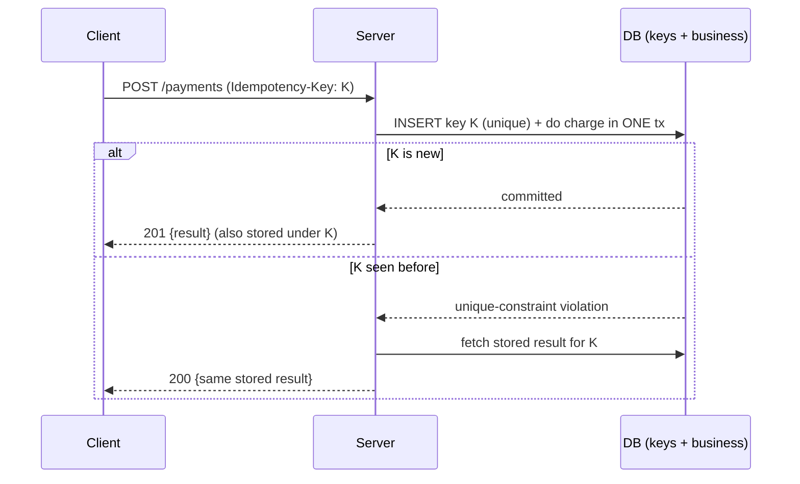

# Idempotency and Retries — Interview

A tiered Q&A bank, from fundamentals to staff-level judgment. Each answer is written to be spoken in an interview: tight, concrete, and honest about trade-offs.

1. What does "idempotent" actually mean?
2. Why do timeouts force retries, and why is that dangerous?
3. Which HTTP methods are idempotent, and which are not?
4. Walk me through the double-charge problem.
5. How does an idempotency-key flow work end to end?
6. Two identical requests with the same key arrive concurrently — what breaks and how do you fix it?
7. Why must the key record and the business write share one transaction?
8. Natural idempotency vs. bolt-on idempotency keys — when do you need a key at all?
9. Is exactly-once delivery real?
10. Why exponential backoff, and why is jitter non-negotiable?
11. What is a retry storm / metastable failure, and how do you prevent it?
12. How do you make a message consumer idempotent?
13. How would you make idempotency and retries a platform default? (staff)
14. What are the common failure modes of idempotency implementations you'd watch for in review?

---

## Q1: What does "idempotent" actually mean?

An operation is idempotent if performing it once or many times yields the same resulting state. It is not about returning the same response bytes — it is about the effect on the system. `DELETE /orders/42` is idempotent because after the first call the order is gone and every subsequent call leaves it gone, even though the first returns `200` and the rest return `404`. The property matters because networks are unreliable: if you cannot tell whether a request landed, the only safe recovery is to retry, and retrying is only safe when the operation is idempotent. So idempotency is the enabling property that makes retries a correctness tool rather than a source of duplicate side effects.

## Q2: Why do timeouts force retries, and why is that dangerous?

A client that sends a request and receives no response within its deadline is in a state of genuine ambiguity: the request may never have arrived, may have arrived and been processed but the response was lost on the way back, or may still be in flight. The client cannot distinguish these cases — a timeout is silence, not information. The only options are to retry (risking a duplicate if the original succeeded) or to give up (risking a lost operation if the original failed). For anything that must not be lost, you retry. That is why every retry mechanism eventually collides with idempotency: retries are unavoidable, so duplicate delivery is unavoidable, so you must design the operation to tolerate being applied more than once.

## Q3: Which HTTP methods are idempotent, and which are not?

The semantics are defined by the spec, not by your implementation — though a buggy handler can violate them.

| Method | Idempotent | Safe (read-only) | Typical use |
|--------|-----------|------------------|-------------|
| GET    | Yes | Yes | Fetch a resource |
| HEAD   | Yes | Yes | Fetch headers only |
| PUT    | Yes | No | Replace a resource at a known URI |
| DELETE | Yes | No | Remove a resource |
| POST   | **No** | No | Create / append / trigger |
| PATCH  | **No** (not guaranteed) | No | Partial update |

`PUT` is idempotent because it sets the resource to a full, absolute state — writing the same body twice leaves the same state. `POST` is the problem child: it typically means "create a new subordinate resource," so calling it twice tends to create two resources. `PATCH` is not guaranteed idempotent because a delta like "increment balance by 10" applied twice is wrong; only if the patch expresses an absolute value is it idempotent. The practical upshot: retries are safe for `GET/PUT/DELETE` by default, and `POST` is exactly where you need an idempotency key.

## Q4: Walk me through the double-charge problem.

A client calls `POST /payments` to charge a card. The server authorizes the charge with the payment processor, commits, and starts sending the response — but the connection drops or the client's deadline expires before the `200` arrives. The client sees a timeout, cannot tell the charge succeeded, and retries. The second request authorizes the card again. The customer is charged twice. This is the canonical motivating example because it is common (mobile networks drop constantly), high-stakes (money), and structurally unavoidable with a naive `POST` — the ambiguity in Q2 guarantees that a correctly-behaving client will sometimes double-submit. The fix is to make the create operation idempotent via a key the client generates once and reuses across retries.

## Q5: How does an idempotency-key flow work end to end?

The client generates a unique key (a UUID) for the logical operation, once, and attaches it — conventionally as an `Idempotency-Key` header — to the request and to every retry of that same request. The server treats the key as the deduplication token:

On a first-seen key the server performs the work and records both the key and the response. On a replay of that key it does no work and returns the previously stored response. The client experiences the operation as having happened exactly once regardless of how many times it retried. Keys should carry a TTL (hours to a day) so the store does not grow unbounded, and the key must be scoped per endpoint/account so unrelated calls cannot collide.

## Q6: Two identical requests with the same key arrive concurrently — what breaks and how do you fix it?

The naive implementation is a read-then-write: "look up the key; if absent, do the work and insert it." Under concurrency both requests read "absent" before either inserts, both proceed, and you double-execute — the exact bug the key was supposed to prevent. This is a check-then-act race. The robust fix is to let the database enforce mutual exclusion with a **unique constraint** on the key column and to insert first. Exactly one insert wins; the loser gets a unique-violation and must not re-execute — instead it either returns the stored result or, if the winner is still in flight, waits/polls or returns a `409`. Never rely on application-level "check if exists" for this; the guarantee has to come from the store's atomicity, not from your control flow.

## Q7: Why must the key record and the business write share one transaction?

If you insert the idempotency key in one transaction and perform the business write in another, a crash between them corrupts your guarantee in one of two directions. If the key commits but the business write fails, all future retries see the key, assume the work was done, and skip it — the operation is silently lost. If the business write commits but the key does not, retries re-execute the work — the double-charge returns. The only correct design is to make the dedup marker and the side effect **atomic**: same transaction, commit together or roll back together. When the side effect lives in an external system that cannot join your DB transaction (a payment processor, an email), you cannot get true atomicity, so you fall back to the outbox pattern — write an intent row atomically with the key, then have a separate reliable worker perform the external call idempotently and mark it done.

## Q8: Natural idempotency vs. bolt-on idempotency keys — when do you need a key at all?

Prefer natural idempotency: design the operation so repetition is inherently harmless, and you never touch a key store. `PUT /users/42` with a full body is naturally idempotent — applying it twice sets the same state. Upserts keyed on a stable business identifier ("insert this order with client-supplied order_id, do nothing on conflict") are naturally idempotent. A key is only needed when the operation is intrinsically non-idempotent and lacks a stable client-supplied identity — most notably `POST` that *creates* a new resource with a server-generated id, or a `POST` that *triggers* a side effect like charging a card or sending a message. The design instinct is: first try to reshape the operation to carry its own identity (client-generated id, absolute-value semantics); reach for the bolt-on `Idempotency-Key` only when you genuinely cannot.

## Q9: Is exactly-once delivery real?

Exactly-once *delivery* over an unreliable network is a myth — you can guarantee at-most-once (never retry, risk loss) or at-least-once (retry, risk duplicates), but not both at the transport level, because the sender can never be certain a message was received. What you can achieve is exactly-once *effect*, often called "effectively-once," by combining at-least-once delivery with idempotent processing: the network may deliver a message one-to-many times, and a deduplicating consumer collapses those duplicates so the observable state changes once. So the honest framing in an interview is: stop trying to make delivery exactly-once; make delivery at-least-once and make the receiver idempotent. That is the only architecture that survives real failures.

## Q10: Why exponential backoff, and why is jitter non-negotiable?

Retrying immediately, or on a fixed interval, is counterproductive: the failure is often caused by load or a transient outage, and hammering the dependency at the same cadence keeps it down. Exponential backoff (delay doubles: 1s, 2s, 4s, 8s, capped) backs off fast enough to relieve pressure and give the dependency room to recover. But pure exponential backoff still synchronizes clients — if a thousand callers all failed at the same instant, they all wait exactly 1s, then all 2s, and retry in tight, aligned waves that re-overload the service. **Jitter** randomizes the delay so retries spread out over the interval instead of stacking into spikes.

| Strategy | Delay formula | Behavior |
|----------|---------------|----------|
| Fixed | `d` constant | Synchronized waves; no relief under load |
| Exponential, no jitter | `base * 2^n` | Backs off, but clients stay in lockstep — thundering herd persists |
| Exponential + full jitter | `random(0, base * 2^n)` | Spreads retries evenly; best de-synchronization (AWS's recommended default) |
| Exponential + equal jitter | `half + random(0, half)` | Some spread, guarantees a minimum wait |

Full jitter is the usual recommendation: it minimizes contention and completion time under high concurrency. The one-line answer: backoff protects the dependency; jitter protects it from your own synchronized clients.

## Q11: What is a retry storm / metastable failure, and how do you prevent it?

A retry storm is a positive feedback loop: a dependency slows down, callers time out and retry, retries multiply the request volume, the added load slows the dependency further, which causes more timeouts and more retries. The system can settle into a **metastable failure state** where it stays down even after the original trigger is gone, because the retry traffic is now self-sustaining — removing the trigger doesn't help because the load is generated by the retries themselves. Three controls break the loop. **Retry budgets** cap retries as a fraction of total traffic (e.g., retries may add at most 10%), so a bad dependency can't be amplified 3x. **Circuit breakers** trip open when a dependency's error rate crosses a threshold, failing fast and shedding load instead of piling on retries, then probing periodically to close. **Bounded retries with jittered backoff** ensure each caller gives up rather than retrying forever. The staff-level point is that a retry policy without a budget or breaker is a liability — it's an availability risk disguised as a resilience feature.

## Q12: How do you make a message consumer idempotent?

At-least-once brokers redeliver, so a consumer will sometimes process the same message twice — on redelivery after a crash, on rebalance, or on ack loss. Make the handler idempotent by deduplicating on a stable message id: keep a processed-ids table and, in the **same transaction** as the business write, insert the id under a unique constraint; if the insert conflicts, the message was already handled and you skip the effect and ack. This is the Q6/Q7 pattern applied to messaging — the dedup marker and the side effect commit atomically, so a crash can't split them. On the producing side, use the **transactional outbox**: write the domain change and the outbound event to an outbox table in one local transaction, then a relay publishes from the outbox at-least-once. That guarantees the event is emitted iff the state change committed (no dual-write inconsistency), and the downstream consumer's dedup absorbs the at-least-once duplicates. Together, outbox on the send side plus idempotent-by-id consumption on the receive side gives you effectively-once end to end.

## Q13: How would you make idempotency and retries a platform default? (staff)

Individual teams re-implementing dedup and backoff produces subtle, divergent bugs — races that only surface under load, retry loops with no budget, keys with no TTL. The staff move is to make correct behavior the path of least resistance. On the **server side**, ship idempotency as shared middleware: a standard `Idempotency-Key` contract, a common key store with unique-constraint enforcement and TTL, and the atomic key-plus-response recording built in, so any mutating endpoint gets it by opting in rather than hand-rolling it. On the **client side**, ship a hardened RPC/HTTP library with exponential backoff, full jitter, bounded attempts, a retry budget, and circuit breakers *on by default*, plus automatic key generation-and-reuse across retries so callers can't accidentally send a fresh key per attempt. Then enforce it: lint or review gates that flag mutating endpoints without idempotency handling and clients that retry without a budget. The goal is that the safe pattern is the default and the unsafe one requires deliberate, visible effort — you're changing the incentive gradient, not writing a wiki page.

## Q14: What are the common failure modes of idempotency implementations you'd watch for in review?

Six recur often enough to keep a checklist. **Check-then-act races** — dedup done in application logic instead of via a unique constraint, so concurrency double-executes (Q6). **Split key/business writes** — the marker and the side effect in separate transactions, so a crash between them either loses the operation or re-executes it (Q7). **Client regenerates the key per retry** — a new UUID on each attempt defeats dedup entirely; the key must be minted once for the logical operation. **Storing the request but not the response** — a replay is detected but the server can't return the original result, so it returns an inconsistent or error response. **Unbounded key growth** — no TTL, the store bloats forever. **Retry without a budget or breaker** — the mechanism that's supposed to add resilience becomes the amplifier in a metastable outage (Q11). In review I'd trace one mutating request through both the happy path and a mid-flight crash, and confirm the unique constraint and the shared transaction are actually there — because those two are what turn a plausible-looking implementation into a correct one.

---

*Next step:* [Webhooks — Junior](../08-webhooks/junior.md)
