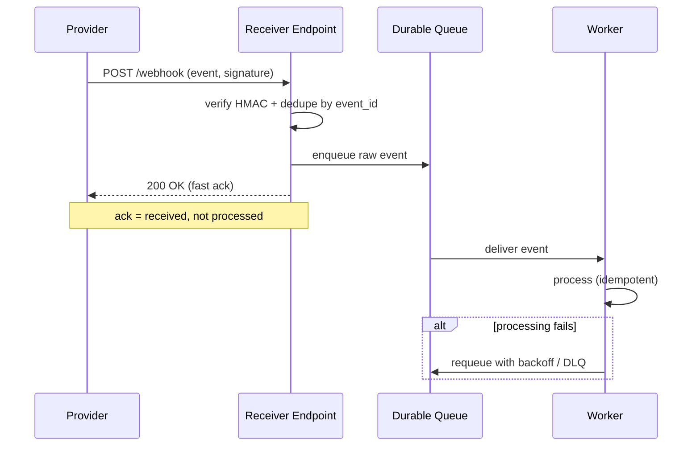
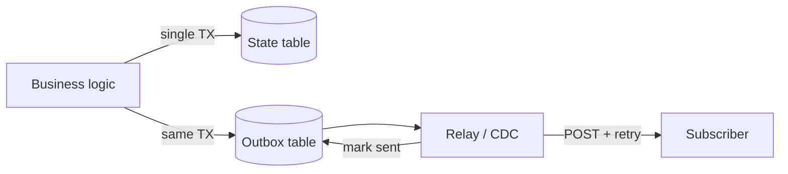

# Webhooks — Interview

A tiered question bank, fundamentals first, then the judgment questions a staff engineer gets when a webhook system becomes a platform. Answers are tight and opinionated — the goal is to sound like someone who has run one in production, not read one blog post.

1. [Q1: What is a webhook, and why not just poll?](#q1-what-is-a-webhook-and-why-not-just-poll)
2. [Q2: Walk me through the delivery mechanics.](#q2-walk-me-through-the-delivery-mechanics)
3. [Q3: How does a receiver verify a webhook is authentic?](#q3-how-does-a-receiver-verify-a-webhook-is-authentic)
4. [Q4: How do you stop replay attacks?](#q4-how-do-you-stop-replay-attacks)
5. [Q5: Delivery is at-least-once. What does that force on the receiver?](#q5-delivery-is-at-least-once-what-does-that-force-on-the-receiver)
6. [Q6: Why fast-ack and process async?](#q6-why-fast-ack-and-process-async)
7. [Q7: Design the provider-side retry and DLQ strategy.](#q7-design-the-provider-side-retry-and-dlq-strategy)
8. [Q8: Ordering isn't guaranteed. How do receivers cope?](#q8-ordering-isnt-guaranteed-how-do-receivers-cope)
9. [Q9: Thin events or fat events?](#q9-thin-events-or-fat-events)
10. [Q10: How do you avoid the dual-write problem when emitting events?](#q10-how-do-you-avoid-the-dual-write-problem-when-emitting-events)
11. [Q11: What are the security risks on the sending side?](#q11-what-are-the-security-risks-on-the-sending-side)
12. [Q12: Webhooks vs SSE vs WebSocket vs polling vs message bus — when each?](#q12-webhooks-vs-sse-vs-websocket-vs-polling-vs-message-bus--when-each)
13. [Q13: How do you rotate the signing secret without breaking receivers?](#q13-how-do-you-rotate-the-signing-secret-without-breaking-receivers)
14. [Q14: You own webhooks as a platform across the org. What does that change?](#q14-you-own-webhooks-as-a-platform-across-the-org-what-does-that-change)

---

## Q1: What is a webhook, and why not just poll?

A webhook is a provider-initiated HTTP callback: instead of the subscriber asking "anything new?" on a schedule, the provider POSTs an event to a URL the subscriber registered when something happens. It inverts the direction of the request — the server calls the client — which is why webhooks are sometimes called "reverse APIs."

The alternative is polling, and the trade-offs are stark. Polling burns request budget on both sides whether or not anything changed; if you poll every 30 seconds, 99%+ of those calls return "nothing new," and your latency floor is still 30 seconds. Webhooks push near-real-time and cost nothing when idle. The catch is that webhooks make the subscriber run an internet-facing endpoint that must be always-on, authenticated, idempotent, and fast — polling pushes all of that complexity onto a client cron job. Poll when the subscriber can't host a public endpoint, when events are extremely frequent (batching a poll beats a flood of callbacks), or when you can tolerate the latency. Webhook when events are sparse-to-moderate and freshness matters.

## Q2: Walk me through the delivery mechanics.

The provider sends an HTTP `POST` to the subscriber's registered URL. The body carries the event payload (usually JSON), and headers carry metadata: an event ID, event type, a delivery ID, a timestamp, and a signature. The subscriber is expected to return a fast `2xx` — typically `200` or `204` — to acknowledge receipt. Anything else (a `4xx`, a `5xx`, a timeout, a connection reset) is treated as a failed delivery and scheduled for retry.

The critical contract is "acknowledge fast." Providers like Stripe and GitHub give you a tight timeout — on the order of a few seconds — to respond. The `2xx` means "I have durably received this," not "I have fully processed this." If you do expensive work (charge a card, send email, run a report) inline before responding, you'll blow the timeout on a slow day, the provider will retry, and now you're processing the same event twice while also looking unreliable. Ack means received, not done.

## Q3: How does a receiver verify a webhook is authentic?

Your endpoint is public, so anyone can POST to it. Authenticity comes from a shared secret and a signature. The provider computes an HMAC — SHA-256 is the standard — over the request, keyed by a secret shared only with you, and sends the result in a header (Stripe's `Stripe-Signature`, GitHub's `X-Hub-Signature-256`). You recompute the HMAC over the received bytes with the same secret and compare.

Three details separate a correct implementation from a subtly broken one. First, sign the timestamp concatenated with the payload — `HMAC(secret, timestamp + "." + raw_body)` — so the signature also binds the send time (this is what enables replay protection in Q4). Second, sign and verify the **raw request bytes**, not a re-serialized object; parsing and re-encoding JSON reorders keys and changes whitespace, which changes the hash and breaks verification. Third, compare with a **constant-time** comparison (`hmac.compare_digest`, `crypto.timingSafeEqual`) — a naive `==` short-circuits on the first differing byte and leaks, via timing, how much of a forged signature was correct, which is enough to mount a byte-by-byte forgery attack. HMAC verification also implicitly guarantees integrity: any tampering with the body invalidates the signature.

## Q4: How do you stop replay attacks?

Signature verification alone proves the payload is authentic and untampered — but a valid, signed request captured off the wire (or resent by a malicious proxy) is *still* valid. Replay protection stops an attacker from re-sending a legitimately signed webhook.

Two layers. First, because the signature covers the timestamp (Q3), an attacker can't alter it without breaking the signature — so you reject any request whose timestamp is outside a tolerance window, typically five minutes. That bounds how long a captured request stays useful. Second, because delivery is at-least-once anyway (Q5), you dedupe on the event ID: track IDs you've already processed and drop repeats. The timestamp window limits the exposure; the ID dedupe makes replays harmless even inside the window. Enforce HTTPS so the payload and signature aren't captured in cleartext to begin with.

## Q5: Delivery is at-least-once. What does that force on the receiver?

Because providers retry on any non-`2xx` or timeout, and because a delivery can succeed on their side but the ack can be lost in flight, **the same event will eventually be delivered more than once.** This isn't an edge case; it's the guarantee. Exactly-once delivery over an unreliable network is not achievable — the honest options are at-least-once (retry, risk duplicates) or at-most-once (don't retry, risk loss), and every serious webhook provider chooses at-least-once.

That pushes idempotency onto the receiver. Each event carries a stable, unique ID. On receipt you check whether you've already processed that ID — a unique constraint on an `event_id` column, or a `SETNX` in Redis with a TTL — and if so, ack and stop. The processing itself should be idempotent where possible (upserts, not blind inserts; "set balance to X," not "add X"). The mental model: the network gives you *at-least-once delivery*, and you build *effectively-once processing* on top of it with dedupe.

## Q6: Why fast-ack and process async?

Two forces converge. The provider imposes a short ack timeout (Q2), and your business logic — charging a card, calling three downstream services, generating a PDF — can be slow and can fail transiently. If you process inline, one slow dependency makes you miss the timeout, the provider retries, and you've coupled your reliability to theirs.

So the receiver does the minimum synchronously: verify the signature, dedupe, persist the raw event to a durable queue or table, and return `2xx`. A separate worker pool picks up events and does the real processing, with its own retries and its own failure handling that are completely decoupled from the provider's timeout. This is the single most important architectural rule for a receiver — validate-persist-ack in milliseconds, process later. It also means a bug in your processing logic doesn't cause the provider to hammer you with retries; you've already acked, and you can reprocess from your own store.

## Q7: Design the provider-side retry and DLQ strategy.

When a delivery fails, retry with **exponential backoff and jitter**, not a fixed interval — a fixed interval means every failing endpoint gets hammered on the same cadence, and when the endpoint recovers, all pending retries stampede it simultaneously. Backoff spreads the load; jitter (a random offset) de-synchronizes retries across many events aimed at the same URL. A typical schedule stretches from seconds to hours over a day or more (Stripe retries with backoff for up to ~3 days).

You need a stopping condition. After N attempts or a max age, stop retrying and move the delivery to a **dead-letter queue** — a durable record of "we gave up on this one." The DLQ is not a graveyard; it's an operational surface. Subscribers get a dashboard to inspect failed deliveries and a "resend" button; you can bulk-replay from the DLQ once a subscriber fixes their endpoint. Also distinguish failure classes: a `410 Gone` or a persistently dead endpoint should trigger **auto-disable** with a notification rather than pointless retries for three days, while a `503` is a transient signal to back off and keep trying. Retrying a `400` (the receiver rejected the payload as malformed) is usually pointless — that won't fix itself.

## Q8: Ordering isn't guaranteed. How do receivers cope?

Retries, backoff, parallel delivery workers, and network reordering mean events arrive out of order. A `resource.updated` can land before the `resource.created`, or an old update can arrive after a newer one. If your logic assumes order, it will corrupt state.

Two robust patterns. First, **re-fetch current state**: treat the webhook as a *notification that something changed*, not as the source of truth, and on receipt call the provider's API to fetch the object's current state. This sidesteps ordering entirely — whatever you fetch is authoritative and current — at the cost of an extra API round-trip and a coupling to the read API. Second, **sequence numbers or versions**: if events carry a monotonic sequence or a version/`updated_at`, the receiver keeps the last version it applied per resource and discards any event with an older or equal version (last-writer-wins). Fat-event designs that embed the full new state pair well with this. The anti-pattern is trusting arrival order and applying deltas blindly; that's the classic way a webhook consumer ends up with a balance or status that's silently wrong.

## Q9: Thin events or fat events?

A **thin event** (notification-only) carries just enough to say "resource X of type Y changed" — an ID and event type — and the receiver fetches details from the API. A **fat event** embeds the full resource state in the payload. Each has real trade-offs.

| Dimension | Thin event | Fat event |
|---|---|---|
| Payload size | Small | Large |
| Extra API call | Required to get details | None |
| Data freshness | Always current (fetched now) | Snapshot at send time; may be stale |
| Ordering sensitivity | Naturally tolerant (re-fetch) | Needs version to resolve staleness |
| Data exposure | Minimal on the wire | Full state crosses the network |
| Receiver coupling | Coupled to the read API | Self-contained |

Thin events are safer for sensitive data (less crosses the wire) and dodge ordering problems, but every event costs the receiver an API call, which can be a thundering herd if you fan out one change to thousands of subscribers who all call back at once. Fat events are convenient and self-contained but risk leaking data, bloat payloads, and can be stale by the time they arrive. Many mature platforms offer both, or send a fat event with an ID so the receiver can re-fetch when it needs the guaranteed-current version.

## Q10: How do you avoid the dual-write problem when emitting events?

The dual-write problem: your service needs to (1) commit a state change to its database and (2) emit the webhook event. These are two separate systems, so there's no atomic "do both." If you write the DB then crash before emitting, the event is lost — the subscriber never learns. If you emit then the DB commit fails, you've announced a change that didn't happen. There is no ordering of two independent writes that's crash-safe.

The fix is the **transactional outbox**. In the *same database transaction* that changes your state, insert a row into an `outbox` table describing the event. Because it's one transaction, either both the state change and the outbox row commit or neither does — atomicity is restored. A separate relay process then reads unsent outbox rows and performs the actual webhook delivery (or publishes to a broker that handles delivery), marking rows sent. The relay may deliver a row more than once if it crashes after sending but before marking it — which is fine, because the whole system is at-least-once and receivers dedupe (Q5). CDC (change-data-capture) tailing the DB log is a variant that avoids polling the outbox table.

## Q11: What are the security risks on the sending side?

The subscriber controls the destination URL, and your delivery service makes an outbound HTTP request to it — that's a **Server-Side Request Forgery (SSRF)** primitive if you're careless. A malicious subscriber can register a URL pointing at `169.254.169.254` (cloud metadata, which can leak IAM credentials), `localhost`, or an internal `10.x`/`192.168.x` service, and your sender will dutifully call it from inside your network. Defend by validating registered URLs and, crucially, re-validating the *resolved IP* at send time (DNS can rebind between registration and delivery): block private, loopback, link-local, and metadata ranges; require HTTPS; and ideally send from an egress proxy or isolated network segment with no access to internal services.

Beyond SSRF: sign every payload so subscribers can verify you (Q3); never put secrets or PII in payloads beyond what's needed; set aggressive timeouts and connection limits so a slow or malicious endpoint can't tie up your delivery workers (a slowloris-style receiver); cap payload sizes and redirect-following; and rate-limit per-subscriber so one buggy consumer can't starve delivery capacity for everyone.

## Q12: Webhooks vs SSE vs WebSocket vs polling vs message bus — when each?

These solve overlapping problems with different topologies and cost profiles.

| Mechanism | Direction | Transport | Best for | Weakness |
|---|---|---|---|---|
| **Polling** | Client pulls | Repeated HTTP | Simple, no public endpoint needed | Wasteful, latency floor = poll interval |
| **Webhooks** | Server pushes to client | HTTP POST per event | Server-to-server events, sparse/moderate rate | Client must host a public, reliable endpoint |
| **SSE** | Server pushes to client | One long-lived HTTP stream | Server-to-browser live updates (feeds, progress) | One-directional; ties up a connection per client |
| **WebSocket** | Bidirectional | Persistent TCP upgrade | Interactive real-time (chat, games, collaboration) | Stateful connections, harder to scale/operate |
| **Message bus** (Kafka/SQS/PubSub) | Producer to consumers | Broker | Internal service-to-service, high throughput, replay | Consumers must integrate a broker client; not for external partners |

The clean way to reason about it: **webhooks are for server-to-server integration with parties you don't control** — a third party registers a URL and you push events over plain HTTP, no shared broker or persistent connection required, which is exactly why Stripe and GitHub use them for external developers. **SSE and WebSocket are for pushing to a browser** — a webhook can't target a user's browser tab. **A message bus is for internal fan-out** where both sides are yours and you want throughput, ordering guarantees, and replay; you'd never ask an external partner to run a Kafka consumer, but internally it beats webhooks. Polling is the fallback when the receiver can't be pushed to at all. In practice large systems combine them: a message bus internally, with a webhook-delivery service subscribed to it that fans events out to external subscribers.

## Q13: How do you rotate the signing secret without breaking receivers?

If you swap the secret atomically, every in-flight and every not-yet-updated receiver instantly starts failing signature verification — a self-inflicted outage. Rotation must overlap.

Support **multiple active secrets** during a rotation window. The provider generates a new secret and, for that window, signs each webhook with *both* the old and the new secret, sending both signatures (Stripe sends multiple `v1` signatures in the header for exactly this). The receiver is written to accept a match against *any* of its configured secrets. The subscriber adds the new secret, confirms deliveries verify against it, then removes the old one; once all subscribers have migrated (or the window expires), the provider stops signing with the old secret and retires it. Give subscribers a self-service way to roll their own secret too — for the case where a secret is leaked and must be revoked immediately — and log which secret verified each delivery so you can see who's still on the old one before you retire it.

## Q14: You own webhooks as a platform across the org. What does that change?

At small scale a webhook is a `POST` in a request handler. At org scale it's a product with an SLA, and the failure modes are organizational, not just technical. The shift in thinking:

**It becomes shared infrastructure, not per-team code.** If every team hand-rolls signing, retries, and DLQs, you get ten subtly different, mostly-wrong implementations. You build one webhook-delivery service: teams publish events to an internal bus, and the platform handles subscription management, signing, retries/backoff, DLQ, auto-disable, SSRF-safe egress, and per-subscriber rate limiting uniformly. Consistency here *is* the product.

**Subscriber experience is the product surface.** External developers judge you on it: a dashboard showing recent deliveries with status codes and response bodies, a "resend" button, a delivery log they can debug against, a **test/ping event**, secret rotation UI, and clear docs on verification and idempotency. Half your support tickets will be "I'm not receiving webhooks," and the answer is almost always on their end — give them the tooling to self-diagnose (was it sent? what did their endpoint return?) before it reaches your on-call.

**Noisy-neighbor isolation and abuse.** One subscriber with a slow or flapping endpoint must not degrade delivery for everyone — you need per-subscriber concurrency limits, isolated retry queues, and circuit-breaking/auto-disable on dead endpoints. You also become responsible for the SSRF blast radius across every event any team emits, so egress hardening is centralized, not per-team.

**Governance.** An event schema is now a public contract: versioning, deprecation policy, and a schema registry matter because breaking a payload breaks every external integration silently. Add observability (delivery success rate, p99 delivery latency, DLQ depth, auto-disabled-subscriber count) as first-class SLIs, because "are webhooks working?" is a question the whole company will ask you.

---

*Next step:* [Backends for Frontend — Junior](../09-backends-for-frontend/junior.md)
