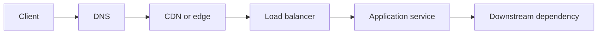

# Networking

> Learn to trace one request from application code to the destination, diagnose the failed layer, and design traffic paths that remain safe under load and partial failure.

Networking becomes useful when it changes what you do. This roadmap starts with packets and connections, then follows real traffic through naming, edge delivery, balancing, services, and public APIs.

Use the diagram as a debugging order: identify the last boundary with healthy evidence, then inspect the next boundary instead of guessing across the whole path.

## Learning path

| Stage | Section | Capability you build |
|---|---|---|
| 1 | [Protocols](protocols/README.md) | Explain how bytes move, establish trust, and become application messages. |
| 2 | [Domain Name System](domain-name-system/README.md) | Trace name resolution and change DNS safely. |
| 3 | [Content Delivery Networks](content-delivery-networks/README.md) | Control cache behavior and move delivery closer to users. |
| 4 | [Load Balancers](load-balancers/README.md) | Distribute traffic, detect unhealthy targets, and fail over. |
| 5 | [Communication](communication/README.md) | Choose request, stream, and message interaction styles. |
| 6 | [Application Layer](application-layer/README.md) | Draw service boundaries and contain distributed failure. |
| 7 | [API Design at Scale](api-design-at-scale/README.md) | Evolve contracts, retries, gateways, and asynchronous callbacks. |

## Use this section on a real incident

1. Write the failing user action and timestamp.
2. Resolve the hostname and record the returned addresses.
3. Establish a connection and inspect latency, negotiation, and certificates.
4. Send one controlled request and record status, headers, and timing.
5. Follow the request through the edge, load balancer, service, and dependency.
6. Change one variable at a time and repeat the same probe.
7. Keep the evidence that proves recovery.

## Progression inside every topic

| Level | Main responsibility |
|---|---|
| Junior | Run a known probe, read its output, and fix a small scoped problem. |
| Middle | Compare choices, define boundaries, and verify an integrated flow. |
| Senior | Protect invariants across components and design recovery before failure. |
| Professional | Align ownership, rollout, observability, and exit criteria across teams. |

Start with the level where the actions are unfamiliar. Move up when you can perform the verification without copying the example.
