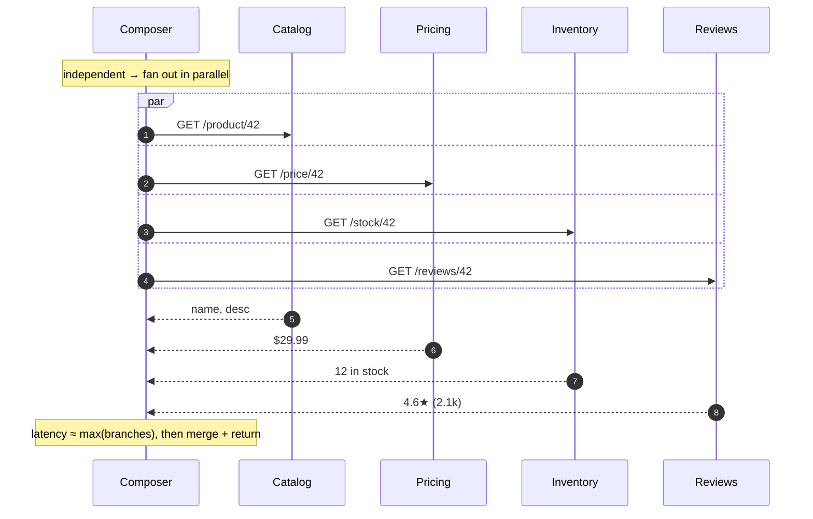
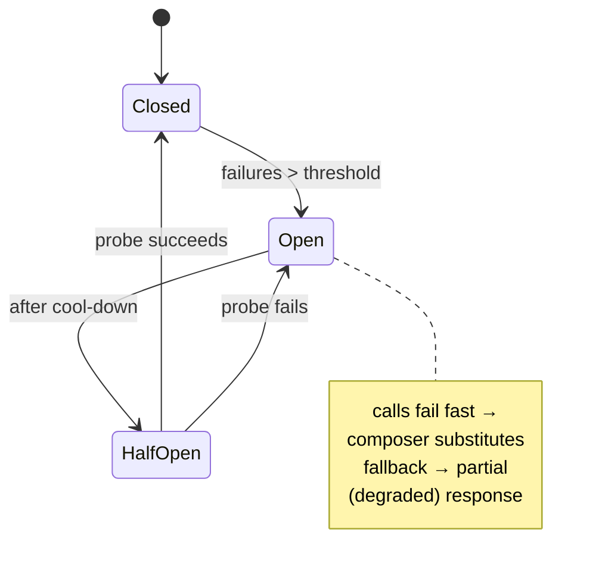
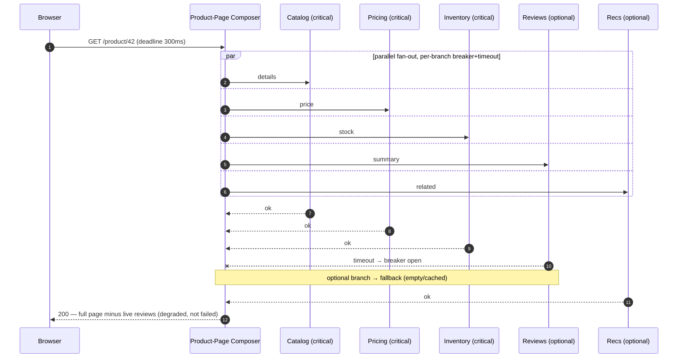

# API Composition — Interview

Interview-grade Q&A on assembling a single client response from data that lives across many services. Answers are tight, precise, and biased toward what separates a strong candidate from a mediocre one: the failure math, the resilience levers, and the placement decisions.

## Table of Contents
1. [Q1: What is API composition and why do we need it?](#q1-what-is-api-composition-and-why-do-we-need-it)
2. [Q2: Where does the composition logic live — gateway, BFF, or a dedicated service?](#q2-where-does-the-composition-logic-live--gateway-bff-or-a-dedicated-service)
3. [Q3: Parallel vs sequential fan-out — how do you choose?](#q3-parallel-vs-sequential-fan-out--how-do-you-choose)
4. [Q4: Explain tail-latency amplification. Why does fan-out make P99 worse?](#q4-explain-tail-latency-amplification-why-does-fan-out-make-p99-worse)
5. [Q5: What mitigations reduce tail-latency amplification?](#q5-what-mitigations-reduce-tail-latency-amplification)
6. [Q6: How does fan-out affect availability, and what is graceful degradation?](#q6-how-does-fan-out-affect-availability-and-what-is-graceful-degradation)
7. [Q7: API composition vs CQRS read model — when do you switch?](#q7-api-composition-vs-cqrs-read-model--when-do-you-switch)
8. [Q8: How do you set timeouts and deadlines for a composed request?](#q8-how-do-you-set-timeouts-and-deadlines-for-a-composed-request)
9. [Q9: What is request hedging and when is it worth it?](#q9-what-is-request-hedging-and-when-is-it-worth-it)
10. [Q10: How do partial responses and circuit breakers work together?](#q10-how-do-partial-responses-and-circuit-breakers-work-together)
11. [Q11: How do you avoid the N+1 fan-out problem in a composer?](#q11-how-do-you-avoid-the-n1-fan-out-problem-in-a-composer)
12. [Q12: What role does distributed tracing play in composition?](#q12-what-role-does-distributed-tracing-play-in-composition)
13. [Q13: How does GraphQL federation relate to API composition?](#q13-how-does-graphql-federation-relate-to-api-composition)
14. [Q14: How do you keep a composed response consistent when sources disagree?](#q14-how-do-you-keep-a-composed-response-consistent-when-sources-disagree)
15. [Q15: Scenario — assemble a product page from 5 services, fast and resilient.](#q15-scenario--assemble-a-product-page-from-5-services-fast-and-resilient)
16. [Q16: What are the anti-patterns and red flags in composition?](#q16-what-are-the-anti-patterns-and-red-flags-in-composition)

---

## Q1: What is API composition and why do we need it?
> API composition is the pattern where one component fans out to several downstream services, joins their responses in memory, and returns a single unified result to the caller. It exists because in a microservice architecture data is **decomposed by service boundary**: the product page needs the catalog service (name, description), the pricing service, the inventory service, the reviews service, and the recommendations service. No single database holds all of it. A naïve client would make five round trips over the WAN and stitch results itself, which is slow, chatty, and leaks the service topology to the client. The composer moves that join server-side, next to the services, on a fast internal network.
>
> The trade-off is that you have replaced a database `JOIN` — cheap, transactional, indexed — with an **in-memory join across the network**, which is none of those things. The rest of these questions are mostly about paying for that trade-off intelligently.

---

## Q2: Where does the composition logic live — gateway, BFF, or a dedicated service?
> Three placements, chosen by who owns the shape of the response:

| Placement | What it is | Owns response shape | Best when | Risk |
|-----------|-----------|--------------------|-----------|------|
| **Gateway aggregation** | The API gateway itself fans out and merges (e.g., via a plugin/route) | Platform/infra team | Simple, generic joins; a few endpoints | Business logic creeps into infra; one team bottlenecks all clients |
| **Backend-for-Frontend (BFF)** | A composer per client type (web BFF, iOS BFF, TV BFF) | The client team | Different clients need different shapes/fields | BFF sprawl; duplicated join logic across BFFs |
| **Composition service** | A standalone service dedicated to one composite resource (e.g., "product-page service") | A product team | The composite is reused by many clients; join is complex | Another network hop; another thing to own and scale |

> Rule of thumb: put it in the **gateway** for trivial passthrough merges, use a **BFF** when the *client* drives the shape (mobile wants fewer fields to save bandwidth; web wants more), and promote to a **dedicated composition service** when the same composite is consumed by multiple clients and the join has real logic worth centralizing. The anti-pattern is stuffing heavy business logic into the shared gateway — it couples every team to the platform team's release cadence.

---

## Q3: Parallel vs sequential fan-out — how do you choose?
> You choose based on the **dependency graph** of the calls.
> - **Parallel** when calls are independent: catalog, pricing, inventory, and reviews all key off the same `product_id`, so fire them concurrently. Total latency ≈ the *slowest* branch (the max), not the sum.
> - **Sequential** only when there is a genuine data dependency: you must call service A to get an ID that is the *input* to service B. Example: fetch the order to get its `line_items`, then fetch product details for each item. Here latency is additive.
>
> The mistake juniors make is sequential-by-default because the code reads top-to-bottom. If two calls do not depend on each other's *output*, they must run in parallel. When you have a mix, model it as a DAG and parallelize every independent layer, only serializing across true edges.

---

## Q4: Explain tail-latency amplification. Why does fan-out make P99 worse?
> When a composed request waits for **all N** parallel branches, its latency is the **maximum** of N samples — and the max of many samples is dominated by their tails. If each service independently exceeds its latency threshold with probability `p`, the probability that **at least one** of N does is:
>
> **P(slow request) = 1 − (1 − p)^N**
>
> Concretely, if each backend has a P99 of 100 ms (so `p = 0.01` of exceeding 100 ms) and you fan out to N = 5, the chance the *composed* request exceeds 100 ms is `1 − 0.99^5 ≈ 0.049` — roughly **5%**, not 1%. What was your backends' P99 has become nearly the composed request's P95. Fan out to N = 100 and `1 − 0.99^100 ≈ 63%` — a "1-in-100" slow event now happens on nearly two of every three requests.

| N (fan-out) | P(at least one slow), p=0.01 | Effect on composed request |
|-------------|------------------------------|----------------------------|
| 1 | 1.0% | backend tail ≈ composed tail |
| 5 | 4.9% | backend P99 ≈ composed P95 |
| 10 | 9.6% | backend P99 ≈ composed P90 |
| 50 | 39.5% | slow becomes common |
| 100 | 63.4% | slow is the norm |

> The lesson: **the more services you join, the more the slowest one you depend on defines your latency.** You cannot fix this by making the median faster; you must attack the tail directly.

---

## Q5: What mitigations reduce tail-latency amplification?
> Attack the tail, not the mean:
> 1. **Per-call timeouts / deadlines.** Cap each branch so a single stalled backend cannot hold the whole response hostage. Better: a shared **deadline** that propagates down so the budget shrinks as it is spent.
> 2. **Hedged requests.** After the branch exceeds, say, its P95, send a second copy to another replica and take whichever returns first. This trades a small amount of extra load for a dramatically tighter tail (Dean & Barroso, "The Tail at Scale").
> 3. **Partial responses / graceful degradation.** Make non-critical branches optional: if reviews time out, render the page without the star rating rather than failing the whole request.
> 4. **Reduce N.** Fewer, coarser calls beat many fine-grained ones. Batch (`GET /products?ids=1,2,3`) instead of N single-item calls.
> 5. **Caching.** Cache the slow, cacheable branches (recommendations, reviews summary) so their tail is served from memory, not recomputed.
> 6. **Backpressure and load shedding** so an overloaded backend fails fast instead of queuing and inflating its own tail.
>
> Hedging plus per-request deadlines is the highest-leverage combination for reads.

---

## Q6: How does fan-out affect availability, and what is graceful degradation?
> Availability **multiplies** the same way latency amplifies. If a composed response requires all N branches to succeed and each is independently available with probability `a`, composite availability is:
>
> **A_composite = a^N**
>
> At `a = 0.999` (three nines) and N = 5, `A = 0.999^5 ≈ 0.995` — you have dropped from three nines to barely two and a half, i.e., roughly 5× more downtime than any single dependency. Depending on all your dependencies makes you **less available than the weakest of them.**
>
> **Graceful degradation** breaks the "all must succeed" assumption. You classify each branch as **critical** (the response is meaningless without it — catalog data on a product page) or **optional** (nice-to-have — reviews, recommendations). Optional branches get a fallback: a default value, a cached value, or omission. Now composite availability depends only on the critical branches, and the response degrades in quality rather than failing outright. This is what lets a page with 5 dependencies stay up when 2 of them are down. Circuit breakers make this automatic: an open breaker instantly returns the fallback instead of waiting for a timeout.

---

## Q7: API composition vs CQRS read model — when do you switch?
> They are the two ends of a **read-time vs write-time join** spectrum.
> - **API composition** joins at **read time**: fresh data, no extra storage, but pays the fan-out cost (latency + availability multiplication) on every request.
> - **CQRS with a materialized read model** joins at **write time**: downstream services publish events, and a consumer maintains a **denormalized, pre-joined** view (e.g., a `product_page` document in Elasticsearch or a wide row). Reads are a single lookup — one hop, one source, no fan-out, so the tail-latency and availability math disappears.

| | API composition | CQRS read model |
|---|-----------------|-----------------|
| Join happens at | Read time | Write time (via events) |
| Read latency | max of N branches | single lookup |
| Freshness | Strong (live data) | Eventually consistent (lag) |
| Extra storage | None | A materialized view to maintain |
| Failure surface | N dependencies per read | The event pipeline + one store |
| Complexity | Simpler to start | Event schema, backfills, rebuilds |

> Switch to a read model when: fan-out is wide (large N), read QPS is high, the composite is read far more than its inputs change, and **eventual consistency is acceptable**. Stay with composition when data must be live-fresh, N is small, or the composite is rarely requested. Many systems do both — compose for the long tail of rare composites, materialize the hot ones.

---

## Q8: How do you set timeouts and deadlines for a composed request?
> Distinguish a **timeout** (a fixed per-call limit) from a **deadline** (an absolute wall-clock instant that propagates through the whole call tree). Composition needs deadlines, not just timeouts.
> - Give the whole composed request a **budget** — say 300 ms end-to-end.
> - Propagate the deadline downstream (gRPC deadlines, or a `grpc-timeout`/deadline header). Each hop computes remaining budget = deadline − now, so a call that arrives with 40 ms left does not spend 200 ms.
> - Per-branch timeouts must be **less than** the total budget, and set from the backend's *own* latency distribution (e.g., a bit above its P99), not a round number.
> - Ban unbounded timeouts. The classic outage is a branch with no timeout stalling behind a slow dependency, exhausting the composer's thread/connection pool, and taking down every unrelated request too.
>
> Also enforce **timeout budgets across retries**: a retried call must fit inside the remaining deadline, otherwise a retry storm blows the budget and amplifies load on an already-struggling backend.

---

## Q9: What is request hedging and when is it worth it?
> Hedging (a.k.a. backup requests) sends a **second copy** of a call to a different replica once the first has been outstanding longer than a threshold (typically its P95/P99), then uses whichever response arrives first and cancels the loser. Because the tail of a single replica is largely independent of another replica's tail, the *minimum* of two attempts has a far shorter tail than either alone — this is the core technique from Dean & Barroso's "The Tail at Scale."
>
> It is worth it when: the operation is a **read** (or otherwise idempotent), the P99/P50 ratio is high (a heavy tail worth cutting), and you can afford a few percent extra load — hedging only after P95 adds ≈5% duplicate requests, not 2×. It is **not** appropriate for non-idempotent writes (you would double-charge), or when the system is already saturated (hedging adds load exactly when you cannot afford it, so gate it behind a rate limit and a circuit breaker). For a composer, hedge the slow, cacheable, read-only branches; leave the cheap fast ones alone.

---

## Q10: How do partial responses and circuit breakers work together?
> A **circuit breaker** wraps each downstream call and tracks its recent error/timeout rate. When failures exceed a threshold it **opens**: subsequent calls fail *instantly* with the fallback instead of waiting for the timeout. After a cool-down it goes **half-open**, letting a probe through to test recovery, then closes if healthy.
>
> **Partial responses** are what the breaker returns when open: for an *optional* branch, the fallback is a default/cached/empty value and the composed response is still returned — degraded but useful. The two compose cleanly:

> The critical benefit is **latency isolation**: without a breaker, a dead backend makes every request pay the full timeout (say 300 ms) before falling back, which itself exhausts pools and cascades. With the breaker open, the fallback is served in microseconds, and one sick dependency stops poisoning the composer's throughput.

---

## Q11: How do you avoid the N+1 fan-out problem in a composer?
> The N+1 problem: you fetch a list of M items (1 call), then loop and fetch details per item (M calls) — the composed request explodes from 1 to 1+M downstream calls, and the tail-latency/availability math above gets far worse. Fixes:
> - **Batch APIs.** Expose `GET /products?ids=1,2,3` (or a batched RPC) so the composer makes one call for the whole set. This is the primary fix.
> - **DataLoader-style coalescing.** Buffer per-item requests within a tick and flush them as one batched call; also de-duplicates repeated IDs. Standard in GraphQL resolvers.
> - **Denormalize / read model.** If the parent already carries what you need, do not re-fetch it (see Q7).
> - **Bounded concurrency.** When you truly must fan out per item, cap the parallelism (a worker pool) so a 500-item list does not open 500 simultaneous connections and self-inflict a thundering herd.
>
> In interviews, spotting the N+1 in a proposed design and proposing a batch endpoint is a strong signal.

---

## Q12: What role does distributed tracing play in composition?
> A composed request becomes one **trace** made of many **spans** — one per downstream branch — linked by a propagated `trace_id` (W3C `traceparent` header / OpenTelemetry context). Tracing is essential to composition specifically because the failure modes are distributed:
> - **Find the tail's culprit.** The waterfall view shows which branch is the slow max on P99 requests — the thing you must hedge or cache. Without it you are guessing which of 5 services caused a slow page.
> - **Confirm parallelism.** Overlapping spans prove your "parallel" fan-out is actually concurrent and not accidentally serialized (a very common bug — the trace shows staircase-shaped sequential spans).
> - **See fallbacks fire.** Spans tagged as errored/short-circuited show when a circuit breaker opened and a partial response was served.
> - **Attribute cost and errors** to the right downstream owner across team boundaries.
>
> Pair traces with **RED metrics per branch** (Rate, Errors, Duration) so you alert on a degrading dependency before it dominates the composite.

---

## Q13: How does GraphQL federation relate to API composition?
> GraphQL federation *is* API composition with a schema-driven query planner. Each service owns a slice of a shared graph (its types and fields); a **gateway/router** parses the incoming query, builds a **query plan** that fans out to the owning subgraphs, resolves cross-service references via entity keys, and stitches the results into one response. So the router is a composition service and the same concerns apply verbatim: parallelize independent subqueries, avoid N+1 with DataLoader batching, propagate deadlines, and degrade partially (GraphQL returns `data` plus a `errors` array, which is graceful degradation built into the protocol — a failed field can null out while the rest of the page renders).
>
> The differences from hand-rolled REST composition: the client selects exactly the fields it needs (no over/under-fetching, which reduces payload and sometimes N), and the join logic is declarative in the schema rather than imperative in composer code. The trade-off is a heavier gateway and query-planning cost, plus the operational burden of the federation layer. It is the natural evolution when you have many clients each wanting different shapes — the same driver that pushes you toward BFFs (Q2), but solved once at the graph layer.

---

## Q14: How do you keep a composed response consistent when sources disagree?
> You mostly **can't** get transactional consistency across an in-memory join — there is no cross-service transaction, so you design for the inconsistency:
> - **Accept read skew and make it harmless.** Inventory says "in stock" but pricing lags a promo change — pick which field the UX can tolerate being slightly stale and label freshness (e.g., "prices updated moments ago").
> - **Reconcile at the source of truth on the action, not the read.** The product page may show a stale price; the *checkout* re-validates price and stock against the authoritative service before charging. Never let a composed read be the transactional boundary.
> - **Propagate a consistent snapshot where it matters.** Pass a version/`as-of` timestamp so all branches answer as of the same point, if the backends support it.
> - **Idempotency keys** on any write triggered by the composed flow, so retries (including hedges) don't double-apply.
>
> The interview point: composition is a **read-optimization pattern**, not a consistency mechanism. State the staleness you accept explicitly, and put the real invariant check at the write/commit step.

---

## Q15: Scenario — assemble a product page from 5 services, fast and resilient.
> **Sources:** catalog (name, description, images) · pricing · inventory · reviews summary · recommendations. Target: P99 under ~300 ms, page stays useful even when some dependencies are down.
>
> **1. Placement.** A dedicated **product-page composition service** (or a web BFF if only the web client needs this exact shape). Keep the shared gateway thin.
>
> **2. Classify criticality.**
> - *Critical:* catalog, pricing, inventory — a product page without a name or price is broken.
> - *Optional:* reviews, recommendations — degrade gracefully.
>
> **3. Fan out in parallel** — all five key off `product_id`, no data dependencies (Q3), so latency ≈ max branch, not sum.
>
> **4. Deadlines & timeouts.** 300 ms total budget, propagated as a deadline; per-branch timeouts set from each backend's P99 and strictly under the budget (Q8).
>
> **5. Resilience per branch.** Circuit breaker + fallback on every call (Q10). Optional branches fall back to empty/cached; critical branches fall back to **last-known-good cache** if fresh enough, and only fail the request if even that is missing.
>
> **6. Attack the tail.** Cache the slow, cacheable branches (reviews summary, recommendations) with short TTLs; **hedge** the slow read-only branches after their P95 (Q9). This is what keeps P99 near the median instead of near the max (Q4/Q5).
>
> **7. Consistency.** Page is a read view; the authoritative price/stock check happens at **add-to-cart / checkout** (Q14).
>
> **8. Observe.** One trace per page render, span per branch, RED metrics per dependency, alert on any branch's error rate or P99 climbing (Q12).
>
> **9. If read QPS is huge and freshness can lag**, promote the hot path to a **CQRS materialized `product_page` document** so a render is one lookup, not a five-way fan-out (Q7).

---

## Q16: What are the anti-patterns and red flags in composition?
> Signals of a weak design:
> - **Sequential-by-default fan-out** for calls with no data dependency — leaves latency on the table (Q3).
> - **No per-call timeout / unbounded waits** — one slow backend exhausts the composer's thread/connection pool and cascades (Q8).
> - **"All branches must succeed"** with no criticality classification — availability collapses to `a^N` (Q6).
> - **N+1 fan-out** with no batch endpoint (Q11).
> - **Business logic crammed into the shared gateway**, coupling every team to the platform's release cadence (Q2).
> - **Hedging or retrying non-idempotent writes** — double-charges, duplicate side effects (Q9/Q14).
> - **Retry storms** — retries with no deadline budget or jitter amplifying load on a struggling backend.
> - **Treating a composed read as a transaction boundary** instead of re-validating at the write (Q14).
> - **No tracing**, so nobody can say which of five services owns the P99 (Q12).
>
> A strong candidate names the failure math (`1 − (1−p)^N`, `a^N`), places the composer deliberately, and defaults to parallel + deadlines + circuit breakers + partial responses.

*Next step:* [Stateless Design — Junior](../stateless-design/junior.md)
