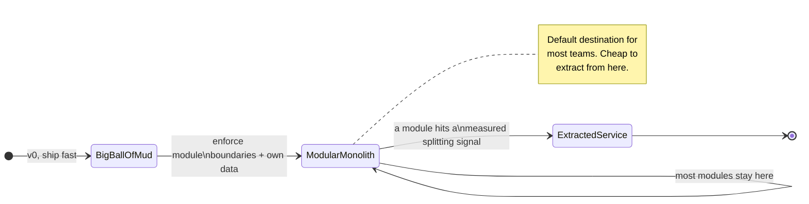
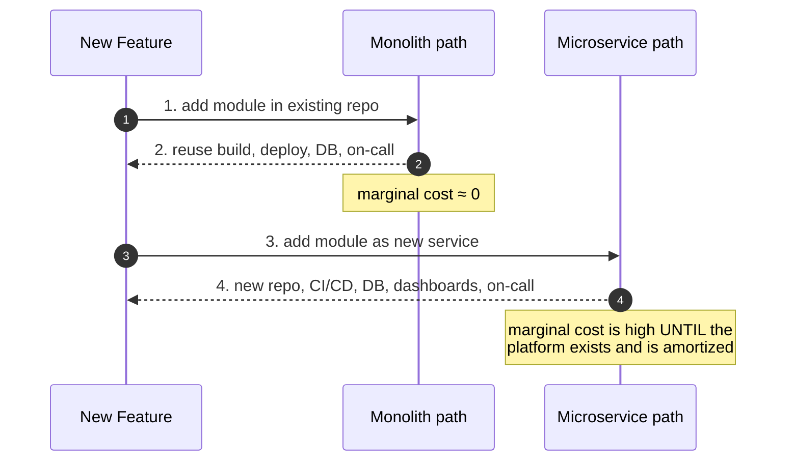
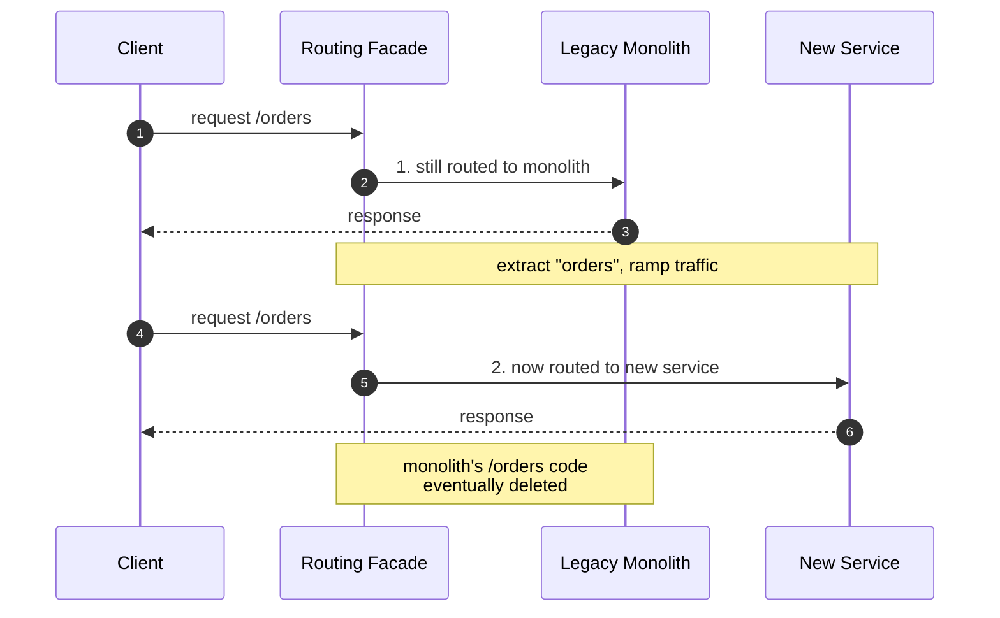

# Monolith vs Microservices — Interview

The single most common architecture question at every level. What separates a strong answer from a mediocre one is not knowing the definitions — it is showing that you treat "microservices" as a *cost you pay for a specific benefit*, not a badge of sophistication. Below are the questions interviewers actually ask, with the crisp, load-bearing answers.

## Table of Contents
1. [Q1: What is the core tradeoff between a monolith and microservices?](#q1-what-is-the-core-tradeoff-between-a-monolith-and-microservices)
2. [Q2: What is "monolith-first" and why is it the default advice?](#q2-what-is-monolith-first-and-why-is-it-the-default-advice)
3. [Q3: What is a modular monolith and when does it beat both extremes?](#q3-what-is-a-modular-monolith-and-when-does-it-beat-both-extremes)
4. [Q4: What concrete signals justify splitting a service out?](#q4-what-concrete-signals-justify-splitting-a-service-out)
5. [Q5: What is the "microservice premium" — fixed vs marginal cost?](#q5-what-is-the-microservice-premium--fixed-vs-marginal-cost)
6. [Q6: How does an in-process call compare to a network call in cost?](#q6-how-does-an-in-process-call-compare-to-a-network-call-in-cost)
7. [Q7: What is the strangler-fig pattern and how do you run a migration with it?](#q7-what-is-the-strangler-fig-pattern-and-how-do-you-run-a-migration-with-it)
8. [Q8: What is a distributed monolith and how do you recognize one?](#q8-what-is-a-distributed-monolith-and-how-do-you-recognize-one)
9. [Q9: Which of these decisions are reversible, and why does that matter?](#q9-which-of-these-decisions-are-reversible-and-why-does-that-matter)
10. [Q10: How do you draw service boundaries correctly?](#q10-how-do-you-draw-service-boundaries-correctly)
11. [Q11: How do microservices change data consistency and transactions?](#q11-how-do-microservices-change-data-consistency-and-transactions)
12. [Q12: How does Conway's Law bear on this decision?](#q12-how-does-conways-law-bear-on-this-decision)
13. [Q13: Scenario — startup with 5 engineers: monolith or microservices?](#q13-scenario--startup-with-5-engineers-monolith-or-microservices)
14. [Q14: What did Amazon Prime Video's move back to a monolith teach us?](#q14-what-did-amazon-prime-videos-move-back-to-a-monolith-teach-us)
15. [Q15: How do you decide, in one sentence, at the whiteboard?](#q15-how-do-you-decide-in-one-sentence-at-the-whiteboard)

---

## Q1: What is the core tradeoff between a monolith and microservices?

> You are trading **operational simplicity** for **independent deployability and scaling**. A monolith keeps all module interactions as in-process function calls inside one deployable unit: one build, one deploy, one process to debug, transactions that span the whole domain for free. Microservices split the domain into independently deployable services communicating over the network — which buys per-team autonomy, independent scaling of hot paths, fault isolation, and heterogeneous tech stacks, at the price of network partial failure, distributed data, versioned contracts, and a large operational surface (service discovery, observability, deployment orchestration).
>
> The one-line framing: **microservices convert code complexity into operational complexity.** That trade only pays off when your bottleneck is *organizational* (many teams stepping on each other) rather than *technical*. If your problem is "the code is a mess," microservices will give you a *distributed* mess that is strictly harder to fix.

| Dimension | Monolith | Microservices |
|---|---|---|
| Deployment unit | One artifact | N independently deployed services |
| Inter-module call | In-process (ns) | Network RPC (µs–ms, can fail) |
| Data / transactions | Single DB, ACID transactions | DB-per-service, sagas / eventual consistency |
| Scaling granularity | Whole app scales together | Scale hot services independently |
| Fault isolation | A leak/crash can take down everything | Blast radius contained to a service |
| Team autonomy | Coordinated releases, shared codebase | Independent release cadence per team |
| Debugging | Single stack trace, one log stream | Distributed tracing across N hops |
| Fixed operational cost | Low | High (platform, CI/CD, observability) |
| Marginal cost of a new module | Near zero | A new deploy pipeline, DB, on-call surface |

---

## Q2: What is "monolith-first" and why is it the default advice?

> Monolith-first (popularized by Martin Fowler) says: **start with a monolith, and only split into services once you understand the domain well enough to draw stable boundaries.** The reasoning is that microservices' single biggest failure mode is *wrong boundaries* — and early in a product's life you do not yet know where the seams are. A boundary drawn wrong becomes a distributed refactor: moving a method between classes is a rename; moving an operation between two services is a network protocol change, a data migration, and a coordinated multi-team deploy.
>
> A monolith lets you move code across module lines cheaply while you are still learning. You pay the microservice premium only after the domain has stabilized and you have a concrete, *measured* reason to split. Almost every large microservices success story — Amazon, Netflix, Uber — started as a monolith and *decomposed*, not the reverse. Greenfield-on-microservices is the exception, and usually only justified when the team has already built this exact system before.

---

## Q3: What is a modular monolith and when does it beat both extremes?

> A modular monolith is a single deployable unit internally partitioned into well-bounded modules that talk through explicit, narrow interfaces — enforced module boundaries, no reaching into another module's internals or tables, ideally a schema-per-module inside one database. You get *most* of the organizational benefits people chase with microservices (clear ownership, low coupling, parallel work) while keeping the operational simplicity of one process and ACID transactions.
>
> It beats both extremes for the common middle case: a team large enough that a mud-ball monolith hurts, but not so large that independent deployment is the actual pain point. It is also the *ideal launchpad* for a future split — if modules already communicate through clean interfaces and own their data, extracting one into a service is mechanical rather than surgical. The discipline is the hard part: without enforcement (module systems, architecture-fitness tests, `internal` visibility, dependency linters), a modular monolith rots back into a big ball of mud. The correct progression for most systems is **mud-ball monolith → modular monolith → extract services only where measured pressure demands it.**

---

## Q4: What concrete signals justify splitting a service out?

> Never split on aspiration ("we want microservices"). Split when you can name a specific, ideally *measured*, pressure that a service boundary directly relieves:
>
> - **Independent scaling need** — one component's resource profile is wildly different (e.g., a CPU-bound video transcoder vs. an I/O-bound API). Bundling forces you to over-provision the whole app to feed one hungry part.
> - **Deployment contention** — teams are blocked on each other's release trains; merge queues and coordination overhead dominate. This is the *organizational* signal and the most legitimate one.
> - **Divergent availability / isolation requirements** — a component must not be able to take down the rest (a flaky third-party integration, an experimental feature) and needs its own bulkhead.
> - **Independent lifecycle / tech fit** — a piece genuinely needs a different language or runtime (ML in Python, a Rust hot path) or a radically different release cadence.
> - **Clear, stable, low-traffic boundary** — the seam is well understood, the cross-boundary call volume is low, and the data is cleanly separable.
>
> The anti-signal: splitting because a diagram looks cleaner, or to mirror an org chart that itself is wrong. If you cannot state the *cost* you are paying and the *specific* benefit that outweighs it, do not split.

---

## Q5: What is the "microservice premium" — fixed vs marginal cost?

> The microservice premium is the *tax* you pay before writing a single line of business logic: service discovery, an API gateway, distributed tracing, centralized logging, per-service CI/CD pipelines, deployment orchestration (Kubernetes or equivalent), inter-service auth, contract testing, and on-call rotations for each service. This is largely a **fixed cost** — you pay most of it to run *the first* service well.
>
> The key insight for interviews: the premium is a *step function*, not linear. A small team pays the entire fixed cost while amortizing it over a tiny number of services — a terrible ratio, which is why small teams should stay monolithic. A large org pays the same fixed cost but amortizes it over hundreds of services, and the *marginal* cost of the next service becomes small once the platform exists. So the question is never "are microservices good?" but "**is my scale past the break-even point where the fixed cost is amortized?**" Below break-even, the monolith wins on pure economics; above it, microservices' marginal-cost advantage compounds.

---

## Q6: How does an in-process call compare to a network call in cost?

> This is the physical reality underneath the whole debate. An in-process function call is roughly a nanosecond; a same-datacenter network round trip is on the order of hundreds of microseconds to a few milliseconds — **three to six orders of magnitude slower** — and, unlike a function call, it can *fail independently, time out, or return partially*. Splitting a monolith replaces cheap, reliable, synchronous calls with expensive, unreliable ones.
>
> The classic latency-ordering reference (Jeff Dean / Peter Norvig, "Latency Numbers Every Programmer Should Know") makes the gap concrete:

| Operation | Approx. latency | Relative to L1 (0.5 ns) |
|---|---|---|
| L1 cache reference | 0.5 ns | 1× |
| In-process function call | ~1–5 ns | ~few× |
| Mutex lock/unlock | 25 ns | 50× |
| Main memory reference | 100 ns | 200× |
| Same-datacenter round trip | ~500 µs | ~1,000,000× |
| Round trip CA → Netherlands | ~150 ms | ~300,000,000× |

> The design consequence: a chatty boundary — one that made many fine-grained in-process calls — becomes catastrophic when turned into network calls (N+1 over RPC, latency multiplied by fan-out, failure probability compounding). This is *why* boundaries must sit where cross-boundary chatter is naturally low. If two modules call each other constantly, they belong in the same service. The Fallacies of Distributed Computing ("the network is reliable," "latency is zero," "bandwidth is infinite") are the tax you did not have to pay in the monolith.

---

## Q7: What is the strangler-fig pattern and how do you run a migration with it?

> The strangler fig (named by Fowler after the vine that grows around a tree and gradually replaces it) is the safe way to migrate *incrementally* — never a big-bang rewrite. You put a routing layer (a proxy, gateway, or facade) in front of the legacy monolith. New or extracted functionality is built as a service behind that router; you flip routes over one capability at a time, so the new service handles that slice while everything else still hits the monolith. Over time the new implementation "strangles" the old one until the monolith can be retired.
>
> Running it in practice:
> 1. **Insert the seam** — a routing/facade layer so callers do not know or care which backend serves a request.
> 2. **Pick the first slice** — a low-risk, well-bounded capability with clean data ownership. Extract it, migrate its data, route a small percentage of traffic to it.
> 3. **Verify by comparison** — run old and new in parallel where possible (dark launch / shadow traffic), compare outputs, then ramp the route from 1% → 100%.
> 4. **Repeat** capability by capability, keeping the system shippable at every step.
> 5. **Decommission** the strangled code once no route points to it.
>
> The whole value is *reversibility at each step*: if a slice misbehaves, you route back to the monolith. Contrast with a rewrite, which is a single enormous irreversible bet.

---

## Q8: What is a distributed monolith and how do you recognize one?

> A distributed monolith is the worst of both worlds: you paid the full microservice premium (network hops, N databases, operational sprawl) but still have monolithic coupling, so you get *none* of the independence benefits. It is the most common way microservices adoptions fail. Tell-tale signs:
>
> - **Lockstep deploys** — you cannot ship service A without simultaneously shipping B and C. If a "release" means coordinating multiple services at once, the boundaries are fake.
> - **Shared database** — multiple services read/write the same tables. Now a schema change ripples across services and nothing is truly independent; the DB is a hidden coupling.
> - **Synchronous request chains** — a single user request fans out through a deep chain of blocking calls (A→B→C→D), so one slow or down service breaks the whole flow. Availability *multiplies down* instead of being isolated.
> - **Shared client libraries with business logic** — a bump requires every service to upgrade in unison.
> - **A change to one service routinely forces changes in others** — the coupling just moved from function calls to wire contracts.
>
> The root cause is almost always **boundaries drawn by technical layer or by convenience rather than by business capability/data ownership.** The fix is to correct ownership (each service owns its data), make interactions asynchronous/event-driven where possible, and version contracts so services can evolve independently. A blunt but honest interview point: *a well-built modular monolith is strictly better than a distributed monolith* — same coupling, far less operational pain.

---

## Q9: Which of these decisions are reversible, and why does that matter?

> Frame every architecture call as a **two-way door** (cheap to reverse — decide fast, learn from production) or a **one-way door** (expensive/impossible to reverse — decide slowly, gather more evidence), per Bezos's decision framework.
>
> - **Staying monolithic / modular-monolithic is a two-way door.** You keep options open; extracting a well-bounded module later is mechanical. Cost of being wrong is low.
> - **Splitting into microservices is much closer to a one-way door.** Merging services back together is rare and painful; you have already spread data across databases, built contracts, and shaped teams around the boundaries (Conway's Law makes org structure follow architecture). Reversing means re-merging data stores and re-orging teams.
>
> This asymmetry is the strongest single argument for monolith-first: **when one option is a two-way door and the other is a one-way door, and you are uncertain, take the reversible one.** You are not committing to a monolith forever — you are deferring an irreversible decision until you have the information to make it well. (Amazon Prime Video's re-consolidation, Q14, is a rare and instructive counter-move.)

---

## Q10: How do you draw service boundaries correctly?

> Boundaries should follow **business capabilities and data ownership**, aligned with Domain-Driven Design *bounded contexts* — not technical layers, not the org chart as-is, not "whatever is convenient today." The tests for a good boundary:
>
> - **High cohesion inside, low coupling across** — things that change together live together; the cross-boundary call volume is naturally low (see Q6 — a chatty boundary is a wrong boundary).
> - **Single owner of its data** — each service owns its tables; no other service reaches into them. Shared databases are the fastest route to a distributed monolith.
> - **Stable, narrow contract** — the interface is small and changes rarely; most change stays *inside* the boundary.
> - **Independently deployable** — you can ship it without coordinating a release with anyone else. If you cannot, the boundary is not real.
>
> Practical heuristic: transactional consistency requirements usually define the *inner* limit of a service — if two operations must be atomic (bank debit + credit), they probably belong in the same service, because spanning that with a distributed saga is a heavy price. Draw the boundary so that the hard consistency lives *inside* one service and only eventual consistency crosses the wire.

---

## Q11: How do microservices change data consistency and transactions?

> This is the sharpest hidden cost. In a monolith, a business operation touching several tables is a single ACID transaction — atomic, isolated, rolled back on failure, essentially free. Split those tables across services and that guarantee evaporates: there is no cross-service transaction. You now have two hard problems:
>
> - **Distributed transactions / consistency** — to keep multiple services' data consistent you use the *saga* pattern: a sequence of local transactions, each with a compensating action to undo prior steps on failure (orchestrated by a coordinator or choreographed via events). This is dramatically more code, more failure modes, and only *eventual* consistency, not atomicity.
> - **Distributed queries** — a query that was a single `JOIN` in the monolith now requires fan-out and in-application joining, or maintaining a denormalized read model (CQRS) fed by events. Reporting across the whole domain becomes a project rather than a query.
>
> The interview-strong statement: *do not put an atomic invariant across a service boundary.* If two pieces of data must always agree instantly, keep them in one service. Accept a service split only where the business genuinely tolerates eventual consistency. Many decompositions fail precisely because they severed an atomic operation and then spent a year reimplementing transactions badly over the network.

---

## Q12: How does Conway's Law bear on this decision?

> Conway's Law states that a system's architecture will mirror the communication structure of the organization that builds it. Two consequences for this question:
>
> - **Architecture and org structure are coupled, so you can only sustain as many services as you have teams to own them.** Five engineers cannot meaningfully own twenty independently-deployed services — the services will end up co-owned, co-deployed, and coupled, i.e. a distributed monolith. The number of *stable, independently-deployable* services you can support is bounded by the number of independent teams.
> - **The "Inverse Conway Maneuver"** — intentionally shaping teams around the architecture you *want* — is how large orgs make microservices work: give each service a single owning team with its own on-call and release cadence, so the independence is organizational, not just diagrammatic. If you split services without splitting ownership, you have not decoupled anything.
>
> So the honest reading is that microservices are as much an *organizational* technology as a technical one. The right time to adopt them is when the org has genuinely grown into multiple autonomous teams whose coordination overhead is the actual bottleneck.

---

## Q13: Scenario — startup with 5 engineers: monolith or microservices?

> **Monolith — specifically a modular monolith — with high confidence, and here is the reasoning I'd give an interviewer.**
>
> 1. **The premium is unaffordable.** Microservices' cost is mostly fixed (Q5): platform, CI/CD per service, tracing, orchestration, per-service on-call. Five engineers would spend most of their time being a platform team instead of shipping product. The fixed cost amortizes over too few services — the ratio is terrible.
> 2. **The benefits don't apply yet.** Microservices solve *organizational* scaling — teams blocking each other on deploys (Q4). Five engineers do not block each other; a single well-run deploy pipeline is fine. You'd be paying for autonomy you don't need.
> 3. **The domain isn't stable.** A pre-product-market-fit startup pivots constantly. Boundaries drawn now will be wrong, and wrong boundaries in microservices are distributed refactors (Q2). In a monolith they're a rename.
> 4. **Reversibility.** Monolith-first is the two-way door (Q9). If they succeed and grow to many teams, they strangler-fig out the hot services later (Q7) — exactly how Amazon, Netflix, and Uber did it. Starting on microservices is the near-irreversible bet, made with the least information they will ever have.
>
> **What I'd actually recommend:** a *modular* monolith — one deployable, but internally partitioned into bounded modules with owned data and enforced interfaces (Q3). This keeps operational cost near zero *and* pre-positions them to extract services cheaply when a real signal appears. The only carve-outs I'd consider on day one: a genuinely different runtime need (e.g., an ML model in a separate Python service) or something that must be isolated for availability — and even those I'd justify against the premium, not adopt reflexively.
>
> **Red flag I'd be watching for as an interviewer:** a candidate who says "microservices, to be scalable and modern." That signals they're optimizing for résumé keywords over the business, and don't understand that they'd be trading their scarce engineering time for operational complexity they cannot yet afford.

---

## Q14: What did Amazon Prime Video's move back to a monolith teach us?

> In 2023 Amazon Prime Video's team published that they moved their audio/video *monitoring* service from a distributed serverless (Step Functions + Lambda) architecture back to a single consolidated ("monolithic") service, and cut infrastructure cost by roughly 90% while removing a scaling ceiling. The generalizable lesson is **not** "microservices are bad" — it is:
>
> - **The right granularity is workload-specific, and it can point the other way.** Their bottleneck was high-volume data being passed *between* distributed components (orchestration and inter-step transfer overhead). Collapsing those hops into one process removed the network/coordination tax entirely — the mirror image of the in-process-vs-network argument in Q6, applied in reverse.
> - **Decomposition is not monotonically good.** You can over-decompose. When components are chatty and pass large payloads, the network becomes the bottleneck and *consolidation* is the optimization.
> - **Measure, then move.** They had production numbers showing where the cost and the ceiling were, and they were willing to reverse an earlier architectural choice — the two-way-door mindset (Q9) in action.
>
> A strong candidate cites this as evidence that "microservices vs monolith" is a *per-component engineering decision driven by measured cost and coupling*, not an ideology to apply uniformly across a whole system.

---

## Q15: How do you decide, in one sentence, at the whiteboard?

> **"Default to a modular monolith; extract a service only when a specific, measured pressure — independent scaling, deployment contention between real teams, or a hard isolation/tech requirement — makes the network's cost worth paying, and draw that boundary along business-capability and data-ownership lines so no atomic invariant crosses it."**
>
> The senior signal in that sentence: you treat the split as a *cost justified by a named benefit*, you default to the reversible option, and you know that a wrong boundary is worse than a monolith. If pressed for the shortest possible version: *start with the monolith, keep it modular, and let real, measured pain — not fashion — pull services out.*

---

*Next step:* [Service Discovery — Junior](../service-discovery/junior.md)
