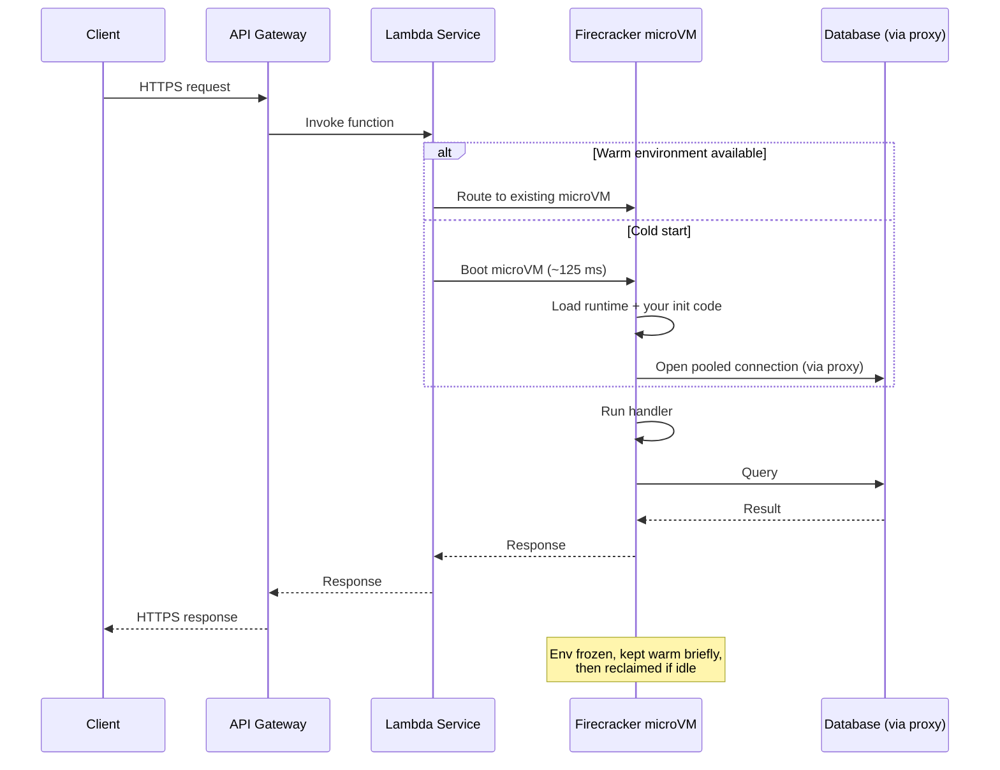

# Serverless / FaaS — Interview

A tiered Q&A bank, from definitions to staff-level architectural judgment. Read the answers as if you were saying them out loud in a design round: claim, mechanism, trade-off.

1. What is serverless / FaaS, and what does it *not* mean?
2. What causes a cold start, and how do you mitigate it?
3. Why must functions be stateless, and where does the state go?
4. Explain the concurrency and scaling model.
5. When is serverless the *wrong* choice?
6. What is the database connection-storm problem?
7. How do you reason about the cost model — and what is the repatriation cliff?
8. How real is vendor lock-in, and how do you contain it?
9. What isolation technology runs the functions?
10. Why is observability harder in serverless?
11. How do you handle per-function IAM and security sprawl?
12. Walk me through a request through a cold Lambda (diagram).
13. How do serverless and containers actually compare?
14. Staff-level: a team wants to "go all serverless." What do you push back on?

---

## Q1: What is serverless / FaaS, and what does it *not* mean?

Serverless is a deployment and billing model where the provider owns capacity management: you hand over a unit of code, and the platform provisions, scales, patches, and idles the compute for you, billing per invocation and per GB-second of execution rather than per running instance. FaaS (Function-as-a-Service — AWS Lambda, Google Cloud Functions, Azure Functions) is the compute primitive: a short-lived, event-triggered function.

It does *not* mean there are no servers — there are, you just don't see or manage them. It also does not mean "no operations": you still own cold-start latency, concurrency limits, IAM policy, observability, and cost governance. The honest one-line definition: serverless is *scale-to-zero, pay-per-use compute where operational responsibility for the machine shifts to the provider*. Everything that used to be "capacity planning" becomes "quota and cost management."

## Q2: What causes a cold start, and how do you mitigate it?

A cold start happens when a request arrives and no warm execution environment exists to serve it. The platform must allocate a sandbox, pull the deployment artifact, boot the runtime, initialize your language runtime (JVM/CLR/Node), run your init/global code (SDK clients, config load, connection setup), and only then invoke the handler. The init phase — not the microVM boot — usually dominates, and it is worst for heavy runtimes (JVM, .NET) and large dependency graphs. Warm invocations reuse the environment and skip all of this.

Mitigations, roughly in order of leverage:

| Mitigation | Mechanism | Cost / trade-off |
|---|---|---|
| **Provisioned concurrency** (Lambda) / min-instances (GCF, Azure Premium) | Keep N environments pre-initialized and warm | You pay for idle warm capacity — partly defeats scale-to-zero |
| **SnapStart** (Lambda, Java) | Snapshot the post-init memory/disk, restore from snapshot instead of re-initializing | Near-free cold-start cut for JVM; state captured at snapshot must be re-randomized (crypto seeds) |
| **Smaller artifact / fewer deps** | Less to download and initialize | Engineering discipline; tree-shaking, slim base layers |
| **Lighter runtime** | Node/Python/Go boot far faster than JVM/.NET | May conflict with team language |
| **Lazy init** | Defer non-critical SDK clients out of the hot path | Complexity; only helps if the work is truly optional |
| **Right-size memory** | More memory = proportionally more CPU on Lambda, faster init | Higher per-ms cost |

The senior framing: cold start is a *tail-latency* problem, not an average problem. At steady traffic most invocations are warm; the pain is p99 and the first request after an idle window. Match the fix to the SLO — provisioned concurrency for latency-sensitive user paths, do nothing for async batch work where a 2s cold start is invisible.

## Q3: Why must functions be stateless, and where does the state go?

Because any given invocation may land on a brand-new environment, and environments are frozen between invocations and reclaimed without warning. You cannot rely on in-process memory, local disk, or background threads persisting across requests — the platform gives no guarantee two requests hit the same instance. So all durable state must be externalized: session and cache state to Redis/Memcached or DynamoDB, files to object storage (S3/GCS), coordination to a queue or a durable-workflow engine (Step Functions, Durable Functions).

There is one nuance worth stating: the execution *environment* is reused across warm invocations, so the space *outside* the handler (global scope) is a legitimate place to cache connections and immutable config — that's exactly why you initialize DB clients there. But it is best-effort reuse, never a correctness guarantee. Treat it as a cache, never as a store.

## Q4: Explain the concurrency and scaling model.

The FaaS concurrency model is one request per instance at a time. An environment handles a single invocation; if a second concurrent request arrives, the platform spins up a *second* environment. So your concurrency equals the number of simultaneous in-flight requests, and the platform scales the instance count linearly with load. The scaling math is simple and worth being able to do live:

> concurrent instances ≈ request rate × average duration.

At 1,000 req/s with 200 ms average duration, steady-state concurrency ≈ 1000 × 0.2 = **200 instances**. At 100 ms it's 100; at 2 s it's 2,000. This is why *duration* is the lever that matters: halving execution time halves both your concurrency footprint and (roughly) your cost.

Two consequences. First, there is no in-process request queuing or connection multiplexing — each instance is its own island, which is what makes the connection-storm problem (Q6) so acute. Second, providers cap concurrency (account/region limits, burst ramp rates); a sudden spike can hit a scaling ceiling and get throttled, so you design async paths behind a queue as a shock absorber.

## Q5: When is serverless the *wrong* choice?

Three canonical anti-fits, and it's a red flag in an interview if a candidate treats serverless as universally good:

- **Steady, high, predictable load.** Pay-per-use is a premium for elasticity. If a service runs pinned near 100% utilization 24/7, a reserved container or VM is dramatically cheaper — you're paying the elasticity tax for elasticity you never use. This is the setup for the repatriation cliff (Q7).
- **Latency-sensitive, tight-tail paths.** Cold starts inject unpredictable tail latency. You can buy it away with provisioned concurrency, but at that point you're paying for always-warm capacity and have quietly rebuilt a container fleet with worse ergonomics.
- **Long-running or heavy compute.** Hard execution-time limits (Lambda caps at 15 minutes), no persistent local state, and cost that scales with duration make big ETL jobs, stateful stream processors, ML training, and anything needing GPUs or large local scratch a poor fit. Batch/Fargate/Kubernetes fit better.

Also poor fits: workloads needing large in-memory caches per instance (each cold instance rebuilds it), and anything requiring predictable per-connection resources like a fixed DB connection pool. The disciplined answer names the axis — utilization, latency SLO, duration — not just examples.

## Q6: What is the database connection-storm problem?

Traditional apps hold a bounded connection pool per process — say 20 connections across 4 app servers, 80 total. Serverless breaks that assumption. Each concurrent function instance is its own process opening its own connection(s). Scale to 2,000 concurrent instances and, naively, you get up to 2,000 database connections opening near-simultaneously. Relational databases (Postgres, MySQL) allocate memory and a backend process per connection; a few thousand connections exhausts `max_connections` and can knock the database over — precisely at your traffic peak, when you can least afford it.

Mitigations: (1) a connection proxy that multiplexes — RDS Proxy, PgBouncer, or a data API — so thousands of function instances share a small warm pool; (2) prefer HTTP/serverless-native data stores (DynamoDB, Aurora Data API) that don't hold long-lived TCP connections; (3) cap concurrency deliberately so the function can't outscale the database. The staff-level insight: serverless doesn't remove the pool, it relocates it *outside* the function, into a proxy layer. The database is almost always the real scaling ceiling long before the functions are.

## Q7: How do you reason about the cost model — and what is the repatriation cliff?

FaaS billing is (roughly) invocations × per-request fee + GB-seconds (memory × duration). It's brilliant for spiky, low-average, or zero-baseline workloads: you pay nothing at idle and nothing for over-provisioned headroom. A cron job, a webhook handler, a nightly report — serverless is often an order of magnitude cheaper than an always-on VM.

The **repatriation cliff** is the crossover where growth flips serverless from cheap to expensive. Per-unit, serverless compute is priced at a premium over raw VMs — you pay for elasticity and zero-ops. Below some utilization threshold the elasticity is worth it; above it you're buying capacity you'd get far cheaper on reserved instances. As a workload's traffic becomes high and steady, cost scales linearly with usage and eventually exceeds the flat cost of a right-sized reserved fleet — sometimes by multiples. At that point teams "repatriate" hot paths back to containers/VMs. The lesson isn't "serverless is expensive"; it's *know your utilization curve*, model the crossover, and keep an eye on it as traffic grows. Cost is a function of load shape, not of the technology.

## Q8: How real is vendor lock-in, and how do you contain it?

It's real and it's deeper than the runtime. Your handler code is portable; your *architecture* is not. Serverless apps are glued to provider-specific triggers, event schemas, IAM models, and managed services — Lambda + API Gateway + DynamoDB + EventBridge + Step Functions is a graph of proprietary contracts. The switching cost lives in that integration surface and in operational muscle memory, not in the 40 lines of business logic.

Containment, not elimination: keep business logic in a plain module that the provider handler merely calls (a thin adapter at the edge), abstract provider SDK calls behind your own interfaces, and be honest that portability has a real engineering cost you're choosing to pay or not. The mature position is a deliberate bet: lock-in buys you velocity and zero-ops today, and for most teams that trade is correct — but you take it with eyes open and confine the proprietary bits to the outer ring so the core stays yours.

## Q9: What isolation technology runs the functions?

You're running untrusted, multi-tenant code, so isolation must be strong yet fast to boot. AWS Lambda (and Fargate) use **Firecracker**, a lightweight virtual machine monitor that runs each function in its own **microVM** — a stripped-down KVM guest with a minimal device model. The point is to get container-like startup speed (boot in ~125 ms, tiny memory overhead) with VM-grade hardware-virtualization isolation, rather than relying on container/namespace boundaries alone for tenant separation. Each microVM gets its own kernel, so a container-escape class of bug doesn't cross the tenant boundary.

This is why the *microVM boot* is rarely the cold-start bottleneck — it's fast. The slow part is what runs inside it (runtime + your init code). Knowing this distinguishes candidates who understand *where* cold-start time actually goes.

## Q10: Why is observability harder in serverless?

Because the unit of execution is ephemeral, numerous, and short-lived. There's no long-running process to SSH into, no local log file to tail, no stable host to attach a profiler to — the environment may be gone before you look. A single user request often fans out across many functions and managed services (API Gateway → Lambda → SQS → Lambda → DynamoDB), so a failure is a needle in a distributed haystack. And cold-start latency makes performance non-stationary: identical requests can differ 10x depending on warm/cold, so naive averages lie.

The working answer: lean on the platform's structured logging (CloudWatch), emit metrics per invocation, and — critically — use **distributed tracing** (X-Ray, OpenTelemetry) with a correlation ID propagated across every hop so you can reconstruct the request path. Alert on the tail (p99, cold-start rate, throttles, concurrency-limit hits, DLQ depth), not just averages. You trade the ability to introspect a live process for the discipline of instrumenting every boundary up front.

## Q11: How do you handle per-function IAM and security sprawl?

Serverless multiplies the number of deployable units, and each one is an identity that needs a policy. A monolith had one role; a serverless system can have hundreds of functions, each with its own execution role, triggers, and downstream permissions. Done well this is a security *win* — least privilege at function granularity, so a compromised function can touch only its one table. Done badly it's sprawl: a hundred hand-rolled `*:*` policies nobody can audit, over-permissioned because it was easier to ship.

Discipline: scope each function's role to exactly the resources it uses (one table, one queue), generate policies from infrastructure-as-code rather than by hand so they're reviewable and consistent, and periodically prune with an access analyzer. Also widen the lens beyond IAM — every function is an entry point, so validate event input, keep dependencies patched (a large managed dependency surface is real attack surface), and store secrets in a secrets manager rather than env vars where feasible. The trade is that fine-grained least-privilege is *possible*, but only if you automate the policy generation; manual IAM at function scale collapses into over-permissioning.

## Q12: Walk me through a request through a cold Lambda (diagram).

The story to narrate: the fork at "warm vs cold" is the whole game. On the warm path you skip boot and init and reuse the pooled connection from global scope — sub-ten-ms overhead. On the cold path you pay for boot + runtime + init + first connection. After the response the environment is frozen (not destroyed) and reused for a while, which is why bursty traffic stays mostly warm and long idle gaps go cold.

## Q13: How do serverless and containers actually compare?

| Dimension | Serverless (FaaS) | Containers (K8s / ECS) |
|---|---|---|
| **Scaling** | Automatic, to zero, per-request | You configure autoscaling; min replicas > 0 usually |
| **Billing** | Per invocation + GB-second | Per running instance-hour |
| **Cold start** | Yes — tail-latency concern | None once running; slow to add capacity on spikes |
| **Execution limit** | Capped (Lambda 15 min) | Unbounded, long-running fine |
| **State** | Must be externalized | Can hold local/in-memory state |
| **Ops burden** | Provider owns the machine | You own nodes, patching, capacity |
| **Concurrency model** | 1 request / instance | Many requests / instance (shared pool) |
| **Best fit** | Spiky, low-baseline, event-driven, glue | Steady load, latency-tight, long-running, stateful |
| **Cost sweet spot** | Low/variable utilization | High/steady utilization |

The one-liner: serverless optimizes for *elasticity and zero-ops at the cost of a per-unit premium and cold-start tails*; containers optimize for *predictable cost and control at the cost of always-on capacity and ops burden*. Most mature systems run both — serverless for event glue and spiky edges, containers for the steady high-traffic core — and choose per-workload by utilization and latency SLO.

## Q14: Staff-level — a team wants to "go all serverless." What do you push back on?

I'd reframe it from a technology decision to a per-workload one. "All serverless" is the same mistake as "all microservices" — a good tool declared a universal law. I'd ask three questions of each candidate workload. What's its utilization shape — steady-high workloads walk straight into the repatriation cliff and belong on reserved capacity. What's its latency SLO — tight-tail user paths either eat cold starts or pay for provisioned concurrency, which quietly reconstructs a warm fleet with worse tooling. And what does it touch — a workload hammering a relational database is gated by the connection-storm ceiling long before the functions run out of scale.

Then I'd name the second-order costs the enthusiasm usually skips: observability across dozens of ephemeral functions is real work, IAM at function scale needs automated policy generation or it rots into over-permissioning, and vendor lock-in moves into the architecture, not just the code. My recommendation is almost always hybrid: serverless for event-driven glue, spiky endpoints, cron, and zero-baseline paths; containers for the steady, latency-critical, stateful, or long-running core. The decision axis is utilization × latency SLO × duration — not fashion. And whatever we choose, we instrument the cost curve so we *see* the crossover coming instead of discovering it on a bill.

---

*Next step:* [Peer-to-Peer Architecture — Junior](../peer-to-peer-architecture/junior.md)
