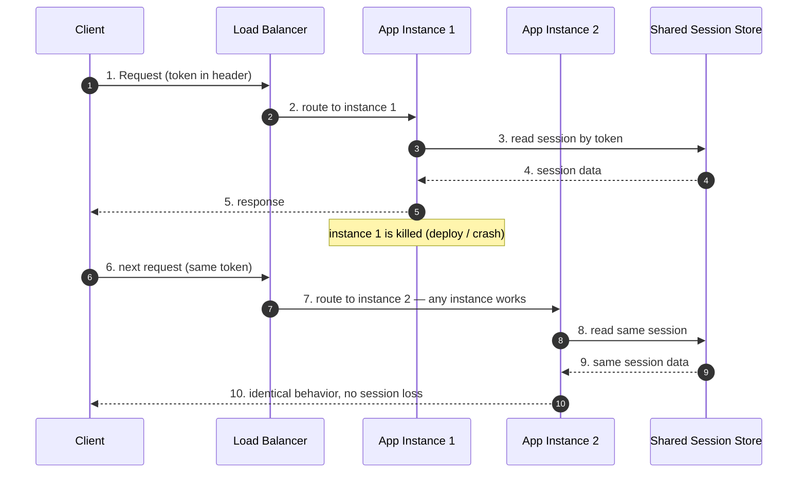
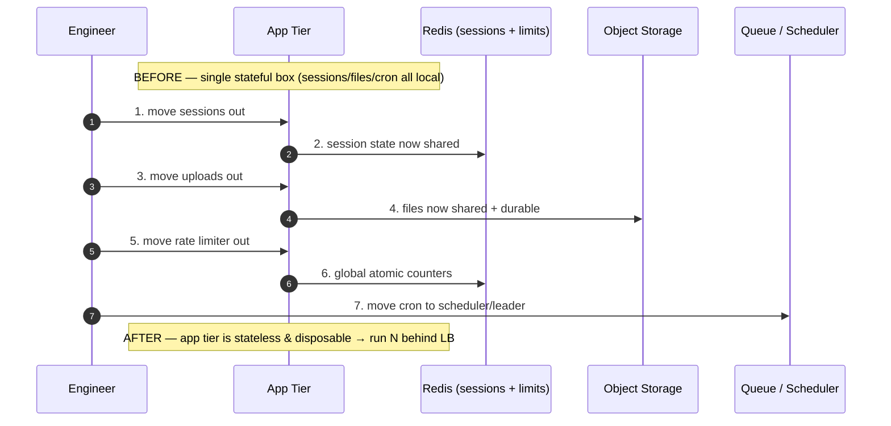

# Stateless Design — Interview

Stateless design is the single property that makes horizontal scaling, painless
failover, and rolling deploys *cheap*. This file is a flat bank of interview
questions with tight, senior-grade answers. The recurring theme an interviewer is
probing: do you understand that "stateless" does not mean "no state" — it means
**no per-client state kept locally on the server between requests**. You didn't
delete the state; you relocated it to somewhere shared and durable.

## Table of Contents

1. [Q1: What does "stateless" actually mean?](#q1-what-does-stateless-actually-mean)
2. [Q2: Why does statelessness enable horizontal scaling, failover, and rolling deploys?](#q2-why-does-statelessness-enable-horizontal-scaling-failover-and-rolling-deploys)
3. [Q3: "You didn't remove state, you relocated it" — explain.](#q3-you-didnt-remove-state-you-relocated-it--explain)
4. [Q4: Where can server-side state go once you push it off the app tier?](#q4-where-can-server-side-state-go-once-you-push-it-off-the-app-tier)
5. [Q5: External session store vs JWT — how do you choose?](#q5-external-session-store-vs-jwt--how-do-you-choose)
6. [Q6: What are sticky sessions and why are they an anti-pattern for scaling?](#q6-what-are-sticky-sessions-and-why-are-they-an-anti-pattern-for-scaling)
7. [Q7: What is the JWT revocation problem?](#q7-what-is-the-jwt-revocation-problem)
8. [Q8: How do you mitigate the JWT revocation problem in practice?](#q8-how-do-you-mitigate-the-jwt-revocation-problem-in-practice)
9. [Q9: How does the 12-factor "disposability" and "stateless processes" idea relate?](#q9-how-does-the-12-factor-disposability-and-stateless-processes-idea-relate)
10. [Q10: Where is true statelessness impossible?](#q10-where-is-true-statelessness-impossible)
11. [Q11: What are hidden-local-state failure modes and how do you catch them?](#q11-what-are-hidden-local-state-failure-modes-and-how-do-you-catch-them)
12. [Q12: Is REST "statelessness" the same as a stateless server process?](#q12-is-rest-statelessness-the-same-as-a-stateless-server-process)
13. [Q13: If the app is stateless, where did the coordination problem go?](#q13-if-the-app-is-stateless-where-did-the-coordination-problem-go)
14. [Q14: Scenario — make this stateful web app horizontally scalable.](#q14-scenario--make-this-stateful-web-app-horizontally-scalable)
15. [Q15: How do you handle file uploads and long-running jobs in a stateless tier?](#q15-how-do-you-handle-file-uploads-and-long-running-jobs-in-a-stateless-tier)
16. [Q16: What does statelessness cost, and when is a stateful design the right call?](#q16-what-does-statelessness-cost-and-when-is-a-stateful-design-the-right-call)

---

## Q1: What does "stateless" actually mean?

> A **stateless service** keeps no per-client, per-session state on the server
> instance between requests. Every request carries everything the server needs to
> process it (identity token, parameters, idempotency key), and any two instances
> of the service are interchangeable for any request. Formally: the response to a
> request is a pure function of `(request, shared backing stores)` — never a
> function of `(request, this-instance's-local-memory-from-a-prior-request)`.
>
> The nuance interviewers want: statelessness is a property of the **application
> tier**, not the whole system. The system as a whole is still full of state — it
> just lives in databases, caches, object stores, and queues that are shared,
> replicated, and durable. Being "stateless" means the *ephemeral compute layer*
> holds no session-critical state locally.

---

## Q2: Why does statelessness enable horizontal scaling, failover, and rolling deploys?

> All three properties fall out of one guarantee: **any instance can serve any
> request**. Because no request is bound to a specific instance's memory, the
> load balancer is free to route each request to whichever instance is healthiest
> or least loaded.
>
> - **Horizontal scaling:** capacity is a linear function of instance count.
>   Adding a node adds throughput immediately — no data migration, no rebalancing,
>   no warm-up of per-user state. Autoscalers can add/remove nodes purely on CPU
>   or RPS signals.
> - **Failover:** if an instance dies mid-flight, only the in-flight requests on
>   it are lost (and those are retried by the client or LB against another node).
>   No session data is lost because none lived there. Recovery = "route around the
>   corpse."
> - **Rolling deploys / blue-green / canary:** you can kill and replace instances
>   in any order because draining an instance loses nothing durable. This is what
>   makes zero-downtime deploys and instant rollback tractable.

---

## Q3: "You didn't remove state, you relocated it" — explain.

> This is the sentence that separates a real understanding from cargo-culting.
> When you make an app tier stateless, the session state, shopping cart, upload
> progress, and rate-limit counters don't vanish — they move to an **external,
> shared, durable store** (Redis, a database, object storage, a token). You have
> traded *local, fast, but instance-bound* state for *remote, shared, but
> network-hop-away* state.
>
> The consequences you must own after relocating:
>
> - A **new dependency and network hop** on the hot path (latency + a new failure
>   mode — what happens when Redis is down?).
> - The store becomes a **shared bottleneck and potential SPOF**; it must itself
>   be scaled, replicated, and capacity-planned.
> - **Consistency questions** you didn't have before: two concurrent requests for
>   the same session now race against a shared store instead of one process's
>   memory.
>
> So "stateless app tier" is really "move the hard state problems down one layer
> to a system that is designed to handle them." The complexity is conserved; you
> relocate it to where it's cheaper to manage.

---

## Q4: Where can server-side state go once you push it off the app tier?

> Four destinations, chosen by the nature of the state:

| Destination | Best for | Latency | Durability | Failure mode when it's down |
|---|---|---|---|---|
| **External session store** (Redis, Memcached) | Session data, carts, rate-limit counters, short-lived hot state | Sub-ms LAN | Configurable (RDB/AOF); often treated as soft | All sessions unreachable → forced re-login / degraded |
| **Client-side token** (JWT, signed cookie) | Identity + claims that fit in a few KB | Zero server read | N/A (client holds it) | Cannot revoke instantly (see Q7) |
| **Durable database** (Postgres, DynamoDB) | State that must survive and be queried (orders, user profile) | ms | High (replicated, backed up) | Core outage — whole system degraded |
| **Object storage** (S3, GCS) | Large blobs: uploads, exports, media | tens of ms | Very high (11 nines on S3) | Blob reads/writes fail; metadata tier can still serve |

> The senior move is to match each *kind* of state to the right store rather than
> shoving everything into one. Session tokens in Redis, business records in the
> DB, files in object storage, ephemeral progress in a token or cache with a TTL.

---

## Q5: External session store vs JWT — how do you choose?

> Both remove state from the app tier; they differ in *where* the session lives
> and therefore in their revocation and size trade-offs.

| Dimension | External session store (opaque session ID) | JWT / self-contained token |
|---|---|---|
| Where state lives | Server-side store (Redis/DB); client holds only an ID | Inside the token on the client; server holds nothing |
| Read on each request | Yes — network hop to store | No — verify signature locally (stateless auth) |
| Revocation | Instant — delete the session row | Hard — token valid until expiry (see Q7) |
| Payload size | Tiny cookie (just the ID) | Larger; grows with claims; sent every request |
| Scaling cost | Store must scale with active sessions | Near-zero server state; CPU for signature verify |
| Mutable session data | Easy — update the store | Awkward — token is immutable until reissued |
| Cross-service auth | Needs shared store access or a service | Any service with the public key can verify |

> Rule of thumb: **JWTs shine for short-lived, cross-service authentication where
> you want zero server-side session lookups.** **Server-side sessions shine when
> you need instant revocation, mutable session data, or you don't want a
> revocation-list workaround.** A very common production pattern is the hybrid:
> short-lived JWT **access tokens** (stateless, ~5–15 min) plus a long-lived
> **refresh token** whose validity *is* checked against a server-side store — you
> get stateless request auth and a real revocation lever.

---

## Q6: What are sticky sessions and why are they an anti-pattern for scaling?

> **Sticky sessions** (session affinity) configure the load balancer to pin a
> client to the same backend instance for the life of their session, usually via
> a cookie or source-IP hash. This lets each instance keep the session in *local
> memory* — which is exactly the local state that statelessness is supposed to
> eliminate.
>
> Why it fights scaling and reliability:
>
> - **Failover loses sessions:** when the pinned instance dies, that user's
>   session dies with it — forced re-login or lost cart, precisely mid-incident.
> - **Uneven load:** long-lived sticky connections cause hot instances; a newly
>   added instance gets only *new* sessions, so scaling out doesn't relieve
>   existing pressure.
> - **Rolling deploys hurt users:** draining an instance evicts everyone pinned to
>   it. You can't freely cycle instances.
>
> It's a legitimate *bridge* — a fast way to run a legacy stateful app behind a
> load balancer without rewriting it. But the correct end state is to externalize
> the session so any instance serves any request, and drop affinity. Treat sticky
> sessions as technical debt with interest, not a destination.

---

## Q7: What is the JWT revocation problem?

> A JWT is **self-validating**: the server trusts it because the signature checks
> out, without consulting any store. That's the source of its scalability *and*
> its core weakness. Because there's no server-side lookup, there's **no natural
> point at which to say "this token is no longer valid."**
>
> Consequence: if a token is compromised, a user logs out, an admin disables an
> account, or permissions are downgraded, the already-issued token **remains valid
> until its `exp` claim passes.** Anyone holding it keeps access for the remainder
> of its lifetime. Logout on a pure-JWT system is often a client-side illusion —
> the browser drops the token, but a stolen copy still works.
>
> This is the fundamental tension: statelessness means "don't check a store," but
> revocation means "check a store." You cannot have instant revocation and
> zero-lookup validation simultaneously without a mitigation.

---

## Q8: How do you mitigate the JWT revocation problem in practice?

> You reintroduce *just enough* state to get a revocation lever, while keeping the
> common path stateless:
>
> - **Short-lived access tokens + refresh tokens.** Access tokens live 5–15 min so
>   the blast radius of a leaked token is small. The long-lived refresh token is
>   checked against a server-side store on each refresh — that's your revocation
>   point. Revoke by deleting the refresh token; the access token dies naturally
>   within minutes.
> - **Denylist / blocklist of revoked token IDs.** Give each token a `jti` (unique
>   ID); on revocation, add the `jti` to a fast store (Redis) with a TTL equal to
>   the token's remaining lifetime. The server checks the denylist per request.
>   This is small (only *revoked, unexpired* tokens) but reintroduces a per-request
>   lookup — a partial return to statefulness, by design.
> - **Token versioning / `token_version` claim.** Store a per-user integer; embed
>   it in the token; bump it on "log out everywhere" or password change. A cheap
>   check invalidates all of a user's tokens at once.
> - **Rotate signing keys** to invalidate everything issued under an old key (blunt
>   — logs out everyone; use for key-compromise, not routine logout).
>
> The honest framing for the interviewer: **each mitigation trades a bit of the
> statelessness back for control.** The refresh-token pattern is the industry
> default because it confines the stateful check to the infrequent refresh path.
> See RFC 7519 (JWT) and RFC 6749 / RFC 9700 (OAuth 2.0 and its security best
> current practice) for the canonical treatment.

---

## Q9: How does the 12-factor "disposability" and "stateless processes" idea relate?

> Two of the Twelve Factors state this directly:
>
> - **Factor VI — Processes:** "Execute the app as one or more stateless
>   processes." Any data that must persist is stored in a stateful backing service
>   (a database). Memory or filesystem may be used as a brief single-transaction
>   cache, but you must never assume anything cached there will be available on a
>   future request — it might land on a different process.
> - **Factor IX — Disposability:** processes are disposable — they can be started
>   or stopped at a moment's notice, should start fast, and shut down gracefully.
>
> Statelessness is the *precondition* for disposability. A process you can kill
> and restart at will, on any host, is only safe if killing it loses nothing
> irreplaceable. That's what makes elastic autoscaling, robust deploys, and
> tolerance of crashy hardware (spot/preemptible instances) possible. This is also
> why containers and Kubernetes assume stateless workloads by default: Pods are
> cattle, not pets, precisely because the app tier holds no local state.

---

## Q10: Where is true statelessness impossible?

> Some workloads are *inherently stateful* — the state is the point of the system,
> and you can't relocate it to a shared store without destroying the property you
> need:
>
> - **Long-lived connections (WebSockets, SSE, gRPC streams).** The connection
>   *is* the state. A specific TCP connection is bound to a specific process; you
>   cannot move an open socket to another instance. You externalize *what you can*
>   (session identity, subscriptions in a shared registry, fan-out via a
>   pub/sub bus like Redis or a message broker) but the socket itself stays put.
> - **Stateful stream processing** (Flink/Kafka Streams windows, aggregations).
>   Operators hold large keyed state (running counts, windows). It's checkpointed
>   to durable storage for recovery, but during processing it's local to the task
>   for performance — you can't do a network round-trip per event at millions of
>   events/sec.
> - **Leader election / consensus** (Raft, ZooKeeper, etcd). The whole purpose is
>   for one node to *be* the leader — an inherently stateful, non-interchangeable
>   role. Nodes are deliberately *not* fungible.
> - **In-memory stores themselves** (Redis, the database, a cache). Something has
>   to actually hold the state; you can't turtle all the way down.
>
> The pattern: **push statefulness to the edges of the system into components
> purpose-built to manage it, and keep the broad middle tier stateless.** The
> question isn't "can everything be stateless" (no) — it's "have I isolated the
> unavoidable state into as few, as well-managed components as possible."

---

## Q11: What are hidden-local-state failure modes and how do you catch them?

> "Hidden local state" is state that leaks into a supposedly stateless instance by
> accident, so the service *appears* stateless in testing (single instance) and
> breaks subtly under load-balanced multi-instance production. Classic offenders:
>
> - **In-process caches / memoization** that assume one instance sees all requests
>   → cache hit rates collapse and, worse, correctness bugs when instances
>   disagree.
> - **Local filesystem writes** (uploads, generated files, temp state) → the next
>   request lands on another instance and the file isn't there.
> - **In-memory rate limiters / counters** → each instance counts only its own
>   traffic, so the effective limit is `N × configured` with N instances.
> - **Sticky-session assumptions baked into code** → "the user's cart is in this
>   process's map" silently breaks the moment affinity is dropped.
> - **Local scheduler / cron / singleton jobs** → every instance runs the job,
>   causing duplicate work (emails sent N times).
> - **Long-lived in-process locks or sequence generators** → no longer mutually
>   exclusive across instances.
>
> How to catch them:
>
> - **Run at least two instances in every environment**, including staging. Most
>   hidden-state bugs are invisible at N=1 and obvious at N=2.
> - **Chaos-test with instance churn**: randomly kill and restart instances during
>   a functional test; anything that breaks was holding local state.
> - **Make the local filesystem read-only** for the app container; writes must go
>   to object storage. Fail loudly on attempted local writes.
> - **Route consecutive requests from one test client to different instances on
>   purpose** (disable affinity in test) to surface "second request, wrong host"
>   bugs.

---

## Q12: Is REST "statelessness" the same as a stateless server process?

> Related but not identical, and conflating them is a common slip. REST's
> statelessness constraint (Fielding) is about the **client-server protocol**:
> each request must contain all information needed to understand it; the server
> must not rely on stored *conversational* context from previous requests on this
> connection. It's a constraint on the *interaction*.
>
> A **stateless process** (12-factor Factor VI) is about **deployment**: the
> server instance holds no local session state, so instances are interchangeable.
>
> They reinforce each other — a RESTful API that carries full context per request
> is naturally easy to serve from a stateless, horizontally scaled fleet — but you
> can violate one without the other. You could build a stateless *process* that
> nonetheless requires a specific request *ordering* (not RESTful), or a RESTful
> API served by processes that secretly cache session data locally (not stateless
> processes). Interviewers use this to check whether you know *which* statelessness
> you're claiming.

---

## Q13: If the app is stateless, where did the coordination problem go?

> It moved to the shared stores — and it got *harder to ignore*, not easier. When
> session state lived in one process's memory, a request had exclusive, race-free
> access to it. Once state is in a shared Redis or database, two concurrent
> requests for the same key can race.
>
> So statelessness at the app tier **pushes coordination down into the backing
> services**, where you now need:
>
> - **Atomic operations** (Redis `INCR`, `SETNX`, Lua scripts) instead of
>   read-modify-write in app memory.
> - **Optimistic concurrency** (compare-and-set / version columns) or transactions
>   in the database.
> - **Distributed locks** (with fencing tokens) when you genuinely need mutual
>   exclusion across the fleet — e.g., a job that must run exactly once.
>
> The lesson: statelessness doesn't eliminate coordination; it relocates it (Q3
> again) to a layer that has proper concurrency primitives. That's a *good* trade
> — those primitives exist precisely because coordinating in a shared store is a
> solved problem, whereas coordinating across N app-process memories is not.

---

## Q14: Scenario — make this stateful web app horizontally scalable.

> **Given:** a monolithic web app running on one big server. It stores logged-in
> user sessions in process memory, saves uploaded avatars to the local disk, keeps
> an in-memory rate limiter, and runs a nightly report via an in-process cron.
> Traffic has outgrown one box. Walk me through making it horizontally scalable.
>
> Approach — externalize each piece of hidden local state, in order of risk:
>
> 1. **Sessions → external store.** Move session data to Redis (or issue signed
>    JWT/refresh-token pairs). Replace the in-memory session map with a lookup by
>    session ID / token. Now any instance serves any user. *This is the change
>    that unlocks everything else.*
> 2. **Uploaded files → object storage.** Write avatars to S3/GCS and store only
>    the URL/key in the database. Make the app container's filesystem effectively
>    read-only so future local-write regressions fail loudly.
> 3. **Rate limiter → shared store.** Replace the in-memory counter with a Redis-
>    based limiter (atomic `INCR` + TTL, or a sliding-window / token-bucket in a
>    Lua script) so the limit is global across instances, not `N ×` per instance.
> 4. **Cron / singleton jobs → external scheduler or leader election.** Don't let
>    every instance run the nightly report. Options: a dedicated scheduler/worker
>    tier consuming from a queue, a distributed lock so exactly one instance runs
>    it, or an external cron (Kubernetes CronJob) that triggers one execution.
> 5. **Put a load balancer in front, run ≥2 instances, drop sticky sessions.**
>    Health checks let the LB route around dead nodes. Configure an autoscaler on
>    CPU/RPS.
> 6. **Verify by chaos.** Run multiple instances in staging, disable affinity, and
>    kill instances mid-test. If nothing breaks, no hidden local state remains.
>
> The meta-point to say out loud: *"I'm not deleting this app's state — I'm
> relocating each piece to a store designed to be shared, then the app tier
> becomes fungible and scales linearly behind a load balancer."*

---

## Q15: How do you handle file uploads and long-running jobs in a stateless tier?

> **File uploads:** never persist the uploaded bytes on the instance that received
> them. Stream them to object storage (S3/GCS), ideally via **pre-signed URLs** so
> the client uploads directly to storage and the app tier only mints the URL and
> records metadata. For large multi-part uploads where progress must survive an
> instance dying, keep the upload session/state in the object store's multipart
> API or in a shared store, keyed by an upload ID the client re-presents.
>
> **Long-running jobs:** don't run them synchronously inside the request-handling
> process — that binds work to an instance that may be killed by a deploy. Instead
> the stateless tier **enqueues a job** (message queue / task queue) and returns a
> job ID immediately. A separate worker tier consumes the queue; the client polls
> a status endpoint (or gets a webhook) using the job ID. Progress lives in a
> shared store, not process memory. Now killing any instance loses nothing: the
> request tier is stateless, the job is durable in the queue, and workers are
> themselves disposable and idempotent (so a retried job is safe).

---

## Q16: What does statelessness cost, and when is a stateful design the right call?

> Statelessness is not free, and pretending it is signals inexperience. Costs:
>
> - **An extra network hop per request** to the session/state store — real latency
>   on the hot path, plus a new dependency that can fail.
> - **The shared store becomes a bottleneck and a SPOF** you must now scale,
>   replicate, and monitor. You moved the hard problem; you didn't dissolve it.
> - **Repeated re-fetching / re-derivation** of context that a stateful process
>   could have kept warm in memory — wasted work compared to local caching.
>
> When a **stateful** design is actually right:
>
> - **Ultra-low-latency or high-throughput inner loops** where a per-request
>   network hop to fetch state is intolerable — e.g., a game server, an ad-serving
>   node with a huge hot in-memory model, or a stateful stream processor. Here you
>   *want* local state and accept affinity + careful failover.
> - **Inherently stateful roles** (Q10): the store itself, leaders, connection
>   terminators for WebSockets/streams.
> - **Small/simple systems** where one box is plenty and the operational cost of a
>   distributed session store isn't justified yet.
>
> The senior stance: *default the broad request-handling tier to stateless for
> elasticity and operational simplicity, and consciously localize state only in
> the few components where the latency or nature of the work demands it — then
> give those components the affinity, replication, and failover they need.*

---

*Next step:* [Service Mesh Intro — Junior](../service-mesh-intro/junior.md)
