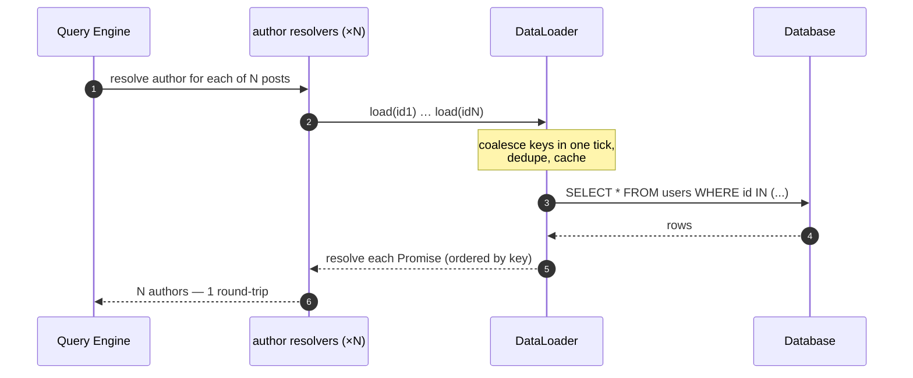
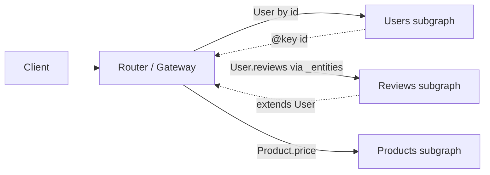

# GraphQL — Interview

GraphQL interview questions for senior/staff backend candidates. Answers are terse on purpose — enough to signal depth, not to lecture. The through-line: GraphQL moves query flexibility from server to client, and that single trade shifts your hardest problems from *endpoint design* to *caching, authorization, and DoS defense*.

## Contents

1. [Q1: What is GraphQL and what problem does it solve?](#q1-what-is-graphql-and-what-problem-does-it-solve)
2. [Q2: Explain schema, types, and resolvers.](#q2-explain-schema-types-and-resolvers)
3. [Q3: Queries vs mutations vs subscriptions.](#q3-queries-vs-mutations-vs-subscriptions)
4. [Q4: What is the N+1 problem and how does DataLoader fix it?](#q4-what-is-the-n1-problem-and-how-does-dataloader-fix-it)
5. [Q5: Why is HTTP caching hard with GraphQL?](#q5-why-is-http-caching-hard-with-graphql)
6. [Q6: How do you defend against expensive/malicious queries?](#q6-how-do-you-defend-against-expensivemalicious-queries)
7. [Q7: How does authorization work in GraphQL?](#q7-how-does-authorization-work-in-graphql)
8. [Q8: What is GraphQL federation?](#q8-what-is-graphql-federation)
9. [Q9: How does error handling differ from REST?](#q9-how-does-error-handling-differ-from-rest)
10. [Q10: How do you version a GraphQL API?](#q10-how-do-you-version-a-graphql-api)
11. [Q11: What are persisted queries and why use them?](#q11-what-are-persisted-queries-and-why-use-them)
12. [Q12: How do subscriptions work at the transport level?](#q12-how-do-subscriptions-work-at-the-transport-level)
13. [Q13: GraphQL vs REST — the honest trade-offs.](#q13-graphql-vs-rest--the-honest-trade-offs)
14. [Q14: Scenario — when would you choose GraphQL, and what operational problems must you solve?](#q14-scenario--when-would-you-choose-graphql-and-what-operational-problems-must-you-solve)

---

## Q1: What is GraphQL and what problem does it solve?

GraphQL is a query language and server runtime for APIs where the **client specifies exactly which fields it wants**, and the server returns a JSON response shaped to match. It targets two REST pain points:

- **Over-fetching** — a REST `GET /users/1` returns the whole user object even when the UI needs only `name` and `avatarUrl`. Bytes and serialization wasted.
- **Under-fetching / round-trips** — rendering a screen needs `/users/1`, then `/users/1/posts`, then `/posts/{id}/comments`. That's a waterfall of requests, each adding latency. GraphQL collapses this into **one round-trip** describing the whole graph.

The mental shift: REST exposes a fixed set of *resources/representations*; GraphQL exposes a *typed graph* the client traverses on demand. It is transport-agnostic but almost always runs over a single `POST /graphql` endpoint. Crucially, GraphQL doesn't make anything *faster* on the backend — it moves the composition problem from many endpoints to one query planner, which is why the hard problems (Q4–Q7) all cluster around that flexibility.

## Q2: Explain schema, types, and resolvers.

Three layers:

- **Schema** — a strongly-typed contract written in SDL (Schema Definition Language). It defines object types, fields, arguments, and the three root types `Query`, `Mutation`, `Subscription`. It is introspectable, which powers tooling (autocomplete, codegen, docs).
- **Types** — scalars (`Int`, `Float`, `String`, `Boolean`, `ID`), objects, `enum`, `interface`, `union`, `input` types, plus non-null (`!`) and list (`[]`) wrappers. Non-null is a *contract*: if a non-null resolver returns `null`, the error propagates up to the nearest nullable ancestor.

```graphql
type User { id: ID!  name: String!  posts: [Post!]! }
type Post { id: ID!  title: String!  author: User! }
type Query { user(id: ID!): User }
```

- **Resolvers** — a function per field: `resolve(parent, args, context, info)`. The engine walks the query tree top-down; each resolver returns a value (or Promise) that becomes the `parent` for its children. Fields with no resolver fall back to a default that reads `parent[fieldName]`. `context` carries request-scoped state (auth principal, DataLoaders, DB handles).

## Q3: Queries vs mutations vs subscriptions.

The three operation types differ in **intent and execution semantics**:

| Operation | Purpose | Execution | Idempotent? |
|-----------|---------|-----------|-------------|
| `query` | Read | Sibling fields resolved **in parallel** | Yes (should be) |
| `mutation` | Write | Top-level fields resolved **serially**, in order | No |
| `subscription` | Long-lived read stream | Emits on server-side events over a persistent connection | N/A |

The serial-execution rule for mutations matters: `[deposit, withdraw]` in one document runs `deposit` fully before `withdraw` starts, so clients can batch dependent writes deterministically. Query fields resolve in parallel because reads are assumed side-effect-free. Note GraphQL gives you no cross-mutation transaction — if you need atomicity across writes, model it as a **single mutation** that owns the transaction boundary.

## Q4: What is the N+1 problem and how does DataLoader fix it?

Given `{ posts { author { name } } }`: the `posts` resolver returns N posts (1 query), then GraphQL invokes the `author` resolver **once per post** — N more queries. Total = **N+1** database round-trips. This is structural, not a bug: resolvers are per-field and don't know their siblings exist.

**DataLoader** fixes it with **per-request batching + caching**:

1. Instead of `SELECT ... WHERE id = X`, each `author` resolver calls `userLoader.load(authorId)`, which returns a Promise but *doesn't fire yet*.
2. DataLoader coalesces all `.load()` calls made in the same tick of the event loop, then calls your batch function **once**: `batchFn([id1, id2, ...]) → SELECT ... WHERE id IN (...)`.
3. It memoizes by key within the request, so the same author fetched twice hits the DB once.

Result: N+1 → **2 queries**. Two rules: (a) the batch function must return results **in the same order** as the input keys (map by id, don't assume DB ordering); (b) create a **fresh DataLoader per request** — a long-lived loader leaks data across users and serves stale reads.



## Q5: Why is HTTP caching hard with GraphQL?

REST caching leans on the URL as a cache key plus HTTP verbs/headers: `GET /users/1` is cacheable by any intermediary (CDN, browser, reverse proxy) keyed on the path. GraphQL breaks all of those assumptions:

- **Single endpoint, POST body** — every request is `POST /graphql`. The URL is identical for every query, and POST is not cached by default. The cache key must be the *query text + variables*, which intermediaries don't understand.
- **Arbitrary response shapes** — two clients asking for overlapping-but-different field sets produce different responses, so coarse response caching has poor hit rates.

Mitigations, in layers:

1. **Persisted queries** (Q11) + `GET` — send a hash instead of the query, use `GET` so CDNs/browsers cache normally.
2. **Normalized client cache** — Apollo/Relay cache by `__typename:id` at the *object* level, so a field fetched in one query is reused in another. This is where GraphQL's real caching win lives.
3. **Server-side resolver/data caching** — cache at the DataLoader / entity layer, below the query engine.

The takeaway to state clearly: GraphQL trades *cheap edge caching* for *powerful client-side normalized caching*. If your workload is CDN-cache-friendly public data, that's a real cost.

## Q6: How do you defend against expensive/malicious queries?

Because clients author queries, a single request can be pathologically expensive — this is a genuine DoS surface. Layered defenses:

- **Depth limiting** — reject queries nested beyond N levels. Blocks cyclic explosions like `user { friends { friends { friends { ... } } } }` (possible whenever the graph has cycles).
- **Query complexity analysis** — assign a cost to each field (e.g., list fields cost `count × childCost`), compute total before execution, reject over budget. This is stronger than depth alone because it catches wide-and-shallow queries too.
- **Amount / pagination limits** — cap `first`/`last` arguments; forbid unbounded list fetches.
- **Persisted-queries allowlist** — in production, accept **only** a pre-registered set of query hashes. This is the strongest control: arbitrary ad-hoc queries are simply rejected, eliminating the whole attack class.
- **Timeouts + rate limiting + query cost as the rate unit** — bill rate limits in complexity points, not request count.

State the order of preference: for a locked-down first-party API, **persisted-query allowlisting** is the primary defense; complexity/depth limits are the backstop for open or exploratory APIs.

## Q7: How does authorization work in GraphQL?

There is no HTTP-method/URL to guard, so authorization moves **into the graph**. Levels:

- **Authentication** — done at the transport layer (validate the token in middleware), placing the principal in `context`.
- **Field-level / type-level authz** — the powerful and dangerous part. Any field can traverse to any other type, so `{ user(id: 1) { billingAccount { creditCardLast4 } } }` must be authorized *per field*, not per endpoint. Enforce in resolvers or via schema directives (`@auth(role: ADMIN)`) / a policy layer.
- **Object-level (BOLA/IDOR)** — check that the *authenticated principal owns/may-see this specific object*, not just that they have the role. This is the #1 GraphQL vuln because the graph makes lateral traversal trivial.

Practical guidance: enforce authz in the **data/business layer** the resolvers call (so it's consistent whether accessed via GraphQL, REST, or a job), and use DataLoader-level checks so batching doesn't bypass per-object rules. Also: **disable introspection in production** for non-public APIs so the schema isn't a free attack map.

## Q8: What is GraphQL federation?

Federation composes **one unified graph from many independently-owned subgraph services** — the microservices answer to GraphQL's monolithic single-schema problem. Instead of one giant server, each team owns a subgraph, and a **gateway/router** stitches them into a supergraph and plans cross-service queries.

Mechanics (Apollo Federation model):

- A type has an **owning** subgraph that declares its key: `type User @key(fields: "id")`.
- Other subgraphs **extend** that type to add fields they own: the Reviews service adds `User.reviews` without owning `User`.
- The router resolves a query spanning both by fetching the base entity, then calling each subgraph's **`_entities` reference resolver** with the key to hydrate the extended fields.



Benefit: team autonomy without exposing N endpoints to clients. Cost: the router becomes a critical latency/availability chokepoint, cross-subgraph queries fan out (watch N+1 *across services*), and schema composition/governance becomes an org problem.

## Q9: How does error handling differ from REST?

GraphQL returns **HTTP 200 for most requests**, including partial failures. The response is `{ "data": ..., "errors": [...] }`:

- A resolver that throws produces an entry in the top-level `errors` array; the corresponding field is `null` and (for non-null fields) nullifies up to the nearest nullable ancestor. Other fields still resolve — **partial success** is a first-class outcome.
- Distinguish **transport errors** (malformed query, 400; auth failure, 401/400) from **execution errors** (resolver threw, 200 + `errors`).
- Best practice: put *unexpected* failures in `errors`, but model *expected* domain outcomes (validation failure, "insufficient funds") as **typed schema results** — e.g., a union `TransferResult = TransferSuccess | InsufficientFunds` — so clients handle them via the type system rather than string-matching error messages.

The interview signal: candidates should note that "200 with errors" surprises REST-trained monitoring and that alerting on HTTP status alone is broken for GraphQL.

## Q10: How do you version a GraphQL API?

GraphQL's design philosophy is **continuous evolution, not versioned URLs** (no `/v2`). You:

- **Add** fields, types, and arguments freely — additive changes are non-breaking because clients request only what they name.
- **Deprecate** fields with the `@deprecated(reason: "use X")` directive, which tooling surfaces to consumers.
- **Measure real usage** via field-level analytics/observability, then remove a field only after usage drops to zero.

This works precisely *because* clients declare their field selection — the server knows exactly who depends on what. Breaking changes (removing a field, tightening nullability from nullable→non-null on input, changing a type) are avoided or migrated behind new fields. For federated graphs, schema **composition checks** in CI catch changes that would break the supergraph.

## Q11: What are persisted queries and why use them?

A persisted (or "trusted") query is a query whose text is **registered ahead of time** and referenced by a hash. The client sends `{ "sha256Hash": "abc..." }` instead of the full query string.

Wins, all of which address earlier problems:

- **Smaller requests** — a hash instead of kilobytes of query text.
- **HTTP caching (Q5)** — send it via `GET` with the hash in the URL, so CDNs/browsers cache normally.
- **Security (Q6)** — an **allowlist** of persisted queries means the server executes *only* known queries; arbitrary/malicious queries are rejected outright.

Apollo's **Automatic Persisted Queries (APQ)** is a runtime handshake: client sends hash → server 404s if unknown → client resends `hash + full query` once → server registers it. A stricter **build-time allowlist** registers queries during CI and rejects anything unregistered — preferred for locked-down first-party APIs.

## Q12: How do subscriptions work at the transport level?

Subscriptions need a **persistent server→client channel** because the server pushes on events. Options:

- **WebSocket** — the classic transport (`graphql-ws` protocol; the older `subscriptions-transport-ws` is deprecated). Full duplex, one connection carries many subscriptions with an id per stream.
- **SSE (Server-Sent Events)** — `graphql-sse`, one-directional server→client over plain HTTP; simpler, proxy-friendly, no upgrade handshake. Good when you only push.

Flow: client sends a `subscribe` op → server keeps the stream open → on each matching event (typically fanned out via a pub/sub bus like Redis so it works across horizontally-scaled nodes) the server runs the selection set and pushes a data frame.

Operational realities to raise: subscriptions are **stateful**, so they complicate horizontal scaling (sticky routing or shared pub/sub), connection count becomes a capacity dimension, and you must handle auth expiry, backpressure, and reconnection/resume on the long-lived connection.

## Q13: GraphQL vs REST — the honest trade-offs.

| Dimension | REST | GraphQL |
|-----------|------|---------|
| Data fetching | Fixed per endpoint; over/under-fetch | Client picks exact fields; one round-trip |
| Endpoints | Many resource URLs | One `POST /graphql` |
| HTTP caching | Native (URL + verbs + CDN) | Hard; needs persisted queries / client cache |
| Type contract | Optional (OpenAPI bolt-on) | Built-in, introspectable schema |
| Versioning | `/v2` URLs common | Additive evolution + `@deprecate` |
| Error model | HTTP status codes | 200 + `errors[]`, partial results |
| DoS surface | Bounded per endpoint | Client-authored queries → needs depth/complexity limits |
| Best fit | Public/cacheable APIs, simple CRUD, file up/download | Rich clients, many entities, mobile bandwidth, graph-shaped data |

There is no universal winner. GraphQL trades edge-cacheability and simple ops for client flexibility and a strong type system; REST trades flexibility for HTTP-native simplicity. Many mature systems run **both**: GraphQL as a BFF/aggregation layer over REST/gRPC microservices.

## Q14: Scenario — when would you choose GraphQL, and what operational problems must you solve?

**Choose GraphQL when:**

- You have **many heterogeneous clients** (web, iOS, Android, partners) with *different* data needs against the *same* backend — GraphQL avoids maintaining bespoke endpoints per client.
- Screens are **graph-shaped and aggregate many entities**, so REST would cause request waterfalls (a dashboard, a social feed, a product page pulling reviews/pricing/inventory).
- Clients are **bandwidth/latency-sensitive** (mobile) and benefit from precise field selection and one round-trip.
- You're building a **BFF/aggregation layer** over multiple downstream services and want one typed contract.

**Avoid it when** the API is simple CRUD, mostly public cacheable content (news, assets), or file transfer — REST + CDN is simpler and cheaper.

**Operational problems you must solve before shipping:**

1. **N+1 across resolvers and services** — mandatory DataLoader batching; watch fan-out in federation (Q4, Q8).
2. **DoS from client-authored queries** — depth + complexity limits, and a **persisted-query allowlist** for first-party clients (Q6, Q11).
3. **Caching strategy** — you lose easy CDN caching; plan persisted-queries-over-GET plus a normalized client cache and server-side entity caching (Q5).
4. **Authorization in the graph** — per-field and per-object (BOLA) checks in the business layer, introspection disabled in prod (Q7).
5. **Observability** — field-level tracing/usage analytics (since one endpoint hides everything), and alerting that understands "200-with-errors" (Q9).
6. **Schema governance** — CI composition/breaking-change checks, deprecation-driven evolution instead of URL versioning (Q10, Q8).

The one-sentence answer an interviewer wants: *"I'd pick GraphQL when many diverse clients query graph-shaped data over one backend — but only if I'm ready to own DataLoader batching, query-cost limits, persisted queries, in-graph authorization, and field-level observability, because GraphQL doesn't remove those problems, it relocates them from endpoint design into the query layer."*

---

*Next step:* [Idempotent Operations — Junior](../idempotent-operations/junior.md)
