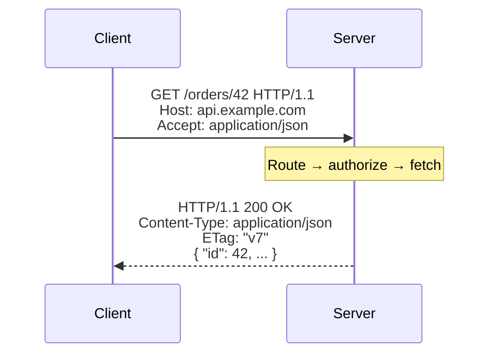
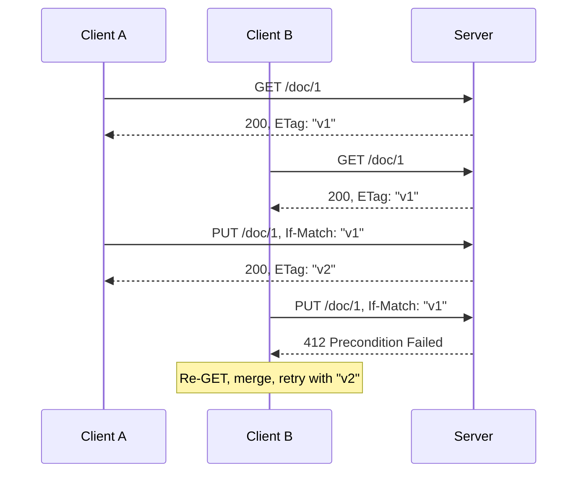

# HTTP — Interview

HTTP interview questions probe whether you treat the protocol as a *contract* — semantics you exploit for correctness (idempotency, conditional requests) and scale (caching, backpressure) — or as a dumb transport you tunnel JSON over. The dividing line between a mid and a senior answer is almost always: *does the candidate reach for HTTP's built-in machinery, or reinvent it in the application layer?*

## Contents

1. [Q1: Describe the HTTP request/response model.](#q1-describe-the-httprequestresponse-model)
2. [Q2: Safe, idempotent, cacheable — define each and classify the methods.](#q2-safe-idempotent-cacheable--define-each-and-classify-the-methods)
3. [Q3: Why does idempotency matter for retries?](#q3-why-does-idempotency-matter-for-retries)
4. [Q4: PUT vs PATCH vs POST — when do you use each?](#q4-put-vs-patch-vs-post--when-do-you-use-each)
5. [Q5: Walk through the status code families and name the ones people misuse.](#q5-walk-through-the-status-code-families-and-name-the-ones-people-misuse)
6. [Q6: What does "HTTP is stateless" actually mean, and why do we want it?](#q6-what-does-http-is-stateless-actually-mean-and-why-do-we-want-it)
7. [Q7: How do ETags and conditional requests work?](#q7-how-do-etags-and-conditional-requests-work)
8. [Q8: Implement optimistic concurrency control over HTTP.](#q8-implement-optimistic-concurrency-control-over-http)
9. [Q9: Explain the caching model: freshness, validation, and the key directives.](#q9-explain-the-caching-model-freshness-validation-and-the-key-directives)
10. [Q10: A client is hammering your API. What do you return, and how does the client behave?](#q10-a-client-is-hammering-your-api-what-do-you-return-and-how-does-the-client-behave)
11. [Q11: Which headers do you consider load-bearing for a correct API?](#q11-which-headers-do-you-consider-load-bearing-for-a-correct-api)
12. [Q12: Cookies vs bearer tokens for authenticating an API — trade-offs?](#q12-cookies-vs-bearer-tokens-for-authenticating-an-api--trade-offs)
13. [Q13: How do you handle a non-idempotent POST that a client may retry?](#q13-how-do-you-handle-a-non-idempotent-post-that-a-client-may-retry)
14. [Q14: What is content negotiation and why does it matter for cache correctness?](#q14-what-is-content-negotiation-and-why-does-it-matter-for-cache-correctness)
15. [Q15: Scenario — design a correct REST-ish HTTP API for a `Payment` resource.](#q15-scenario--design-a-correct-rest-ish-http-api-for-a-payment-resource)
16. [Q16: What breaks when you ignore HTTP semantics and tunnel everything through POST?](#q16-what-breaks-when-you-ignore-http-semantics-and-tunnel-everything-through-post)

---

## Q1: Describe the HTTP request/response model.

HTTP is a **stateless, request/response, client-initiated** application protocol. The client sends a *request* — a method (verb), a target URI, a protocol version, headers, and an optional body — and the server returns exactly one *response* — a status line (version + status code + reason phrase), headers, and an optional body. There is one response per request; the server never speaks first (server-push in HTTP/2 aside, now effectively dead).

The abstractions are stable across versions even as the wire format changed radically:

HTTP/1.1 sends this as plaintext with newline framing over one TCP connection; HTTP/2 multiplexes many request/response streams over a single connection as binary frames with HPACK header compression; HTTP/3 moves that multiplexing onto QUIC over UDP to kill TCP head-of-line blocking. The **semantics** (methods, status codes, headers, meaning of a resource) are shared and specified separately (RFC 9110) from the wire syntax (RFC 9112/9113/9114). This separation is the key insight: you design APIs against the semantics, not the transport.

## Q2: Safe, idempotent, cacheable — define each and classify the methods.

Three orthogonal properties, defined in RFC 9110:

- **Safe**: the request is read-only from the client's intent — it does not request a state change. Safe methods are the ones a crawler or prefetcher may fire freely.
- **Idempotent**: making the request *N* times has the same effect on server state as making it once. Note this is about *state*, not the response body — a `DELETE` fired twice is idempotent even though the second returns `404`.
- **Cacheable**: the response *may* be stored and reused, subject to freshness rules.

| Method | Safe | Idempotent | Cacheable | Typical use |
|--------|------|-----------|-----------|-------------|
| GET | ✅ | ✅ | ✅ | Retrieve a representation |
| HEAD | ✅ | ✅ | ✅ | Metadata/existence check, no body |
| OPTIONS | ✅ | ✅ | ❌ | Capabilities, CORS preflight |
| PUT | ❌ | ✅ | ❌ | Replace resource at known URI |
| DELETE | ❌ | ✅ | ❌ | Remove resource |
| POST | ❌ | ❌ | ⚠️ only if explicit `Cache-Control`/`Expires` | Create / process / non-idempotent action |
| PATCH | ❌ | ❌* | ❌ | Partial update |

*PATCH is not idempotent in general — a JSON Patch `{"op":"add","path":"/tags/-","value":"x"}` appends each time. It *can* be made idempotent with a merge-style payload plus a precondition. Safe ⊆ idempotent (every safe method is idempotent) but not vice versa. The whole point of memorizing this table is that it drives retry policy, prefetch safety, and cache eligibility — it is not trivia.

## Q3: Why does idempotency matter for retries?

Because the network is a **liar about failure**. When a client times out or gets a connection reset, it cannot distinguish "the server never saw my request" from "the server processed it and the response was lost." The only safe way to retry under that ambiguity is if replaying the request is harmless — i.e., idempotent.

So the rule for automatic retry logic is: **retry idempotent methods freely (with backoff); never blindly retry non-idempotent ones.** A retried `GET` or `PUT` converges to the same state. A retried `POST /transfers` might move $100 twice. This is why well-behaved HTTP clients and proxies retry `GET`/`PUT`/`DELETE` on connection failure but leave `POST` alone unless you opt in explicitly. When you *must* make a `POST` retry-safe, you add an idempotency key (Q13) — you are manually promoting it to idempotent at the application layer.

## Q4: PUT vs PATCH vs POST — when do you use each?

- **PUT** = *replace the resource at this URI with this representation.* The client knows the target URI and sends the complete new state. Idempotent. Use it when the client controls the identifier (`PUT /users/me/settings`) or for full-document replacement. `PUT` can also *create* if the resource doesn't exist yet.
- **PATCH** = *apply this partial modification.* The body is a description of changes (JSON Merge Patch RFC 7396, or JSON Patch RFC 6902), not the full resource. Use it for large resources where sending the whole thing is wasteful, or when you only own some fields.
- **POST** = *process this according to the resource's own semantics.* The catch-all for non-idempotent creation and actions. `POST /orders` creates an order and the *server* assigns the URI (returned in `Location`). Use it when the client can't or shouldn't pick the identifier.

The decision heuristic: *Does the client know the final URI?* If yes and it's sending the whole thing → `PUT`. Whole thing but server-assigned URI → `POST` to a collection. Partial change → `PATCH`. A common senior tell is knowing that `PUT` to a collection endpoint (`PUT /orders`) is almost always wrong — you `PUT` to an *item*, `POST` to a *collection*.

## Q5: Walk through the status code families and name the ones people misuse.

Five classes, first digit encodes the category (RFC 9110):

- **1xx** informational — `100 Continue`, `101 Switching Protocols` (WebSocket upgrade). Rarely surfaced to app code.
- **2xx** success — `200 OK`, `201 Created` (with `Location`), `202 Accepted` (queued, not yet done), `204 No Content` (success, no body).
- **3xx** redirection — `301`/`308` permanent, `302`/`307` temporary, `304 Not Modified` (conditional GET hit — the workhorse of caching). Key distinction: `307`/`308` preserve the method and body; `301`/`302` historically got rewritten to `GET` by clients.
- **4xx** client error — the request is wrong; retrying unchanged won't help. `400`, `401` (unauthenticated), `403` (authenticated but forbidden), `404`, `409` (conflict), `412` (precondition failed), `422` (well-formed but semantically invalid), `429` (rate limited).
- **5xx** server error — the server failed; retry *may* help. `500`, `502`, `503` (unavailable, often with `Retry-After`), `504`.

Common misuse to call out: returning **`200` with an error payload** inside (breaks every proxy, cache, and monitor that keys off status); conflating **`401` and `403`** ("who are you?" vs "you can't do this"); using **`400` for auth/permission** problems; and returning **`500` for validation errors** that are really `400`/`422`, which pollutes error-rate SLOs and triggers spurious retries. The line "4xx means *you* fix it, 5xx means *I* might" captures why the boundary matters operationally.

## Q6: What does "HTTP is stateless" actually mean, and why do we want it?

Stateless means **each request carries everything the server needs to process it**; the server keeps no client session context *required* to interpret the next request. Request N+1 does not depend on server-side memory of request N.

Why we want it: any request can go to any server instance, so you scale **horizontally** by adding boxes behind a load balancer with no session affinity, you can restart or drain a node without dropping user sessions, and retries/failover are simple because there's no per-connection state to reconstruct. This is the property that makes HTTP the substrate for elastic web tiers.

The nuance interviewers want: statelessness is about the *protocol*, not your *application*. Applications obviously have state — it just lives in a shared store (DB, Redis) referenced by an opaque token or cookie the client sends each time. The state moves out of the connection and into a resource the request identifies. Sticky sessions and in-process session state are exactly the anti-pattern that reintroduces coupling and breaks the horizontal-scaling property.

## Q7: How do ETags and conditional requests work?

An **ETag** is an opaque validator the server attaches to a representation — a version fingerprint, e.g. `ETag: "a1b2c3"`. It can be *strong* (`"..."`, byte-identical) or *weak* (`W/"..."`, semantically equivalent). The client stores it and uses it to make **conditional requests** that let the server skip work or block unsafe writes:

- **Conditional GET** — client sends `If-None-Match: "a1b2c3"`. If the resource still matches, the server returns **`304 Not Modified`** with no body; the client reuses its cached copy. This saves bandwidth and rendering, not a round trip.
- **Conditional write** — client sends `If-Match: "a1b2c3"` on a `PUT`/`PATCH`/`DELETE`. If the current ETag differs (someone else changed it), the server returns **`412 Precondition Failed`** and rejects the write.

`Last-Modified` + `If-Modified-Since`/`If-Unmodified-Since` is the timestamp-based equivalent, but ETags are preferred: one-second timestamp granularity is too coarse for high-throughput writes, and content can change without the mtime moving. ETags are the foundation of both efficient caching *and* optimistic concurrency, which is why they're worth this much attention.

## Q8: Implement optimistic concurrency control over HTTP.

Optimistic concurrency assumes conflicts are rare, so instead of locking, you **detect** a conflict at write time and reject the loser. HTTP has this built in via ETag + `If-Match`, so you don't need application-level version columns exposed to clients:

Both clients read version `v1`. A writes first, server accepts and bumps to `v2`. B's write still asserts `If-Match: "v1"`, which no longer matches, so the server returns **`412`** rather than silently clobbering A's change — the classic lost-update problem, prevented. B must re-fetch, reconcile against `v2`, and retry. Crucially, the ETag comparison and the write must be **atomic** on the server (a `WHERE version = ?` in the same transaction, or a compare-and-set); otherwise two writers can both pass the check between check and commit. That atomicity is the part people forget in interviews.

## Q9: Explain the caching model: freshness, validation, and the key directives.

HTTP caching has two phases: **freshness** (can I reuse this without asking?) and **validation** (it's stale — is it *still* good?).

A stored response is **fresh** until its freshness lifetime expires, computed from `Cache-Control: max-age=<seconds>` (preferred) or the legacy `Expires` header. While fresh, a cache serves the response with zero contact with the origin. Once **stale**, the cache doesn't discard it — it **revalidates** using the conditional request from Q7 (`If-None-Match`/`If-Modified-Since`). A `304` means "still good, reset freshness"; a `200` delivers new content.

Directives worth naming:

- `Cache-Control: no-cache` — store it, but *always* revalidate before use (not "don't store").
- `Cache-Control: no-store` — never write it to any cache (use for sensitive data).
- `private` vs `public` — `private` allows the browser cache but forbids shared caches/CDNs; `public` permits shared caching even for authenticated responses.
- `s-maxage` — freshness override for *shared* caches only, distinct from `max-age` for private ones.
- `Vary` — tells caches which request headers partition the cache key (see Q14).
- `stale-while-revalidate` / `stale-if-error` — serve stale content while refreshing in the background, or when the origin is down — huge for perceived latency and resilience.

The senior framing: caching correctness is a *joint contract*. The origin declares intent via headers; browsers, CDNs, and reverse proxies enforce it. Get `Vary` or `private` wrong and you leak one user's authenticated data to another through a shared cache — a real, exploitable bug.

## Q10: A client is hammering your API. What do you return, and how does the client behave?

Return **`429 Too Many Requests`** with a **`Retry-After`** header telling the client how long to wait — either delta-seconds (`Retry-After: 30`) or an HTTP date. This is cooperative backpressure: the server pushes the pacing decision to the client instead of just dropping traffic. For a planned outage or overload you'd use `503 Service Unavailable`, also with `Retry-After`.

The client must **honor `Retry-After`** and otherwise fall back to **exponential backoff with jitter** — doubling delays cap growth, and jitter (randomizing the delay) prevents the *thundering herd* where thousands of clients retry in lockstep and re-synchronize the overload. Naive fixed-interval retries turn a blip into a self-inflicted DDoS.

Two senior points. First, `429`/`503` are *retryable* signals — unlike a `400`, retrying later can succeed — so they belong in a retry budget, but with a hard cap (max attempts / max total time) or you amplify load. Second, publish the rate-limit *state* proactively via headers (commonly `RateLimit-Limit`, `RateLimit-Remaining`, `RateLimit-Reset`, now being standardized) so well-behaved clients self-throttle *before* hitting the wall, rather than probing until they get slapped with `429`.

## Q11: Which headers do you consider load-bearing for a correct API?

The ones that carry protocol semantics, not just metadata:

- **`Content-Type`** and **`Accept`** — declare and negotiate representation format; getting these right is the difference between content negotiation working and clients guessing.
- **`Content-Length`** / **`Transfer-Encoding: chunked`** — message framing; mismatches here are a real security surface (request smuggling).
- **`ETag`**, **`If-Match`**, **`If-None-Match`**, **`Last-Modified`** — validators for caching and concurrency (Q7).
- **`Cache-Control`**, **`Vary`**, **`Expires`** — the caching contract (Q9).
- **`Authorization`** — credentials; kept out of URLs so it doesn't land in logs/caches.
- **`Location`** — where the newly created (`201`) or redirected (`3xx`) resource lives.
- **`Retry-After`** — backpressure timing (Q10).
- **`Idempotency-Key`** — de-dupe retried unsafe requests (Q13).

The framing that impresses: headers are HTTP's **extensible metadata channel**, and correct APIs *lean on the standard ones* rather than inventing `X-My-Version` when `ETag` exists or bespoke error envelopes when status codes suffice. Reinventing protocol machinery in the body is the tell of someone who doesn't know the protocol.

## Q12: Cookies vs bearer tokens for authenticating an API — trade-offs?

| Dimension | Session cookie | Bearer token (e.g. JWT in `Authorization`) |
|-----------|---------------|-----------|
| Transport | Sent automatically by browser | Attached explicitly by client |
| State | Usually references server-side session | Often self-contained (claims signed) |
| CSRF exposure | Vulnerable (auto-sent) — needs SameSite / CSRF tokens | Not auto-sent, so inherently CSRF-resistant |
| XSS exposure | Mitigated by `HttpOnly` (JS can't read it) | If stored in JS-readable storage, exfiltratable |
| Revocation | Trivial — delete server session | Hard for stateless JWTs until expiry; needs a denylist |
| Cross-domain / mobile / service-to-service | Awkward | Natural fit |
| Scaling | Needs shared session store (or sticky sessions) | Stateless-friendly; no server lookup if self-contained |

The honest senior answer refuses the false binary. For a **browser** app, `HttpOnly; Secure; SameSite` cookies are often the *safer* default because they take the token out of JavaScript's reach (XSS can't steal an `HttpOnly` cookie), and you handle CSRF with `SameSite=Lax/Strict` plus tokens. For **native apps, SPAs talking to third-party APIs, and service-to-service**, bearer tokens win on cross-origin ergonomics and statelessness. The real trade-off is **revocation vs. statelessness**: self-contained tokens scale beautifully but you can't cleanly kill one before it expires — which is why production JWT setups use short-lived access tokens plus refresh tokens and a revocation list.

## Q13: How do you handle a non-idempotent POST that a client may retry?

You promote the `POST` to idempotent using an **idempotency key**. The client generates a unique key (a UUID) per *logical* operation and sends it on the request, conventionally `Idempotency-Key: <uuid>`. The server, on first receipt, processes the request and **atomically records the key with its result**. If the *same* key arrives again — because the client retried after a lost response — the server recognizes it and returns the **stored original result** instead of re-executing.

Implementation details that separate a real answer from a hand-wave:

- The key→result record and the side effect must be committed **atomically** (same transaction, or the effect keyed by the idempotency key with a unique constraint) — otherwise a crash between "did the work" and "saved the key" replays it.
- Handle the **in-flight** case: a retry arriving while the first is still processing should block or return `409`, not double-execute.
- Give keys a **TTL** and scope them per (endpoint, auth principal) so they can't collide or be replayed forever.
- Return whether the response was a fresh execution or a replay (some APIs signal it) so clients aren't surprised by a cached `201`.

This is exactly how Stripe and similar payment APIs make "charge the card" retry-safe over an unreliable network — the canonical example to cite.

## Q14: What is content negotiation and why does it matter for cache correctness?

Content negotiation lets one URI serve multiple representations, with the client stating preferences via `Accept` (media type), `Accept-Language`, `Accept-Encoding`, and the server choosing and reporting the choice. `GET /report/9` with `Accept: application/json` and with `Accept: text/csv` can return the same resource in different formats from the same URL.

The cache-correctness link is the **`Vary`** header. A shared cache keys stored responses by URL. If a URL's response depends on a request header, the cache *must* include that header in its key, or it will serve the JSON version to a client that asked for CSV. The server signals this with `Vary: Accept` (or `Vary: Accept-Encoding`, etc.). Forget `Vary` and you get **cache poisoning across representations** — the wrong content served to the wrong client. Conversely, `Vary: *` or varying on a high-cardinality header (like `User-Agent`) can shatter your cache hit rate to near zero. So content negotiation and caching are coupled: every negotiated dimension is a `Vary` obligation, and every `Vary` value is a cache-fragmentation cost you're choosing to pay.

## Q15: Scenario — design a correct REST-ish HTTP API for a `Payment` resource.

I'll design so each operation exploits the right HTTP semantics — correctness first, then scale.

**Resource model.** A payment is a first-class resource under a collection: `/payments` (collection) and `/payments/{id}` (item). Sub-state like refunds nests: `/payments/{id}/refunds`.

**Operations:**

| Operation | Method + path | Notable semantics |
|-----------|---------------|-------------------|
| Create a payment | `POST /payments` | Non-idempotent → require `Idempotency-Key`. Returns `201 Created`, `Location: /payments/{id}`, and the body. |
| Fetch one | `GET /payments/{id}` | Safe, cacheable. Returns `200` + `ETag`. `private, no-store` here — payments are sensitive. |
| List | `GET /payments?status=...&cursor=...` | Safe. Cursor-based pagination, not offset, for stability under writes. |
| Update mutable fields | `PATCH /payments/{id}` | Requires `If-Match: <etag>` for optimistic concurrency; `412` on stale write. |
| Cancel | `POST /payments/{id}/cancel` | An *action*, not a state noun — `POST` a sub-resource. Idempotent effect (already-canceled → `200`, not error). |
| Refund | `POST /payments/{id}/refunds` | Creates a refund sub-resource; own `Idempotency-Key`. |

**Cross-cutting decisions:**

- **Idempotency** on every unsafe create (`POST`) via `Idempotency-Key`, since payment retries under network failure are guaranteed and double-charging is unacceptable (Q13).
- **Concurrency** via `ETag` + `If-Match` on mutations so two dashboards editing the same payment can't clobber each other (Q8).
- **Status codes** carry meaning: `201` create, `200` update, `409` on conflicting state transition (e.g. refunding a canceled payment), `422` for business-rule violations (amount exceeds captured), `402` for declined-by-processor, `429` on rate limit.
- **Async where needed**: if capture is slow, return `202 Accepted` with a `Location` to a status resource the client polls, rather than holding the connection.
- **No sensitive data in URLs or caches**: `Authorization` header, `Cache-Control: private, no-store` on payment representations.
- **Statelessness**: auth token per request, no server session; any node can serve any request (Q6).

The through-line: I'm not inventing versioning, dedupe, or conflict detection in the JSON body — I'm using HTTP's `Idempotency-Key`, `ETag`/`If-Match`, and status codes because they're the standard, interoperable contract that every proxy and client already understands.

## Q16: What breaks when you ignore HTTP semantics and tunnel everything through POST?

"POST-tunneling" (every call is `POST /api` with an action name in the body — the SOAP/JSON-RPC-over-HTTP style) discards the free machinery HTTP hands you, and you pay for all of it later:

- **No caching.** `POST` isn't cacheable by default, so every read hits the origin. You lose browser cache, CDN offload, and `304` revalidation — a huge throughput and latency regression.
- **No safe retries.** Everything is opaque and non-idempotent to intermediaries, so proxies and clients can't retry reads on failure; you rebuild reliability by hand.
- **No status semantics.** Errors come back `200` with a body, so load balancers, monitoring, and circuit breakers can't tell success from failure. Your error-rate SLOs and health checks go blind.
- **No conditional requests / concurrency control.** `ETag`/`If-Match` don't apply, so you reimplement optimistic locking in the payload — worse and non-standard.
- **No visibility.** Access logs, tracing, and rate limiters that key on method+path see one endpoint doing everything; observability and per-operation limiting collapse.

The summary an interviewer wants: HTTP is not a transport you tunnel over — it's a **semantic contract shared by browsers, CDNs, proxies, load balancers, and monitoring**. Ignoring it doesn't make the problems disappear; it forces you to rebuild caching, retries, concurrency, and observability yourself, in your app, incompatibly. Working *with* the protocol is how you get all of that for free.

---

*Next step:* [TCP — Junior](../tcp/junior.md)
