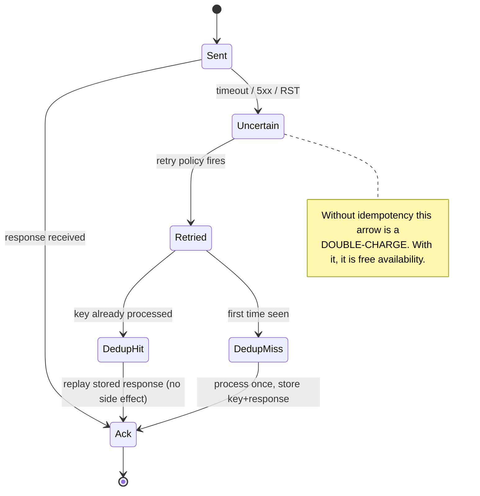
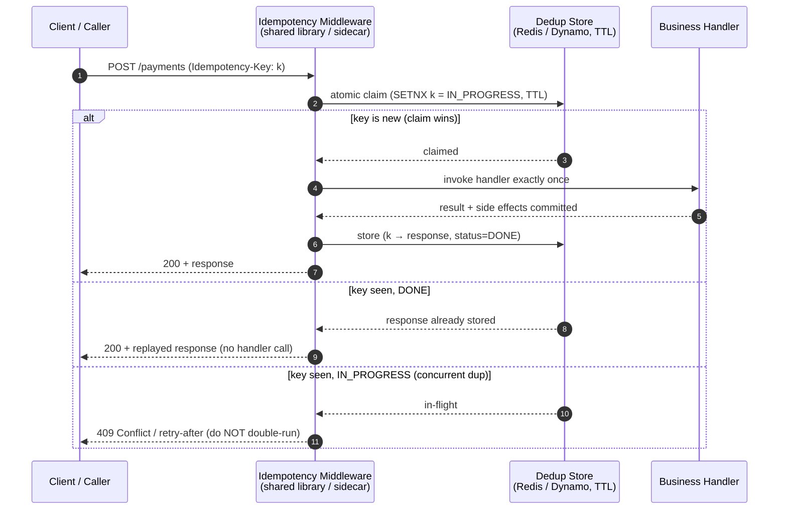
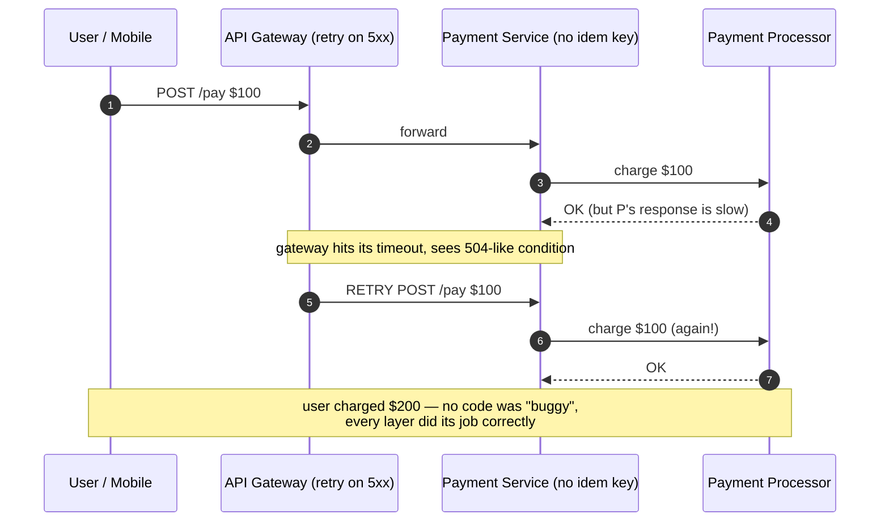

# Idempotent Operations — Staff

> **Axis:** organizational scope & judgment — NOT deeper mechanism (that is `professional.md`).
> This file answers: how does a Staff/Principal engineer make idempotency a *non-negotiable org
> standard* rather than a per-team afterthought, decide *where the organization must invest in it
> versus where it is over-engineering*, and read the reliability leverage it unlocks — namely that
> safe retries are the precondition for aggressive retry policies, which are in turn the cheapest
> availability the org will ever buy. The key-store, the dedup window, the SETNX — those are settled
> by senior. The question here is why the double-charge incident keeps happening across teams, and
> what platform lever removes the whole class of it at once.

---

## Table of Contents

1. [Idempotency Is a Property of the Org, Not the Endpoint](#1-idempotency-is-a-property-of-the-org-not-the-endpoint)
2. [The Reliability Payoff: Safe Retries Are the Cheapest Availability](#2-the-reliability-payoff-safe-retries-are-the-cheapest-availability)
3. [Build It Once as a Platform: Shared Middleware + Dedup Store](#3-build-it-once-as-a-platform-shared-middleware--dedup-store)
4. [Build-Shared vs Per-Team: The Governance Decision](#4-build-shared-vs-per-team-the-governance-decision)
5. [Where to Enforce It — and Where It's Overkill](#5-where-to-enforce-it--and-where-its-overkill)
6. [Incident Patterns: Tracing Double-Charges and Duplicate Messages](#6-incident-patterns-tracing-double-charges-and-duplicate-messages)
7. [The Standard as Written: What "Idempotent by Default" Actually Mandates](#7-the-standard-as-written-what-idempotent-by-default-actually-mandates)
8. [Testing for Idempotency: Duplicate Injection as a Gate](#8-testing-for-idempotency-duplicate-injection-as-a-gate)
9. [Cost, ROI, and the Total Ledger](#9-cost-roi-and-the-total-ledger)
10. [Rollout, Migration, and Reversibility](#10-rollout-migration-and-reversibility)
11. [When NOT to Reach for Idempotency Infrastructure](#11-when-not-to-reach-for-idempotency-infrastructure)
12. [Second-Order Consequences & Signals to Watch](#12-second-order-consequences--signals-to-watch)
13. [Staff Checklist](#13-staff-checklist)

---

## 1. Idempotency Is a Property of the Org, Not the Endpoint

At senior level, idempotency is a per-endpoint craft: accept a client-supplied key, look it up in
a dedup store, replay the stored response on a hit, atomically claim the key on a miss. Correct, and
almost irrelevant to the Staff decision.

The Staff reframing: **at-least-once delivery is the ambient physics of your entire distributed
system, so idempotency is not a feature some endpoints opt into — it is the invariant the org either
guarantees everywhere it mutates state, or leaks money and trust at random.** Every one of these is
the same underlying event, at-least-once redelivery, hitting a non-idempotent write:

```text
- A client's POST times out at 30s; the client retries; the first write had already committed.
- A load balancer's 504 fires while the origin is still processing; the caller retries.
- A Kafka/SQS consumer crashes after side-effecting but before committing its offset → redelivery.
- A retry library (gRPC retry policy, Envoy, a service mesh) transparently re-sends on RST_STREAM.
- A user double-taps "Pay". A mobile client resends on network flap. A webhook provider re-fires.
```

None of these is a bug in one team's code. They are the correct, unavoidable behavior of every
reliability layer the org has deliberately built. The Fallacies of Distributed Computing
(Deutsch/Gosling) — "the network is reliable" chief among them — are the reason retries exist; the
retries are the reason duplicates exist; the duplicates are the reason idempotency is mandatory. A
Staff engineer who treats it as "some endpoints need dedup logic" has mis-scoped it. The correct
sentence is: *"Any endpoint that mutates state and can be retried by any layer in our stack must be
idempotent, and since every layer retries, that means every mutating endpoint — so we provide it as
a platform primitive rather than asking 300 engineers to each get the SETNX-then-write race right."*

The org-scope tell: the double-charge incident is never traced to a single missing `if` statement
that one review would have caught. It is traced to the *absence of a standard* — a new team shipped a
payment path, wired up a client retry, and nobody in the org owned the sentence "mutating endpoints
are idempotent." That is a Staff failure, not a junior one.

---

## 2. The Reliability Payoff: Safe Retries Are the Cheapest Availability

This is the argument that funds the entire investment, and most engineers under-sell it because they
frame idempotency as *defense* (stops double-charges) rather than *enabler* (unlocks aggressive
retries). The enabler framing is the one that gets Staff buy-in.

**Retries are the highest-ROI availability lever in a distributed system.** A large fraction of
request failures are transient: a pod restart, a brief GC pause, a rebalancing partition, a 1-second
network blip. If callers retry those, a huge share of would-be user-facing errors vanish before the
user ever sees them. But retrying a *non-idempotent* write is worse than not retrying — you have
traded an error for a duplicate charge, a double-shipped order, a doubled ledger entry. So:

```text
Without idempotency:  retries are dangerous → teams disable or minimize them
                      → transient failures reach the user → availability capped by transient rate.

With idempotency:     retries are safe → teams can retry aggressively (exponential backoff + jitter,
                      hedged requests, service-mesh-level retry) → transient failures absorbed
                      → measured availability rises with ZERO new capacity spent.
```

Idempotency is the *precondition that unlocks* the cheapest availability improvement the org can buy.
You do not add servers, you do not add regions — you make retries safe, then turn them on. This is
why the standard pairs the two: **"idempotent by default" and "retry with backoff by default" are one
policy, not two.** Shipping the retry policy without idempotency manufactures duplicates at scale;
shipping idempotency without the retry policy leaves the availability win on the table.

The number to put in front of leadership: for a service with a 0.5% transient failure rate and a
retry that succeeds 90% of the time, safe retries cut user-visible errors by ~90% — the difference
between 99.5% and 99.95% success — for the cost of one middleware and a Redis cluster. No other
lever is that cheap per nine.



---

## 3. Build It Once as a Platform: Shared Middleware + Dedup Store

The single highest-leverage move a Staff engineer makes on this topic is to **make idempotency free
to consume.** If every team must hand-roll key extraction, the claim/commit race, response caching,
and TTL, then idempotency is only as good as the least careful engineer's understanding of a
compare-and-swap — and the incident is guaranteed. The correct posture is a platform-provided
idempotency middleware plus a shared dedup store, wired into the golden-path service scaffold so a
team gets it *without opting in*.



What the platform owns so teams don't have to get it wrong:

- **The atomic claim.** The claim-then-write must be a single atomic operation (`SETNX`, a
  conditional put, or a fingerprint uniqueness constraint) or two concurrent duplicates both pass the
  "have I seen this?" check and both execute. This race is the single most common hand-rolled bug;
  centralizing it removes the class.
- **Request-body fingerprinting.** Bind the stored key to a hash of the request; if a caller reuses a
  key with a *different* body, return an error rather than silently replaying the wrong response.
- **The DONE vs IN_PROGRESS distinction.** Concurrent duplicates (not just sequential retries) must be
  rejected or serialized, not double-executed.
- **Response caching + TTL.** Replays must return the *original* status and body, and the window must
  outlive realistic retry horizons (client retry budgets, queue redelivery, human double-tap) — a
  common floor is 24h; payment reconciliation may demand days.
- **Uniform observability.** Emit `idempotency_hits`, `conflicts`, and `claim_races` as first-class
  metrics so the org can *see* how often duplicates arrive — the number that proves the platform is
  earning its keep.

The point of "build once" is not code reuse. It is that **correctness of a distributed compare-and-swap
is not a thing you can ask every team to re-derive.** You centralize it for the same reason you don't
ask every team to implement TLS.

---

## 4. Build-Shared vs Per-Team: The Governance Decision

| Dimension | Platform-provided (shared middleware + dedup store) | Per-team hand-rolled |
|---|---|---|
| Correctness of the claim/commit race | Written once, reviewed by experts, fuzzed | Re-derived per team; the race is subtly wrong somewhere |
| Time-to-safe for a new team | Zero — inherited from the scaffold | Days per endpoint; often skipped under deadline |
| Consistency of behavior (TTL, replay semantics, key format) | Uniform, contract-tested | Divergent; every incident is a new investigation |
| Observability (dup rate, conflicts) | Free, org-wide dashboard | Absent or bespoke |
| Failure mode when the dedup store is down | One well-understood policy (fail-open vs fail-closed, decided once) | Undefined per team; often fails open silently → duplicates |
| Cost | One Redis/Dynamo cluster + one library team | N teams' engineering time, forever, re-spent |
| Risk of the platform becoming a bottleneck/SPOF | Real — must be sized, sharded, and on-call'd | Diffuse — each team's problem |

The decision is not close for any org past a few teams: **build it shared.** The one honest cost of
the shared path is that the dedup store becomes a dependency on the critical write path of every
mutating service, so it must be treated as tier-0 infrastructure — sized, replicated, and with an
explicit, decided-once answer to "what do we do when it's unavailable?" (Fail-closed for financial
writes: refuse rather than risk a duplicate. Fail-open only where a duplicate is genuinely harmless.)
That is a Staff responsibility, and it is far cheaper than 300 engineers each owning a private,
under-tested version of the same race.

The anti-pattern to name explicitly: a "recommended pattern in a wiki page" is *not* a platform. If
adoption is opt-in and manual, the teams that most need it — the new team shipping under deadline — are
exactly the ones who skip it. The standard only works if it is the path of least resistance.

---

## 5. Where to Enforce It — and Where It's Overkill

Idempotency has real cost — a store lookup on the write path, a key contract clients must honor, a TTL
to reason about. Mandating it *everywhere* including pure reads and naturally-idempotent writes is
over-engineering that earns you nothing and adds latency. The Staff skill is knowing where the
investment is non-negotiable versus where it is noise.

| Path / operation | Enforce idempotency? | Why |
|---|---|---|
| Payments, refunds, charges, transfers | **Mandatory, fail-closed** | A duplicate is real money lost and a compliance event |
| Order placement / fulfillment / shipping | **Mandatory** | Duplicate ships product, double-bills, breaks inventory |
| Ledger / accounting entries | **Mandatory** | Double-entry corrupts the books; hardest to unwind |
| Message/event consumers (any at-least-once queue) | **Mandatory** | Redelivery is guaranteed, not exceptional — this is the #1 dup source |
| Outbound webhooks / notifications | **Strongly recommended** | Duplicate emails/SMS/push erode trust and cost money |
| Account/resource creation (signup, provision) | **Recommended** | Duplicate accounts/resources cause reconciliation pain |
| `PUT`/full-replace updates | Often free | Naturally idempotent by definition — verify, don't re-implement |
| `DELETE` by stable ID | Often free | Deleting an already-deleted resource is a no-op — verify semantics |
| `GET` and other pure reads | **No** | Reads have no side effect; adding a key store is pure overhead |
| Analytics/telemetry counters where approx is fine | **No / cheap** | Slight over-count is acceptable; enforcing exactness costs more than it saves |

The governing rule: **enforce idempotency in proportion to the cost and irreversibility of a duplicate
side effect.** Money and physical fulfillment sit at the top; a duplicated analytics event that nudges
a dashboard by 0.01% sits at the bottom. A team that wraps every read in an idempotency key has
cargo-culted the standard; a team that ships an at-least-once consumer without it has violated it.
Both are review-catchable *only if the standard says which is which* — which is why §7 exists.

---

## 6. Incident Patterns: Tracing Double-Charges and Duplicate Messages

The reason this topic gets a Staff file at all: the same two incidents recur across the org, in
different teams, for the same root cause, and the postmortems keep landing on a local fix ("add a check
here") instead of the systemic one ("we have no idempotency standard"). Recognizing the *class* is the
Staff contribution.

**Pattern A — the double-charge.**



The postmortem trap: it looks like the gateway retried too eagerly, so the fix proposed is "make the
gateway not retry payments." That is the *wrong* fix — it disables the availability lever from §2 and
leaves every *other* dup source (user double-tap, PSP-side retry, mobile reconnect) live. The correct
fix is the systemic one: a client-supplied idempotency key threaded from the edge, honored by the
platform middleware, so the *retry stays safe* rather than being banned.

**Pattern B — the duplicate message.** A consumer reads an event, performs the side effect (send email,
increment balance, create a record), then crashes before committing its offset. On restart it re-reads
the same event and does it again. This is not an edge case — it is the *defined* behavior of every
at-least-once broker (Kafka, SQS, Pub/Sub, RabbitMQ). The postmortem trap here is "we lost exactly-once
delivery, let's turn on exactly-once semantics." Broker-level EOS is expensive, narrow, and does not
cover side effects that leave the broker's transactional boundary (the email is already sent). The
durable fix is the same as everywhere: **make the consumer idempotent** — dedup on a stable message ID,
or make the side effect itself naturally idempotent (upsert by key), so redelivery is a no-op.

The Staff pattern-recognition, stated once: **when a postmortem's action item is "stop retrying" or
"turn on exactly-once," the real root cause is almost always "this write was not idempotent," and the
real action item is "adopt the platform idempotency middleware here."** If the org keeps writing the
local fix, it will keep having the incident on the next new endpoint.

---

## 7. The Standard as Written: What "Idempotent by Default" Actually Mandates

A standard that lives in an engineer's head produces the incident in §6. To be an org standard it has
to be *written, defaulted, and enforced*. The Staff engineer owns the wording. A workable standard:

```text
IDEMPOTENCY STANDARD (org-wide)
1. SCOPE: Every endpoint or consumer that mutates persistent state or triggers an external
   side effect (charge, ship, notify, provision) MUST be idempotent. Reads are exempt.
2. MECHANISM: Use the platform idempotency middleware + shared dedup store. Hand-rolled
   dedup requires an explicit exception approved in an ADR (§35.1).
3. KEY OWNERSHIP: Idempotency keys are CLIENT-generated (the caller owns retry identity),
   globally unique (UUIDv4), and per-logical-operation.
4. RETRY PACT: Any service that is idempotent MUST enable the standard retry policy
   (exponential backoff + jitter, bounded budget). Idempotency and safe retry ship together.
5. FAILURE POLICY: Financial/fulfillment paths FAIL CLOSED when the dedup store is
   unavailable. Only explicitly-annotated harmless paths may fail open.
6. TTL: Dedup window ≥ the max realistic redelivery horizon for that path (default 24h;
   payments/reconciliation may require days).
7. VERIFICATION: CI must run the duplicate-injection contract test (§8) against every
   mutating endpoint. No green test → no merge to a mutating path.
```

The two clauses that separate a real standard from a wiki suggestion: **clause 2 makes the platform
path the default and the alternative an *exception with a paper trail*** (so skipping it is a visible
decision, not a silent omission), and **clause 7 makes it a gate** (so the standard is enforced by CI,
not by hoping a reviewer remembers). Everything else is detail. Getting influence-without-authority
buy-in on this is the actual Staff work: you make the compliant path the easy path (scaffold, sidecar,
default retry config) so that adherence is the byproduct of using the golden path, not a tax on it.

---

## 8. Testing for Idempotency: Duplicate Injection as a Gate

Idempotency is the property most likely to be *believed* and least likely to be *verified*, because the
happy path never exercises it — duplicates only arrive under failure. The org standard is only credible
if it is tested, and the test must inject the failure the standard exists to survive: **send the same
operation twice (and concurrently) and assert the side effect happened exactly once.**

```text
DUPLICATE-INJECTION CONTRACT TEST (runs in CI on every mutating endpoint)
  1. Sequential dup:  POST op with key k → assert side effect count == 1.
                      POST op with SAME key k → assert side effect count STILL == 1,
                      and the second response equals the first (replayed).
  2. Concurrent dup:  fire N identical requests with key k in parallel →
                      assert exactly ONE executes, others get replay or 409 (the claim race).
  3. Body-mismatch:   reuse key k with a different body → assert error, NOT a wrong-response replay.
  4. Store-down:      simulate dedup-store outage → assert the DECIDED policy
                      (fail-closed for financial paths; fail-open only where annotated).
```

Beyond the per-endpoint contract test, the org should run **duplicate injection as a chaos experiment**
in staging (and gated in prod): a fault-injection layer that randomly re-delivers a fraction of
messages and re-sends a fraction of HTTP writes. If the system is truly idempotent, injected duplicates
are invisible — balances, order counts, and ledgers are unchanged. If a team's endpoint slipped through
without the middleware, the chaos run surfaces the drift *before* a real retry storm does. This is the
same philosophy as running a game day: you manufacture the failure on your schedule so it doesn't
happen on the customer's. The metric that proves it works is the one from §3 — the dedup-hit counter
climbing during the chaos window while side-effect counts stay flat.

The test is the standard's teeth. Clause 7 of §7 says "no green duplicate-injection test → no merge to a
mutating path." Without that gate, the standard degrades to a suggestion and §6 returns.

---

## 9. Cost, ROI, and the Total Ledger

The build-shared decision is trivially positive once you write the ledger honestly, because most
engineers only count the *cost* side (the Redis cluster) and forget the *avoided-loss* and
*availability* sides.

```text
COST (recurring):
  + One dedup-store cluster (Redis/Dynamo), tier-0, replicated, on-call'd.
  + One library/platform team owning the middleware, contract test, and rollout.
  + A few ms of store-lookup latency on each mutating write.

AVOIDED LOSS (the reason it pays for itself in one incident):
  - Direct duplicate-charge refunds + chargeback fees + payment-processor penalties.
  - Duplicate fulfillment (product shipped twice) — often unrecoverable.
  - Ledger corruption reconciliation — the most expensive engineering-hours to unwind.
  - Trust/brand cost of double-billing a customer (churn, support load, press).

AVAILABILITY UPSIDE (§2):
  - Safe retries absorb the transient-failure rate → measured availability rises
    for zero added capacity. This is the largest line and the easiest to under-count.
```

The break-even is embarrassing: a single averted double-charge incident at any org handling real
payments typically pays for the dedup store for years. Frame it to leadership not as "we want to build
idempotency infrastructure" (sounds like gold-plating) but as **"we are removing an entire class of
financial-loss incidents and unlocking a step-change in availability, for the price of one Redis
cluster."** The unit economics — cost per mutating request of the store lookup — is negligible against
the per-incident cost of a duplicate on a money path.

---

## 10. Rollout, Migration, and Reversibility

You rarely get to mandate idempotency on a greenfield org; you retrofit it onto live money paths, which
is a two-way-door migration if sequenced correctly and a self-inflicted outage if not.

- **Sequence by blast radius, highest first.** Payments, ledger, and order/fulfillment consumers get
  the middleware first — they carry the incidents that fund the whole program. Low-stakes paths follow.
- **Additive, not flag-day.** The middleware accepts-but-does-not-require a key first (log-only mode:
  record what *would* have been deduped), then moves to enforce. This lets you observe the real
  duplicate rate before you change behavior, and it makes the store a soft dependency during ramp.
- **Backfill the key contract at the edge.** Callers (mobile, web, gateway) must start *generating and
  threading* keys before enforcement, or you'll dedup nothing. Ship the client change first.
- **Decide the store-down policy before, not during, the first outage.** Financial paths fail closed;
  wire and test that path in staging so the first real dedup-store blip is a controlled refuse, not a
  duplicate storm.
- **Reversibility.** Idempotency is a two-way door *per endpoint* — you can disable enforcement for a
  path by config if the middleware misbehaves. The retry policy it unlocks is the sharper edge: never
  enable aggressive retries on a path *before* it is idempotent, or you convert the migration into the
  §6 incident. Idempotency-on precedes retries-on, always, and rolls back in the reverse order.

---

## 11. When NOT to Reach for Idempotency Infrastructure

A Staff engineer is as valued for saying "you don't need this here" as for the mandate.

- **Pure reads.** A `GET`, a search, a report — no side effect, no key, no store lookup. Wrapping these
  in idempotency is latency and complexity for zero benefit.
- **Naturally-idempotent writes.** A `PUT` that fully replaces a resource, a `DELETE` by stable ID, an
  upsert keyed on a business identity — these are *already* idempotent by construction. Verify the
  semantics; do not bolt a second dedup layer on top. Two idempotency mechanisms fighting is worse than
  one.
- **Approximate-tolerant telemetry.** High-volume analytics counters where a fraction of a percent of
  over-count is meaningless: the cost of exact dedup exceeds the value. Accept the approximation.
- **Truly single-shot internal flows with no retry layer.** A batch job invoked once by a cron with no
  retrier and no external caller can be left simpler — though the moment *anyone* wraps it in a retry,
  the exemption expires.
- **Uniqueness the datastore already enforces.** If a database unique constraint on the natural key
  *is* your idempotency (the duplicate insert simply fails), you may not need the middleware layer on
  top — the constraint is the dedup. Know which one you're relying on and don't accidentally run both
  with conflicting semantics.

The failure the mandate must avoid: making idempotency a ritual applied to everything, so teams add key
stores to read endpoints, latency creeps everywhere, and engineers learn to see the standard as
bureaucratic overhead rather than the money-and-availability lever it is. Enforce it exactly where §5
says, and nowhere else.

---

## 12. Second-Order Consequences & Signals to Watch

- **The retry-storm amplification.** Once idempotency makes retries safe and teams turn them on, an
  origin brownout can be *amplified* by retries (every caller retrying a struggling service). Idempotency
  makes retries correct, not free. Pair it with retry budgets, circuit breakers, and backoff-with-jitter,
  or you have traded duplicate-charges for a retry-driven thundering herd. Watch the ratio of retried to
  original requests during incidents.
- **The dedup store as a new tier-0 SPOF.** You centralized correctness onto one store on every mutating
  write path. Its availability now bounds your write availability. Watch its p99, its saturation, and
  rehearse its failure — the fail-closed path is now part of your money path's uptime story.
- **Silent fail-open drift.** The most dangerous regression: a team's middleware config quietly flips to
  fail-open on a financial path (to "improve availability"), and duplicates resume silently until a
  reconciliation catches them weeks later. Alert on any financial path running fail-open. The
  dedup-hit-rate dropping to zero on a busy endpoint is a signal the middleware was bypassed.
- **Key-reuse and TTL-expiry bugs.** A client that reuses keys across genuinely-different operations, or
  a TTL shorter than the real redelivery horizon, reintroduces duplicates through the "correct" system.
  Watch conflict-rate and body-mismatch-rate metrics.
- **The metric that says it's working.** Rising `idempotency_hits` with flat side-effect counts means the
  platform is silently absorbing duplicates the org would otherwise be paying for. Falling hits on a busy
  mutating path means something bypassed the middleware — investigate before the next retry storm finds it.

---

## 13. Staff Checklist

- [ ] Idempotency is a **written org standard** (§7), defaulted into the golden-path scaffold, with
      non-compliance requiring an ADR exception — not a wiki suggestion.
- [ ] A **platform idempotency middleware + shared dedup store** exists so every team inherits the
      correct claim/commit race for free; hand-rolling requires justification.
- [ ] The **retry pact** is enforced: idempotency and aggressive-retry-with-backoff ship together, and
      retries-on never precedes idempotency-on for any path.
- [ ] Enforcement is **scoped by duplicate-cost** (§5): mandatory on money/fulfillment/consumer paths,
      exempt on reads and naturally-idempotent writes — not applied as a blanket ritual.
- [ ] Every mutating endpoint has a **duplicate-injection contract test** gating merge, and
      **chaos duplicate injection** runs in staging/prod.
- [ ] The **dedup-store-down policy is decided and tested** (fail-closed on financial paths), and alerts
      fire on any financial path silently running fail-open.
- [ ] Postmortems for double-charge / duplicate-message incidents route to the **systemic fix** (adopt the
      middleware) rather than the local trap ("stop retrying" / "turn on exactly-once").
- [ ] Cost/ROI is **modeled as a ledger** (store cost vs avoided-loss vs availability upside), and the
      break-even is stated to leadership.
- [ ] Observability exposes **hit-rate, conflict-rate, and claim-races** org-wide so the standard's value
      and any bypass are visible.

*Next step:* [Microservices — Junior](../../application-layer/microservices/junior.md)
