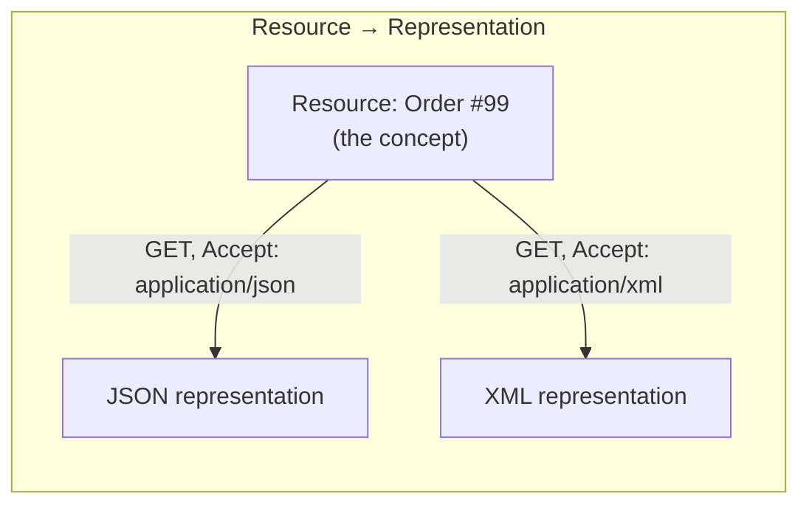
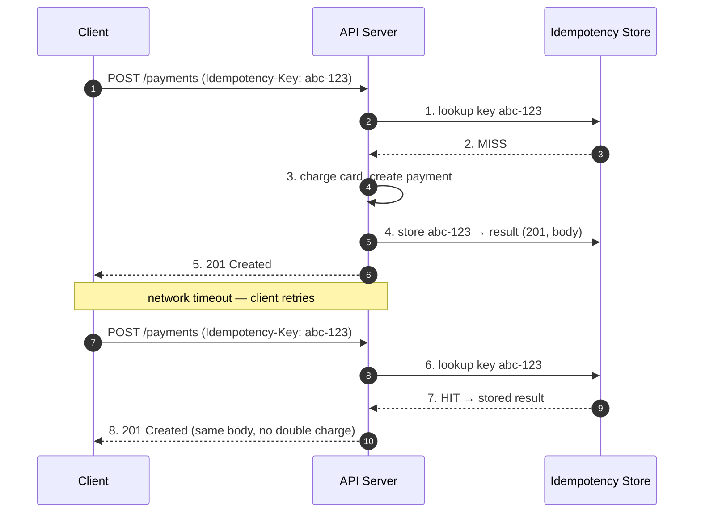
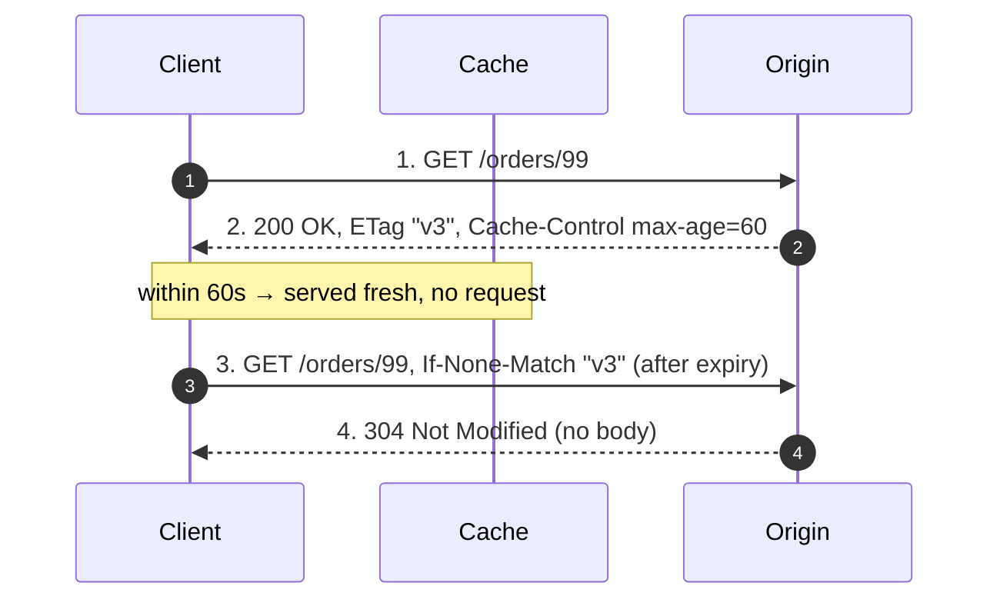

# REST — Interview

REST (Representational State Transfer) is the default architectural style for HTTP APIs, yet
most candidates recite "verbs and nouns" without understanding *why* the constraints exist.
This file drills the constraints, the trade-offs, and the design judgment an interviewer
actually probes at senior level.

## Table of Contents

1. [Q1: What is REST — and what does it actually constrain?](#q1-what-is-rest--and-what-does-it-actually-constrain)
2. [Q2: What is a resource, and how do you model URLs and methods?](#q2-what-is-a-resource-and-how-do-you-model-urls-and-methods)
3. [Q3: Why is statelessness a core constraint? What does it buy you?](#q3-why-is-statelessness-a-core-constraint-what-does-it-buy-you)
4. [Q4: What is the "uniform interface" and why does it matter?](#q4-what-is-the-uniform-interface-and-why-does-it-matter)
5. [Q5: Which HTTP methods are safe and which are idempotent?](#q5-which-http-methods-are-safe-and-which-are-idempotent)
6. [Q6: How do you make a non-idempotent operation (POST) safely retryable?](#q6-how-do-you-make-a-non-idempotent-operation-post-safely-retryable)
7. [Q7: What is HATEOAS and the Richardson Maturity Model?](#q7-what-is-hateoas-and-the-richardson-maturity-model)
8. [Q8: How do you paginate a large collection?](#q8-how-do-you-paginate-a-large-collection)
9. [Q9: How do you version a REST API?](#q9-how-do-you-version-a-rest-api)
10. [Q10: What are over-fetching and under-fetching, and how does REST address them?](#q10-what-are-over-fetching-and-under-fetching-and-how-does-rest-address-them)
11. [Q11: How do you use HTTP caching correctly (ETags, Cache-Control)?](#q11-how-do-you-use-http-caching-correctly-etags-cache-control)
12. [Q12: How do you signal errors and design status codes?](#q12-how-do-you-signal-errors-and-design-status-codes)
13. [Q13: REST vs RPC (gRPC) vs GraphQL — when do you pick which?](#q13-rest-vs-rpc-grpc-vs-graphql--when-do-you-pick-which)
14. [Q14: How do you model actions that aren't CRUD?](#q14-how-do-you-model-actions-that-arent-crud)
15. [Q15: Scenario — design a REST API for a `payments` resource; version and paginate it](#q15-scenario--design-a-rest-api-for-a-payments-resource-version-and-paginate-it)
16. [Q16: What are common REST anti-patterns that fail an interview?](#q16-what-are-common-rest-anti-patterns-that-fail-an-interview)

---

## Q1: What is REST — and what does it actually constrain?

REST is an **architectural style**, not a protocol or a standard, defined by Roy Fielding in his
2000 dissertation. It is a set of six constraints that, when applied to a networked system, yield
scalability, evolvability, and a decoupled client/server. It is *not* "JSON over HTTP with URLs" —
that is a common but shallow characterization.

The six constraints:

| # | Constraint | What it requires | Property gained |
|---|-----------|------------------|-----------------|
| 1 | **Client–Server** | Separate UI concerns from data storage | Independent evolution of each side |
| 2 | **Stateless** | Each request carries all context; server holds no session | Horizontal scaling, resilience |
| 3 | **Cacheable** | Responses declare whether they are cacheable | Latency + load reduction |
| 4 | **Uniform Interface** | Standard resource identification, self-describing messages, manipulation via representations, HATEOAS | Decoupling, visibility |
| 5 | **Layered System** | Client cannot tell if it talks to origin or an intermediary | Proxies, gateways, LBs, CDNs |
| 6 | **Code-on-Demand** *(optional)* | Server can ship executable code (e.g., JS) | Extensible clients |

The uniform interface (constraint 4) is what most distinguishes REST from RPC. An API that ignores
these constraints (e.g., stateful sessions, RPC-style `/getUser?id=5` endpoints, no cacheability
metadata) is "HTTP API" but not RESTful.

## Q2: What is a resource, and how do you model URLs and methods?

A **resource** is any concept worth naming and addressing — a user, an order, a collection of
orders. It is identified by a URI. The JSON/XML you send over the wire is a *representation* of
that resource's current state, not the resource itself.

Modeling rules:

- **URLs are nouns; HTTP methods are verbs.** `POST /orders` — never `POST /createOrder`.
- **Collections are plural nouns**: `/orders`, `/users/42/orders`.
- **Hierarchy expresses containment**: `/users/42/orders/99` — order 99 belonging to user 42.
- Keep nesting shallow (2 levels max); deeper hierarchies become brittle. Prefer
  `/orders/99` with a `userId` field over `/users/42/orders/99` once the child is
  independently addressable.
- Query parameters are for **filtering, sorting, pagination** — not for identifying a resource:
  `/orders?status=shipped&sort=-created_at`.



The mapping of intent to method: `GET` (read), `POST` (create / non-idempotent action),
`PUT` (replace), `PATCH` (partial update), `DELETE` (remove).

## Q3: Why is statelessness a core constraint? What does it buy you?

Stateless means the **server stores no client session state between requests** — every request
carries everything needed to process it (auth token, parameters, body). The application state
lives on the client or in a shared data store the request references, never in per-connection
server memory.

Why it matters:

1. **Horizontal scaling** — any request can hit any server. There is no "sticky session" pinning
   a user to one box, so you can add/remove instances freely behind a round-robin load balancer.
2. **Resilience** — if a server dies mid-traffic, in-flight requests can be replayed on another
   instance; no lost session invalidates the user.
3. **Caching** — a request that fully describes itself can be cached by any intermediary keyed
   on the URL + relevant headers, because the response doesn't depend on hidden server state.
4. **Visibility** — a monitoring proxy can understand a request in isolation.

The cost: each request re-sends context (token re-validation, larger payloads). The trade is
usually worth it. "Stateless" refers to *session/conversational* state — the database still
holds durable resource state; that's fine and expected.

## Q4: What is the "uniform interface" and why does it matter?

The uniform interface is the constraint that decouples clients from servers by standardizing how
they interact. It has four sub-constraints:

1. **Identification of resources** — resources are named by URIs.
2. **Manipulation through representations** — the client holds a representation (e.g., JSON) and
   sends it back to modify the resource; it does not call methods on server objects.
3. **Self-descriptive messages** — each message carries enough metadata (`Content-Type`,
   `Cache-Control`, status codes) to be processed standalone.
4. **HATEOAS** — responses link to available next actions (see Q7).

The payoff is *generality*: any REST client (a browser, `curl`, a mobile app) can talk to any
REST server using the same primitives, and intermediaries (caches, proxies) can operate without
API-specific knowledge. The cost is efficiency — a uniform interface can't be micro-optimized for
one client's exact needs, which is precisely the gap GraphQL and gRPC target.

## Q5: Which HTTP methods are safe and which are idempotent?

- **Safe** = read-only; no observable change to server state. Safe methods can be prefetched and
  cached freely.
- **Idempotent** = making the *same* request N times has the same effect on server state as
  making it once. Critical for retries: a client that times out can safely retry an idempotent
  request without fear of duplicate side effects.

| Method | Safe | Idempotent | Typical use |
|--------|:----:|:----------:|-------------|
| `GET` | ✅ | ✅ | Retrieve a representation |
| `HEAD` | ✅ | ✅ | Headers only (existence / metadata check) |
| `OPTIONS` | ✅ | ✅ | Discover allowed methods / CORS preflight |
| `PUT` | ❌ | ✅ | Full replace at a known URI |
| `DELETE` | ❌ | ✅ | Remove (deleting twice → still gone) |
| `PATCH` | ❌ | ⚠️ Not guaranteed | Partial update |
| `POST` | ❌ | ❌ | Create / non-idempotent action |

Key nuance interviewers push on: **`PUT` is idempotent, `POST` is not.** `PUT /orders/99` with
the same body twice leaves order 99 in one final state. `POST /orders` twice creates two orders.
`PATCH` *can* be idempotent (e.g., set field to a fixed value) but isn't guaranteed (e.g., a
JSON-Patch "increment" op is not). Idempotency is about the *effect on state*, not the response
body — `DELETE` returning `404` on the second call is still idempotent.

## Q6: How do you make a non-idempotent operation (POST) safely retryable?

Use an **idempotency key**. The client generates a unique key (UUID) per logical operation and
sends it in a header (e.g., `Idempotency-Key`). The server records the key with the result of the
first successful execution; a retry with the same key returns the stored result instead of
re-executing.



This is the pattern Stripe uses for card charges. Subtleties: scope keys per authenticated
account, give them a TTL (e.g., 24h), and handle the in-flight case (two concurrent requests with
the same key) with a lock or unique DB constraint so the second waits for or rejects against the
first.

## Q7: What is HATEOAS and the Richardson Maturity Model?

**HATEOAS** (Hypermedia As The Engine Of Application State) means responses embed links telling the
client what it can do next, so the client navigates the API by following links rather than
hard-coding URL templates. Example:

```json
{
  "id": 99,
  "status": "pending",
  "amount": 4200,
  "_links": {
    "self":    { "href": "/payments/99" },
    "capture": { "href": "/payments/99/capture", "method": "POST" },
    "refund":  { "href": "/payments/99/refund",  "method": "POST" }
  }
}
```

The client learns that `capture` is available *because the server included the link* — if the
payment were already captured, the server would omit it. This decouples the client from URL
structure and workflow rules.

The **Richardson Maturity Model** grades how RESTful an API is:

| Level | Name | Characteristic |
|-------|------|----------------|
| 0 | The Swamp of POX | Single URI, single method (`POST`); RPC tunneled over HTTP (e.g., SOAP) |
| 1 | Resources | Multiple URIs, one per resource; still one method |
| 2 | HTTP Verbs | Proper use of `GET/POST/PUT/DELETE` + status codes — **where most "REST" APIs live** |
| 3 | Hypermedia Controls | HATEOAS — responses drive state via links |

Honest interview answer: most production APIs are **Level 2**, and that's a defensible choice.
Full HATEOAS (Level 3) adds real coupling benefits but few clients are written to consume links
dynamically, so the ROI is often low. Know the model; don't over-claim.

## Q8: How do you paginate a large collection?

Never return an unbounded collection. Two dominant strategies:

| Strategy | How | Pros | Cons |
|----------|-----|------|------|
| **Offset / limit** | `?limit=20&offset=40` (page 3) | Trivial; random page access | O(offset) DB scan cost; **drift** — inserts/deletes shift rows, causing dupes/skips |
| **Cursor (keyset)** | `?limit=20&after=<opaque_cursor>` | Stable under writes; O(1) seek on indexed key | No random page jumps; cursor must encode a sort key |

Cursor pagination is the correct default for large, mutable, or high-traffic collections. The
cursor is an opaque token (base64 of the last item's sort key, e.g., `created_at,id`) so clients
can't construct or reason about it — you can change the encoding later.

```json
{
  "data": [ /* 20 items */ ],
  "page": {
    "next_cursor": "eyJjcmVhdGVkX2F0IjoiMjAyNi0wNy0wMSIsImlkIjo5OX0",
    "has_more": true
  }
}
```

Always pair pagination with a **stable, deterministic sort** (include a tiebreaker like the primary
key), or ordering is undefined across pages. Cap `limit` server-side (e.g., max 100) to protect
the backend.

## Q9: How do you version a REST API?

You version so you can make **breaking changes** without breaking existing clients. Non-breaking
changes (adding a field, a new endpoint, a new optional parameter) should never require a version
bump — design clients to tolerate unknown fields.

| Approach | Example | Pros | Cons |
|----------|---------|------|------|
| **URI path** | `/v1/orders` | Explicit, cache-friendly, easy to route | URI no longer identifies the same resource across versions (purist objection) |
| **Custom header** | `X-API-Version: 2` | Clean URLs | Harder to test in a browser; easy to forget |
| **Accept header (media type)** | `Accept: application/vnd.acme.v2+json` | "Correct" per REST — content negotiation | Verbose; poor tooling support |
| **Query param** | `/orders?version=2` | Simple | Muddies filter semantics; cache keys bloat |

Pragmatic answer: **URI path versioning (`/v1`) wins in practice** for its operability, routing
clarity, and cache behavior, even though media-type versioning is the more "RESTful" ideal.
Version at a coarse grain (`v1`, `v2`), not per-endpoint. Publish a **deprecation policy** with a
sunset window and communicate it via the `Deprecation` and `Sunset` response headers.

## Q10: What are over-fetching and under-fetching, and how does REST address them?

- **Over-fetching**: an endpoint returns more data than the client needs (mobile screen shows a
  name and avatar but `GET /users/42` returns 40 fields). Wasted bandwidth and parsing.
- **Under-fetching**: an endpoint returns too little, forcing the client to make N follow-up calls
  (fetch a user, then fetch each of their 20 orders → the N+1 problem over HTTP).

REST mitigations (short of switching to GraphQL):

- **Sparse fieldsets**: `?fields=id,name,avatar` — client selects returned fields.
- **Expansion / embedding**: `?include=orders` or `?expand=author` — server inlines related
  resources to cut round-trips.
- **Compound documents** (JSON:API style) or purpose-built endpoints (`/users/42/dashboard`) for
  known composite views — the Backend-for-Frontend (BFF) pattern.

These are exactly the pain points GraphQL is built to solve declaratively; if a client's fetch
patterns are highly variable, that's a signal to evaluate GraphQL (see Q13).

## Q11: How do you use HTTP caching correctly (ETags, Cache-Control)?

Caching is a first-class REST constraint. Two mechanisms:

- **Freshness (`Cache-Control`)**: `Cache-Control: max-age=300` tells caches the response is fresh
  for 300s — served without hitting the origin. Use `public`/`private`, `no-store` (never cache),
  `no-cache` (cache but revalidate every time).
- **Validation (`ETag` + conditional requests)**: the server returns `ETag: "v3"`. The client
  later sends `If-None-Match: "v3"`; if unchanged, the server replies `304 Not Modified` with no
  body — saving bandwidth. `Last-Modified` / `If-Modified-Since` is the timestamp-based variant.



ETags double as **optimistic concurrency control**: a client sends `If-Match: "v3"` on a `PUT`;
the server rejects with `412 Precondition Failed` if the resource changed underneath — preventing
lost updates.

## Q12: How do you signal errors and design status codes?

Use HTTP status codes for their semantic meaning; don't return `200 OK` with `{"error": ...}` (a
classic Level-0 smell that breaks caches and intermediaries).

| Class | Meaning | Common codes |
|-------|---------|--------------|
| **2xx** | Success | `200` OK, `201` Created (+ `Location` header), `202` Accepted (async), `204` No Content |
| **3xx** | Redirection | `301` Moved, `304` Not Modified |
| **4xx** | Client error | `400` Bad Request, `401` Unauthenticated, `403` Forbidden, `404` Not Found, `409` Conflict, `422` Unprocessable, `429` Too Many Requests |
| **5xx** | Server error | `500` Internal, `502` Bad Gateway, `503` Unavailable, `504` Timeout |

Distinguish `401` (not authenticated — who are you?) from `403` (authenticated but not authorized).
Distinguish `400` (malformed syntax) from `422` (valid syntax, invalid semantics). For bodies,
adopt a standard structure — **RFC 9457 Problem Details** (`application/problem+json`) — so clients
parse errors uniformly:

```json
{
  "type": "https://api.acme.com/errors/insufficient-funds",
  "title": "Insufficient funds",
  "status": 402,
  "detail": "Account balance 1500 is below charge amount 4200",
  "instance": "/payments/99"
}
```

## Q13: REST vs RPC (gRPC) vs GraphQL — when do you pick which?

| Dimension | REST | gRPC (RPC) | GraphQL |
|-----------|------|-----------|---------|
| **Model** | Resources + HTTP verbs | Remote procedure calls (functions) | Single endpoint, query language |
| **Transport / format** | HTTP/1.1+, JSON | HTTP/2, Protobuf (binary) | HTTP, JSON |
| **Contract** | OpenAPI (optional) | Protobuf `.proto` (strict) | Schema (strict, typed) |
| **Fetching** | Fixed per endpoint (over/under-fetch) | Fixed per method | Client selects exact fields |
| **Caching** | Native HTTP caching (URL-keyed) | Weak (POST-like, binary) | Hard (single POST endpoint) |
| **Streaming** | Limited (SSE) | First-class bidi streaming | Subscriptions |
| **Browser support** | Native | Needs gRPC-Web proxy | Native |
| **Best for** | Public APIs, CRUD, cache-heavy reads | Internal service-to-service, low-latency, high-throughput | Aggregating many sources, diverse/rich clients |

Interview framing: **REST** for public-facing, resource-oriented APIs where HTTP caching and broad
tooling matter. **gRPC** for internal microservice communication where you control both ends and
want performance, streaming, and a strict contract. **GraphQL** when clients have highly variable
data needs and you're aggregating multiple backends, accepting the cost of harder caching and
query-complexity governance. They coexist — a common architecture is GraphQL/REST at the edge,
gRPC between services.

## Q14: How do you model actions that aren't CRUD?

Not everything is create/read/update/delete. Options for an action like "capture a payment" or
"cancel an order":

1. **Sub-resource controller endpoint**: `POST /payments/99/capture`. Pragmatic and widely used.
   The verb-like path segment names a *controller* resource — acceptable when a pure resource
   model is awkward.
2. **State transition via update**: `PATCH /payments/99` with `{"status": "captured"}`. Cleaner
   REST, but hides business rules (not every status transition is legal) and loses action-specific
   parameters.
3. **Model the action as a resource**: `POST /payments/99/captures` creates a *capture* resource.
   Most RESTful — the action becomes a first-class, addressable, auditable entity (`GET
   /payments/99/captures/1`). Preferred when the action has its own lifecycle, data, or history.

Rule of thumb: if the action produces something you'd want to list, audit, or reference later,
make it a resource (option 3). Otherwise a controller endpoint (option 1) is a fine, honest
compromise.

## Q15: Scenario — design a REST API for a `payments` resource; version and paginate it

**Prompt:** "Design a REST API for payments. How do you version it and paginate the list?"

**1. Resource model & endpoints:**

| Method | Path | Purpose | Idempotent |
|--------|------|---------|:----------:|
| `POST` | `/v1/payments` | Create a payment (requires `Idempotency-Key`) | ✅ via key |
| `GET` | `/v1/payments/{id}` | Fetch one payment | ✅ |
| `GET` | `/v1/payments` | List payments (paginated, filtered) | ✅ |
| `POST` | `/v1/payments/{id}/refunds` | Create a refund (action as sub-resource) | ✅ via key |
| `GET` | `/v1/payments/{id}/refunds` | List refunds for a payment | ✅ |

No `PUT`/`DELETE` on a payment — a completed payment is immutable and financially audited; you
*refund*, not delete. This is a deliberate, defensible modeling choice worth stating aloud.

**2. Creating a payment (idempotent POST):**

```
POST /v1/payments
Idempotency-Key: 6f1a...UUID
Content-Type: application/json

{ "amount": 4200, "currency": "USD", "source": "tok_visa" }

→ 201 Created
Location: /v1/payments/pay_99
```

Retries with the same key return the same `201` — no double charge (Q6).

**3. Versioning:** URI-path `/v1/...` for operability and clean routing. Additive changes (new
fields) stay in `v1`; only breaking changes (removing/renaming a field, changing semantics) trigger
`/v2`. Announce deprecation via `Deprecation: true` and `Sunset: <date>` headers, with a
documented migration window.

**4. Pagination:** cursor-based (keyset) because the payment list is large, append-heavy, and
must stay stable while new payments arrive:

```
GET /v1/payments?limit=20&after=<cursor>&status=succeeded&created[gte]=2026-01-01

→ 200 OK
{
  "data": [ /* ≤20 payment objects */ ],
  "page": { "next_cursor": "eyJpZCI6InBheV85OSJ9", "has_more": true }
}
```

Cursor encodes `(created_at, id)` for a stable, indexed sort with a tiebreaker; `limit` is capped
server-side at 100. Filters (`status`, `created[gte]`) are query params — they refine the
collection without changing its identity.

**5. Caching & concurrency:** `GET /v1/payments/{id}` returns an `ETag`; mutations use `If-Match`
for optimistic concurrency. List responses are `Cache-Control: private, no-store` since they're
account-scoped financial data.

**6. Errors:** RFC 9457 Problem Details bodies; `402` for insufficient funds, `409` for a
conflicting state transition, `422` for validation, `429` with `Retry-After` when rate-limited.

## Q16: What are common REST anti-patterns that fail an interview?

- **RPC-in-URLs**: `POST /getUser?id=5` or `/api/doPayment` — verbs in paths, ignoring HTTP
  semantics (Richardson Level 0).
- **200-for-everything**: returning `200 OK` with an error body; breaks caches, monitoring, and
  client error handling.
- **Ignoring idempotency**: retryable `POST` with no idempotency key → double charges on timeout.
- **Unbounded lists**: `GET /orders` returning every row; no pagination cap.
- **Chatty under-fetching**: forcing clients into N+1 request storms with no expansion support.
- **Breaking changes without versioning**: renaming a field in place and breaking every client.
- **Statefulness via sticky sessions**: storing session in server memory, defeating horizontal
  scaling.
- **Leaky internal identifiers**: exposing raw DB primary keys or letting clients construct
  cursors, coupling clients to your storage.
- **Inconsistent naming**: mixing `/user` and `/orders`, `snake_case` and `camelCase` across
  endpoints.

Naming the anti-pattern *and* its fix (not just "that's bad") is what separates a senior answer.

---

*Next step:* [GraphQL — Junior](../graphql/junior.md)
