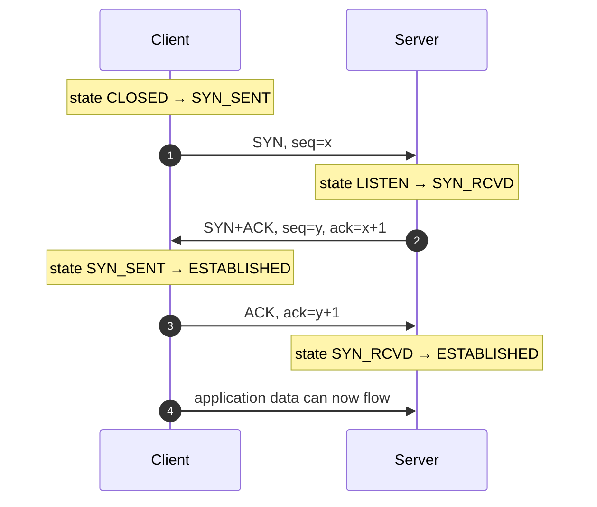

# TCP — Interview

Fifteen questions on TCP as the reliable, ordered byte-stream that most application protocols
(HTTP/1.1, HTTP/2, gRPC-over-h2, most databases, SMTP, SSH) are built on. Answers are written to be
spoken in 60–120 seconds and to survive the follow-up.

## Contents

1. [Q1: What exactly does TCP guarantee — and what does it not?](#q1-what-exactly-does-tcp-guarantee--and-what-does-it-not)
2. [Q2: Walk through the 3-way handshake. Why three messages and not two?](#q2-walk-through-the-3-way-handshake-why-three-messages-and-not-two)
3. [Q3: Flow control vs congestion control — what's the difference?](#q3-flow-control-vs-congestion-control--whats-the-difference)
4. [Q4: Explain slow start, AIMD, CUBIC, and BBR at a high level.](#q4-explain-slow-start-aimd-cubic-and-bbr-at-a-high-level)
5. [Q5: What is TCP head-of-line blocking, and how does QUIC fix it?](#q5-what-is-tcp-head-of-line-blocking-and-how-does-quic-fix-it)
6. [Q6: How many round trips before the first byte of application data?](#q6-how-many-round-trips-before-the-first-byte-of-application-data)
7. [Q7: What is TIME_WAIT and why does it exist? When does it hurt?](#q7-what-is-time_wait-and-why-does-it-exist-when-does-it-hurt)
8. [Q8: What is ephemeral port exhaustion and how do you fix it?](#q8-what-is-ephemeral-port-exhaustion-and-how-do-you-fix-it)
9. [Q9: Why is connection reuse / keep-alive so important?](#q9-why-is-connection-reuse--keep-alive-so-important)
10. [Q10: What is the bandwidth-delay product and window scaling?](#q10-what-is-the-bandwidth-delay-product-and-window-scaling)
11. [Q11: Nagle's algorithm and delayed ACK — why do they interact badly?](#q11-nagles-algorithm-and-delayed-ack--why-do-they-interact-badly)
12. [Q12: How does TCP detect and recover from packet loss?](#q12-how-does-tcp-detect-and-recover-from-packet-loss)
13. [Q13: How is a connection closed? What's a half-open connection?](#q13-how-is-a-connection-closed-whats-a-half-open-connection)
14. [Q14: Scenario — a high-throughput transfer is slow over a high-latency link. Why?](#q14-scenario--a-high-throughput-transfer-is-slow-over-a-high-latency-link-why)
15. [Q15: Scenario — a service shows huge connection churn and periodic stalls. Debug it.](#q15-scenario--a-service-shows-huge-connection-churn-and-periodic-stalls-debug-it)

---

## Q1: What exactly does TCP guarantee — and what does it not?

TCP gives you a **reliable, ordered, byte-stream** connection between two endpoints:

- **Reliable** — lost segments are retransmitted; corrupted segments (caught by the checksum) are dropped and resent. Data you `write()` either arrives or the connection is torn down.
- **Ordered** — bytes are delivered to the application in the exact order they were sent, using sequence numbers to reassemble out-of-order arrivals.
- **Byte-stream, not message-stream** — this is the one candidates forget. TCP has **no concept of message boundaries**. One `write()` of 1000 bytes may arrive as three `read()`s; three `write()`s may coalesce into one `read()`. The application must frame its own messages (length prefix, delimiter, or a self-describing format like HTTP chunked encoding).
- **Flow- and congestion-controlled** — it won't overrun a slow receiver or collapse a congested network.

What TCP does **not** give you: security (that's TLS on top), message framing, delivery *deadlines* (it prioritizes reliability over latency — a retransmit can stall the whole stream), or protection against a peer that simply stops reading. And "reliable" is scoped to the connection: if the process crashes after `write()` returns, the bytes may be in a kernel buffer and never sent.

## Q2: Walk through the 3-way handshake. Why three messages and not two?



Each side must **choose and synchronize an initial sequence number (ISN)** so byte ordering works, and each ISN must be *acknowledged* by the peer. That is fundamentally four events — C's SYN, S's ACK of it, S's SYN, C's ACK of it — but the server piggybacks its SYN onto the ACK, collapsing four into three.

Two messages are insufficient: with only SYN → SYN+ACK, the server never learns whether the client received its SYN, so the server's sequence space is unsynchronized and it can't safely send data. Three messages let **both** directions confirm the other's ISN. The randomized ISN (RFC 6528) also frustrates off-path attackers trying to inject or hijack a connection. The cost: **one full RTT** before any data flows (TCP Fast Open can shortcut this on repeat connections — see Q6).

## Q3: Flow control vs congestion control — what's the difference?

They both limit how much unacknowledged data is in flight, but they solve different problems and are enforced by different parties.

| | Flow control | Congestion control |
|---|---|---|
| **Protects** | The **receiver** from being overrun | The **network** from being overrun |
| **Signal** | Receiver's advertised window (`rwnd`) in every ACK | Inferred: loss, delay/RTT, or ECN marks |
| **Owner** | Receiver dictates; sender obeys | Sender computes its own `cwnd` |
| **Mechanism** | Sliding window; `rwnd=0` pauses the sender | Slow start, AIMD, CUBIC, BBR (Q4) |
| **Failure mode** | Deadlock/stall if receiver stops reading | Congestion collapse if absent |

The sender may inject at most **`min(rwnd, cwnd)`** bytes of unacknowledged data. `rwnd` says "my buffer has this much room"; `cwnd` says "the path can currently absorb this much." Both must be satisfied. A classic confusion: a slow *transfer* on a fast, uncongested link is almost always a **flow-control / window-size** problem (Q10, Q14), not congestion.

## Q4: Explain slow start, AIMD, CUBIC, and BBR at a high level.

- **Slow start** — a new connection has no idea what the path can carry, so `cwnd` starts small (~10 MSS) and *doubles every RTT* (exponential) until it hits `ssthresh` or sees loss. Fast ramp, but it means short connections never reach full speed — another reason to reuse connections (Q9).
- **AIMD (Additive Increase / Multiplicative Decrease)** — the classic congestion-avoidance phase (Reno). Add 1 MSS per RTT while things are fine; on loss, **halve** `cwnd`. The multiplicative back-off is what makes TCP *fair* and *stable* — it reacts hard to congestion and probes gently. The downside is the sawtooth: throughput oscillates and recovers slowly on high-BDP links.
- **CUBIC** (default in Linux) — replaces linear increase with a **cubic function of time since the last loss**. It ramps back toward the prior window aggressively, then plateaus near it, then probes cautiously above — much better than Reno on high-bandwidth, high-latency ("long fat") networks. Still **loss-based**: it treats a dropped packet as the congestion signal.
- **BBR** (Google) — **model-based, not loss-based**. It continuously estimates the path's *bottleneck bandwidth* and *minimum RTT* and paces sending to `BDP`, aiming to keep the pipe full without filling router queues. This makes it resilient to **non-congestive loss** (lossy Wi-Fi/cellular) and avoids **bufferbloat** — where deep router buffers inflate latency without loss, defeating loss-based algorithms. Trade-off: BBR can be unfair to CUBIC flows in some regimes, which is why the choice is workload-dependent.

## Q5: What is TCP head-of-line blocking, and how does QUIC fix it?

Because TCP delivers a **single in-order byte stream**, a lost segment blocks delivery of *every byte behind it* until the retransmission arrives — even bytes that already arrived and belong to an unrelated logical message. This is **head-of-line (HOL) blocking**.

It bites hardest with **HTTP/2**, which multiplexes many independent streams over one TCP connection. At the HTTP layer the streams are independent, but at the TCP layer they share one byte stream, so a single lost packet stalls *all* concurrent HTTP/2 streams. HTTP/1.1's workaround (six parallel connections) actually dodged this by not multiplexing.

**QUIC** (RFC 9000, the basis of HTTP/3) fixes it by running over UDP and implementing streams, reliability, and congestion control **in user space with per-stream sequencing**. A lost packet only blocks the stream(s) whose bytes it carried; other streams keep flowing. QUIC also merges the transport and TLS handshakes (Q6) and supports **connection migration** (survives IP changes, e.g. Wi-Fi → cellular) via a connection ID instead of the 4-tuple. The residual caveat: within a *single* QUIC stream, ordering still means intra-stream HOL blocking remains.

## Q6: How many round trips before the first byte of application data?

Count them by handshake:

| Setup | RTTs to first request byte | Notes |
|---|---|---|
| Plain TCP | **1** | 3-way handshake (Q2) |
| TCP + TLS 1.2 | **2–3** | 1 TCP + 2 TLS (full handshake) |
| TCP + TLS 1.3 | **2** | 1 TCP + 1 TLS |
| TCP + TLS 1.3, resumed | **1** | TLS 1.3 **0-RTT** sends data with the first flight |
| TCP Fast Open + TLS 1.3 | **~1** | TFO carries data in the SYN |
| QUIC (HTTP/3), 1-RTT | **1** | Transport + TLS merged |
| QUIC, 0-RTT resumption | **0** | Data rides the first packet |

So a cold HTTPS connection over a 100 ms path costs **~200 ms of pure handshake before any HTML moves** — dominated entirely by latency, not bandwidth. This is why connection reuse (Q9), TLS session resumption, and moving to TLS 1.3 / HTTP/3 are the highest-leverage latency wins for chatty, short-lived requests. **0-RTT caveat:** early data is replayable, so it must only carry idempotent requests.

## Q7: What is TIME_WAIT and why does it exist? When does it hurt?

When a connection closes, the endpoint that sent the **final ACK** (usually the *active closer* — the side that called `close()` first) holds the socket in **TIME_WAIT** for **2×MSL** (Maximum Segment Lifetime; typically 60 s on Linux, `2*MSL` conceptually up to 4 minutes). Two reasons:

1. **Absorb late duplicates** — a delayed retransmission of the peer's FIN must be ACKable; if the socket vanished immediately, a stray old segment could be misinterpreted by a *new* connection reusing the same 4-tuple.
2. **Ensure the final ACK is delivered** — if it's lost, the peer resends its FIN and TIME_WAIT is there to re-ACK it.

It hurts when a machine **actively closes** a very high rate of short connections — e.g. a load balancer or a service that opens a fresh connection per request to a backend. Thousands of sockets pile up in TIME_WAIT, consuming ephemeral ports (Q8) and socket memory. Mitigations: **reuse connections** (make TIME_WAIT rare, Q9), enable `net.ipv4.tcp_tw_reuse` for outbound connections, and make the *server* (not the client) the active closer where possible. Do **not** blindly set `SO_LINGER` to 0 to skip TIME_WAIT — that sends a RST and can corrupt in-flight data.

## Q8: What is ephemeral port exhaustion and how do you fix it?

A TCP connection is identified by the 4-tuple **(src IP, src port, dst IP, dst port)**. When a client opens outbound connections to a *fixed* server IP:port, only the **source port** varies, and it's drawn from the ephemeral range (Linux default ~28k ports, `net.ipv4.ip_local_port_range`). Add TIME_WAIT (Q7) holding ports for ~60 s, and a service making thousands of short-lived outbound connections per second **runs out of source ports** — new connections fail with `EADDRNOTAVAIL` / "cannot assign requested address."

Because the tuple includes the *destination*, the limit is **per (dst IP, dst port)**, so this bites hardest when fanning out to one backend behind one VIP. Fixes, in order of preference:

1. **Connection pooling / keep-alive** — the real fix; reuse a handful of connections instead of churning thousands (Q9).
2. **Widen the port range** — `ip_local_port_range` to e.g. `1024 65535`.
3. **Enable `tcp_tw_reuse`** — lets the kernel reuse TIME_WAIT sockets for new outbound connections safely (uses timestamps).
4. **Add destination diversity** — more backend IPs/ports expands the tuple space.

## Q9: Why is connection reuse / keep-alive so important?

Every new connection pays the handshake tax (Q6): 1 RTT for TCP, 1–2 more for TLS, plus **slow start** (Q4) meaning the connection begins at a tiny `cwnd` and takes several RTTs to reach full throughput. Tearing it down risks **TIME_WAIT** (Q7) and **port exhaustion** (Q8). Reuse amortizes all of that:

- **HTTP keep-alive** (HTTP/1.1 default) keeps the TCP+TLS connection open for subsequent requests — you skip the handshake and the connection stays "warm" (large `cwnd`).
- **Connection pools** (DB drivers, HTTP clients, gRPC channels) hold a bounded set of pre-established connections. Size the pool with Little's Law: `connections ≈ arrival_rate × avg_service_time`.
- HTTP/2 and gRPC go further: **one** long-lived connection multiplexes many concurrent streams, eliminating per-request setup entirely (at the cost of TCP-level HOL blocking, Q5).

The failure to reuse is one of the most common latency and stability bugs in production (see Q15). Watch out for stale pooled connections (idle-timeout on the far side, NAT dropping the mapping) — pools need health checks or a max-idle policy.

## Q10: What is the bandwidth-delay product and window scaling?

The **bandwidth-delay product (BDP)** = bottleneck bandwidth × round-trip time. It is the amount of data that must be **in flight** to keep the pipe completely full. To achieve line-rate throughput, the sender must be allowed at least BDP bytes of *unacknowledged* data — i.e. the effective window (`min(rwnd, cwnd)`) must be ≥ BDP.

Worked example: a 1 Gbps link with 80 ms RTT:
`BDP = 1e9 bits/s × 0.080 s / 8 = 10,000,000 bytes ≈ 10 MB`. You need a ~10 MB window in flight to saturate it.

The catch: the TCP header's window field is **16 bits → max 65,535 bytes**. Far below 10 MB. The fix is the **Window Scaling option** (RFC 7323), negotiated in the SYN, which left-shifts the advertised window by up to 14 bits, allowing windows up to ~1 GB. Without window scaling — or with an OS socket-buffer cap (`net.ipv4.tcp_rmem`/`tcp_wmem`) below BDP — throughput is capped at `window / RTT` regardless of how much bandwidth you bought. This is the root cause of Q14.

## Q11: Nagle's algorithm and delayed ACK — why do they interact badly?

**Nagle's algorithm** reduces tiny-packet overhead: if there's unacknowledged data outstanding, buffer small writes until either a full segment accumulates *or* the outstanding data is ACKed. **Delayed ACK** does the reverse on the receiver: hold the ACK up to ~40–200 ms hoping to piggyback it on a response or batch it with the next ACK.

Combined, they **deadlock against each other** for request/response traffic: the sender withholds a small final segment waiting for an ACK; the receiver withholds the ACK waiting for more data or a chance to piggyback. Neither moves until the delayed-ACK timer fires — injecting a spurious **40 ms stall** into what should be a microsecond exchange. The classic symptom is a chatty RPC protocol that mysteriously exhibits ~40 ms latency floors.

Fix: for latency-sensitive, small-message protocols, set **`TCP_NODELAY`** to disable Nagle. Most RPC frameworks and databases do this by default. Don't disable it blindly for bulk-write workloads where Nagle's coalescing genuinely helps.

## Q12: How does TCP detect and recover from packet loss?

Two mechanisms:

- **Fast retransmit / fast recovery** — the receiver ACKs the *highest contiguous* byte, so a gap produces **duplicate ACKs**. On **3 duplicate ACKs**, the sender infers loss and retransmits immediately *without waiting for a timeout*, then halves `cwnd` and continues (fast recovery). This is the common, cheap case.
- **RTO (Retransmission Timeout)** — if ACKs stop entirely (no dup-ACKs to trigger fast retransmit), a timer fires after `RTO = SRTT + 4×RTTVAR` (smoothed RTT + variance, per RFC 6298). RTO is the expensive case: `cwnd` collapses to 1 and slow start restarts, and RTO has a **minimum floor (~200 ms on Linux)**, so a single tail-loss can cost a visible stall.

**SACK** (Selective ACK, RFC 2018) makes recovery efficient: instead of only "everything up to X," the receiver reports exactly which non-contiguous blocks arrived, so the sender retransmits *only* the missing pieces rather than everything after the gap. Loss also feeds congestion control (Q4) — which is why non-congestive loss on Wi-Fi/cellular unfairly throttles loss-based algorithms and motivates BBR.

## Q13: How is a connection closed? What's a half-open connection?

Closing is a **four-way** exchange (each direction is closed independently, because TCP is full-duplex):

```mermaid
sequenceDiagram
    autonumber
    participant A as Active closer
    participant B as Peer
    A->>B: FIN (I'm done sending)
    B-->>A: ACK
    Note over A,B: connection is now half-closed; B may still send
    B->>A: FIN (B done too)
    A-->>B: ACK
    Note over A: A enters TIME_WAIT (2×MSL)
```

After A sends FIN and B ACKs it, A can't send more but **B can still send data** — a legitimate **half-closed** state (e.g. `shutdown(SHUT_WR)` to signal end-of-request while still reading the response).

A **half-open** connection is different and pathological: one side thinks the connection is alive but the other has crashed or lost the state (no FIN was exchanged — the machine rebooted or the network dropped). The survivor keeps a socket open forever unless it writes (and gets a RST) or **TCP keepalive** probes detect the dead peer (default ~2 hours, usually tuned down). Load balancers and long-lived pools must set keepalive or an idle timeout, or they accumulate zombie connections.

## Q14: Scenario — a high-throughput transfer is slow over a high-latency link. Why?

*"I'm copying a large file between two datacenters on a 1 Gbps link, RTT ~80 ms, and I only get ~50 Mbps. Bandwidth tests show the link is fine. Why?"*

This is a textbook **window vs BDP** problem (Q10), not a bandwidth or congestion problem.

1. **Compute BDP:** `1 Gbps × 80 ms ≈ 10 MB` must be in flight to fill the pipe.
2. **Compute the actual ceiling from the window:** throughput ≤ `window / RTT`. If the effective window is capped at ~512 KB, ceiling = `512 KB / 0.080 s ≈ 6.4 MB/s ≈ 51 Mbps` — matching the symptom exactly.
3. **Find why the window is small.** Usual culprits: **window scaling disabled** (middlebox stripped the SYN option, or an old stack), or **socket buffers too small** (`tcp_rmem`/`tcp_wmem` or the app's `SO_RCVBUF`/`SO_SNDBUF` below BDP). Long fat pipes need big buffers.

**Diagnose:** `ss -ti` shows the negotiated window scale, `cwnd`, `rtt`, and retransmits; a `tcpdump`/Wireshark trace confirms whether window scaling was negotiated and whether the receiver window is the limiter. **Fix:** enable/allow window scaling end-to-end, raise autotuning limits (`net.ipv4.tcp_rmem`/`tcp_wmem` and `tcp_window_scaling=1`), or use a CUBIC/BBR sender tuned for high BDP. If loss is present (`ss` shows retransmits), a loss-based algorithm will also sawtooth badly here — **BBR** helps on lossy long-fat paths. Also consider parallel streams to work around a single-flow window cap.

## Q15: Scenario — a service shows huge connection churn and periodic stalls. Debug it.

*"A service calling a downstream API has tens of thousands of sockets in TIME_WAIT, occasional `EADDRNOTAVAIL` errors, and periodic latency spikes. Debug it."*

Symptom triage:

- **`TIME_WAIT` pileup + `EADDRNOTAVAIL`** → the service is **opening a new connection per request and actively closing it**, exhausting ephemeral ports (Q7, Q8). Confirm with `ss -s` (socket summary by state) and `ss -tan state time-wait | wc -l`.
- **Periodic latency spikes** → likely **cold-start cost per request**: every request pays the TCP+TLS handshake and starts in slow start (Q4, Q6), so tail latency balloons whenever a fresh connection is needed.

**Root cause:** no connection reuse. The HTTP client is created per request, or `MaxIdleConnsPerHost` is 0/too low, or the far side's keep-alive is being ignored, or `Response.Body` isn't drained/closed so the connection can't be returned to the pool.

**Fix (in order):**
1. **Enable connection pooling / keep-alive** and size the pool with Little's Law (Q9) — this removes churn, TIME_WAIT, and slow-start cost in one move.
2. **Drain and close response bodies** so connections return to the pool instead of being torn down.
3. If churn is unavoidable, enable **`tcp_tw_reuse`** and **widen `ip_local_port_range`** (Q8) as mitigations, and make the *server* the active closer.
4. Add **keepalive/idle-timeout health** on pooled connections so stale/half-open sockets (Q13) don't cause request-time failures.

The lesson: connection *lifecycle* — not bandwidth — is the usual culprit behind churn-and-stall pathologies. Reuse first; tune sysctls second.

---

*Next step:* [UDP — Junior](../udp/junior.md)
