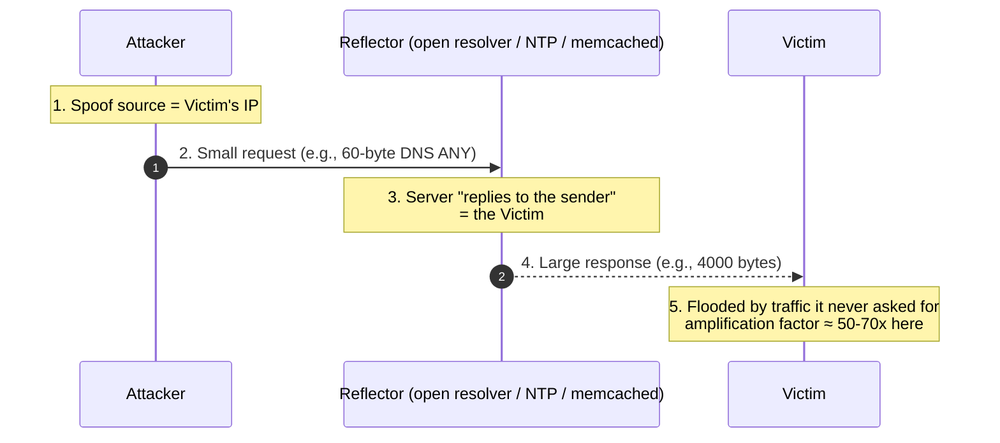

# UDP — Interview

The User Datagram Protocol is the *minimal* transport: a thin wrapper over IP that
adds ports and a checksum, and nothing else. No connection, no ordering, no
retransmission, no flow control, no congestion control. Everything TCP gives you
for free must be rebuilt — or deliberately skipped — by the application. These
questions probe whether you understand *what UDP guarantees (almost nothing)*,
*when that emptiness is an asset*, and *what the application must do to make it safe*.

## Contents

1. [Q1: What is UDP and what does it guarantee?](#q1-what-is-udp-and-what-does-it-guarantee)
2. [Q2: UDP vs TCP — the core trade-offs](#q2-udp-vs-tcp--the-core-trade-offs)
3. [Q3: When should you actually choose UDP?](#q3-when-should-you-actually-choose-udp)
4. [Q4: What is in a UDP datagram? How big is the header?](#q4-what-is-in-a-udp-datagram-how-big-is-the-header)
5. [Q5: How do you build reliability on top of UDP?](#q5-how-do-you-build-reliability-on-top-of-udp)
6. [Q6: Why is running UDP without congestion control dangerous?](#q6-why-is-running-udp-without-congestion-control-dangerous)
7. [Q7: MTU, fragmentation, and why you keep datagrams small](#q7-mtu-fragmentation-and-why-you-keep-datagrams-small)
8. [Q8: What is a UDP amplification / reflection attack?](#q8-what-is-a-udp-amplification--reflection-attack)
9. [Q9: How does NAT traversal work for UDP (STUN/TURN/ICE)?](#q9-how-does-nat-traversal-work-for-udp-stunturnice)
10. [Q10: What is QUIC and why is it built on UDP?](#q10-what-is-quic-and-why-is-it-built-on-udp)
11. [Q11: Does UDP have ordering or duplicate protection?](#q11-does-udp-have-ordering-or-duplicate-protection)
12. [Q12: How do you detect loss and measure quality on a UDP stream?](#q12-how-do-you-detect-loss-and-measure-quality-on-a-udp-stream)
13. [Q13: Multicast and broadcast — why only UDP?](#q13-multicast-and-broadcast--why-only-udp)
14. [Q14: Scenario — choose a transport for a real-time multiplayer game](#q14-scenario--choose-a-transport-for-a-real-time-multiplayer-game)
15. [Q15: Scenario — choose a transport for a video call](#q15-scenario--choose-a-transport-for-a-video-call)
16. [Q16: Operational — what UDP knobs and metrics do you watch in production?](#q16-operational--what-udp-knobs-and-metrics-do-you-watch-in-production)

---

## Q1: What is UDP and what does it guarantee?

> UDP (RFC 768) is a **connectionless, best-effort datagram** transport. It adds
> exactly two things to raw IP: **16-bit source/destination ports** (so multiple
> apps can share a host) and an **optional checksum** (mandatory over IPv6). That
> is the entire value proposition.
>
> What it guarantees: **nothing** beyond "a datagram is delivered intact or not at
> all." There is no handshake, no acknowledgment, no sequence numbers, no
> retransmission, no ordering, no duplicate suppression, no flow control, no
> congestion control. A datagram may be **lost, duplicated, reordered, or
> delayed** — silently. The one integrity guarantee is negative: if the checksum
> fails, the datagram is *dropped*, not repaired, and you are not told.
>
> The mental model: UDP is "IP plus ports." It is a **framing primitive**, not a
> reliable channel. It hands the application a raw pipe and steps out of the way —
> which is precisely why latency-sensitive and custom-protocol systems want it.

---

## Q2: UDP vs TCP — the core trade-offs

> TCP is a **reliable, ordered, byte-stream** connection with built-in congestion
> and flow control; UDP is an **unreliable, unordered, message** datagram with
> none of that. The trade is *guarantees* versus *control and latency*.

| Dimension | TCP | UDP |
|---|---|---|
| Connection | Handshake (SYN/SYN-ACK/ACK), stateful | Connectionless, no setup |
| Delivery | Reliable — retransmits lost segments | Best-effort — loss is silent |
| Ordering | In-order byte stream | None — datagrams may reorder |
| Duplicates | Suppressed | Possible; app must dedupe |
| Boundaries | None (byte stream) | Preserved — 1 send = 1 datagram |
| Flow control | Yes (receive window) | None |
| Congestion control | Yes (mandatory) | None (app must add it) |
| Head-of-line blocking | Yes — one loss stalls the whole stream | No — independent datagrams |
| Header size | 20 bytes (min) | 8 bytes |
| Handshake latency | ≥ 1 RTT before data (3 with TLS 1.2) | 0 RTT — send immediately |
| Multicast/broadcast | No | Yes |
| Typical uses | HTTP, DB, file transfer | DNS, media, games, QUIC, VoIP |

> The killer TCP weakness for real-time media is **head-of-line blocking**: because
> TCP delivers a strictly ordered stream, a single lost segment stalls *everything*
> behind it until it is retransmitted — even data that already arrived. For a live
> stream, that stalled data is stale by the time it unblocks. UDP has no such
> coupling: each datagram stands alone, so a lost audio frame just gets skipped and
> playback continues.

---

## Q3: When should you actually choose UDP?

> Choose UDP when **timeliness beats completeness**, when you need **control the
> kernel won't give you**, or when you need **one-to-many** delivery. Concretely:
>
> - **DNS** — a query and its answer usually fit in one datagram; a TCP handshake
>   would double the latency of every lookup. Fall back to TCP only for large
>   responses (RFC 7766).
> - **Real-time media (VoIP, video conferencing, live streaming)** — a late packet
>   is useless; retransmitting it (as TCP would) just adds jitter. Better to drop
>   it and conceal the gap. This is RTP-over-UDP territory.
> - **Multiplayer games** — position updates are sent 20–60×/s; only the *latest*
>   state matters, so a lost update is superseded by the next one, not
>   retransmitted.
> - **QUIC / HTTP/3** — QUIC is built *on* UDP so it can implement its own
>   loss recovery, per-stream ordering, and 0-RTT handshake in userspace, escaping
>   TCP's head-of-line blocking and kernel-upgrade lag.
> - **Discovery / telemetry / multicast** — mDNS, SSDP, metrics fan-out, service
>   heartbeats: fire-and-forget, one-to-many, loss-tolerant.
>
> The anti-signal: if you need every byte, in order, exactly once, and you are not
> going to reimplement that yourself, use TCP. Reinventing reliability badly is a
> classic UDP failure mode.

---

## Q4: What is in a UDP datagram? How big is the header?

> The UDP header is a fixed **8 bytes** — four 16-bit fields — sitting inside an IP
> packet:

```mermaid
sequenceDiagram
    autonumber
    participant App as Application
    participant UDP as UDP layer
    participant IP as IP layer
    participant Net as Network
    App->>UDP: 1. sendto(payload, dst_ip:port)
    Note over UDP: 2. Prepend 8-byte header:<br/>src port | dst port | length | checksum
    UDP->>IP: 3. Hand datagram to IP
    Note over IP: 4. Prepend IP header;<br/>fragment if > MTU
    IP->>Net: 5. Emit packet(s)
    Net-->>IP: 6. Arrive (maybe reordered / lost)
    IP->>UDP: 7. Reassemble, verify IP
    Note over UDP: 8. Verify UDP checksum;<br/>drop silently on failure
    UDP->>App: 9. Deliver whole datagram to bound socket
```

> - **Source port (16 bits)** — optional in IPv4 (may be 0); the sender's reply port.
> - **Destination port (16 bits)** — which socket on the host receives it.
> - **Length (16 bits)** — header + data, so the theoretical max payload is
>   65,507 bytes (65,535 − 8 UDP − 20 IPv4). You will never send that in practice
>   (see Q7).
> - **Checksum (16 bits)** — covers the header, data, and a pseudo-header of IP
>   addresses. Optional over IPv4 (0 = disabled), **mandatory over IPv6**.
>
> Key property: **message boundaries are preserved.** One `sendto()` becomes one
> datagram becomes one `recvfrom()`. Unlike TCP's byte stream, the receiver never
> has to frame messages itself.

---

## Q5: How do you build reliability on top of UDP?

> You re-implement the pieces of TCP you actually need — and *only* those. The
> building blocks:
>
> 1. **Sequence numbers** — tag each datagram so the receiver can detect loss,
>    reorder, and dedupe.
> 2. **Acknowledgments** — the receiver confirms receipt. Use **cumulative** or
>    **selective ACKs (SACK)** so a single loss doesn't force resending everything.
> 3. **Retransmission with timeout (RTO)** — resend un-ACKed datagrams, backing off
>    on repeated loss. Estimate RTT (Karn/Jacobson) to set the timer.
> 4. **Flow control** — a window / rate the receiver advertises so you don't
>    overrun it.
> 5. **Congestion control** — *mandatory* if you retransmit (see Q6): react to loss
>    by slowing down.
>
> The critical design decision is **partial reliability**. You rarely want
> full TCP semantics — that's what TCP is for. Instead:
>
> - **Reliable-ordered** for control messages (login, chat, "player died").
> - **Reliable-unordered** for events where order doesn't matter (inventory pickup).
> - **Unreliable-sequenced** for state snapshots — deliver only if newer, drop stale.
>
> Don't build this from scratch in an interview answer without naming the proven
> options: **QUIC** (full, standardized), **RTP + RTCP** (media), and game libraries
> like **ENet**, **RakNet/GameNetworkingSockets**, or **KCP**. "I'd use QUIC or
> ENet rather than reinvent congestion control" is a senior-level answer.

---

## Q6: Why is running UDP without congestion control dangerous?

> Because a UDP sender that ignores loss will **keep blasting at full rate into a
> congested network**, and the network's only defense against overload is to *drop
> packets* — which a naive sender treats as "send it again," making things worse.
> This is **congestion collapse**: throughput falls toward zero while the link
> saturates with retransmissions.
>
> TCP prevents this cooperatively — every TCP flow slows down on loss (AIMD), so
> flows share the link fairly. A UDP flow that does not back off is **"unresponsive"
> or "TCP-unfriendly"**: it starves the well-behaved TCP flows sharing the same
> bottleneck, because they cede bandwidth on loss and the UDP flow scoops it up.
>
> Consequences you should be able to name:
>
> - **Congestion collapse** — the historical failure the internet's congestion
>   control was designed to prevent (Van Jacobson, 1988).
> - **Unfairness / starvation** of coexisting TCP traffic.
> - **Self-inflicted loss** — you overrun the bottleneck buffer and lose your *own*
>   packets, degrading your own quality.
>
> The rule: **if you retransmit or send at a rate that can fill a link, you MUST add
> congestion control.** Media apps use rate adaptation (e.g., Google Congestion
> Control in WebRTC); QUIC ships CUBIC/BBR. "UDP is fast because it has no
> congestion control" is a trap answer — it's fast *because* it defers that
> responsibility to you, and skipping it is a bug, not a feature.

---

## Q7: MTU, fragmentation, and why you keep datagrams small

> The **MTU** (Maximum Transmission Unit) is the largest IP packet a link will carry
> — classically **1500 bytes** on Ethernet. If your UDP datagram plus headers
> exceeds the path MTU, IP must **fragment** it into multiple packets and reassemble
> at the destination.
>
> Fragmentation is bad for UDP specifically because:
>
> - **All-or-nothing reassembly** — if *any* fragment is lost, the *entire* datagram
>   is discarded. A 4 KB datagram split into 3 fragments has ~3× the effective loss
>   probability of a single small datagram.
> - **No retransmission** — UDP won't resend the lost fragment, so the whole
>   datagram just vanishes.
> - **Firewall/NAT hostility** — many middleboxes drop IP fragments outright.
> - **Reassembly resource pressure and attack surface** (fragment-flood DoS).
>
> Practical guidance: keep UDP payloads **≤ ~1200 bytes** to stay comfortably under
> the common 1500 MTU after IP/UDP headers and any tunneling (VPN, IPv6 extension
> headers) overhead. This is exactly why **QUIC caps its initial datagrams around
> 1200 bytes** and does **Path MTU Discovery**. Set the **Don't Fragment (DF)** bit
> and do PMTUD, or probe for the working size yourself, rather than relying on IP
> fragmentation.

---

## Q8: What is a UDP amplification / reflection attack?

> A DDoS technique that abuses UDP's **connectionless, unauthenticated** nature.
> Because there is no handshake to prove the source address, an attacker can **spoof
> the victim's IP** as the source of a small request to a public UDP server. The
> server sends its (much larger) reply to the *victim*. This does two things at once:
>
> - **Reflection** — the attack traffic comes from innocent third-party servers, not
>   the attacker, hiding the origin.
> - **Amplification** — a small spoofed query yields a large response, multiplying
>   the attacker's bandwidth by the **amplification factor**.



> Notorious amplifiers and their factors: **DNS** (~28–54×), **NTP `monlist`**
> (~556×), **memcached** (up to ~51,000× — the 2018 GitHub 1.35 Tbps attack),
> **SSDP**, **CLDAP**. Defenses:
>
> - **BCP 38 / ingress filtering** — networks drop packets with source addresses
>   they couldn't legitimately originate, killing spoofing at the source.
> - **Don't run open reflectors** — close/rate-limit public resolvers, disable NTP
>   `monlist`, never expose memcached to the internet.
> - **Response Rate Limiting (RRL)** on DNS.
> - Protocol design: **QUIC requires the server's first-flight response to be ≤ 3×
>   the client's** until the client's address is validated — an explicit
>   anti-amplification limit baked into the spec.

---

## Q9: How does NAT traversal work for UDP (STUN/TURN/ICE)?

> Two peers behind NATs can't just connect — each sees only a private address, and
> the NAT only opens a mapping when the *inside* host sends out first. UDP traversal
> uses three tools, orchestrated by **ICE**:
>
> - **STUN** (Session Traversal Utilities for NAT, RFC 8489) — a peer asks a public
>   STUN server "what public IP:port do you see me as?" The server's reply reveals
>   the peer's NAT-mapped address (its *server-reflexive candidate*). Peers exchange
>   these and attempt to send directly.
> - **Hole punching** — both peers send UDP packets to each other's reflexive
>   addresses simultaneously. Each outbound packet opens its NAT's mapping, so the
>   inbound packet from the other side finds a hole already punched. Works for
>   full-cone/restricted/port-restricted NATs.
> - **TURN** (Traversal Using Relays around NAT, RFC 8656) — the fallback when hole
>   punching fails (notably **symmetric NATs**, which assign a *different* mapping
>   per destination, so the reflexive address the peer learned is useless). A TURN
>   server *relays* all traffic between the peers. It always works but adds latency
>   and bandwidth cost, so it's the last resort.
> - **ICE** (Interactive Connectivity Establishment, RFC 8445) — the algorithm that
>   gathers all candidates (host, server-reflexive via STUN, relayed via TURN),
>   pairs them, and probes each pair with connectivity checks, choosing the
>   lowest-latency working path. This is how **WebRTC** connects browsers.
>
> The reason this all rides on UDP: hole punching depends on the connectionless,
> per-packet mapping behavior of NATs, and media wants the direct low-latency path
> that STUN discovers.

---

## Q10: What is QUIC and why is it built on UDP?

> **QUIC** (RFC 9000) is a modern reliable, secure, multiplexed transport that runs
> **in userspace on top of UDP**, and is the transport under **HTTP/3**. It gives you
> everything TCP+TLS does — reliability, ordering, congestion control, encryption —
> but rebuilt to fix TCP's structural limits. Why UDP as the substrate?
>
> - **Escape kernel/middlebox ossification.** TCP lives in the OS kernel and is
>   mangled by middleboxes; deploying a new TCP feature takes a decade of OS
>   upgrades. QUIC lives in the app, so it ships on your release cadence, and to the
>   network it just looks like UDP.
> - **Eliminate head-of-line blocking.** TCP is one ordered stream, so one lost
>   segment stalls all multiplexed requests. QUIC has **independent streams**: a
>   loss on stream A doesn't block stream B — only the affected stream waits.
> - **Faster handshakes.** QUIC folds the transport and TLS 1.3 handshakes together
>   → **1-RTT** connection setup, and **0-RTT** on resumption (send app data with the
>   first packet).
> - **Connection migration.** A QUIC connection is identified by a **Connection ID**,
>   not the 4-tuple, so it survives a client IP change (Wi-Fi → cellular) without
>   reconnecting.
> - **Always encrypted**, including most transport metadata, which also limits
>   middlebox interference.
>
> So QUIC doesn't use UDP for *speed via unreliability* — it re-adds full
> reliability. It uses UDP purely as a **thin, deployable, un-opinionated datagram
> carrier** that lets it own the transport logic in userspace.

---

## Q11: Does UDP have ordering or duplicate protection?

> **No — neither.** Datagrams can arrive **out of order** (they may take different
> routes or sit in different queues) and can be **duplicated** (retransmission at
> lower layers, routing loops, or a resend by the app itself). UDP does nothing
> about either; the payload arrives verbatim or is dropped on checksum failure, and
> that's the whole contract.
>
> If order or exactly-once handling matters, the application adds a **sequence
> number** to each datagram and, at the receiver:
>
> - **Reorders** using a small jitter/reorder buffer (media) or a sliding window
>   (reliable protocols).
> - **Deduplicates** by tracking the highest sequence seen plus a bitmap of recent
>   sequences (a *replay window*), discarding anything already seen.
> - For state-snapshot traffic, uses **"latest wins"** — a datagram older than the
>   last one applied is simply dropped, since a newer state already superseded it.
>
> Note what UDP *does* preserve that TCP does not: **message boundaries**. So the
> app never has to reframe — it only has to sequence.

---

## Q12: How do you detect loss and measure quality on a UDP stream?

> Since UDP is silent about loss, the receiver infers it from **gaps in application
> sequence numbers**. For real-time media this is standardized by **RTP + RTCP**
> (RFC 3550):
>
> - **RTP** carries each media chunk with a **sequence number** and a **timestamp**.
> - The receiver detects loss from missing sequence numbers, and **jitter** from the
>   variance in inter-arrival timing relative to the timestamps.
> - **RTCP** is a companion control channel where receivers periodically send
>   **Receiver Reports** back: fraction of packets lost, cumulative loss, highest
>   sequence received, interarrival jitter, and round-trip time (via report
>   timestamps).
> - The sender uses those reports to **adapt** — lower the bitrate/resolution, change
>   codec settings, or switch forward-error-correction (FEC) strength — before
>   quality collapses.
>
> Techniques to *survive* loss without retransmission (which would add latency):
> **FEC** (send redundant parity so a lost packet can be reconstructed) and **PLC /
> concealment** (interpolate over a missing audio/video frame). The design principle:
> on a real-time UDP stream you **conceal or adapt**, you don't retransmit, because a
> repaired-but-late packet is worthless.

---

## Q13: Multicast and broadcast — why only UDP?

> **Multicast** (one sender → a group of subscribed receivers) and **broadcast**
> (one sender → everyone on a subnet) are **inherently one-to-many**, and TCP simply
> cannot do them: TCP is a **point-to-point** protocol whose reliability machinery
> (per-connection ACKs, windows, retransmission) assumes exactly one receiver. You
> can't ACK-and-retransmit sanely across thousands of receivers — that's the
> **ACK-implosion** problem.
>
> UDP has no connection and no ACKs, so a single datagram sent to a multicast group
> address is fanned out by the network to all subscribers at once. That makes UDP
> the transport for:
>
> - **Service/device discovery** — mDNS/Bonjour, SSDP/UPnP.
> - **IPTV / streaming to many receivers**, financial market-data feeds.
> - **Routing/coordination protocols** (OSPF, some cluster gossip).
>
> The trade-off is that reliability, if needed, must be layered on top with
> multicast-aware schemes (NACK-based repair, FEC), not per-receiver ACKs — and
> broadcast/multicast generally don't traverse the public internet, so they live on
> LANs and controlled networks.

---

## Q14: Scenario — choose a transport for a real-time multiplayer game

> **Answer: UDP, with a thin custom reliability layer (or a library like ENet /
> GameNetworkingSockets / KCP) — not raw TCP.**
>
> Reasoning walk-through, which is what the interviewer wants:
>
> 1. **Requirement.** Player position/state updates 20–60×/s; input latency budget
>    is tens of milliseconds. Freshness dominates completeness.
> 2. **Why not TCP.** A dropped state update over TCP triggers retransmission and
>    **head-of-line blocking** — every later update stalls behind the lost one, so
>    the player sees a freeze then a jump. And a retransmitted position from 100 ms
>    ago is *already stale* — the game has moved on. TCP does exactly the wrong thing.
> 3. **Why UDP.** Each snapshot is independent. Lose one? The next one (arriving in
>    ~16–50 ms) supersedes it. No stall, no stale replays.
> 4. **What you add on top.** Split traffic by reliability class:
>    - *Unreliable-sequenced* for movement/state — "latest wins," drop stale.
>    - *Reliable-ordered* for critical events — "player fired," "match ended,"
>      purchases — using sequence numbers + ACKs + retransmit.
>    - **Client-side prediction + server reconciliation + interpolation** to hide the
>      remaining loss and jitter.
> 5. **Don't forget congestion control** (Q6) and **keep datagrams < ~1200 bytes**
>    (Q7). Use NAT traversal (Q9) for peer-to-peer modes; authoritative-server
>    modes just connect out to the server.
>
> Red flag if a candidate says "TCP with Nagle disabled" and stops — disabling Nagle
> helps latency but does nothing about head-of-line blocking, which is the real
> killer here.

---

## Q15: Scenario — choose a transport for a video call

> **Answer: UDP, via WebRTC — RTP/RTCP for media over UDP, with ICE/STUN/TURN for
> connectivity and DTLS-SRTP for encryption.**
>
> 1. **Requirement.** Interactive two-way audio/video; end-to-end latency must stay
>    under ~150–200 ms or conversation breaks down. A late frame is useless.
> 2. **Why not TCP.** Retransmission + head-of-line blocking inject **jitter and
>    stalls** — the call freezes and unfreezes. Humans tolerate a *dropped* frame far
>    better than a *frozen* stream.
> 3. **Why UDP + RTP.** RTP sequence numbers + timestamps let the receiver detect
>    loss, buffer for jitter, and **conceal** missing frames rather than wait for them.
> 4. **Media resilience instead of retransmission.** **FEC** and packet-loss
>    concealment recover/hide loss without a round trip; **RTCP** receiver reports
>    drive **adaptive bitrate** so quality degrades gracefully as the network worsens
>    (Google Congestion Control in WebRTC).
> 5. **Getting connected.** Peers are behind NATs, so **ICE** gathers candidates,
>    **STUN** finds public reflexive addresses, hole-punching tries a direct path,
>    and **TURN** relays as a fallback for symmetric NATs (Q9).
> 6. **Nuance worth stating:** the *signaling* channel (SDP offer/answer exchange) can
>    ride reliable transport (WebSocket/HTTPS), while the *media* rides UDP. Use the
>    right transport per channel rather than one for everything.

---

## Q16: Operational — what UDP knobs and metrics do you watch in production?

> Because the kernel does so little for UDP, operations must watch what would
> otherwise be hidden:
>
> - **Receive-buffer drops.** UDP has no flow control, so if the app can't `recv()`
>   fast enough the **socket receive buffer overflows and datagrams are dropped
>   silently**. Watch `netstat -su` / `UdpInErrors` / `RcvbufErrors`; tune
>   `SO_RCVBUF` (and `net.core.rmem_max`) and drain the socket in a tight loop or
>   offload to a ring buffer.
> - **Send failures / ENOBUFS** under burst load.
> - **Path MTU and fragmentation** — monitor for oversized datagrams; set DF + do
>   PMTUD; keep payloads ≤ ~1200 bytes (Q7).
> - **Application-level loss, reorder, and jitter** from your own sequence numbers —
>   the kernel can't report these; RTCP/receiver-report equivalents do.
> - **Checksum offload** correctness on NICs, and **GSO/GRO** (generic
>   segmentation/receive offload) for high-throughput UDP (QUIC servers rely on
>   these to hit line rate without per-datagram syscall overhead).
> - **Congestion-control health** — sending rate vs. loss, ensuring you back off
>   (Q6).
>
> The theme: with UDP you own the reliability *and* the observability. If you don't
> instrument loss and buffer drops, they happen invisibly until users complain.

---

*Next step:* [RPC — Junior](../rpc/junior.md)
