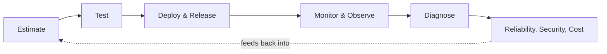

# On Production

> Reason about a system after it ships: size it correctly, prove it works, watch it run, ship changes to it safely, and keep it reliable, secure, and affordable under real traffic.

This roadmap picks up where design and implementation end. It follows the lifecycle of a system once it is live: estimate its scale before you build, test it so you know it works, understand its performance envelope, deploy and release it safely, watch it with monitoring and observability, diagnose it when something breaks, hold it to a reliability bar, rehearse its failures on purpose, defend it at scale, protect the data it holds, and keep it affordable.

## Learning path

| # | Section | Practice outcome |
|---|---|---|
| 01 | [Estimation](estimation/README.md) | Size a system from requirements before writing code. |
| 02 | [Testing](testing/README.md) | Choose the test level that actually catches the failure. |
| 03 | [Performance](performance/README.md) | Measure before optimizing, and protect the hot path from regression. |
| 04 | [Deployment Infrastructure](deployment-infrastructure/README.md) | Ship a running instance safely across environments. *(planned)* |
| 05 | [Release](release/README.md) | Turn a built artifact into a traceable, reversible delivery. |
| 06 | [Monitoring](monitoring/README.md) | Know a system's health before a user reports it. *(planned)* |
| 07 | [Observability](observability/README.md) | Answer questions about the system you didn't know to ask in advance. *(planned)* |
| 08 | [Diagnostics](diagnostics/README.md) | Reason about a running system you cannot step through with a debugger. |
| 09 | [SRE & Reliability](sre-reliability/README.md) | Own an error budget and respond to incidents deliberately. *(planned)* |
| 10 | [Chaos Engineering](chaos-engineering/README.md) | Rehearse failure before it happens for real. *(planned)* |
| 11 | [Security at Scale](security-at-scale/README.md) | Defend a system whose attack surface grows with its traffic. *(planned)* |
| 12 | [Data Privacy](data-privacy/README.md) | Handle user data under real legal and contractual obligations. *(planned)* |
| 13 | [Cost Efficiency](cost-efficiency/README.md) | Treat spend as a first-class engineering constraint. *(planned)* |

Sections marked *(planned)* have their topics scoped but not yet written; open the section for the current list.

## Use this on a real system

1. Estimate the load and failure budget before committing to a design.
2. Write tests that would catch the failure you're most worried about.
3. Measure the hot path before changing it.
4. Deploy behind a rollback path you have actually exercised.
5. Confirm monitoring would have caught the last incident, not just this one.
6. When something breaks, diagnose from evidence, not assumption.
7. Feed what you learned back into the next estimate.

## Progression inside every published topic

| Level | Main responsibility |
|---|---|
| Junior | Run a known method correctly in a small, well-defined scope. |
| Middle | Choose boundaries, compare options, and verify an integrated flow. |
| Senior | Protect system invariants under load, failure, and change. |
| Professional | Align ownership, delivery, and measurable outcomes across teams. |
