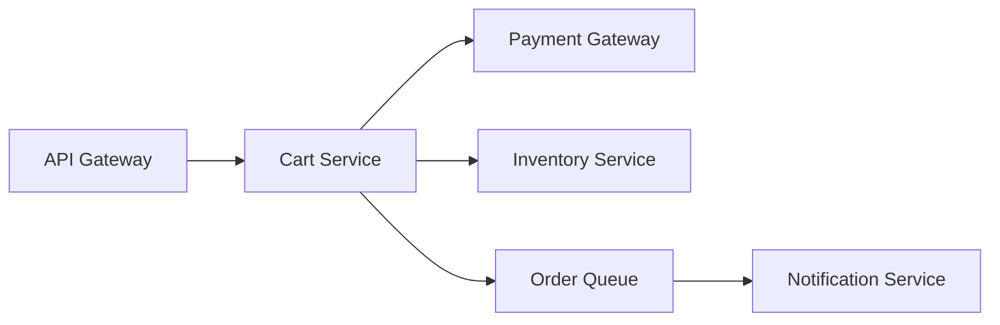

# Failure Modes — Middle

<!-- level-focus -->
At middle level, focus on this question:

> When a system has more failure modes than you can rehearse individually, how do you decide which ones deserve priority, and how do you keep the catalog useful as the system changes?

Use the smallest realistic scenario that exposes the decision and its failure behavior.

> **Roadmap:** [Chaos Engineering](../README.md) → Failure Modes

*A complete list of everything that could go wrong is not a plan — it's a wall of text nobody reads. Prioritizing the list is the actual skill.*

---

## Core Concept 1 — From List to Prioritized Catalog

A junior-level catalog is a list. A middle-level catalog is a *ranked* list, because you cannot rehearse, monitor, and design mitigations for every entry equally. Score each failure mode on three axes, each 1–3:

| Axis | 1 | 2 | 3 |
|---|---|---|---|
| **Severity** | Degraded but self-healing | Partial user-facing impact | Full outage or data loss for a critical path |
| **Likelihood** | Rare (needs a compound event) | Plausible (has happened to a peer system) | Regular (has happened to us, or is architecturally guaranteed to recur) |
| **Detectability** | An alert fires on it directly today | Would show up indirectly (a related alert, a support ticket) | Would go unnoticed until a customer or a postmortem surfaces it |

Multiply severity × likelihood for a priority score, and treat detectability separately as a flag: a high-priority failure mode with poor detectability is more urgent to *instrument* than one that's already well alerted, even if the raw score is the same. This is the same instinct as classic FMEA (failure mode and effects analysis) from reliability engineering, adapted to software where you can't assign hard numeric failure rates the way a hardware BOM can — use relative judgment, and revisit the scores as evidence comes in rather than trusting the first guess.

## Core Concept 2 — Choosing the Catalog's Boundary

The junior level catalogs one component at a time. At middle level the more useful boundary is often a **request path** or **user journey**, because that's the unit a real incident actually breaks, and it's the unit whose failure modes compose.

Take a checkout flow: `API gateway → Cart Service → Payment Gateway (external) → Inventory Service`, with an async hop to a `Notification Service` via a queue after checkout completes.



Cataloging per-component would give you Payment Gateway's failure modes in isolation. Cataloging per-journey forces the harder, more useful question: *if Payment Gateway is slow, what does Cart Service do while it waits — and does that then affect Inventory Service, which Cart Service also calls in the same request?* Component-level catalogs miss this; journey-level catalogs catch it, because composition is exactly where cascading failure hides.

## Core Concept 3 — A Prioritized Catalog for the Checkout Journey

| Failure mode | Severity | Likelihood | Priority | Detectability today |
|---|---|---|---|---|
| Payment Gateway returns errors for all requests | 3 | 2 | 6 | Good — 5xx rate alert exists |
| Payment Gateway is slow (2xx after 8–10s) but not erroring | 3 | 3 | 9 | Poor — no alert distinguishes slow-success from normal |
| Inventory Service double-decrements stock on Cart Service retry | 3 | 2 | 6 | Poor — no reconciliation check runs today |
| Order Queue backs up, notification delayed | 1 | 3 | 3 | Good — queue depth alert exists |
| Cart Service's connection pool to Inventory Service exhausts under Payment Gateway slowness | 3 | 2 | 6 | Poor — pool metrics exist but no alert threshold is set |

The row that should jump out is "Payment Gateway is slow but not erroring": highest priority score, and the worst detectability. That combination — high priority, poor detectability — is exactly what should get engineering attention first, ahead of the higher-severity-but-already-alerted row above it. This is the trade-off judgment middle level is responsible for: not treating the raw severity column as the only signal.

## Core Concept 4 — Tying Failure Modes to a Steady-State Hypothesis

The "Principles of Chaos Engineering" manifesto frames resilience work around a **steady-state hypothesis**: a measurable signal (throughput, error rate, latency) that represents "the system is behaving normally." A failure mode is only actionable in the catalog if you can state which steady-state metric it would move, and by how much would count as a violation.

```yaml
# Attaching a steady-state hypothesis to a catalog entry turns it from
# a description into something a game day or fault-injection test can check.
failure_mode: payment_gateway_slow_success
component: payment-gateway
trigger: p99 response time > 8s, status 200
steady_state:
  metric: checkout_success_rate
  normal: "> 99.5% over 5m"
  hypothesis: "checkout_success_rate stays > 99.5% even while payment-gateway p99 > 8s"
expected_if_unmitigated: "checkout_success_rate drops below 95%, cart-service threads saturate"
```

Writing the hypothesis surfaces the actual design question: does Cart Service have a timeout and circuit breaker on its call to Payment Gateway short enough that a slow-but-successful gateway doesn't saturate Cart Service's own thread pool? If nobody knows the answer, that's the next thing to find out — and it's a design question, not a monitoring question.

## Core Concept 5 — Under- and Over-Application Signals

**Under-cataloging** shows up as: the catalog only has one row per dependency ("down"), postmortems keep surfacing failure modes nobody wrote down beforehand, or the catalog hasn't been touched since a new dependency was added six months ago.

**Over-cataloging** shows up as: hundreds of rows nobody reads, entries for failure modes with no plausible trigger ("what if the CPU spontaneously becomes sentient"), or the same underlying cause listed five times under five different component names because nobody normalized it. A catalog people stop reading is as useless as no catalog.

The middle-level correction for over-cataloging: collapse entries that share a root cause and a mitigation into one row with multiple affected components listed, and delete entries whose likelihood is so low and severity so contained that no design decision would change based on them.

## Core Concept 6 — Incremental Adoption

Don't try to catalog every service at once. A workable rollout:

1. Pick the one or two user journeys with the highest business impact (checkout, login — not the internal admin tool).
2. Catalog that journey end to end, scored, with steady-state hypotheses for the top three entries.
3. Fix the worst detectability gap you find (usually: add an alert that distinguishes slow-success from fast-success, since that's the one junior catalogs miss entirely).
4. Only then expand to the next journey, reusing the same table format so catalogs are comparable across teams later.

Trying to reach full coverage before validating the format on one journey means finding out the format is wrong only after you've applied it forty times.

## Core Concept 7 — Verifying at Unit and Integrated-Flow Level

A catalog entry is a hypothesis until something confirms it. Verify at two levels:

- **Unit level** — does the client code for a dependency actually distinguish the failure modes you wrote down? If your HTTP client wraps a timeout and a connection-refused and a 503 into the same generic `error`, then "Payment Gateway slow" and "Payment Gateway down" look identical to your code even though they need different handling (a slow gateway calls for a timeout/circuit-breaker response; a down gateway calls for an immediate fast-fail). Write a unit test that asserts the client surfaces these as distinguishable error types.
- **Integrated-flow level** — does the checkout journey, as a whole, behave the way the steady-state hypothesis predicts when the dependency is artificially slowed in a test or staging environment? This step usually hands off to Fault Injection to actually induce the condition; the middle-level catalog work is producing the hypothesis that injection will test, and confirming the *code path* exists to make the hypothesis even possibly true.

```go
// Unit-level check: the client must expose *which* failure mode occurred,
// not a single opaque error, or the catalog's distinctions are unenforceable.
func TestPaymentClient_DistinguishesSlowFromDown(t *testing.T) {
    slow := newFakeGateway(withLatency(9 * time.Second))
    _, err := client.Charge(ctx, slow, req)
    assert.ErrorIs(t, err, ErrSlowResponse) // not just "err != nil"

    down := newFakeGateway(withConnectionRefused())
    _, err = client.Charge(ctx, down, req)
    assert.ErrorIs(t, err, ErrUnreachable)
}
```

---

## Real-World Examples

- **The slow-success gap.** A team's catalog lists "Payment Gateway down" with a good alert, but not "Payment Gateway slow." Six months later the gateway starts returning 200s after nine seconds during a vendor incident; Cart Service's connection pool saturates and checkout fails for everyone, with no alert firing until customer support tickets pile up.
- **Collapsing duplicate entries.** A catalog has "Redis down," "cache miss storm," and "Redis returns stale data" as three unrelated rows across three teams' spreadsheets. A middle-level review notices they're all downstream of one root cause (cache eviction under memory pressure) and merges them into one entry with one mitigation (bounded TTL plus a stampede-safe reload), cutting the catalog's size without losing information.
- **A steady-state hypothesis catches a bad assumption.** Writing "checkout_success_rate stays > 99.5% even while payment-gateway p99 > 8s" forces someone to check the actual timeout value in Cart Service's client config — and it turns out the timeout is 30 seconds, meaning the hypothesis was false the whole time and nobody had looked.

## Common Mistakes

- **Treating raw severity as the only priority signal.** A high-severity, well-alerted failure mode can be less urgent to work on than a medium-severity failure mode nobody would notice happening. Detectability is not optional context — factor it in.
- **Cataloging components instead of journeys.** Component-level entries miss the compounding effects that only show up when you trace a single request across several dependencies.
- **Writing a steady-state hypothesis nobody checked.** A hypothesis that "the system stays healthy" is worthless if no one verifies whether the code actually enforces the timeout/circuit-breaker the hypothesis assumes exists.
- **Letting the catalog grow without pruning.** Duplicate entries and implausible entries make people stop trusting and reading the catalog, which defeats its purpose as fast as never writing one.
- **Trying for full coverage before validating the format.** Applying an unproven table structure to forty services means redoing the work forty times when the format turns out to need a column you didn't think of.

---

## Apply it

1. Pick a real multi-component request path you own (or the checkout journey above) and diagram it, naming every synchronous and asynchronous hop.
2. Catalog at least five failure modes across at least three different components on that path, scoring each for severity, likelihood, and detectability.
3. For the two highest-priority entries, write a steady-state hypothesis stating the metric, its normal range, and what would count as a violation.
4. Write one unit test that proves your client code can actually distinguish two of the failure modes you cataloged (e.g., slow vs. unreachable) rather than collapsing them into one generic error.
5. Identify the single worst detectability gap in your table and describe the specific alert or dashboard panel that would close it.

## Verify your work

- The prioritized table has distinct severity, likelihood, and detectability values per row — not every row scored identically out of laziness.
- At least one steady-state hypothesis names a concrete metric and threshold, not a vague "system stays up."
- The unit test fails if the client is changed to collapse the two failure modes back into one error type, proving it actually enforces the distinction.
- A teammate unfamiliar with the journey can use your diagram and table together to predict what happens if any one hop degrades.

## Review questions

- Why can severity alone misprioritize a failure-mode catalog, and what does detectability add?
- Why does cataloging a request path catch failure modes that cataloging one component at a time misses?
- What makes a steady-state hypothesis useful versus just restating "the system should work"?
- What is the difference between verifying a failure mode at the unit level and verifying it at the integrated-flow level?
