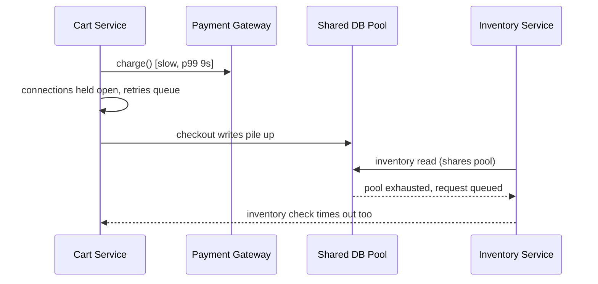

# Failure Modes — Senior

<!-- level-focus -->
At senior level, focus on this question:

> Which failure modes actually threaten the system's invariants across a dependency chain, and what evidence proves the catalog reflects the system as built rather than as imagined?

Use the smallest realistic scenario that exposes the decision and its failure behavior.

> **Roadmap:** [Chaos Engineering](../README.md) → Failure Modes

*A catalog built from a whiteboard session is a set of guesses. A catalog validated against incidents, dependency graphs, and real experiments is an architectural asset. Senior work is closing that gap.*

---

## Core Concept 1 — Anchor the Catalog to Invariants, Not Components

A junior or middle catalog is organized around components and journeys. At senior level, the organizing question changes: **which invariant does this failure mode threaten?** An invariant is a property the system must never violate regardless of what fails — "a customer is never charged twice for one order," "inventory count never goes negative," "an order is never silently lost between acceptance and fulfillment."

Every failure mode in the catalog should trace to at least one invariant it could break, and every invariant should have at least one failure mode that threatens it — if it doesn't, either the invariant is already unconditionally safe (rare, worth confirming) or the catalog has a blind spot.

| Invariant | Threatening failure mode | Why |
|---|---|---|
| Never double-charge a customer | Payment Gateway times out after actually completing the charge, client retries | The retry looks identical to a fresh request unless idempotency is enforced |
| Inventory never goes negative | Two concurrent requests both read stock=1, both decrement | Read-then-write without a lock or atomic decrement race under load |
| An accepted order is never silently lost | Order Queue consumer crashes mid-processing without acking, message is dropped | At-most-once delivery configuration loses the message on crash |

This reframing matters because it changes what counts as "done." A component-level catalog is done when every dependency has entries. An invariant-level catalog is done when every invariant has a *defense* — not just a description of what could go wrong, but a mechanism (idempotency key, atomic decrement, at-least-once delivery with dedup) that the failure mode is checked against.

## Core Concept 2 — Correlated and Cascading Failure Modes

The failure modes that cause real outages are rarely the independent, single-component kind a first-pass catalog captures. They're the ones that **correlate across shared infrastructure**:

- **Retry storms.** Cart Service times out calling Payment Gateway and retries; so does every other Cart Service instance, simultaneously, because they all hit the same timeout at the same moment under the same load spike. The retries amplify load on an already-struggling Payment Gateway instead of relieving it.
- **Shared resource exhaustion.** Cart Service and Inventory Service share a connection pool to a shared Postgres proxy. A slowdown in one query pattern (say, a slow inventory report) exhausts the pool for everyone using that proxy, including the unrelated checkout path.
- **Thundering herd on recovery.** A dependency comes back up after an outage; every client that was queued or retrying hits it simultaneously, and the fresh-but-still-cold dependency falls over again immediately.

None of these show up in a per-component or even per-journey catalog unless you explicitly ask "what else shares this resource, and what happens when this failure mode and that one occur at the same time?" That question — correlation across shared infrastructure — is the senior-level addition to the catalog, and it is exactly the category that a single-fault mental model misses.

## Core Concept 3 — Gray Failures Are the Hard Category

A **gray failure** (the term used in distributed-systems and SRE literature for this class of problem) is a failure that the system's own health checks and monitoring do not see, while it is nonetheless degrading real user experience — the dependency reports itself healthy, or partially healthy, while actually serving errors or high latency to a subset of callers, a subset of regions, or a subset of request shapes.

Examples that belong in a senior-level catalog specifically because they evade simple detection:

- One availability zone's replica is degraded while the load balancer's health check (a cheap `/ping`) still passes, because the health check doesn't exercise the slow code path.
- A dependency is healthy for 99% of request types but consistently fails for one uncommon request shape (a large payload, a rare currency code) that your synthetic health check never sends.
- A cache is technically "up" but its hit rate has silently collapsed to zero, turning every request into an uncached, slow path without a single error being thrown.

The catalog entry for a gray failure has to name not just the trigger and symptom but **why existing health checks miss it** — that's the piece of information that turns "we should have caught this" into an actual fix.

## Core Concept 4 — Evidence Over Assumption

A whiteboard-derived catalog reflects what the room imagined could go wrong. A validated catalog reflects what the system actually does, confirmed by:

- **Incident history.** Every past incident's root cause should map to a catalog entry — either confirming one that was already there, or adding one that was missing. A catalog with zero entries traceable to a real incident either belongs to a system with no incident history yet (rare) or hasn't been reconciled against reality.
- **Dependency graphs from real traffic**, not architecture diagrams from six months ago. Architecture diagrams drift from what's actually deployed; a service mesh's or APM's live call graph shows what really calls what, right now, including the connections nobody remembers adding.
- **Actual fault-injection results**, handed off from the Fault Injection sibling topic: an experiment that runs a hypothesized failure mode and observes real behavior either confirms the catalog entry or reveals the catalog was wrong (the system handled it fine, or it broke in a different way than predicted).

The discipline: treat every catalog entry as a hypothesis with a confidence level — "confirmed by a past incident," "confirmed by an injected experiment," or "asserted, not yet validated" — and prioritize validating the asserted ones with the highest invariant impact, rather than letting them sit as permanent guesses.

## Core Concept 5 — Cross-Component Scenario: Multi-Region Payment Settlement

Consider a payment system split across two regions for availability, with an async settlement step: the charge is authorized synchronously, and final settlement with the payment processor happens via a queue consumed by a settlement worker, replicated cross-region for failover.

Two plausible designs for what happens when the queue backs up during a processor slowdown:

| Design | Behavior under processor slowdown | Trade-off |
|---|---|---|
| **A: Synchronous double-write, both regions write settlement state directly** | Each region's worker attempts to write settlement status to a shared table; under contention, writes serialize and queue depth in the *database* grows | Simpler to reason about ordering, but the shared table becomes the correlated bottleneck — the two regions' fates are coupled through it |
| **B: Region-local queues, async reconciliation job merges settlement state periodically** | Each region processes its own backlog independently; a separate reconciliation job resolves any conflicting settlement records after the fact | Regions stay independently available during the slowdown, but a resolvable-conflict window is introduced, and the reconciliation job is now a new component with its own failure modes |

Neither design is free — Design A trades independence for simpler ordering guarantees; Design B trades a temporary conflict window for regional isolation, and shifts complexity into a new reconciliation component that must itself be cataloged. The senior-level judgment is not "pick the design with fewer failure modes" (B just moves them, it doesn't remove them) but "pick the design whose failure modes are cheaper to detect and recover from, given which invariant matters most" — here, "never double-charge" likely rules out A's easy-to-reason-about-but-tightly-coupled writes if double-write retries aren't idempotent, and B's conflict window is only acceptable if reconciliation itself is monitored as a first-class component.

## Core Concept 6 — Questions That Expose Weak Assumptions

Before committing to a design based on a failure-mode catalog, a senior engineer asks questions that surface untested assumptions rather than confirming what's comfortable to believe:

- "What happens if this dependency returns success, slowly, instead of failing fast?" — the slow-success case is the one most designs silently assume away.
- "What if 30% of nodes fail instead of one?" — many designs are only validated against single-node loss, and behave completely differently at fleet-wide partial failure.
- "Which of these failure modes have we actually observed, versus only imagined?" — separates evidence from assumption before the catalog drives a design decision.
- "What shares infrastructure with this component that isn't in the diagram?" — surfaces the correlated-failure category that per-component thinking misses.
- "How would we know if this failure mode were happening right now?" — if the honest answer is "we wouldn't," that's a gray failure candidate and belongs in the catalog with detection as the open action item, not the mitigation.

## Core Concept 7 — Recovery and Evolution of the Catalog

A catalog is not a one-time artifact. It needs a trigger for revisiting it: a new dependency being added, an architecture change that alters what shares infrastructure with what, a new invariant introduced by a product change (e.g., adding a new payment method changes what "never double-charge" needs to cover), or a postmortem whose root cause wasn't in the catalog. Treat "the catalog didn't predict this incident" as itself a finding to record and act on, not just an embarrassment to move past — the fix is usually a new correlated-failure entry or a newly identified gray failure, and both make the next revision more accurate than the last.

---

## Real-World Examples

- **Idempotency gap found by tracing an invariant.** Walking "never double-charge" backward through the checkout path reveals that Cart Service retries a timed-out charge request without an idempotency key, because the client library was upgraded and quietly dropped the header. The invariant-first catalog catches this before an incident does; a component-first catalog, which would have just said "Payment Gateway: unreachable," would not have noticed.
- **A gray failure hides behind a passing health check.** One region's payment processor connection is degraded for large-payload requests only; the health check sends a tiny synthetic ping that always succeeds. The catalog entry that names "health check doesn't exercise large payloads" turns a mystery into a two-line fix.
- **Evidence overturns an assumed design choice.** A team assumed Design B (region-local queues) would isolate regions, but a fault-injection experiment shows the reconciliation job silently falls behind under sustained load, creating a conflict window far longer than assumed. The catalog entry changes from "asserted" to "confirmed wrong as designed," and the reconciliation job gets its own SLO.

## Common Mistakes

- **Building the catalog only from imagination.** Without reconciling against incident history and real dependency graphs, the catalog reflects what the room thought of, not what the system does.
- **Missing correlated failure modes because the diagram doesn't show shared infrastructure.** A connection pool, a cache, or a rate limiter shared across "independent" services couples their failure modes even when nothing in the architecture diagram suggests it.
- **Treating a passing health check as proof of health.** Gray failures are specifically the cases where the health check and reality disagree; a catalog that trusts health checks uncritically will miss this whole category.
- **Choosing a design because it "has fewer failure modes"** without checking whether it moved the failure modes into a new, uncataloged component instead of eliminating them.
- **Never re-triggering catalog review after architecture changes.** A catalog frozen at the last review is stale the moment a new dependency, region, or invariant is added.

---

## Apply it

1. Take a system you know well and list its top three invariants (properties that must never be violated, not just "should work").
2. For each invariant, find at least one failure mode that could violate it, tracing back through the actual dependency chain, not just the component that owns the invariant.
3. Identify one correlated or shared-infrastructure failure mode that a per-component catalog would miss — name the shared resource explicitly.
4. Pick one catalog entry and mark its confidence level (confirmed by incident, confirmed by experiment, or asserted only) and, if asserted, state what evidence would confirm or refute it.
5. Ask the five weak-assumption questions from Core Concept 6 against one real design decision your team made, and write down which question exposed the shakiest assumption.

## Verify your work

- Every invariant on your list has at least one traceable failure mode, and every high-priority failure mode traces to a named invariant.
- The correlated-failure entry names the specific shared resource and both components affected, not a vague "things might interact."
- The confidence-level exercise produces at least one entry honestly marked "asserted, not yet validated," with a concrete next step to validate it.
- Applying the five questions to a real decision surfaces at least one assumption the original design discussion did not explicitly address.

## Review questions

- Why does anchoring a failure-mode catalog to invariants change what counts as "the catalog is complete"?
- What makes a gray failure harder to catalog and detect than a failure mode that trips an error or an alert?
- Why can choosing a design with "fewer failure modes" still leave the system no safer?
- What evidence turns a catalog entry from an assumption into something you can trust in a design decision?
