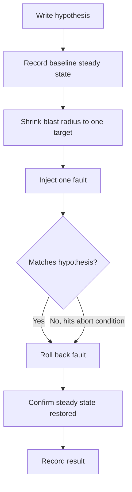

# Fault Injection — Junior

<!-- level-focus -->
At junior level, focus on this question:

> How do I run one small, controlled fault-injection experiment and confirm the system responded the way I predicted?

Use the smallest realistic scenario that exposes the decision and its failure behavior.

## 1. What "Fault Injection" Actually Means

Chaos engineering as a discipline is about rehearsing failure on purpose, so you find out how your system behaves *before* a real outage teaches you the hard way. **Fault injection** is the specific technique underneath that: deliberately introducing a fault — a killed process, a slow network link, a full disk, an unreachable dependency — into a running system and watching what happens.

A few terms you need before doing this for real:

| Term | Meaning |
|---|---|
| Fault | The thing you inject: a kill signal, added latency, dropped packets, a maxed-out CPU. |
| Failure | The user-visible consequence, if any, of the fault (a timeout, an error page, a stalled queue). |
| Steady state | The normal, healthy behavior of the system, described in measurable terms (e.g. "95% of checkout requests complete in under 400ms"). |
| Hypothesis | A specific, falsifiable prediction: "if fault X happens, steady state holds / degrades in way Y." |
| Blast radius | How much of the system a fault can reach — one pod vs. one AZ vs. everything. |
| Abort condition | The trigger that says "stop the experiment now," decided *before* you start. |

The point of an experiment is never "break something and see." It is: state a prediction, inject one fault, and check the prediction against reality.

## 2. The Repeatable Method

Every fault injection experiment, no matter how small, follows the same five steps:

1. **Write the hypothesis.** In the form "if [fault] happens to [target], then [steady-state behavior] should hold."
2. **Record the baseline.** Capture the steady-state metric *before* you touch anything, so you have something to compare against.
3. **Shrink the blast radius.** Target the smallest thing that can still test the hypothesis — one instance, one pod, a staging environment — never the whole fleet on a first attempt.
4. **Inject exactly one fault, and watch.** Change one variable, observe the metric, and know your abort condition before you start the clock.
5. **Roll back, then record.** Remove the fault, confirm the system returns to steady state, and write down what actually happened versus what you predicted.



Skipping any one of these five steps is how a rehearsal turns into an accident: no baseline means you can't tell if anything actually changed; no abort condition means you find out the hard way when to stop.

## 3. Worked Example: Killing a Worker Pod in Staging

**System:** `orders-worker` is a Kubernetes deployment with 3 replica pods, each consuming from an `orders` queue as part of the same consumer group. Staging environment, not production.

**Hypothesis:** "If one `orders-worker` pod is killed, the consumer group rebalances within 15 seconds, and no order messages are lost or double-processed."

**Baseline (recorded before the experiment):**

| Metric | Value |
|---|---|
| Running pods | 3 |
| Queue lag | ~5 messages |
| Consumer group members | 3 |
| Error rate | 0% |

**Step 1 — pick the target and confirm the blast radius:**

```bash
kubectl get pods -l app=orders-worker -n staging
# orders-worker-7d9f4c-abc12   1/1   Running
# orders-worker-7d9f4c-def34   1/1   Running
# orders-worker-7d9f4c-ghi56   1/1   Running
```

**Step 2 — inject the fault (kill one pod):**

```bash
kubectl delete pod orders-worker-7d9f4c-abc12 -n staging
# pod "orders-worker-7d9f4c-abc12" deleted
```

**Step 3 — observe:**

```bash
kubectl get pods -l app=orders-worker -n staging -w
# orders-worker-7d9f4c-abc12   1/1   Terminating
# orders-worker-7d9f4c-new78   0/1   ContainerCreating
# orders-worker-7d9f4c-new78   1/1   Running        # +8s
```

Queue lag graph: rises from 5 to about 40 messages over ~8 seconds while one consumer is missing, then drains back to baseline within 20 seconds of the new pod joining the consumer group. No duplicate order confirmations appear in the log.

**Step 4 — compare to hypothesis:** Rebalance took 8 seconds, well inside the 15-second prediction. No lost or duplicated messages. Hypothesis holds.

**Step 5 — record the result** in the team's experiment log: date, target, fault, baseline, observed outcome, pass/fail.

A more disciplined alternative to a raw `kubectl delete pod` is a declarative experiment spec, which records the hypothesis as code and makes the blast radius explicit. A Chaos Mesh `PodChaos` experiment expressing the same fault:

```yaml
apiVersion: chaos-mesh.org/v1alpha1
kind: PodChaos
metadata:
  name: kill-one-orders-worker
  namespace: staging
spec:
  action: pod-kill
  mode: one              # blast radius: exactly one matching pod
  selector:
    namespaces: [staging]
    labelSelectors:
      app: orders-worker
  duration: "30s"
```

`mode: one` is the blast-radius control — it guarantees only a single pod is ever touched, no matter how many pods match the selector.

## 4. A Small Catalog of Beginner-Safe Techniques

| Technique | What it simulates | Example command/tool |
|---|---|---|
| Process kill | A crashed instance | `kubectl delete pod <name>`, `kill -9 <pid>` |
| Frozen process | A hung, unresponsive instance (not crashed, not restarted) | `kill -STOP <pid>` (and `kill -CONT` to release it) |
| Network latency | A slow downstream dependency | `tc qdisc add dev eth0 root netem delay 300ms` |
| Network loss | Dropped packets / an unreachable dependency | `iptables -A OUTPUT -d <ip> -j DROP` |
| CPU/memory pressure | A noisy-neighbor or resource-starved host | `stress-ng --cpu 4 --timeout 60s` |

Each of these is reversible: remove the `tc` rule, delete the `iptables` rule, send `kill -CONT`, let the deleted pod come back via the deployment controller. At junior level, always know the exact undo command before you run the fault command.

## 5. Success Criteria

A junior-level experiment is successful when all of the following are true — not just "nothing looked broken":

| Criterion | How to check it |
|---|---|
| Hypothesis was falsifiable and written down first | You can point to the sentence before the experiment log entry |
| Baseline was captured | You have a number to compare "during" against |
| Blast radius was the smallest useful target | One pod/instance, not the whole fleet |
| Fault was actually injected | The command output or dashboard shows the change took effect |
| System returned to steady state after rollback | Metric matches the pre-experiment baseline again |
| Result was recorded | Someone other than you could read the log and understand what happened |

## 6. Common Beginner Mistakes

- **Injecting a fault with no hypothesis.** "Let's kill something and see" produces an anecdote, not evidence.
- **Skipping the baseline.** Without a "before" number, you can't tell whether the "after" number is actually different.
- **No abort condition.** Deciding when to stop *while* things are already going wrong is how a drill becomes an incident.
- **Forgetting to roll back.** A `tc netem` delay or an `iptables DROP` rule left in place after the experiment silently corrupts every measurement that follows.
- **Testing in production on day one.** Blast radius should be earned through staging experience first — start there, always.
- **Changing more than one variable.** Injecting latency *and* killing a pod in the same run makes it impossible to say which fault caused which effect.

## Apply it

1. Pick a service with at least 2 replicas in a staging environment you control (or a local `docker compose` / `kind` cluster with 2+ replicas of one service).
2. Write the hypothesis on paper first: "If one replica of `<service>` is killed, `<steady-state metric>` recovers within `<N>` seconds and no requests are dropped."
3. Record the baseline metric (request success rate, queue lag, or response time) for at least 60 seconds before touching anything.
4. Kill exactly one replica (`kubectl delete pod` or `docker stop` on one container) and watch the metric until it returns to baseline, timing the recovery.
5. Write a short experiment log entry: hypothesis, baseline, observed result, pass/fail, and the exact rollback/recovery command you'd use if it hadn't recovered on its own.

## Verify your work

- You have a written hypothesis that was stated *before* the fault was injected, not reconstructed afterward.
- You have a before/during/after set of numbers for the same metric, not just a subjective impression.
- The system returned to its baseline value after the injected replica was replaced or restarted.
- Your experiment log entry is specific enough that a teammate could re-run the same experiment from it.
- You can name the exact command that would have undone the fault if the system had not recovered automatically.

## Review questions

- What is the difference between a fault and a failure in this context?
- Why must the baseline be recorded before the fault is injected rather than estimated afterward?
- What makes a blast radius "small" in a Kubernetes deployment with several replicas?
- What is the risk of running a fault-injection experiment with no abort condition defined in advance?
