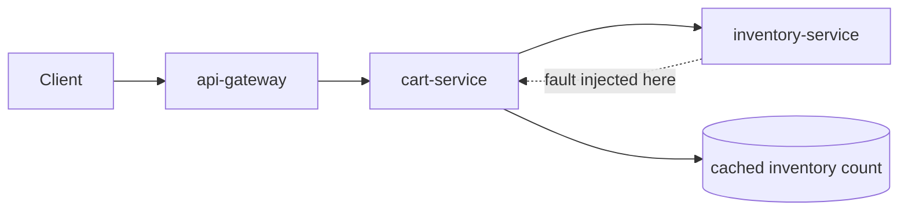

# Fault Injection — Middle

<!-- level-focus -->
At middle level, focus on this question:

> Which fault-injection technique and blast-radius boundary fits a given component, and what does that choice cost you in realism, safety, and effort?

Use the smallest realistic scenario that exposes the decision and its failure behavior.

## 1. The Technique Spectrum

Fault injection can happen at several layers of the stack, and each layer trades realism against safety and effort. Junior-level work picks any one of these and uses it carefully; middle-level work chooses *which layer* deliberately, based on what question the experiment is meant to answer.

| Layer | Technique | Example tooling | Realism | Blast-radius control | Setup effort |
|---|---|---|---|---|---|
| Network | Latency/loss injection at the kernel or proxy | `tc netem`, `iptables`, Istio/Envoy fault injection, Toxiproxy | High for network-caused failures | Fine — scoped to a link, a percentage of traffic, or a route | Medium |
| Process | Kill, freeze, or restart a process | `kill -9`, `kill -STOP`, `kubectl delete pod` | High for crash/hang scenarios | Coarse — usually one whole instance at a time | Low |
| Resource | Starve CPU, memory, disk, or file descriptors | `stress-ng`, cgroup limits, `fallocate` to fill disk | High for capacity-related failures | Medium — can target one container's cgroup | Medium |
| Dependency/application | Force an error or delay inside the code path itself | Feature-flagged fault, a fault-injecting client decorator, a chaos-aware test double | Lower — tests your code's reaction, not the real transport | Fine — down to a single call site | Low, but requires code support |

None of these is "the right one" in the abstract. The right one is whichever layer actually contains the failure mode you're trying to prove your system survives.

## 2. A Worked Component Decision

**System:** a checkout flow — `api-gateway` → `cart-service` → `inventory-service` → `payment-gateway` (external, out of scope for this experiment). `inventory-service` occasionally degrades under load; the team wants to verify that a slow `inventory-service` does not take down checkout entirely.



**Hypothesis:** "If `inventory-service` responds with 3-second latency on 50% of requests, `cart-service` falls back to its cached inventory count within its 1-second timeout, and checkout completion rate stays above 95%."

Three candidate injection points, and the trade-off at each:

| Candidate | Mechanism | What it actually tests | Cost |
|---|---|---|---|
| A: kernel-level, on the network path | `tc qdisc add ... netem delay 3000ms` on `inventory-service`'s pod interface | The real network stack and real timeout wiring, but affects *all* traffic to that pod, not just `cart-service`'s calls | Needs node/pod-level access; blunt — can't target one caller |
| B: service-mesh fault injection | Istio `VirtualService` with `fault.delay`, scoped to the `cart-service → inventory-service` route | The real client library's timeout and retry behavior, scoped to exactly one caller-callee edge, with a percentage knob | Needs a mesh already in place; config-only, no code change, no redeploy |
| C: application-level | A feature flag in `inventory-service`'s handler that sleeps before responding | Only the application logic's reaction; the transport layer is never actually touched | Requires code changes and a deploy to add the flag |

For *this* hypothesis — does `cart-service`'s timeout-and-fallback logic work — **B is the better choice**. It exercises the real client timeout without needing a code change, it can be scoped to exactly the one edge in the call graph being tested, and it supports a percentage knob so the blast radius on real traffic is controllable. Candidate A is too blunt (it would also break `inventory-service`'s health checks and any other caller). Candidate C tests something narrower and requires shipping code just to run an experiment, which raises the cost of iterating on the hypothesis.

The Istio fault injection spec for candidate B:

```yaml
apiVersion: networking.istio.io/v1
kind: VirtualService
metadata:
  name: inventory-service-fault
  namespace: checkout
spec:
  hosts:
    - inventory-service
  http:
    - fault:
        delay:
          percentage:
            value: 50
          fixedDelay: 3s
      route:
        - destination:
            host: inventory-service
```

## 3. Composing With Real Traffic: Percentage and Retries Interact

The `percentage: 50` field above is not cosmetic — it is the blast-radius control for this technique, and it interacts with whatever retry policy already exists on the caller. If `cart-service` retries failed calls three times, a 100%-delay fault doesn't just slow requests down, it triples the load on `inventory-service` for the duration of the experiment, which can turn a targeted latency test into a self-inflicted retry storm. Composing fault injection responsibly at this level means reading the caller's retry/circuit-breaker configuration *before* deciding on delay percentage and duration — the fault and the resilience mechanism you're testing are not independent variables.

## 4. Under- vs Over-Application Signals

| Signal | What it looks like | What it means |
|---|---|---|
| Under-applied | Every experiment injects 100% failure, never partial degradation | You're only proving the all-or-nothing case; partial degradation (the far more common real failure) is never exercised |
| Under-applied | Experiments only ever target `inventory-service`, never the edges around it | You have coverage of one node, not the graph — an untested edge is exactly where a real incident will happen |
| Over-applied | Every deploy pipeline stage now runs a chaos experiment, most of which are unrelated to what changed | Experiment fatigue: signal drowns in noise, and people start skipping the results |
| Over-applied | Faults are injected into production with no percentage cap and no kill switch | The "rehearsal" becomes indistinguishable from a real outage, and trust in the practice erodes fast |

The tell for "about right": every experiment has a specific hypothesis tied to a specific recent change or a specific known gap in confidence, not a fixed schedule run out of habit.

## 5. Incremental Adoption Path

1. **Unit level, in code.** A fault-injecting decorator wraps the `inventory-service` client in tests, forcing a timeout on command, and asserts the fallback path executes.
2. **Integrated flow, in staging.** The Istio fault above runs against the full checkout flow in a staging namespace with real service-to-service calls, verifying the fallback still works when the whole stack is involved, not just the client wrapper.
3. **Canary, in production, tiny blast radius.** The same fault, `percentage: 5`, routed only to a canary deployment or a specific test account, with a defined kill switch.
4. **Scheduled/continuous verification.** Once confidence is established, this experiment becomes a recurring, automated check — the boundary where this topic hands off to continuous resilience testing rather than one-off fault injection.

Each step only proceeds once the previous one has produced a passing result; skipping straight to step 3 without step 1 or 2 means the first time the fallback logic is exercised is against real customer traffic.

## 6. Verification at Two Levels

**Unit level** — the fault is injected in test code, not in a running environment:

```python
def test_cart_falls_back_on_slow_inventory(monkeypatch):
    slow_client = FaultInjectingClient(inventory_client, delay_ms=3000, rate=1.0)
    cart = CartService(inventory_client=slow_client, timeout_ms=1000)

    result = cart.get_available_quantity(sku="SKU-123")

    assert result.source == "cache_fallback"
    assert result.quantity is not None
```

This confirms the fallback branch exists and is reachable, cheaply and deterministically, on every CI run.

**Integrated-flow level** — the fault runs against the deployed staging system:

- Apply the `VirtualService` fault from §2 to the staging `inventory-service` route.
- Drive real checkout traffic (a synthetic load generator or a smoke-test script) through `api-gateway`.
- Watch the dashboard for `cart-service`'s p99 latency, error rate, and fallback-hit counter.
- Confirm checkout completion rate stays at or above the 95% threshold from the hypothesis, and that `payment-gateway` traffic pattern is unaffected (proving the fault didn't leak past `cart-service`).
- Remove the `VirtualService` fault and confirm the fallback-hit counter returns to zero and latency returns to baseline.

A passing unit test proves the branch exists; a passing integrated-flow run proves it's actually reachable and effective through the real network path, real timeouts, and real service mesh configuration — which is why both levels matter and neither substitutes for the other.

## Apply it

1. Pick two services in a staging environment with a real caller → callee relationship (e.g. an API service and one of its downstream dependencies), and write a hypothesis about how the caller should degrade when the callee is slow.
2. List the three candidate injection layers (network/kernel, service mesh, application) for this specific edge and fill in the trade-off table from §2 for your own scenario.
3. Implement the unit-level check first: a fault-injecting wrapper around the client that forces the failure mode, asserting the fallback or error-handling path is reached.
4. Run the integrated-flow version in staging using whichever layer you selected (a service-mesh fault rule if you have one, `tc netem` if not), and capture the same metric your hypothesis named.
5. Write down which injection layer you chose and why the other two would have answered a different question than the one you were asking.

## Verify your work

- The trade-off table you filled in names a specific reason (not "seemed easier") for choosing one injection layer over the other two.
- The unit test fails when the fallback code path is removed or broken, proving it actually exercises the logic under test.
- The integrated-flow experiment shows the same metric named in the hypothesis moving in the predicted direction, with numbers, not just "looked fine on the dashboard."
- After rollback, the affected service's latency and error rate return to their pre-experiment baseline.
- You can explain, in one sentence, what would have been missed if you had only run the unit-level check and skipped the integrated-flow one.

## Review questions

- Why does a service-mesh fault injection rule test something different from an application-level feature flag that produces the same delay?
- How does an existing retry policy on the caller change the effective blast radius of a percentage-based fault?
- What is a concrete sign that a team is under-applying fault injection versus over-applying it?
- Why is it necessary to verify at both the unit level and the integrated-flow level rather than picking just one?
