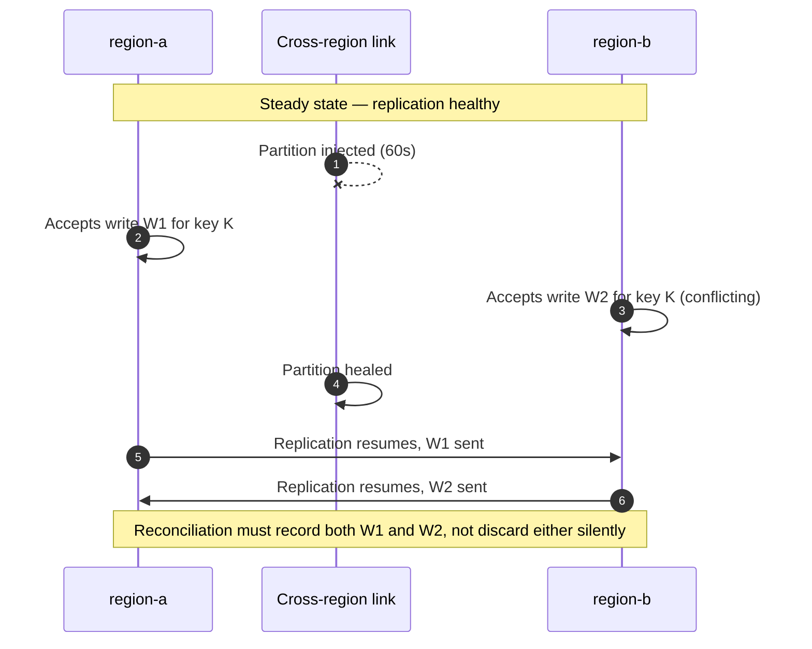

# Fault Injection — Senior

<!-- level-focus -->
At senior level, focus on this question:

> What invariant must the fault-injection mechanism itself preserve so that a rehearsal can never turn into an unrecoverable incident, and what evidence proves that invariant actually holds?

Use the smallest realistic scenario that exposes the decision and its failure behavior.

## 1. The Injection Mechanism Is Itself a System

At middle level, the interesting decision is which layer to inject a fault at. At senior level, the interesting decision is different: the tool doing the injecting — Chaos Mesh, Gremlin, AWS Fault Injection Simulator, a hand-rolled `tc`/`iptables` script, an Istio config push — is itself a piece of software, with its own control plane, its own availability, and its own failure modes. Treating it as a neutral instrument rather than a first-class component of the architecture is where fault-injection programs quietly become the source of the very incidents they were built to prevent.

The question that matters is not "does this fault expose a weakness in the target system?" but "what happens to the fault if the thing that's supposed to remove it fails first?" This is the **orphaned fault problem**: the controller that injected the fault crashes, is rescheduled, loses its lease, or gets network-partitioned from the target — and the fault it applied (a `tc` rule, a killed process, a paused container) has no mechanism forcing it to revert, because reverting was the controller's job.

## 2. Invariants a Fault-Injection Platform Must Hold

A fault-injection capability that is safe to run against anything beyond a disposable sandbox must guarantee, independent of any one component's health:

| Invariant | Why it matters | What breaks it |
|---|---|---|
| **Bounded blast radius** | The fault can only ever reach the targets the experiment author intended | A label selector that matches more pods than expected (e.g. `env: staging` without `app: X`, silently including shared infrastructure) |
| **Guaranteed auto-revert, independent of controller liveness** | The fault must expire even if the orchestrator that applied it is gone | TTL enforcement lives only in the controller's reconcile loop, with no fallback if that loop stops running |
| **Distinguishability from real incidents** | On-call must be able to tell "this is the chaos experiment" from "this is a real outage" without guessing | Injected faults aren't tagged in logs/traces/alerts, so the injected symptom is indistinguishable from an organic one |
| **Safe, idempotent abort** | Aborting twice, or aborting a fault that already expired, must be a no-op, not an error | Abort logic assumes the fault is still active and fails or double-applies a fix when it isn't |

The first two are about containment; the second two are about being able to reason about the system *while* the experiment is running, and about recovering cleanly regardless of what state you find it in.

## 3. Failure Modes of the Injection Mechanism Itself

| Failure mode | Mechanism | Mitigation |
|---|---|---|
| **Stuck fault** | The controller that applied a `tc netem` rule or paused a container dies before its TTL fires; nothing else is watching | Enforce TTL at the point of injection, not only centrally — e.g. schedule the revert via `at`/a local timer/a DaemonSet watchdog independent of the central controller, so the fault self-expires even if the controller never comes back |
| **Blast-radius escape** | A selector intended to match one canary pod also matches a shared dependency in the same namespace | Require a dry-run that prints the exact resolved target list before execution, and gate any selector matching more than N targets behind explicit confirmation |
| **Fault masking a real incident** | An injected fault and a genuine, unrelated incident overlap in time; on-call spends the first 20 minutes chasing the wrong cause | Maintain an experiment registry that timestamps every active experiment and surfaces it automatically alongside any alert firing in the same window |
| **Safety mechanism disabled as a side effect** | The experiment's own blast radius accidentally includes the autoscaler, the health-check endpoint, or the alerting pipeline meant to catch the fault | Explicitly exclude control-plane and observability paths from the target selector unless they are the deliberate subject of the experiment |

## 4. Cross-Component Scenario: A Regional Network Partition

**System:** an active-active service replicated across two regions, `region-a` and `region-b`, with asynchronous, last-write-wins replication between them. Both regions accept writes.

**Hypothesis:** "If `region-a` loses network connectivity to `region-b` for 60 seconds, both regions continue serving reads and writes locally, and once connectivity is restored, replication reconciles without silently discarding conflicting writes."

The invariant under test is not availability — both regions staying up during the partition is the easy part, and roughly guaranteed by the active-active design. The invariant that actually matters is **no silent conflict loss**: a write accepted in `region-a` and a conflicting write accepted in `region-b` during the partition must both be visible in some resolvable form after reconciliation, not have one silently overwritten with no record.



A partition at this scope is injected at the network layer between regions, using something like AWS Fault Injection Simulator's network-disruption action or a Chaos Mesh `NetworkChaos` partition:

```yaml
apiVersion: chaos-mesh.org/v1alpha1
kind: NetworkChaos
metadata:
  name: region-a-to-b-partition
spec:
  action: partition
  mode: all
  selector:
    namespaces: [region-a]
    labelSelectors:
      app: replication-agent
  direction: both
  target:
    selector:
      namespaces: [region-b]
      labelSelectors:
        app: replication-agent
    mode: all
  duration: "60s"
```

The blast radius here is scoped tightly to the `replication-agent` component in each region — not the entire region's traffic — so that only the cross-region replication path is affected while both regions continue serving their local users normally, isolating the one dependency actually under test.

## 5. Evidence, Not Preference

A senior-level review of this experiment does not accept "the dashboard looked fine" as evidence that the invariants in §2 hold. It asks for a specific, falsifiable test of the mechanism itself. Two examples of the difference:

- **Weak (preference-based):** "We trust the TTL will revert the partition because the config says `duration: 60s`."
- **Strong (evidence-based):** "We killed the Chaos Mesh controller pod 20 seconds into this same experiment and confirmed, via the `NetworkChaos` resource's `status` and by checking `iptables`/`tc` state directly on the affected nodes, that the partition was still removed at the 60-second mark — proving the revert does not depend on the controller staying alive."

The second statement is evidence that the "guaranteed auto-revert independent of controller liveness" invariant from §2 actually holds, under the specific condition most likely to break it. The reconciliation question for the write-conflict hypothesis needs the same treatment: the evidence is finding both `W1` and `W2` recorded in the reconciliation log (or a conflict-resolution event referencing both), not merely observing that no error was thrown.

## 6. Trade-offs Among Plausible Injection Approaches

| Approach | Precision | Blast-radius control | Realism | Cost |
|---|---|---|---|---|
| Kernel-level (`tc`, `iptables`, direct process signals) | Coarse — affects everything on that host/interface | Weak without extra tooling | Highest — the real stack is genuinely broken | Low tooling cost, high operational discipline required |
| Service-mesh / sidecar (Istio, Envoy, Chaos Mesh's mesh-aware faults) | Fine — scoped to a specific route or percentage | Strong — declarative selectors and percentages | High for anything the mesh mediates; invisible to anything that bypasses it | Requires the mesh already in place |
| Managed platform (AWS FIS, Gremlin) | Fine — built-in blast-radius templates and stop conditions | Strongest — platform-enforced stop conditions tied to CloudWatch alarms or similar | High, plus first-party safety rails | Vendor dependency; less control over exact mechanism |
| Application-level (feature flag, injected exception) | Finest — a single call site | Strong but manual | Lower — never actually exercises the real transport/timeout stack | Requires code changes and a deploy per experiment |

No single approach dominates; the right choice depends on which invariant is under test and whether the mechanism itself already has independent, platform-enforced stop conditions (AWS FIS and most managed chaos platforms do; a hand-rolled `tc` script does not, unless you build that in yourself).

## 7. Questions to Ask Before Approving Any Experiment

- What removes this fault if the process or controller that applied it disappears mid-experiment?
- What is the largest possible blast radius if the selector matches more than intended — and has that been checked with a dry run, not just read from the YAML?
- How will on-call distinguish this experiment's symptoms from a real, unrelated incident happening in the same window?
- Does the experiment's blast radius accidentally include the alerting, health-check, or autoscaling path that's supposed to react to the fault?
- What is the actual invariant this experiment is testing — and is that the invariant that matters, or just the one that's easiest to observe?

## Apply it

1. Pick a fault-injection tool your team already uses (or Chaos Mesh/AWS FIS in a sandbox account), and identify exactly where its TTL/auto-revert logic lives — controller reconcile loop, agent-local timer, or platform-managed stop condition.
2. Design an experiment that deliberately tests the *mechanism*, not just the target: inject a fault, then kill or network-partition the controller/agent that applied it before its TTL expires.
3. Confirm, by inspecting the actual system state (not just the tool's dashboard) — `tc qdisc show`, `iptables -L`, process list, or equivalent — whether the fault reverted anyway or is now orphaned.
4. Write the invariant this test was checking as a single falsifiable sentence, and record whether the evidence supports or contradicts it.
5. If the fault was left orphaned, document the minimal change needed (e.g. a node-local watchdog, an agent-enforced TTL) to make the auto-revert independent of the controller, and re-run the test to confirm the fix.

## Verify your work

- You have direct system-level evidence (not tool-dashboard-only evidence) of whether the fault reverted when the controller was killed mid-experiment.
- The invariant under test was written as a specific, falsifiable sentence before the experiment ran.
- If a gap was found, a concrete architectural change was identified and re-tested, not just noted for later.
- You can name which of the four invariants in §2 this experiment targeted and explain why that one, specifically, was worth spending the effort to test.
- The experiment's blast radius was scoped tightly enough that killing the controller mid-experiment could not itself cause a wider outage.

## Review questions

- Why is the fault-injection mechanism itself a component that needs its own failure-mode analysis, rather than a neutral instrument?
- What specific evidence would prove that a fault's auto-revert does not depend on its controller staying alive?
- In the regional-partition scenario, why is "both regions stayed available" insufficient evidence that the experiment passed?
- What kind of blast-radius escape is most dangerous — a selector matching too many targets, or a selector accidentally including the observability/control-plane path — and why?
