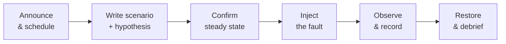

# Game Days — Junior

<!-- level-focus -->
At junior level, focus on this question:

> Can I plan, run, and debrief one small, well-scoped game day that proves whether the system behaves as expected under a single injected fault?

Use the smallest realistic scenario that exposes the decision and its failure behavior.
> **Roadmap:** [Chaos Engineering](../README.md) → Game Days
> *A game day is a fire drill for your system: a scheduled, announced exercise where a team deliberately breaks something on purpose, on a clock, with people watching — so the first time a failure happens isn't during a real incident.*

---

## Core Concept 1 -- What a Game Day Actually Is

A **game day** is a scheduled, facilitated exercise where a team injects a real fault into a system — on purpose, at a known time, with people watching — to find out whether the system (and the team) behaves the way everyone assumes it does.

It is different from the other topics in this section:

- **Fault Injection** is the *mechanic* — the tool or command that actually breaks something (killing a pod, adding latency, dropping a dependency).
- **Resilience Testing** is *automated and continuous* — faults injected by a pipeline, unattended, as part of normal CI/CD.
- **Game Days** are a *scheduled human exercise* — people plan it, people watch it, people write down what happened, and a group debriefs afterward.

A game day borrows fault-injection mechanics, but the point isn't the fault — it's the **rehearsal**. You are practicing detection, response, and recovery under controlled conditions, the same way a fire drill practices evacuation before there's an actual fire.

> **The core idea:** if your team has never watched this failure happen, you don't actually know what will happen. A design doc's claim ("the service degrades gracefully") is an assumption until you've watched it fail and confirmed the assumption held.

## Core Concept 2 -- Vocabulary You Need Before You Run One

| Term | Meaning |
|---|---|
| **Steady state** | The normal, healthy behavior of the system, defined by a metric (e.g., p99 latency < 200 ms, error rate < 0.1%) — measured *before* you touch anything. |
| **Hypothesis** | A specific, falsifiable prediction: "killing one of three `orders-api` pods will not raise the error rate above 0.1%." |
| **Scenario** | The one fault you will inject, its scope, and its timing — written down in advance, not improvised. |
| **Blast radius** | The set of users, requests, or systems that could be affected if the hypothesis is wrong. Kept small on purpose. |
| **Facilitator (Red Team)** | The person who actually triggers the fault, on schedule, following the written scenario. |
| **Incident Commander (IC)** | The person who can call off the exercise at any moment if something unexpected and risky happens. |
| **Scribe** | The person who writes down what happened, with timestamps — not from memory afterward. |
| **Debrief** | The structured discussion immediately after the exercise: what did we expect, what actually happened, what do we fix. |

The single most important discipline for a junior engineer to learn here: **write the hypothesis down before you inject anything.** A prediction made after the fact isn't a prediction — it's a rationalization.

## Core Concept 3 -- The Game Day Lifecycle

A small game day always follows the same shape, in this order:



- **Announce & schedule.** Tell the on-call, the service owner, and anyone whose dashboards will move. Nobody should be paged by their own drill.
- **Write scenario + hypothesis.** One page: what fault, what scope, what you expect, how you'll know if you're wrong.
- **Confirm steady state.** Look at the dashboard *before* you start. If the system is already unhealthy, stop — you'll learn nothing from breaking a system that's already broken.
- **Inject the fault.** One fault, one action, at the scheduled time.
- **Observe & record.** Watch the metric named in the hypothesis. Write down what you see, with timestamps.
- **Restore & debrief.** Undo the fault (or confirm the system already healed itself), then meet to compare what happened against what you predicted.

## Core Concept 4 -- Roles on a Small Game Day

Even a tiny game day needs more than one person, because the person injecting the fault should never be the only person watching for damage.

| Role | Responsibility | On a 3-person game day |
|---|---|---|
| **Incident Commander** | Owns the go/no-go decision; can abort at any time | The service's tech lead |
| **Facilitator / Red Team** | Executes the scenario exactly as written | The engineer running the fault-injection command |
| **Scribe / Observer** | Watches dashboards, records timestamps and readings | Anyone else on the team |

At this size, one person can hold Facilitator and Scribe if needed, but the Incident Commander should never be the same person pressing the button — you want one person whose only job is "should we stop?"

## Core Concept 5 -- Worked Example: Killing One Pod

**System:** `orders-api`, a stateless HTTP service behind a Kubernetes `Service`, running 3 replicas with readiness probes.

**Scenario brief (written the day before):**

```text
Scenario:    Kill one of three orders-api pods during business hours.
Hypothesis:  Kubernetes reschedules the pod and the Service removes it from
             rotation fast enough that customer-visible error rate stays
             under 0.1% and p99 latency stays under 200ms.
Steady state: p99 latency < 200ms, error rate < 0.1% (Grafana: orders-api dashboard)
Blast radius: at most 1/3 of orders-api capacity, for at most ~30 seconds.
Rollback:    Kubernetes reschedules automatically; no manual action expected.
             If error rate exceeds 1%, IC calls it and we scale up replicas.
Roles:       IC: Mai.  Facilitator: Dan.  Scribe: Priya.
Time:        Tuesday 14:00, low-traffic window.
```

**Steady-state check (14:00):**

```text
p99 latency: 118ms
error rate:  0.02%
replicas:    3/3 ready
```

**Inject the fault (14:01):**

```bash
kubectl get pods -l app=orders-api
# orders-api-7f9d4-abcde   1/1   Running
# orders-api-7f9d4-fghij   1/1   Running
# orders-api-7f9d4-klmno   1/1   Running

kubectl delete pod orders-api-7f9d4-abcde
```

**Observe (14:01–14:02), recorded by the scribe:**

```text
14:01:03  pod deleted
14:01:04  replicas 2/3 ready; p99 latency 141ms; error rate 0.03%
14:01:19  new pod scheduling
14:01:34  replicas 3/3 ready; p99 latency 122ms; error rate 0.02%
```

**Verdict:** the hypothesis held. Error rate never crossed 0.1%, latency recovered within ~30 seconds, and no manual action was needed. The debrief still asks one useful follow-up question: *what if the node the pod was on also had 2 other services' pods, and all three needed to reschedule at once?* That question becomes the seed of next month's game day — a slightly wider scenario, not a bigger leap.

## Common Mistakes

- **Skipping the steady-state check.** Without a "before" measurement, you have no way to tell whether a bad reading during the exercise was caused by your fault or was already happening.
- **No written hypothesis.** "Let's see what happens" is curiosity, not an exercise — you need a specific, falsifiable prediction to know whether the result surprised you.
- **Running it unannounced.** Paging your own on-call by surprise teaches them to distrust every future page, and wastes their time chasing a fire you lit on purpose.
- **No one holds the "stop" authority.** If the person injecting the fault is also the only person deciding whether to abort, they'll be tempted to let a bad situation run "just a little longer" to see what happens.
- **Picking a system nobody on the team fully understands yet.** A junior's first game day should be on a service with a known, simple failure mode — not the most complex, least-documented system in the fleet.
- **Treating a clean result as "nothing to learn."** A hypothesis that held is still evidence. Write it down; it's what lets the next game day scope up with confidence.

---

## Apply it

1. Pick one small, stateless service you already understand (or a sandbox app) running with 2+ replicas.
2. Write a one-page scenario brief: the fault (kill one replica), the hypothesis, the steady-state metric, and the blast radius.
3. Recruit at least one other person to be Incident Commander so you are not both facilitator and abort-authority.
4. Record the steady state, inject the fault, and log timestamped observations until the system recovers.
5. Hold a 15-minute debrief comparing the hypothesis to what the scribe recorded, and write down one follow-up question for next time.

## Verify your work

- The scenario brief exists in writing before the fault was injected, with a falsifiable hypothesis.
- The scribe's log has timestamps for steady state, injection, and recovery.
- The observed metric (latency, error rate) can be compared directly against the hypothesis's stated threshold.
- The debrief produced one concrete follow-up question, not just "it worked."

## Review questions

- What is the difference between a game day and automated fault injection?
- Why must the steady state be measured before the fault is injected, not inferred afterward?
- Who should hold abort authority, and why shouldn't it be the person triggering the fault?
- What makes a hypothesis falsifiable rather than just a guess?
