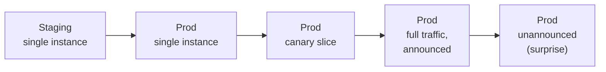

# Game Days — Middle

<!-- level-focus -->
At middle level, focus on this question:

> Which environment, blast radius, and roles should this game day use so it produces trustworthy evidence without needless risk?

Use the smallest realistic scenario that exposes the decision and its failure behavior.
> **Roadmap:** [Chaos Engineering](../README.md) → Game Days
> *A junior game day proves one fault against one service. A middle-level game day is a design exercise: choosing where to run it, how wide to let it reach, and who needs to be in the room — and being able to explain why those choices are the right ones for this system, today.*

---

## Core Concept 1 -- The Boundaries You Choose, Not Just the Fault

At junior level the fault was fixed and the scope was small by default. At middle level, the fault-injection mechanic is the easy part — the real work is deciding four boundaries before you write the scenario brief:

| Boundary | The choice | What it trades off |
|---|---|---|
| **Environment** | Staging vs. production | Safety vs. realism |
| **Blast radius** | One instance vs. a canary slice vs. full traffic | Confidence vs. customer risk |
| **Schedule** | Announced and scheduled vs. unannounced ("surprise") | Clean signal vs. testing real detection |
| **Composition** | Single service vs. a dependency chain | Simplicity vs. finding the failures that actually happen in production |

None of these has a universally correct answer. The skill is picking the boundary that matches what this exercise is actually trying to prove, and being able to say why out loud.

## Core Concept 2 -- Staging vs. Production, Honestly

Staging is where most teams start, and it's the right place to *rehearse the mechanics* — is the scenario brief clear, does the fault-injection tool work, do people know their roles. But staging lies in three specific ways that matter for chaos engineering:

- **Traffic shape is fake.** Synthetic load rarely reproduces the request mix, cache hit rates, or connection reuse patterns that make production failures behave the way they do.
- **Scale is fake.** A dependency timeout that a 3-replica staging deployment absorbs instantly may behave completely differently across 200 production replicas under a real connection pool.
- **Incentives are fake.** Nobody's bonus, SLA, or customer trust is at risk in staging, so people don't push back the way they would on a real production change — the exercise doesn't test whether your organization's actual guardrails hold.

The "Principles of Chaos Engineering" manifesto states this directly: to build confidence in production behavior, you eventually have to experiment in production. The middle-level judgment call is *when* to graduate — not whether staging is worthless (it isn't) but recognizing that a staging-only game day answers "does our tooling work?" and not "does our system survive?".

## Core Concept 3 -- Incremental Adoption: Widening the Blast Radius on Purpose

A team that has never run a game day should not open with "kill a whole availability zone in production." The middle-level skill is designing a ladder, where each rung produces evidence that justifies climbing to the next one.



- **Staging, single instance** — validate the mechanics and the runbook.
- **Prod, single instance** — same fault, real traffic, but the blast radius is one replica out of many (this is the junior-level example from `junior.md`, but now run against production).
- **Prod, canary slice** — route a small, labeled percentage of real traffic through the faulty path; if the hypothesis is wrong, only that slice is affected.
- **Prod, full traffic, announced** — the whole service is exposed to the fault, on a schedule everyone knows about.
- **Prod, unannounced** — the fault happens without warning to the responding team, testing whether detection and response work without foreknowledge, closest to a real incident.

Skipping rungs is the most common over-application mistake at this level: a team that jumps straight to unannounced production chaos before it has ever confirmed the fault-injection tool behaves as expected is not testing the system, it's gambling with it. Conversely, staying at "staging, single instance" forever is the under-application signal — the team gets a comfortable string of green checkmarks that tell them nothing about how the real system behaves.

## Core Concept 4 -- Roles at Multi-Component Scale

Once a scenario crosses a service boundary, one Incident Commander and one Facilitator are no longer enough — the honest reason is that no single person can watch two services' dashboards and understand both failure domains well enough to call an abort correctly.

| Role | Responsibility | Why it doesn't collapse into one person at this scale |
|---|---|---|
| **Incident Commander (IC)** | Holds the single abort decision across the whole exercise | Must synthesize input from every observer, not just watch one dashboard |
| **Facilitator (Red Team)** | Executes the fault-injection steps exactly as scripted | Needs to focus entirely on the injection mechanic, not on interpreting graphs |
| **Scribe** | Timestamps every action and every observation, unedited | Needs to be a dedicated writer or the timeline gets reconstructed from memory later, and memory lies |
| **Observer per affected service** | Watches that service's own dashboards and alerts | Nobody understands `payment-gateway`'s dashboards as well as the person who owns it |
| **Service owner on standby** | Can veto the scenario or clarify unexpected behavior in their system | The person who wrote the circuit breaker is the fastest path to "is this expected?" |

The rule of thumb: **one observer per system whose failure could plausibly surprise you.** If you can't recruit an observer for a dependency, that's a signal the scenario is too wide for this team's current readiness — narrow it back to a rung you can properly observe.

## Core Concept 5 -- A Cross-Component Scenario, Worked

**System:** `checkout-service` calls `payment-gateway` synchronously on the purchase path. The team's design doc claims: "if `payment-gateway` is slow, `checkout-service`'s circuit breaker opens after 5 consecutive timeouts and falls back to a `pending-review` queue instead of blocking the request." Nobody has ever watched this happen.

**Scenario brief:**

```text
Scenario:    Inject 3s of latency into 100% of payment-gateway calls, canary
             slice only (5% of checkout traffic), for 10 minutes.
Hypothesis:  checkout-service's circuit breaker opens within ~10 timeouts and
             requests fall back to pending-review; checkout error rate for the
             canary slice stays under 2%, and non-canary traffic is unaffected.
Steady state: checkout p99 < 400ms, payment-gateway p99 < 150ms, error rate < 0.1%.
Blast radius: 5% of checkout traffic, for 10 minutes, with a kill switch on the
             latency-injection sidecar.
Roles:       IC: Marco. Facilitator: Yuki. Scribe: Beatriz.
             Observer (checkout-service): Om. Observer (payment-gateway): Lena.
             Service owner on standby: the circuit-breaker's author, Sana.
```

**What actually happened:** the circuit breaker opened after 14 timeouts, not 10 — the threshold in code was a different config value than the one in the design doc. Canary error rate peaked at 6%, above the 2% ceiling, before falling back kicked in. The IC did not abort (the ceiling breach was brief and within the blast radius), but the debrief flagged a real gap: **documentation and configuration had drifted apart, and nobody would have known without running the exercise.**

## Core Concept 6 -- Verifying at Two Levels

A cross-component game day is only trustworthy if you verify at both levels, not just the dramatic one:

- **Unit level, beforehand.** Before scheduling the exercise, confirm the circuit breaker's logic in isolation — a unit test that feeds it 14 simulated timeouts and asserts it opens, and 13 that assert it stays closed. This is what tells you the *threshold value* to expect, so the game day's hypothesis is grounded in the actual code, not the design doc's memory of it.
- **Integrated-flow level, during the exercise.** The game day itself is the integration check: does the real service, under real load, with the real config, actually trip the breaker the unit test predicted — and does the fallback path (the `pending-review` queue) actually receive and process the diverted requests, or does it silently drop them?

A team that only does the unit-level check has proven the breaker's logic is correct in isolation, but not that it's wired up correctly in production, or that the fallback path is healthy. A team that only does the game day, with no unit coverage, has to re-derive the exact threshold every time by trial and error. You want both: the unit test tells you what to predict, the game day tells you whether reality agrees.

## Common Mistakes

- **Widening scope faster than the team's confidence.** Jumping from "never run one" to "unannounced, full production traffic" skips the evidence that would have caught the config-vs-doc mismatch safely.
- **One shared dashboard for two services.** If checkout and payment-gateway observers are staring at the same combined panel, subtle per-service signals (payment-gateway's own error rate rising before checkout's does) get missed.
- **No kill switch on the injected fault.** A latency sidecar with no independent off-switch means "abort" requires a redeploy — far too slow once the IC calls it.
- **Assuming the design doc's numbers are the real config.** The worked example's whole finding was that they weren't. Trust the exercise's evidence over the document's claim.
- **Running the game day as the only verification.** Skipping the unit-level check means every game day re-discovers basic facts about the code instead of confirming them under real conditions.
- **Choosing production before staging has proven the tooling works.** If the fault-injection mechanism itself is unreliable, you can't tell whether a bad result is the system failing or the tool malfunctioning.

---

## Apply it

1. Pick two services in a real system where one calls the other synchronously on a critical path (or design a small two-service sandbox that mirrors one).
2. Write the boundary decisions explicitly: environment, blast radius, schedule, and which dependencies are in scope — with one sentence justifying each choice.
3. Confirm the relevant fallback or circuit-breaker logic with a unit-level check first, and record the exact threshold it asserts.
4. Run the game day with a dedicated observer per service and a scribe, and compare the integrated result against the unit-level prediction.
5. In the debrief, write down any place where the real system's behavior disagreed with either the design doc or the unit test, and who owns fixing the drift.

## Verify your work

- The boundary choices (environment, blast radius, schedule, composition) are written down with reasons, not just inherited from the last exercise.
- A unit-level check exists for the fallback logic and its recorded threshold matches (or explicitly contradicts) what the game day observed.
- Each affected service had its own named observer, and the scribe's log distinguishes which service each observation came from.
- Any drift found between documentation, configuration, and observed behavior is written down with an owner, not just discussed and forgotten.

## Review questions

- Which boundary (environment, blast radius, schedule, or composition) most changes what this exercise can prove?
- What evidence would justify moving this scenario up one rung on the incremental-adoption ladder?
- Why does a cross-component scenario need one observer per service instead of one observer overall?
- How does a unit-level check change what you can conclude from the game day's integrated result?
