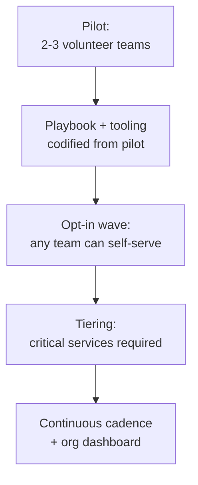

# Game Days — Professional

<!-- level-focus -->
At professional level, focus on this question:

> How do you run a game-day program across dozens of teams so every service gets rehearsed on a cadence, with clear ownership and measurable improvement, without a central bottleneck?

Use the smallest realistic scenario that exposes the decision and its failure behavior.
> **Roadmap:** [Chaos Engineering](../README.md) → Game Days
> *A senior engineer designs one excellent game day around one invariant. A professional-level program makes "every critical service gets rehearsed regularly, by the people who own it, with evidence that it's improving" true across an organization that will not sit still and wait for a central team to schedule it.*

---

## Core Concept 1 -- The Program Problem Is Different From the Exercise Problem

A single well-designed game day (senior level) proves one invariant, once. A **program** has to make that kind of rehearsal a durable, recurring property of the organization — across services owned by different teams, with different maturity, different risk tolerance, and different willingness to spend an afternoon breaking their own system on purpose.

The naive failure mode is a central chaos-engineering team that personally runs every game day. It works at five teams and collapses at fifty: the central team becomes the bottleneck, it never understands any one service as well as its owners do, and "chaos engineering" becomes something done *to* teams rather than something teams do for themselves. The professional-level goal is the opposite: an **operating model** where any team can run a trustworthy game day on its own service, with limited coordination from the center, and the organization can still see — in aggregate — whether the practice is actually improving reliability.

## Core Concept 2 -- Decomposing the Initiative Into Reversible Increments

Rolling out a program to an entire engineering organization in one push is how most reliability initiatives die — and it's also unfalsifiable in the middle of rollout, because you can't tell whether a stall is a program problem or a normal adoption curve. Decompose it instead into increments that each produce a decision point:

- **Pilot with volunteers.** Two or three teams who already want this run a facilitated game day with direct support from whoever is championing the program. The goal isn't coverage — it's finding out what a scenario brief template, a roles checklist, and a safety mechanism actually need to contain.
- **Codify the playbook.** Turn what the pilot learned into a self-serve template: scenario brief format, the roles table, a checklist for blast-radius controls, and a kill switch every team can use without asking permission.
- **Opt-in wave.** Any team can now run their own game day using the shared playbook and shared tooling (fault-injection library, dashboards, a shared Slack channel for announcing exercises) without the central team in the room.
- **Tiering.** Once the mechanics are proven, make it a requirement for services above a defined criticality tier — not for everyone at once, and not by mandate before the tooling has been proven to work self-serve.
- **Continuous cadence + org dashboard.** The steady state: every critical service has a standing cadence (e.g., quarterly), visible on one dashboard, and the org can see coverage and staleness at a glance.

Each stage is reversible: if the pilot reveals the playbook is wrong, you fix it before wider rollout, instead of discovering the same problem forty times in parallel.

## Core Concept 3 -- Cross-Team Contracts and Accountability

A program only scales if responsibility is unambiguous. The professional-level model splits ownership cleanly between the platform and the service teams:

| Responsibility | Owned by | Why it can't sit with the other side |
|---|---|---|
| Fault-injection tooling, safety mechanisms (kill switches, blast-radius controls) | **Platform / reliability team** | A shared, audited kill switch is infrastructure; every team reinventing one is how a badly-built one eventually causes a real outage |
| Scenario design, hypothesis, and the invariant being tested | **Service-owning team** | Only the team that owns `payment-gateway` understands what its invariants actually are and what "acceptable degraded" looks like for its customers |
| Scheduling, roles, and facilitation for their own exercise | **Service-owning team** | Coordination overhead scales with headcount if a central team has to staff every exercise |
| Program-level cadence, tiering policy, and cross-org dashboard | **Platform / reliability team** | Someone has to be able to answer "which critical services haven't been rehearsed this quarter" without asking forty teams individually |
| Approval for production-impacting scope (canary vs. full traffic, unannounced runs) | **Joint: service team proposes, a defined approver signs off** | This is the point where customer-facing risk and compliance obligations genuinely need a second set of eyes, not a rubber stamp |

The contract has to be explicit and written down, not assumed, because the failure mode of an implicit split is that both sides think the other owns the kill switch, and nobody notices until an exercise actually needs one.

## Core Concept 4 -- Governance, Compliance, and Coordination Risk

At organization scale, a handful of risks show up that a single senior-level exercise never has to think about:

- **Regulatory and compliance boundaries.** In regulated environments (payments, healthcare, anything with customer data residency requirements), a game day that touches production customer traffic may itself be a reportable change or require a defined approval trail. The program needs a documented approval path *before* the first production-impacting exercise, not a retrofit after an auditor asks about it.
- **Customer-facing coordination.** A canary-scoped production exercise that goes slightly over its blast-radius estimate can generate real support tickets. Customer support and the incident-communications function need to know a program exists and roughly when exercises run, even if they aren't in the room for every one.
- **Cross-team dependency scheduling.** A game day on `checkout-service` that also stresses `payment-gateway` needs `payment-gateway`'s team to know it's happening, even though they didn't schedule it — the professional-level fix is a shared calendar and an announcement convention, not a case-by-case negotiation each time.
- **Tooling drift across teams.** If every team builds its own fault-injection scripts, the organization loses the ability to answer "is our chaos tooling itself safe and consistent" — this is the specific argument for centralizing the injection mechanism even while decentralizing scenario ownership.

## Core Concept 5 -- Outcome Measures and Exit Conditions

A program that can't show it's working will lose budget and champions the first time the organization gets busy. Define measures before rollout, not after someone asks:

| Measure | What it tells you | Healthy signal |
|---|---|---|
| **Coverage** — % of tier-1 services with a completed exercise in the last quarter | Whether the program is reaching the services that matter most | Rising toward 100% of tier-1, tracked explicitly |
| **Staleness** — days since a service's last exercise, per service | Which services are due, without asking each team | No tier-1 service older than its defined cadence |
| **Findings per exercise** | Whether exercises are still finding real gaps (assumption drift, missing runbooks, wrong thresholds) or have become theater | A non-zero, gradually declining rate — zero findings for many exercises in a row is itself a signal to check whether scenarios have gotten too easy |
| **Time-to-fix for findings** | Whether findings turn into action or a backlog nobody touches | Findings closed within an agreed SLA, tracked like any other reliability debt |
| **MTTR trend for real incidents touching rehearsed failure modes** | The actual payoff: does rehearsal shorten real recovery time | Downward trend correlated with exercises covering that failure class |

**Exit conditions** matter as much as the measures themselves — a program needs an explicit definition of "this migration/rollout stage is done," or it never graduates from pilot. For example: "the opt-in wave is complete when at least 80% of tier-1 teams have run one self-serve exercise using the shared playbook, with no P1 incidents caused by an exercise itself" is a condition you can check, unlike "teams seem comfortable with it."

## Core Concept 6 -- A Sustained-Delivery Scenario: Scaling From 5 Teams to 50

A concrete version of the whole model: a reliability team champions game days starting with 5 volunteer teams. Eighteen months later the org has grown to 50 teams and 120 services. What changed, and what stayed the same:

- **What stayed the same:** the roles table (IC, facilitator, scribe, observer, service owner on standby), the scenario-brief format, the requirement that every exercise names a falsifiable hypothesis about an invariant. These are the parts that transfer regardless of scale.
- **What had to change:** exercises can no longer be scheduled ad hoc in a shared channel — a rotating calendar with automated staleness alerts replaced manual tracking. Tiering became necessary because 120 services cannot all be rehearsed quarterly with available engineering time; tier-1 (customer-facing, revenue-critical) gets quarterly cadence, tier-2 gets biannual, tier-3 is opt-in only. The kill switch that started as a script in one team's repo became a platform-provided, audited primitive every team calls the same way, because forty teams each reinventing "how do I safely inject latency" is itself an operational risk.
- **What the org measures now that it didn't at 5 teams:** coverage and staleness by tier, aggregated on a dashboard the VP of engineering can read without asking anyone — because at 5 teams everyone just knew who'd run an exercise recently, and at 50 that knowledge doesn't fit in anyone's head.
- **The signal that the program is actually sustaining itself, not just surviving on champion energy:** new teams onboard themselves using the playbook without asking the platform team for help, and the findings-per-exercise rate stays non-zero — evidence the practice is still finding real gaps rather than having decayed into a scheduled formality.

## Common Mistakes

- **Centralizing exercise execution instead of tooling.** A central team running every game day doesn't scale past a handful of services and never builds the service-owner expertise that makes findings trustworthy.
- **Rolling out to the whole org before the pilot has proven the playbook.** The same template mistake surfaces forty times in parallel instead of once, cheaply, during the pilot.
- **No documented approval path for production-impacting scope**, discovered only when compliance or an incident review asks for one after the fact.
- **Measuring activity instead of outcomes** — counting "exercises run" without tracking findings, time-to-fix, or MTTR trend, which rewards running easy, low-value exercises just to hit a number.
- **Treating zero findings as success** rather than as a signal to check whether scenarios have stopped being challenging enough to matter.
- **No exit condition for each rollout stage**, so the program stalls indefinitely in "pilot" or "opt-in wave" with no clear trigger to advance or to declare a stage complete.

---

## Apply it

1. Define the outcome the program should improve — for example, "reduce MTTR for AZ-level incidents" — and the coverage/staleness/findings measures that would show progress toward it.
2. Write the cross-team contract: which responsibilities sit with the platform team, which sit with service-owning teams, and who approves production-impacting scope.
3. Decompose the rollout into reversible stages (pilot, playbook, opt-in, tiering, continuous cadence), each with an explicit exit condition.
4. Run the pilot with 2-3 volunteer teams and use their exercises to revise the shared scenario-brief template and kill-switch tooling before wider rollout.
5. Publish the coverage/staleness dashboard and the findings-per-exercise trend, and review both on a fixed cadence with the teams and stakeholders who depend on the program's outcomes.

## Verify your work

- Each rollout stage has a written exit condition, and the program only advances when that condition is met, not on a fixed calendar date.
- The cross-team contract names an owner for tooling, scenario design, scheduling, and production-impacting approval, with no responsibility left implicit.
- The dashboard shows coverage and staleness per service tier without requiring anyone to ask individual teams.
- Findings-per-exercise and time-to-fix are tracked, and at least one real incident's recovery time can be compared against a prior rehearsal of the same failure mode.

## Review questions

- Why does centralizing exercise execution fail to scale past a handful of teams, and what should be centralized instead?
- What must a cross-team contract specify explicitly to avoid an implicit ownership gap during a real exercise?
- Why is an explicit exit condition necessary for each stage of a phased rollout, rather than a general sense that teams are "comfortable" with it?
- What would a sudden drop to zero findings per exercise actually indicate about the program?
