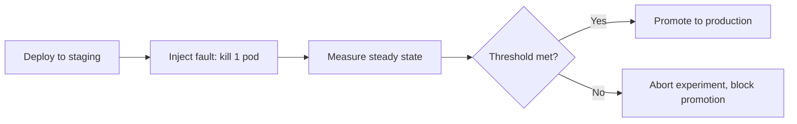

# Resilience Testing — Junior

<!-- level-focus -->
At junior level, focus on this question:

> How do you turn one failure hypothesis into an automated experiment that runs in a pipeline and proves — or disproves — a system's resilience?

Use the smallest realistic scenario that exposes the decision and its failure behavior.
> **Roadmap:** [Chaos Engineering](../README.md) → Resilience Testing
> *Your first automated chaos experiment: a steady-state hypothesis, a fault, and a pipeline stage that checks the result instead of a human watching a dashboard.*

---

## Core Concept 1 — What "Resilience Testing" Adds

You may already know two related ideas from this section: **Fault Injection** (the mechanic that breaks something on purpose — killing a pod, delaying a network call) and **Game Days** (a scheduled event where a team gathers to run failure scenarios by hand and watch what happens).

Resilience testing takes the same fault-injection mechanics used in a Game Day and makes them **continuous and automated**: instead of a human running the experiment once, on a calendar date, with people watching graphs, a pipeline runs it on every deploy (or every night) and a script decides pass or fail.

| | Game Day | Resilience Testing |
|---|---|---|
| Who runs it | A human, live | A pipeline, automated |
| Frequency | Scheduled event | Every deploy / every night |
| Who judges the result | People watching dashboards | An automated check against a defined metric |
| Primary output | Team learning, incident notes | Pass/fail signal that can gate a release |

Resilience testing does not replace Game Days — it takes the failure scenarios a Game Day discovers and turns the safe, well-understood ones into a repeatable regression check.

## Core Concept 2 — The Vocabulary You Need

- **Steady-state hypothesis** — a measurable definition of "the system is working," expressed as a metric and a threshold, e.g. "HTTP success rate stays at or above 99% and p99 latency stays under 400ms."
- **Chaos experiment** — a fault (kill a pod, add latency, drop a dependency) applied for a bounded time, paired with a steady-state check before, during, and after.
- **Blast radius** — how much of the system the fault can touch. For a first automated experiment, keep it to one non-critical replica of one service in a non-production environment.
- **Abort condition** — the rule that stops the experiment early and reverts the fault if things go worse than expected.

## Core Concept 3 — A Repeatable Method

Follow these steps for your first automated experiment:

1. **Pick one service and one steady-state metric.** Something you can query in one line, e.g. HTTP 2xx rate over the last two minutes.
2. **Write the hypothesis as a sentence.** "If we kill one of three `orders-api` replicas, the 2xx rate stays above 99% because the other two replicas absorb the traffic."
3. **Choose the smallest fault that tests the hypothesis.** One pod, one replica, a few minutes — not "kill the whole deployment."
4. **Automate the fault and the check as one pipeline stage**, so it runs the same way every time, without a person deciding "looks fine" by eye.
5. **Define the abort/rollback rule before running it**, not after you see a bad result.
6. **Record the verdict** (pass or fail) as a build artifact, so the result is visible in the pipeline, not only in someone's memory.

## Core Concept 4 — A Worked Example

Service: `orders-api`, three replicas, deployed to a staging namespace after every merge to `main`.

Steady-state hypothesis, written down before touching anything:

```yaml
# steady-state.yaml
metric: http_success_rate
query: sum(rate(http_requests_total{service="orders-api",status=~"2.."}[2m]))
       / sum(rate(http_requests_total{service="orders-api"}[2m]))
threshold: ">= 0.99"
window: 2m
```

The experiment, using Chaos Mesh's `PodChaos` to kill exactly one pod:

```yaml
# pod-kill-experiment.yaml
apiVersion: chaos-mesh.org/v1alpha1
kind: PodChaos
metadata:
  name: orders-api-kill-one
  namespace: staging
spec:
  action: pod-kill
  mode: fixed
  value: "1"
  selector:
    namespaces: ["staging"]
    labelSelectors:
      app: orders-api
  duration: "30s"
```

A CI stage that runs the experiment and gates on the steady-state check:

```yaml
# .github/workflows/deploy-staging.yml (excerpt)
- name: deploy to staging
  run: kubectl apply -f k8s/staging/orders-api.yaml

- name: run resilience experiment
  run: kubectl apply -f chaos/pod-kill-experiment.yaml

- name: check steady state during and after experiment
  run: ./scripts/check-steady-state.sh --config steady-state.yaml --duration 120s

- name: fail the build if steady state breached
  if: failure()
  run: |
    kubectl delete -f chaos/pod-kill-experiment.yaml --ignore-not-found
    echo "Resilience experiment failed — blocking promotion to production."
    exit 1
```

Observed inputs and outputs on a real run:

| Input | Value |
|---|---|
| Replicas before fault | 3 |
| Pods killed | 1 |
| Steady-state threshold | >= 99% success rate |
| Success rate during experiment | 99.4% |
| Verdict | Pass |

The build promotes to production because the recorded evidence — not a person's impression — says the hypothesis held.

## Core Concept 5 — A Flowchart of the Gate



## Common Beginner Mistakes

- **No baseline before the fault.** If you never measured the success rate with no fault at all, you cannot tell whether a drop was caused by the experiment or was already happening.
- **Blast radius too large for a first attempt.** Killing every replica, or running against production before staging, turns a learning exercise into an incident.
- **No automated abort.** Watching the experiment "just in case" defeats the point — if a human has to intervene manually every time, it is not yet automated resilience testing.
- **Treating one green run as permanent proof.** A pass today says nothing about next week's code change. The experiment must run again on the next deploy to mean anything.
- **Never testing the failing case.** If you have never seen the gate turn red, you do not actually know it works. Deliberately break something the gate should catch at least once.

## Success Criteria

An experiment at this level is done when:

- The steady-state hypothesis is written down as a metric and threshold, not a feeling.
- The fault, the measurement, and the abort are all automated in one pipeline stage.
- You have seen the gate pass at least once and fail at least once (by injecting a deliberately excessive fault) so you know it can actually catch a problem.
- The verdict is recorded somewhere other than your memory.

## Recording the Verdict

A verdict that only exists as a green checkmark in a CI dashboard disappears the moment the build history is pruned. Save enough detail that someone reading it next month, without having watched the run, can tell what was tested and what happened:

```json
{
  "experiment": "orders-api-kill-one",
  "hypothesis": "2xx rate stays >= 0.99 when one of three replicas is killed",
  "steady_state_before": 0.999,
  "steady_state_during": 0.994,
  "steady_state_after": 0.999,
  "verdict": "pass",
  "run_at": "2026-08-29T02:14:00Z"
}
```

This small record answers three questions a dashboard alone cannot: what was the hypothesis, what was actually measured, and when. It also becomes the raw material for the trend-watching that later levels build on — a single pass means little, but a history of passes and the occasional deliberate failure is real evidence.

---

## Apply it

1. Pick a small staging service with at least two replicas and one clear health endpoint.
2. Write a steady-state hypothesis as a single query and threshold (e.g. HTTP success rate over two minutes).
3. Add a pipeline stage that kills one replica using a fault-injection tool (Chaos Mesh, Litmus, or a simple `kubectl delete pod`) and waits a fixed duration.
4. Add a check that queries the steady-state metric during and after the fault, and fails the build if the threshold is breached.
5. Run it twice: once as designed (should pass), and once with the blast radius intentionally increased (e.g. kill all replicas) to confirm the gate actually fails when it should.

## Verify your work

- The pipeline log shows the fault being injected, the steady-state query running, and an explicit pass/fail verdict.
- The passing run's recorded success rate is at or above your threshold.
- The deliberately-broken run produces a failing verdict and blocks promotion — proving the gate is not just decorative.
- No manual step was required to decide the outcome; a person only reads the recorded verdict afterward.

## Review questions

- What is the difference between a chaos experiment run at a Game Day and one run as automated resilience testing?
- Why must a steady-state hypothesis be written as a metric and threshold instead of a general impression?
- What would happen if you never tested the case where the gate is supposed to fail?
- Why should the first automated experiment use the smallest possible blast radius?
